# 使用机器学习发现客户群—第 1 部分(数据探索)

> 原文：<https://medium.com/analytics-vidhya/discovering-customer-segments-using-machine-learning-part-1-data-exploration-7c171c21206a?source=collection_archive---------9----------------------->

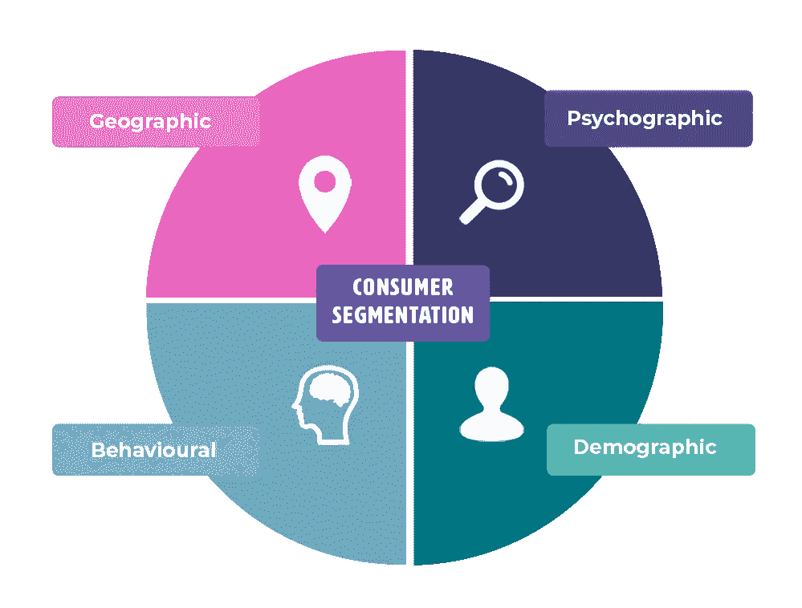

[https://CPA website images . blob . core . windows . net/public images/Blogs/Segmenting-Consumer-Markets-transparent-BG . png](https://www.professionalacademy.com/blogs/segmentation-targeting-positioning-the-buyer-persona/)

当我们即将推出新产品、服务或营销策略时，我们经常会想知道哪个客户市场将是我们的有效目标。借此机会，我想向您展示一个例子，说明统计和机器学习如何帮助您**近似**客户的人口统计和行为模式。

> 在处理这些数据时，我尝试了两种不同的方法。这两种方法都旨在**再次接近**客户的人口统计和行为模式。这两种方法得出了大致相同的结论。方法有:
> ——数据降维(PCA)然后聚类。
> 和
> ——聚类然后通过分类建模检查变量重要性。我将演示第一种方法，因为它比第二种方法更理论化。

在我们进入主题之前，本文将讨论数据探索。我们作为例子使用的数据来自 Kaggle.com([https://www . ka ggle . com/imakash 3011/customer-personality-analysis](https://www.kaggle.com/imakash3011/customer-personality-analysis))。

***如果你对这部分不感兴趣，而你们又想直接跳到机器学习部分，请关注我这个链接！***
[https://sea-Remus . medium . com/discovery-customer-segments-using-machine-learning-part-2-dimension-reduction-and-clustering-36c 6108599 F9](https://sea-remus.medium.com/discovering-customer-segments-using-machine-learning-part-2-dimension-reduction-and-clustering-36c6108599f9)

# 数据描述

所以从 Kaggle 获得的原始数据包含 28 列，不包括 ID。我排除了 ID，因为它不包含任何重复的记录，这意味着每一行都是唯一客户的信息。
我们有 9 个分类变量和 19 个数值变量。

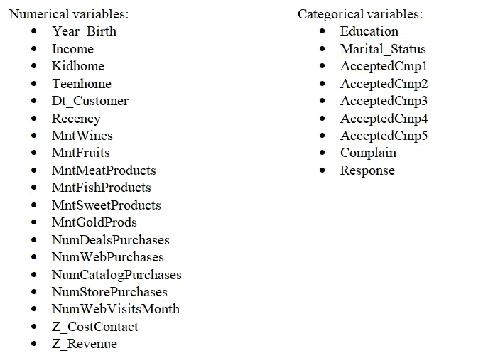

除了 Z_CostContact 和 Z_Revenue，我们可以在 Kaggle 上看到每个变量的定义。我们应该看看这些变量，看看它到底意味着什么。

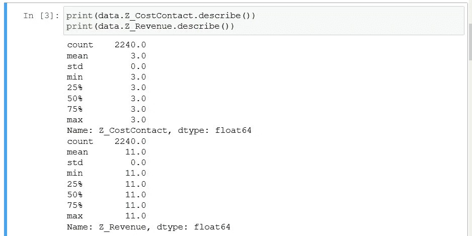

这两个变量实际上都有一个常量值。这意味着即使我们保留那些变量，它们也不会对任何事情有所贡献。我们可以安全地扔掉它们。

# 解读有趣的变量

我们不会可视化所有的变量。相反，我们将只看几个变量，以了解我们当前面对的客户的总体情况。

## 年份 _ 出生和婚姻状况

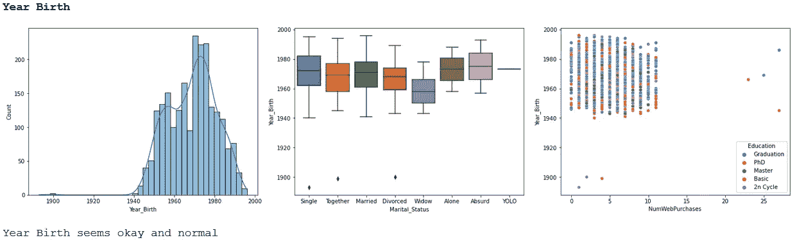

我们可以看到，我们的数据实际上由 1940 年至 2000 年出生的客户组成。我们应该放弃年龄小于 1935 的客户，因为拥有一个年龄为 100 岁的客户是没有意义的(例如，出生于 1900 年，所以 2000 年是 100 岁)。我们还应该考虑将婚姻状况中的“孤独”、“荒谬”和“YOLO”编码为“单身”，因为这三个类别似乎都表示没有任何伴侣的生活。

## 教育

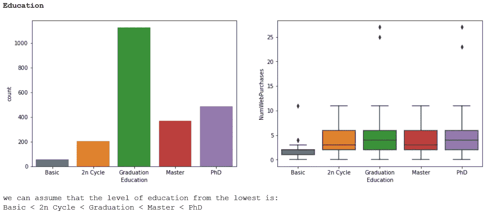

教育似乎也是合乎逻辑的，但如果我们注意 NumWebPurchases，我们已经看到 20 以上的购买两次是异常值(在 Year_Birth 图和此图中)。我们也可以考虑将其从数据中删除。

## 收入

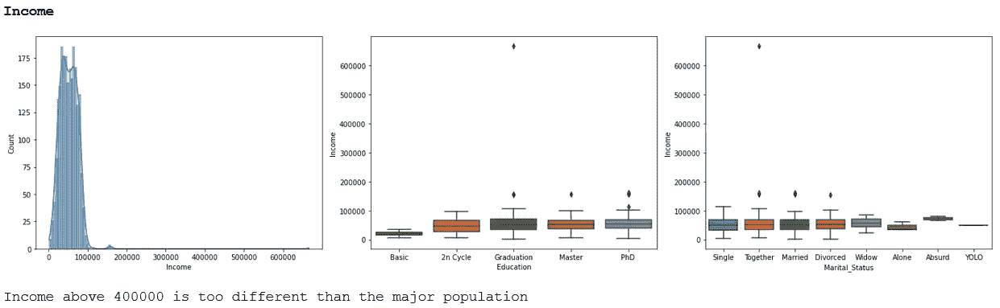

好的，我们需要剔除 40 万以上的收入，因为它似乎是一个异常值。它也需要被删除，因为它可能会影响我们将要进行的聚类。

## 崭新

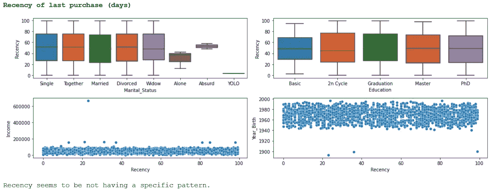

我们可以看到，最近似乎具有均匀分布，客户具有特定最近的可能性彼此完全相同。我们不会在这个变量中找到一个特定的分段截止值。我们可以去掉这个变量。

## 支出的相关性

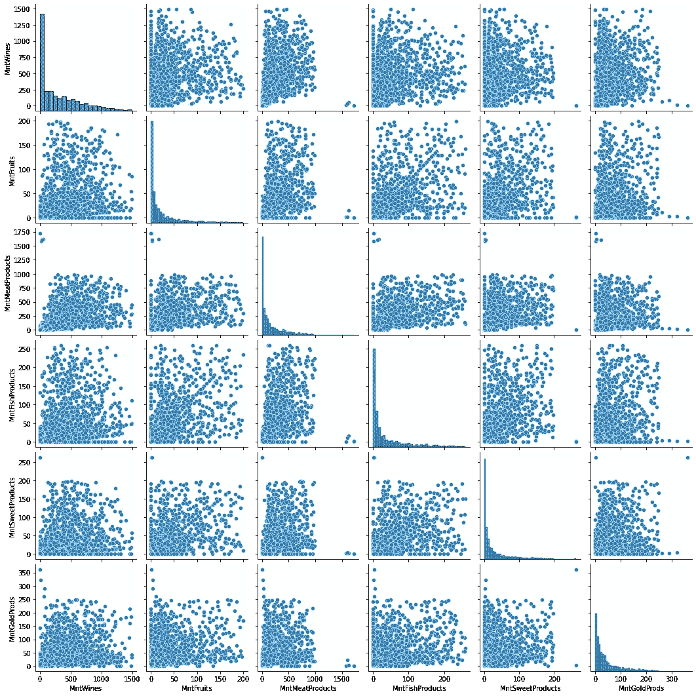

每个项目的采购金额之间的相关性

我们可以看到，每幅图实际上都显示了每个特定物品的购买量与其他每个特定物品的购买量相关。这证明我们可以在以后减少这个变量。

## 购买地点的相关性

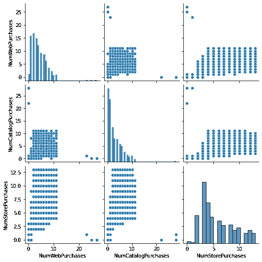

上述各变量之间也存在相关性。网络购买和目录购买之间的相关性可能没有那么大。我们还应该在后面的降维过程中包含这些变量。

## Dt_Customer(加入日期和年龄)

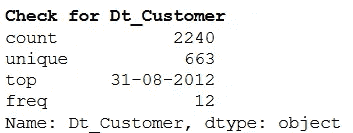

我们关于 Dt_Customer 的数据实际上是一个“对象”。我们应该将这个变量的类型改为日期。由于我们没有自加入以来最后一次观察到的当前日期的信息，我们可以使用 Dt_Customer 的最大值/日期作为我们最后一次观察到我们的客户加入的日期。根据 Dt_Customer 和的最大日期，如果我们假设数据观察的最后日期等于 Dt_Customer 的最大日期，我们还可以使用 Year_Birth 获得客户的年龄。

# 数据清理和(一点)特征工程

关于上面我们看到的几个变量，我们可以开始清理数据，将几个变量变成更好的变量。

## 极端值

我们看到的异常值位于收入、出生年份和网上购物之后。我们将根据这些变量删除行。

```
firstdrop = data[data.Income < 400000][:]
seconddrop = firstdrop[firstdrop.Year_Birth > 1935][:]
final = seconddrop[seconddrop.NumWebPurchases < 20][:]
```

## 特征工程和缺失值

在去除异常值后，我们开始讨论 Dt_Customer、AcceptedCmp 和 marriage _ Status。

```
import datetime#Dt_Customer for days since join and Age
#we use maximum of Dt_Customer to assume it as our final date of observationfinal.Dt_Customer = pd.to_datetime(final.Dt_Customer)
final['days_since_join'] = (max(final.Dt_Customer)-final.Dt_Customer).dt.days
final['Age'] = (max(final.Dt_Customer.dt.year)-final.Year_Birth)#Handling marital status
final['Marital_Status'] = final['Marital_Status'].replace({'Alone':'Single', 'Absurd':'Single','YOLO':'Single'})#Handling Binary Variables
#replace acceptedcampaign, complain and response
final[['AcceptedCmp1','AcceptedCmp2','AcceptedCmp3','AcceptedCmp4','AcceptedCmp5','Complain','Response']] = final[['AcceptedCmp1','AcceptedCmp2','AcceptedCmp3','AcceptedCmp4','AcceptedCmp5','Complain','Response']].replace(0,'No')
final[['AcceptedCmp1','AcceptedCmp2','AcceptedCmp3','AcceptedCmp4','AcceptedCmp5','Complain','Response']] = final[['AcceptedCmp1','AcceptedCmp2','AcceptedCmp3','AcceptedCmp4','AcceptedCmp5','Complain','Response']].replace(1,'Yes')
```

我们还会检查缺失值，如果可能的话，会对它们进行估算。

```
#Check for missing values
print(final.isnull().sum())
```

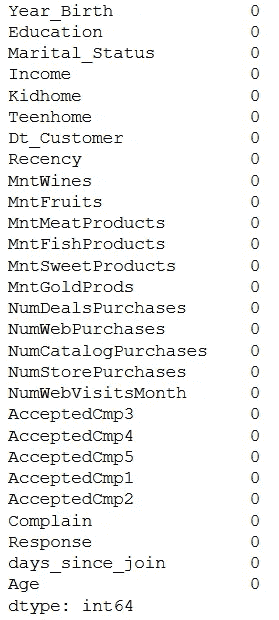

然后，我们删除 Year_Birth、Dt_Customer 和 Recency，然后将数据导出到我们的文件夹，以进行下一步。

```
datatoclust = final.drop(['Dt_Customer','Recency','Year_Birth'],axis = 1,inplace =False)
datatoclust.to_csv('readytoclust.csv',index = False)
```

我们的数据适合进行聚类！
接下来的步骤，也是我们将要讨论的主题(降维&聚类)，可以在本文的第 2 部分看到。

> 第二部分:
> [https://sea-Remus . medium . com/discovery-customer-segments-using-machine-learning-PART-2-dimension-reduction-and-clustering-36c 6108599 F9](https://sea-remus.medium.com/discovering-customer-segments-using-machine-learning-part-2-dimension-reduction-and-clustering-36c6108599f9)

那里见！