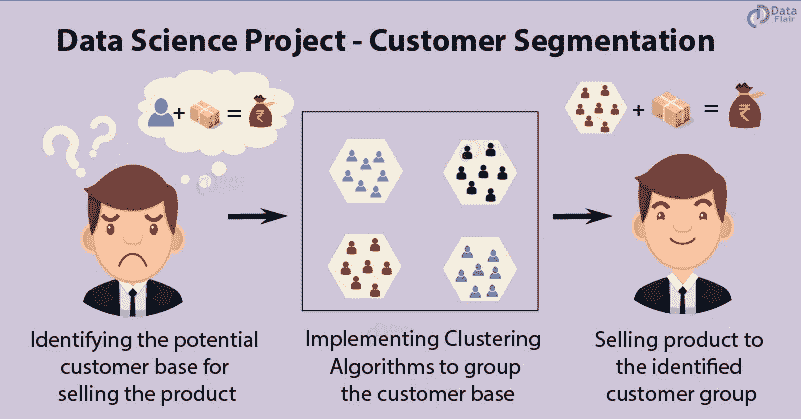
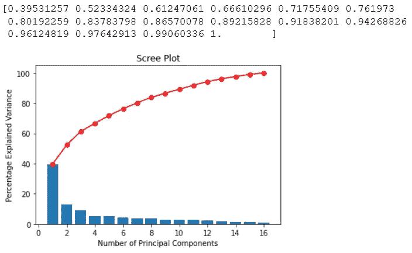

# 使用机器学习发现客户群—第 2 部分(降维和聚类)

> 原文：<https://medium.com/analytics-vidhya/discovering-customer-segments-using-machine-learning-part-2-dimension-reduction-and-clustering-36c6108599f9?source=collection_archive---------10----------------------->



[https://data-flair . training/blogs/WP-content/uploads/sites/2/2019/07/R-project-customer-segmentation . png](https://data-flair.training/blogs/wp-content/uploads/sites/2/2019/07/R-project-customer-segmentation.png)

在前一部分中，我们清理了数据，并确定了可以使用哪个变量。在这一部分，我们将直接讨论如何为聚类准备数据。我们的数据由 25 个变量组成，上层管理人员和我们自己不方便同时直观地解释所有 25 个变量。这就是为什么我们在进行聚类之前先从降维开始。

# 主成分分析

在我们实现 PCA 之前，第一步实际上是只从数据中选择数字变量，因为 PCA 并不意味着处理分类变量。在我们选择了数值变量之后，我们可以实现 PCA。

```
from sklearn.preprocessing import StandardScaler
from sklearn.decomposition import PCA
pcascale = StandardScaler()
datanum = data.loc[:,data.dtypes != 'object']
datacat = data.loc[:,data.dtypes == 'object']
forpca = pd.DataFrame(pcascale.fit_transform(datanum),columns=datanum.columns)
pca = PCA(svd_solver = 'full')
pca.fit(forpca)
```

主成分分析的目的，还是为了减少我们将要用到的变量的维数。PCA 通过投影一对变量作为新的变量，即“分量”，来减少原始变量；因此，它被称为主成分分析。为了了解我们需要保留多少组分，我们需要查看 PCA 结果中组分的累积方差。我们将绘制预测变量的累积解释方差图，以确定我们应该保留多少分量。

```
def display_scree_plot(pca):
    scree = pca.explained_variance_ratio_*100
    plt.bar(np.arange(len(scree))+1, scree)
    plt.plot(np.arange(len(scree))+1, scree.cumsum(),c="red",marker='o')
    plt.xlabel("Number of Principal Components")
    plt.ylabel("Percentage Explained Variance")
    plt.title("Scree Plot")
    plt.show(block=False)expvar = np.round(pca.explained_variance_ratio_,5) 
expvar
print(pca.explained_variance_ratio_.cumsum())
display_scree_plot(pca)
```



累积解释方差及其图

现在，保留成分的数量实际上取决于我们希望从原始数据中解释多少差异。通常，用户(像我们这样的人)希望解释的方差保持在 80%-95%的范围内，这取决于具体情况。在这种情况下，我实际上要保留可以累计解释 80%原始数据差异的组件。
我们可以看到，我们实际上只需要 7 个分量来描述原始数据方差的 80.19%。因此，现在我们将原始数据投影到 7 个新组件中。我们可以通过显示组件上每个变量的负载来解释 7 个新组件。通常，为了解释一个组件，我们只关注高于 0.3 或低于-0.3 的载荷。

```
pcanew = PCA(n_components = 7,svd_solver = 'full')
pcanew.fit(forpca)
loadings = pd.DataFrame(pcanew.components_.T, columns=['PC1','PC2','PC3','PC4','PC5','PC6','PC7'], index=forpca.columns)
loadings[(loadings>0.3)|(loadings<-0.3)]
```


如果我们看一下每个组成部分，我们可以说在每个组成部分中，这些变量很重要:
PC1 =收入，MntWines，MntMeatProducts，numcatalogpuses，numstoreepurchases
PC2 = teen home，NumDealsPurchases，NumWebPurchases
PC3 = teen home，NumWebVisitsMonth，days_since_join，Age
PC4 = Kidhome，NumDealsPurchases，days_since_join，Age
PC5 = MntWines，MntFruits

通过查看每个组件中的重要变量，我们可以尝试了解每个组件试图从数据中描述什么。经过长时间的思考，我是这样解释 7 个主成分的:
PC1 =财富的衡量标准
PC2 =使用交易的倾向
PC3 =相对年龄
PC4 =加入后的相对时间
PC5 =相对商品购买量
PC6 =活动衡量标准
PC7 =黄金与糖果购买量的比较

> 这是我在解释每一个组成部分时对我的推理的解释。我加上这一点，以防你们想知道我为什么这样解释每一部分的原因。
> 
> 推理:
> PC1 =我们可以看到它所包含的大部分变量都可以用来衡量富裕程度比如:a)收入越高，PC1 值越高。b)购买的葡萄酒量越高，PC1 值越高。c)等。
> 
> PC2 =我们可以看到，PC2 可能表明 NumDealsPurchases 的增加也可能表明 Teenhome 和 NumWebPurchases 数量的增加。在 PC2 分量上具有最高负载的 NumDealsPurchases 意味着 NumDealsPurchases 对 PC2 的值的影响非常高。因此，我们可以说，这个组成部分可能代表了用户购买交易的倾向有多大。
> 
> PC3 = PC3 在 days_since_join 和 Age 上具有高负载，即使这两个原始变量实际上具有低相关性。这可能表明，PC3 实际上试图描述我们的平均客户年龄，因此侧重于年龄或自加入以来的天数(自加入以来的客户年龄)。
> 
> PC4 = PC4 在 days_since_join 上权重很大，但与 PC3 不同，在 Age 上的负载没有 days_since_join 高。这意味着 PC4 在其值中考虑年龄，但更关注 days_since_join。PC4 考虑的其他变量是 NumDealsPurchases 和 Kidhome。这意味着 PC4 可能试图测量 days_since_join 数将如何根据 NumDealsPurchases 和/或 Kidhome 的大小而变化。
> 
> PC5 = PC5 显然是在试图描述顾客购买商品的相对量，因为它总共包含 MntWines、MntFruits、MntFishProducts 和 MntSweetProducts。
> 
> PC6 = PC6 包含了相当多的变数。我们可以看到，有 3 个关于购买次数的变量，其加载量> 0.3 或
> 
> PC7 = PC7 仅包含 MntGoldProds 和 MntSweetProducts。我们可以说，该组件试图描述购买的黄金与购买的甜食的相对数量(MntGoldPurchases 与 MntSweetProducts 的比率)。

# 使用 K 原型的聚类

在解释了主成分分析的每个成分想要表达的意思之后，我们可以尝试将主成分分析得分与我们之前分离的原始分类数据相结合。

```
reduced = pd.DataFrame(pcanew.transform(forpca), columns = ['wealthiness','usedeals','relative_age','relative_timesincejoin','relative_mntgoods','activitymeasurement','goldstosweets'])forclust=pd.concat([reduced.reset_index(drop=True),datacat.reset_index(drop=True)],axis = 1)
```

然后，我们使用这个组合数据作为聚类的输入。

> 在本文结束之前，我们必须记住，用于拟合聚类算法的输入是与原始分类数据相结合的 PCA 得分。

我们将使用 K-Prototype 聚类，因为它处理数值和分类数据。由于 K-Prototype 实际上是 K-Means 和 K-Modes(某种程度上)的组合，我们将需要声明我们想要从数据中获得的聚类数。我们将使用 kmodes.kprototypes 包中的成本方法生成的肘形曲线来评估最佳聚类数。

```
from kmodes.kprototypes import KPrototypes
Poscatcol = [forclust.columns.get_loc(i) for i in forclust.loc[:, forclust.dtypes == 'object'].columns]
cost = []
for i in range(2,7):
    clust = KPrototypes(n_clusters = i,init='Huang',random_state=42)
    clust.fit_predict(forclust,categorical = Poscatcol)
    cost.append(clust.cost_)

sns.lineplot(x = range(2,7),y = cost,marker = "+",dashes = True)
plt.title('Elbow Curve')
plt.xlabel('N of Clusters')
plt.ylabel('Cost')
plt.plot
```


通过肘形曲线，我们可以看到最佳的集群数量是 3，因为我们希望显著降低成本，同时防止创建太多的集群。从 2 个集群到 3 个集群，成本下降相对显著。因此，我们运行聚类以从数据中获得 3 个聚类。

```
finalclust = KPrototypes(n_clusters = 3, init='Huang',random_state=42)
finalclust.fit_predict(forclust,categorical = Poscatcol)
full = forclust.loc[:]
full['segments'] = finalclust.labels_
full.segments.value_counts()
```

使用从数据组合中获得的聚类，我们描述了数值变量和分类变量


左图:通过数值数据(PCA 分数)进行的聚类比较，右图:通过分类数据进行的聚类比较

从用于聚类输入和绘制的组合数据(PCA 得分和原始分类数据)中，我们可以估计我们的市场是如何聚类和表现的。这些是我们细分市场中令人感兴趣的东西:

## 第一个群集(群集 0)

我们的大多数客户都属于这个集群，因此我们可以将这个集群作为参考来解释其他集群(一般客户/大多数客户)。与其他集群中的客户相比，该集群中的大多数客户不太可能拒绝我们活动的报价。与其他集群相比，该集群上的客户可以被认为更富有。

该聚类的箱线图显示了自加入以来的相对时间、购买商品的相对数量、活动测量以及购买糖果的黄金数量，这些数据没有显示出聚类之间的任何差异，但是我们可以尝试关注异常值，以查看可能正确的一些想法。如果我们关注离群值，这个集群(集群 0)上的客户可能由比其他集群上的客户加入我们的时间更长的客户组成。离群值也可能表明该集群上的客户比其他集群上的客户更活跃，购买了更多的产品。**这只是一个想法，也许正确，也许不正确**。稍后，我们将通过使用原始数据比较每个聚类来检查这一想法的有效性。

## 第二组(组 1)

这个集群中的客户没有第一个集群中的客户富有。该集群中的客户是最有可能购买特价商品的客户。

## 第三组(第二组)

该集群中的客户是其他集群中所有客户中最不富裕的客户。与其他活动相比，该群中的客户更有可能接受我们第三次活动的报价。尽管很难被发现，也没有太大区别，但是这个集群上的客户比其他集群上的客户更有可能抱怨。

> 我们可以忽略分类变量，因为我们可以从上面的图中看到，它们对区分每个聚类没有太大贡献。分类变量的模式在一个聚类和另一个聚类之间或多或少是相同的。

# 用 PCA 分数+原始分类数据验证聚类

我们将尝试通过使用原始数据比较每个聚类的特征来验证使用组合数据(PCA 得分和原始分类数据)进行的聚类的结果。**这里的目的是查看从组合数据(PCA 得分+分类数据)得出的每个聚类的结论特征与从原始数据得出的每个聚类的结论特征之间是否存在差异。**

```
data['segments'] = finalclust.labels_
fig, ax = plt.subplots(nrows = 3, ncols = 5,figsize = (15,15))sns.boxplot(y='Age', x= 'segments', data=data, ax=ax[0,0])
sns.boxplot(y='days_since_join', x= 'segments', data=data, ax=ax[0,1])
sns.boxplot(y='Income', x= 'segments', data=data, ax=ax[0,2])
sns.boxplot(y='MntWines', x= 'segments', data=data, ax=ax[0,3])
sns.boxplot(y='MntFruits', x= 'segments', data=data, ax=ax[0,4])
sns.boxplot(y='MntFishProducts', x= 'segments', data=data, ax=ax[1,0])
sns.boxplot(y='MntMeatProducts',x= 'segments', data=data, ax=ax[1,1])
sns.boxplot(y='MntGoldProds',x= 'segments', data=data, ax=ax[1,2])
sns.boxplot(y='NumStorePurchases',x= 'segments', data=data, ax=ax[1,3])
sns.boxplot(y='NumWebPurchases',x= 'segments', data=data, ax=ax[1,4])
sns.boxplot(y='NumCatalogPurchases',x= 'segments', data=data, ax=ax[2,0])
sns.boxplot(y='NumDealsPurchases',x= 'segments', data=data, ax=ax[2,1])
fig.delaxes(ax[2,2])
fig.delaxes(ax[2,3])
fig.delaxes(ax[2,4])
plt.tight_layout()
plt.show()
```


用来自组合数据的聚类结果解释原始数据(PCA 得分+原始分类数据)

选择在上面绘制的变量是在考虑了其与 PCA 结果成分的关系(由载荷解释)后选择的。上面的图试图用原始变量描述我们的原始数据，但是被我们的聚类结果分割。分类变量未绘制。根据上面的图，**我们之前通过 PCA 得分做出的聚类解释与我们目前通过原始数据**做出的聚类解释相差不远。我们可以看到，第一个聚类由比大多数客户更富有的客户组成。他们也更积极，也比其他顾客购买了更多的产品**(就像之前 PCA 得分上的异常值所暗示的那样！)**。同时，每个集群之间的年龄和加入天数似乎没有太大差异。我们还可以看到，与其他集群的客户相比，第二个集群更有可能购买特价商品。

> **有趣的事实**:如果你关注客户的交易购买和网络购买，你会发现这实际上与我们在 PC2 上的 PCA 加载密切相关。我们将 PC2 解释为客户通过交易进行购买的趋势。在 PC2 内部，我们可以看到 web 购买也有相对较大的加载量。这意味着我们可以通过网上购物的次数或者通过交易购物的次数来描述 PC2。当我们解释 PC2 的聚类结果时，我们可以看到第二个聚类高于平均值。这意味着第二群集可能具有较高的网络购买量和/或较高的交易购买量。这个假设在上面的最后一个情节中得到了回答。

# 结论

根据这些数据，我们可以看出有三种类型的客户。简而言之，这三种类型的顾客在他们的收入和他们在网上购物和网上购物的行为上有所不同。如果我们考虑所有顾客的平均收入，我们可以说，平均收入的顾客更倾向于从网上购买和通过交易购买。高收入的顾客往往比低收入的顾客更活跃。

这部作品在过程和写作上都远非完美。我希望听到你们的一些评论和意见(是的，亲爱的读者)。最后，如果这篇文章以任何方式帮助你理解机器学习如何被用来做市场细分，请留下“掌声”。:)

在我的下一部作品中再见！