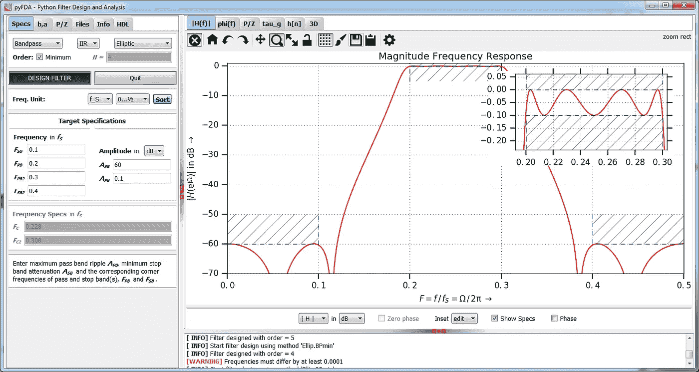

# 使用 Python 滤波器设计分析工具进行离散时间设计

> 原文：<https://medium.com/analytics-vidhya/discrete-time-design-using-python-filter-design-analysis-tool-e8dd432e490e?source=collection_archive---------10----------------------->

## pyFDA —数字滤波器设计

## 设计离散时间数字滤波器的分析工具

pyFDA 工具。图片来源: [pyFDA](https://github.com/chipmuenk/pyfda/raw/develop/img/pyfda_screenshot_3.png)

[**数字滤波器**](https://en.wikipedia.org/wiki/Digital_filter) 是对采样的离散时间信号执行数学运算以减少或增强该信号的某些方面的系统。虽然过滤器很容易理解…