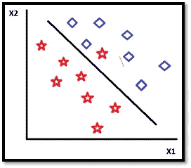
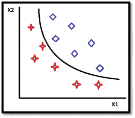

# 判别分析——概念上的理解

> 原文：<https://medium.com/analytics-vidhya/discriminant-analysis-a-conceptual-understanding-c2ccc0dd2906?source=collection_archive---------7----------------------->

判别分析是一种处理带有响应变量和预测变量的数据的分类技术。它主要用于根据数据的自变量将观察值分类到一个类或类别中。判别分析的两种类型:线性判别分析和二次判别分析。

# **线性判别分析(LDA):**

它是一种监督技术，试图使用自变量的线性组合来预测因变量的类别。它假设独立变量是正态分布的(连续的和数字的),并且类的方差/协方差相等。这种技术既可以用于分类，也可以用于降维。当这些假设得到满足时，LDA 创建一个线性决策边界。

线性判别分析

这条线可以清楚地区分数据集中的 0 和 1。因此，LDA 的目标是论证区分 0 和 1 的最佳界限。然而，即使当这些假设被违反时，LDA 也表现良好。

# **LDA 技术:**

DS =β0+β1 * X1+β2 * X2+—+βk * Xk

在哪里

DS:判别分数

β:判别权重/系数

x:独立变量

估计权重，以便尽可能清楚地根据判别函数将各组分开。LDA 构建了一个等式，该等式最小化了将病例错误分类到其各自类别中的可能性。

# **LDA 的假设:**

1.多元正态性-所有标签的独立变量应该是正态分布的。

2.所有类的方差和协方差相等。

3.没有多重共线性，如果存在，如果结果受到影响，需要进行处理。

4.数据中的所有样本应该是相互独立的。

# **LDA 表现良好的标准:**

1.最大限度地减少将案例错误分类到各自类别的可能性。

2.点离线的距离，即滞后点离分隔线有多远。

3.在 LHS 的概率和在 RHS 的概率。

# **标准化、非标准化和结构系数:**

标准化变量的主要目的(其中均值变为 0，标准差变为 1，协方差变为相关)是为了引入数值稳定性。如果自变量有单位，那么βs 将继承相应单位的倒数。从而使βs 不含单位，对原始自变量进行标准化。βs 的值越高，意味着相应的自变量在区分因变量类别时变得越重要。它还向我们展示了可变的重要性。与线性回归不同，LDA 更倾向于自变量之间的相关性更强。

# 什么时候使用 LDA？:

1.当阶级划分得很清楚的时候。当类被很好地分开时，逻辑回归缺乏稳定性，也就是当 LDA 来拯救时。

2.当数据量很小时，LDA 的效率更高。

3.当我们有两个以上的班级时，LDA 是更好的选择。在二元分类的情况下，逻辑回归和 LDA 都可以应用。

# **执行 LDA 的步骤:**

1.计算数据集不同类别的 d 维均值向量。

2.计算类间方差，即不同类平均值之间的可分性。

3.计算类内方差，即每个类的平均值和样本之间的可分性。

4.计算散射矩阵的特征向量和相应的特征值。对应于实非零特征值的特征向量指向被变换拉伸的方向，并且特征值是它被拉伸的因子。负特征值意味着方向相反。

5.通过降低特征值对特征向量进行排序，并选择具有最大特征值的 k 个特征向量来形成(n×k)维矩阵。

6.使用最大化类间方差和最小化类内方差的 Fisher 标准构建低维空间投影。

# **LDA 是如何做预测的？:**

LDA 模型使用贝叶斯定理来估计概率。它们根据新输入数据集属于每个类的概率进行预测。概率最高的类是输出类，然后 LDA 进行预测。简单地通过使用贝叶斯定理进行预测，该定理估计给定输入时输出的概率。它们还利用了每个类别的概率以及属于该类别的数据。

# **LDA 与其他技术的比较:**

1.LDA、ANOVA 和回归分析将因变量表示为自变量的线性组合。

2.LDA 中的因变量是分类变量，自变量是连续变量。方差分析使用分类自变量和连续因变量。

3.LDA 与 PCA 和因子分析密切相关，因为两者都是线性变换技术，即它们寻找最佳解释数据的变量的线性组合。

4.LDA 是一种监督技术，而 PCA 是一种非监督技术，因为它忽略了类别标签。

# **LDA 的应用:**

1.0 和 1 的分离。

2.物体的识别

3.模式识别任务

# **二次判别分析:**

这是 LDA 的一种变体，使用自变量的二次组合来预测因变量的类别。它不假设类的协方差相等，但是正态分布的假设仍然成立。QDA 创建了一个二次决策边界。

DS =β1 * X1+β2 * X2+β3 * X12+β4 * X22+β5 * X1 * X2

然而，QDA 不能用于降维。

二次判别分析