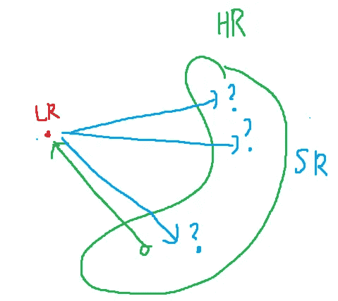
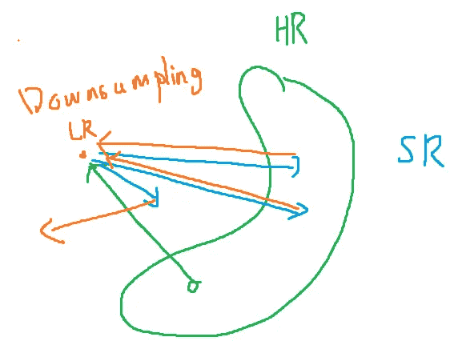

# 讨论了一种新的超分辨率损失方法

> 原文：<https://medium.com/analytics-vidhya/discussing-a-novel-approach-for-the-loss-of-super-resolution-b76b77311093?source=collection_archive---------12----------------------->

# 当前 SR 的问题

正如我在[上一篇文章](/analytics-vidhya/possible-issues-of-the-loss-for-deep-learning-based-super-resolution-649c5bd79635)中所讨论的，测量 SR 的当前损失函数:HR 和 SR 之间的 MSE 损失，对抗性训练，感知损失存在一些问题，并且不是该模型必须实现的最佳感知质量的基本目标。我们将简要总结目前在测量 SR 质量中使用的损失的问题，并提出我对如何改进这些方法的想法。

我想指出的是，这些是我个人的观察和看法，*不是研究者的共识*。有些论点，尤其是第三点可能会有争议。问题如下。

1.  因为 LR->SR 映射不是一对一的函数，所以模型必须能够输出具有随机变化的多个图像。换句话说，SR 问题有多个答案。
2.  与第一个问题相关，基于 MSE 的内容损失不接受图像纹理中的随机变化，并且仅仅因为它具有像素方面的变化就惩罚高质量图像。因此，基于 MSE 的解决方案经常导致过度平滑的图像。
3.  为解决第二个问题(如 VGG 损失和对抗性损失)而提出的感知度量不是 SR 的基本度量。VGG 损失似乎是一种杂项技术，对抗性训练继承了许多问题，并且非常不稳定和不收敛。这两种方法都不能单独发挥作用，只能通过混合损失来发挥作用。

尽管最近的随机共振模型表现很好，而且某些点在实际应用中可能不太重要，但我认为目前的随机共振损失公式是不完整的“把戏”。

# 什么是超分辨率？

我问了自己一个最基本的问题“什么是 SR？”。如多篇文章所述，SR 旨在学习下采样的反函数。然后，我画了下面的图表，并考虑了我们如何奖励模型预测 HR 图像流形上存在的每一个天蓝色预测。MSE 度量的问题是，该模型并不关心 SR 图像是否看起来是 HR，而是只考虑像素方向的距离(见第二张图)。

基于对抗学习的方法旨在通过用鉴别器学习空间并基于鉴别器的测量惩罚生成器来学习绿色 HR 流形。如果鉴别器成功地学习了 HR 空间，那么生成器一定成功地生成了似是而非的图像，但我相信这是通过权重混合来干扰的，鉴别器在学习 HR 流形上完全失败。很难做出一个完整的结论，但我会诊断 ESPCN 的鉴别者是否了解了真实的 HR 空间，并且没有过度适应另一篇帖子中的训练数据。

基于解决方案的 SR 问题和 MSE 问题

# 在下采样空间比较图像

我想到了在下采样空间中比较 HR 和 SR 的想法，而不是直接测量距离。所以，我们用 MSE(LR，双三次(G(LR))代替 MSE(HR，G(LR))作为损失。下图对此进行了说明。

方法的说明。上图是正规的 SR 管道，下面是我的想法。

这样，只有当图像不在给定 LR 图像的 HR 对应物的真实流形上时，损失才会惩罚模型。这样，我们可以在没有对抗性训练的情况下学习 HR 空间，至少在理论上是这样。通过额外的修改，我相信我们可以直接学习感知愉悦的图像。

我失去方法的例证

# 履行

我根据这个损失建议训练了 4x ESRGAN 模型。可悲的是，结果非常人为和怪异。结果如下。每列代表 HR、SR、双三次插值图像。

来自重建的“婴儿”图像的图像补片。

一开始我以为是因为 LR 高或者其他问题导致训练崩溃。但是该模型实际上学会了利用这种损失，并且学会了在不输出预期的 SR 图像的同时最小化损失。这可能是显而易见的，我也预料到这个问题，但结果非常极端。我认为来自一个 LR 图像的可能的 HR 图像的潜在空间非常大，并且必须实施一些额外的机制来加强来自可能的 HR 流形的“真实的”HR 补丁。

下图显示了以 4 倍缩减采样的噪声图像。它们非常精确，我们可以发现该模型在输出不令人满意的超分辨率图像的同时使损失最小化。

# 改进的方法

改进这种方法的一个方法似乎是增加对抗性训练。在之前的内容损失+对抗性损失的混合中，内容损失与对抗性损失是对立的，我们必须在两种损失之间做出权衡。将我们的损失与对抗损失混合可以将两种损失一起最小化，因为我们的损失不会惩罚模型，除非重建图像在 HR 流形之外，这对于对抗损失是可承受的，并且可以限制 GAN 伪影。

此外，我们可以使用其他上采样方法来代替 ESPCN，例如预上采样和去卷积(转置卷积)。ESPCN 平铺分离通道，这对于常规 MSE 损耗来说不是问题，但在我们的情况下可能是一个严重的问题，因为模型更容易利用损耗并分离通道的输出，因为我们的损耗仅在组合尺度中测量。

我感谢对我的方法和论点的批评，因为我想听听你的意见，并通过你的意见改进我的想法。