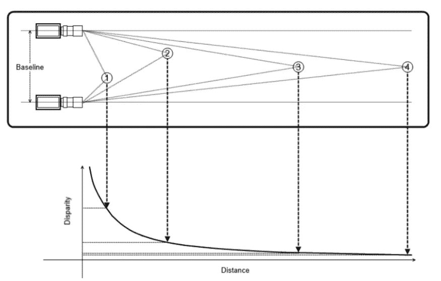

# 立体视觉:物体和摄像机之间的深度估计

> 原文：<https://medium.com/analytics-vidhya/distance-estimation-cf2f2fd709d8?source=collection_archive---------0----------------------->

# 问题

不可能使用单个摄像机“O”来估计点对象“P”离摄像机的距离(深度)。这是因为无论“P”在投影线上有多近或多远，它都会映射到图像中的同一点“P”。

来源:[1]

# 解决办法

**立体视觉**是一种技术，用于使用两个摄像机从摄像机估计点物体‘P’的深度。立体视觉的基础类似于人类视觉中的 3D 感知，并且基于来自多个视点的光线的三角测量。

# 流行的立体摄像系统

## 1.并行系统

来源:[1]

## 2.通用系统

来源:[1]

在本教程中，我们将使用**平行立体相机系统进行深度估计**。

# 深度估计

## 概观

使用平行照相机立体系统的深度估计的容易理解的插图

*   P =物理世界中的目标点(场景点)
*   P *L =* (x *l* ，y *l* ) *=* 左侧摄像机图像中的点 P
*   P *R =* (x *r* ，y *r* ) *=* 右摄像机图像中的点 P
*   n1 =左摄像机图像中 P *L* 点的水平像素距离
*   n2 =右摄像机图像中 P *R* 点的水平像素距离
*   T =左右摄像机中心之间的基线距离
*   f =摄像机的焦距
*   d =相机传感器 CMOS/CCD 中像素的物理尺寸
*   Z =点 P 和摄像机中心之间的距离

**视差(D)= n1-N2 = x*l*-x*r***

所以最后我们有了，

我们能从这个等式中学到什么？📚

*   **深度与视差成反比**。视差越大，物体越靠近相机的基线。视差越小，物体离基线越远。

来源:[2]

*   **差异与基线**成比例。这很容易想象。如果两个摄像机之间的基线距离很小，那么两个图像之间的差异/差异就会很小。随着基线的增加，差距会越来越大。

这两点是非常重要的考虑因素。当我们设计立体声系统时，我们希望非常精确地测量视差，因为这是放弃深度的原因。为此，我们必须使用基线足够大的立体声配置，因为基线越大，我们可以更精确地进行视差测量。

## 立体匹配

对于点 P *L* ，我们怎么得到对应的 P *R* ？🙄

***模板匹配！！***

我们首先在左图中取一个窗口/像素块，P *L* 作为该窗口的中心。

现在我们需要使用这个窗口作为模板，在右图中找到一个相同大小的匹配窗口。

但是这里有一个陷阱！！💡我们不需要扫描整个右图像来找到匹配窗口。相应的窗口必须位于右图中的同一水平线上(称为**扫描线**)。平行立体摄像机系统不会沿垂直方向产生任何视差。换句话说，y *l* =y *r* 。

模板匹配时沿扫描线滑动窗口的图示

因此，我们采用左侧图像中的模板，并计算与右侧图像中沿扫描线的所有窗口的相似性。

如何计算相似度？？🤔

有许多计算相似性的方法。其中一些是:

**1。平方差和(SSD)**

计算 SSD 的等式

SSD 最小的窗口=最相似/匹配的窗口。

**2。绝对差值之和(SAD)**

计算 SAD 的等式

具有最小 SAD 的窗口=最相似/匹配窗口。

最相似窗口的中心将被称为 P *R.*

## 例子

**问**您的视觉系统由两个经过校准的摄像机组成；它们有相同的焦距 20 厘米，基线 10 厘米，相机中的像素大小假定为 0.1 厘米/像素；每幅图像的分辨率为 1920*1080 像素。评估它能测量的最大距离。

**A.** 给定:f = 20，T = 10，d=0.1。

目标:最大化 z。

在我们得到的等式中插入给定值后，

为了最大化 Z，我们需要最小的 D，所以 D=1。

所以我们的视觉系统可以测量 20 米的最大距离。

# 深度图

如果我们为两幅图像中的每个像素位置计算视差，我们可以生成深度图/图像。如果我们使用这个深度图作为 RGB 图像的第四个通道，我们称这个图像为 RGB-D。

理论够了。是时候编码了！！👨🏻‍💻

## 步骤 1 —加载必要的包

## 第 2 步-加载左、右灰度图像

图像取自米德尔伯里立体视觉数据集[3]。

## 步骤 3 —显示两幅输入图像

## 步骤 4-定义一个函数来计算和显示差异

## 步骤 5-执行深度估计

**块大小(bSize) = 5**

**块大小(bSize) = 25**

代码可以在这里找到[。](https://colab.research.google.com/drive/1ywwcgbk1wLv8Qk7-HhJppT0wpk__ch-j?usp=sharing)

# 误称“3D”

真实的 3D 图像以三维显示图像。你在立体视觉中看到的只是带有一些深度信息的 2D 图像，而不是真正的 3D。它通过发送从两个不同的视角(左眼和右眼)拍摄的两个不同的 2D 图像来欺骗你的大脑，所以你在屏幕上有一种错误的深度感知。你不能移动到一边，从不同的角度看事物或事物背后的东西。你看的是假 3D，还是 **2.5D** 。

# 移动 3D 相机📱

随着移动相机和 3D 传感器的成本和尺寸不断降低，消费电子产品制造商发现将 3D 相机纳入下一代移动设备越来越实际。

最早的消费类移动 3D 设备之一是 **LG Thrill** 。这款基于安卓的智能手机有两个 500 万像素的摄像头，可以利用立体效果捕捉 3D 图像和视频。尽管有免眼镜的 3D 显示器，但由于其巨大的重量和体积以及相对较低的照片质量，该设备未能在市场上获得吸引力[4]。

# 其他三维数据表示

*   测定体积的
*   多边形网格
*   点云

# 参考

1.  [http://www.cs.toronto.edu/](http://www.cs.toronto.edu/~fidler/slides/2015/CSC420/lecture12_hres.pdf)
2.  [https://www . oreilly . com/library/view/learning-opencv-3/9781491937983/](https://www.oreilly.com/library/view/learning-opencv-3/9781491937983/)
3.  [http://vision.middlebury.edu/stereo/data/scenes2001/](http://vision.middlebury.edu/stereo/data/scenes2001/)
4.  [Kadambi、Achuta、Ayush Bhandari 和 Ramesh Raskar。"视觉中的 3d 深度相机:硬件的优势和局限性."在*使用 RGB-D 传感器的计算机视觉和机器学习*中，第 3-26 页。Springer，Cham，2014。](https://link.springer.com/chapter/10.1007/978-3-319-08651-4_1)

本文到此为止。

别忘了👏如果你喜欢这篇文章。

如果你有任何问题或者想澄清一些事情，你可以在[领英](https://www.linkedin.com/in/apargarg99/)上找到我。

~快乐学习。