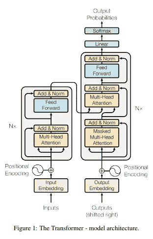
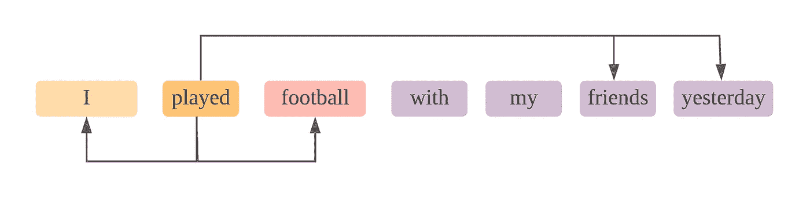
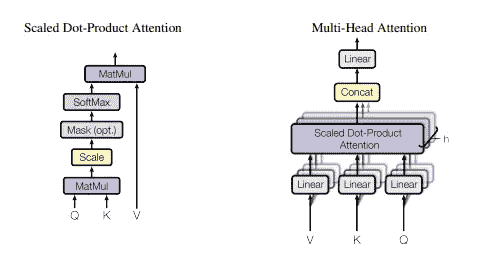
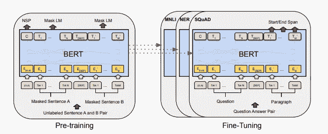
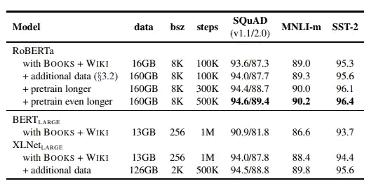
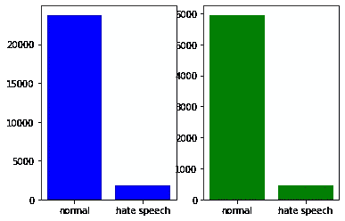

# distilt-RoBERTa 对仇恨言论的分类和对变形金刚的概念性评论

> 原文：<https://medium.com/analytics-vidhya/distil-roberta-for-hate-speech-classification-and-a-conceptual-review-about-transformers-c283bd8ff827?source=collection_archive---------1----------------------->

你好，人们喜欢阅读书呆子技术的东西和那些 ML 项目下周到期。从我过去的两个帖子中，我意识到我喜欢写关于人工智能的文章，因为它总是意味着学习一些新的东西，或者至少在向社区提供信息的同时更新一些概念。这一次我想写一些关于仇恨言论的东西，因为**骄傲**月，但是我被我的工作和我的毕业设计缠住了，然而无论如何决定晚了几乎两个月才写。

本文是关于文本分类的任务。具体来说，我们使用的是“🤗“Datasets library 用于获取仇恨言论分类的 twitter 数据集，Transformers library 用于微调此用例的 distilt-RoBERTa 模型，让我们开始吧！

如果你想直接**跳到代码**，你可以查看我的 [colab 笔记本](https://colab.research.google.com/drive/1b-zn4AgQwBDosAqRoRvyPxoEQKBYJF59?usp=sharing)或者向下滚动直到你看到代码。


罗伯塔是变形金刚模特。由 [Unsplash](https://unsplash.com/s/photos/transformers?utm_source=unsplash&utm_medium=referral&utm_content=creditCopyText) 上的 [Arseny Togulev](https://unsplash.com/@tetrakiss?utm_source=unsplash&utm_medium=referral&utm_content=creditCopyText) 拍摄

# 什么是变压器？

不，我不是在说汽车人或霸天虎。变形金刚是最先进的**深度学习架构**革新了自然语言处理。他们的前辈基于复杂的递归或卷积神经网络进行文本序列建模和转换，这使得他们很难训练并且速度很慢。相反，变形金刚只使用**注意机制**【1】，这将在本文后面解释。现在把它想象成一个黑匣子，接收一个键、一个值和一个查询。



来源[1]

该架构遵循编码器-解码器模型。**编码器**是一堆 *N 个*相同的块，如下所示:

*   多头注意力层
*   逐点全连通层
*   他们之间的残余联系。

另一方面，**解码器**也是一堆具有以下层的 *N* 块:

*   一种掩蔽的多头注意力，它接收向右移位的输出嵌入，带有一个额外的特殊开始标记和另一个特殊结束标记。我们使用这些是因为我们试图在给定前一个令牌的情况下预测下一个令牌。此外，以这样一种方式执行屏蔽，使得某个序列上的记号**I只能出现在小于用于预测的**I的位置上的记号。****
*   另一个多头关注层接收来自**编码器**的值和键的输出，并且查询是前一个关注层的输出。
*   良好的全连接层。
*   这些层之间也有残余连接。

在解码器之后，具有 softmax 激活的密集层被用于令牌分类。

# 什么是多头注意力层？

注意力的概念是从文本序列中提取上下文信息的关键。现在，想一个断句成 ***n*** 单词记号的句子。



人类层面的关注。每个单词都是一个标记。

从这个图中我们看到了什么？如果我们看一下*【被玩】*令牌，我们可以问自己:注意力应该去哪里？嗯，我们可能会说足球可以得到一些关注，因为那是我们正在玩的。然后朋友会受到一些关注，因为这些是我一起玩的人，等等。每个箭头都是一个注意机制。我们可以看到注意力分散在不同的实体上。这大概就是多头注意力层的目的。

现在，这些标记被转换成被称为嵌入的隐藏维度 ***d*** 的数字向量，从而产生表示文本序列 ***的维度 ***n* x *d* 的矩阵。*****



多头注意力架构。来源[1]

同一个矩阵将被馈送到三个线性层，如图所示。可以看到，对于值有***【V】***，对于键有***【K】***，对于查询有***【Q】***，但这三者一开始其实都是同一个矩阵。此外，通过矩阵乘法将键和查询组合在一起，进行规范化，并提供给 softmax 函数，为我们提供将与值相乘的“权重”。所有这一切的要点是，需要注意的单词将具有更大的权重，希望将上下文信息添加到原始嵌入中。回想一下我们之前的图表，有一个句子有很多箭头代表注意力机制。在我们的模型中，每一个都是一个注意力头，所有的注意力头并行工作，有效地捕捉不同的信息。

# 伯特和罗伯塔变形金刚

transformers 的目标是使用我们之前看到的预训练方法来产生可以从文本创建数字表示的语言模型，其中每个标记只能依赖于来自先前标记的上下文信息，然后针对一些下游任务(如文本分类、文本摘要等)进行微调。

**BERT** 代表来自变压器[2]的双向编码器表示。作者认为，以前的变形金刚只是通过从左到右的训练来限制预训练文本表示的能力。

然而，与伯特一起，他们提出了一种叫做掩蔽语言模型 **(MLM)** 的方法论。它只是随机屏蔽 15%的令牌。目标是允许模型学习双向上下文信息，并且使用交叉熵损失将屏蔽的记号用于预测原始记号。

除了 MLM，该模型还被进一步训练用于下一句预测 **(NSP)** 。目标是学习两个句子之间的关系，为此，他们使用成对的句子(如<问题，答案>)来生成标记序列。包含两个句子的序列有一个特殊的记号来分隔它们。在为每个预处理示例选择句子 ***A*** 和 ***B*** 时，50%的时间*是跟随 ***A*** 的实际下一个句子，标记为***is next***；而且 50%的时候是从语料库中随机抽取的句子，标注为 ***NotNext*** 。*

*BERT 的架构如下:*

*   *基本型号 12 个变压器组，大型型号 24 个。*
*   *每个关注层内的 12 个自我关注头用于基础，16 个用于大型*
*   *底座的隐藏尺寸为 768，大型为 1024*

*正如作者所说，使用这种方法的总体优势是 BERT 可以生成比以前的模型更强大的表示，并且需要**最小的架构变化**来微调大多数 NLP 任务。*

**

*对于大多数 NLP 任务，只需对体系结构进行最小的改动，就可以轻松地对 BERT 进行微调。来源[2]*

*现在， **RoBERTa** 实际上是在 BERT 的基础上做了一些改动[3]:*

*   *对模型进行更长时间、更大批量、更多数据的训练*
*   *移除下一句预测目标*
*   *较长序列的训练*
*   *动态改变应用于训练数据的掩蔽模式*

*他们发现 BERT 没有最佳的训练程序，因此通过允许模型预训练中的这种变化来提高其性能。作为比较，您可以在下表中看到结果:*

**

*对照表。最后三列对应于三个不同的数据集。来源[3]*

# *仇恨言论分类*

*先说实际实现。我们将使用“🤗“数据集库。它保存了许多数据集，供我们训练和测试我们的模型。如果你想的话，可以在这里看看。现在，我们将使用*“tweets _ hate _ speech _ detection”*作为我们的特定用例。*

*我们可以使用下面的代码片段列出所有可用的数据集名称:*

*然后，我们加载我们想要的数据集，并将其按 80–20 的比例分割，用于训练和测试，如下所示:*

*现在我们想知道标签的分布，在 matplotlib 的一点帮助下绘制出来。*

*这是我们得到的柱状图:*

**

*可以清楚地看到，“正常”样本的数量远远大于“仇恨言论”样本的数量。这表明我们可能需要使用精度和召回指标，因为在处理不平衡的数据时，精度本身可能会有点误导。稍后将详细介绍这一点！*

*现在让我们为 RoBERTa 模型实例化预训练的记号赋予器。这种记号化器将把我们的文本序列转换成数字向量，我们将记号化器映射到我们的训练和测试数据集。*

*这是我们亲爱的罗伯塔。我们传递训练的类的数量作为参数。当然，对于其他用例，可能不止两个。RoBERTa 将把一些上下文信息放入我们之前用记号化器生成的序列向量中，并以端到端的方式执行文本分类。*

*接下来，我们需要实际训练我们的模型。"🤗“变形金刚库提供了一个**训练器**对象，这将有助于模型训练，而我们只需编写很少的代码。但是首先，我们需要定义要使用的超参数。注意，我们不打算在这里执行超参数优化。我会让你们自己决定。现在，我们就用下面的吧。*

*此外，我们实际上可以传递给培训师一个函数，该函数将检索我们需要的**绩效指标**。为什么我们需要精确和召回？假设我们的模型在测试时将所有样本预测为正常语音。你会说“多么无用的模型”。但事实上，该模型将获得 93%的准确率，这代表了被标记为“正常”的样本的比例。*

**

*从[https://en.wikipedia.org/wiki/Precision_and_recall](https://en.wikipedia.org/wiki/Precision_and_recall)取回。对，起诉我吧！*

*从上图中，我们可以看到**精度**告诉我们，我们的预测有多少是真正积极的。假阳性越少意味着精度越高。另一方面，**回忆**告诉我们，从所有属于阳性类的例子中，我们实际上成功预测了多少为阳性。假阴性越少，召回率越高。*

*此外，我们还可以包括 **f1-score** ，无非是前两个度量的调和平均值。此外，下面的代码片段显示了计算它们的函数的定义:*

*现在，我们将训练参数、模型、度量函数和数据集传递给训练者，然后执行训练和评估。注意不要使用其他种类的神经网络，因为这个对象只针对变形金刚进行了优化！*

*最后，我们得到了以下性能指标:*

```
*{'epoch': 5.0,  
 'eval_accuracy': 0.9816958698372966,  
 'eval_f1': 0.8612099644128114,  
 'eval_loss': 0.12132309377193451,  
 'eval_precision': 0.9075,  
 'eval_recall': 0.8194130925507901,  
 'eval_runtime': 100.8981,  
 'eval_samples_per_second': 63.351,  
 'eval_steps_per_second': 3.964
}*
```

*不算太坏吧！但是召回率并没有我们期望的那么高。尽管如此，我认为我们可以通过优化超参数来更好地适应我们的模型，但这是另外一个故事了。*

# *收场白*

*如果你一路来到这里，我**感谢**你花时间阅读这篇文章。希望能对你有用！我这样做是为了学习和努力为社区做贡献，以此来表达我的感激之情。此外，让我们结束仇恨言论！我们应该权利平等！我们的差异让这个世界如此美丽。*

*再见！*

# ***参考文献***

*[1] A .瓦斯瓦尼*等著*《注意力是你所需要的一切》，*arXiv:1706.03762【cs】*，2017 年 12 月[在线]。可用:[http://arxiv.org/abs/1706.03762.](http://arxiv.org/abs/1706.03762.)【访问时间:2021 年 8 月 5 日】*

*[2] J. Devlin，M.-W. Chang，K. Lee，K. Toutanova，“BERT:用于语言理解的深度双向转换器的预训练”，*arXiv:1810.04805【cs】*，2019 年 5 月[在线]。可用:[http://arxiv.org/abs/1810.04805.](http://arxiv.org/abs/1810.04805.)【访问时间:2021 年 8 月 5 日】*

*[3] Y .刘*等*，《RoBERTa:一种鲁棒优化的 BERT 预训练方法》，*arXiv:1907.11692【cs】*，2019 年 7 月【在线】。可用:[http://arxiv.org/abs/1907.11692.](http://arxiv.org/abs/1907.11692.)【访问时间:2021 年 8 月 5 日】*