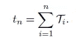
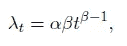
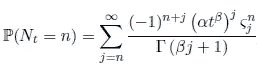
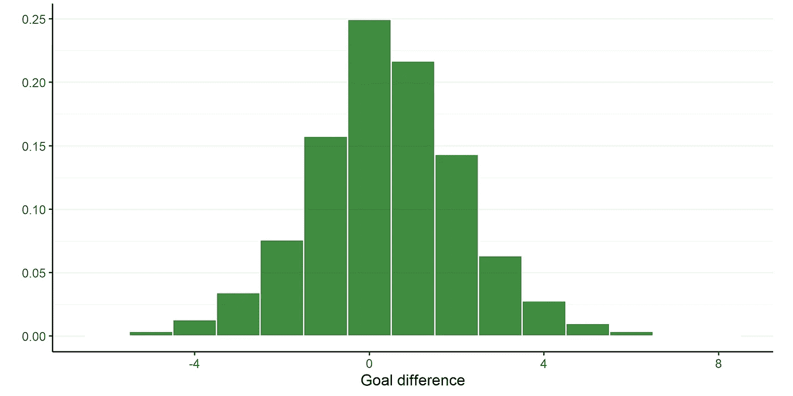

# 英超进球分布

> 原文：<https://medium.com/analytics-vidhya/distribution-of-premier-league-goals-855c909c6955?source=collection_archive---------4----------------------->


照片由[塑造的](https://unsplash.com/@shapelined?utm_source=medium&utm_medium=referral)在[的 Unsplash](https://unsplash.com?utm_source=medium&utm_medium=referral) 上拍摄

## 英格兰足球超级联赛数据管窥

大约一年前，我交了硕士论文。这是一个迷人的课题，我非常喜欢研究它。我的论文过程开始于交卷前一年左右，当时我遇到了一种近乎完美的方式，将我的学业、数学金融和我毕生热爱的足球(对美国读者来说是英式足球)融合在一起。我以前看过几篇论文，描述了如何从足球进球分布的统计模型中制定一个简单的投注策略[1，2，3]，并基于其中一些论文实施了一些业余爱好项目。然而，在我学习期间，我最近参加了一门高级随机过程和期权定价技术的课程，引起了我的注意。当我的一个朋友偶然发现最近的一篇文章时，这种情况达到了高潮，这篇文章将这两个主题结合到一个简单的风险中性框架中，通过将比赛中的进球视为基础资产，使用泊松过程[4]对比赛中的足球赌注进行定价。在我的论文中，我提出了这个*简单*框架的扩展，在这样做的时候，我对用于统计表示足球比赛进球的模型做了一些初步的分析和模型检查。我将试着在这篇文章中展示我在这部分论文中的一些发现。

我在论文中所做的工作与大多数以前关于足球进球分布的学术(或娱乐)论文不同的是，我不仅检查了比赛中的进球分布*，还通过查看足球比赛中的进球次数检查了*比赛中的进球分布*，基本上，对于对数学感兴趣的读者，我调查了某些**得分/计数过程** 如何可以用来描述一场典型的足球比赛及其可能的缺点。事实上，我试图将模型检查程序从简单的目标分布中推开，因此，我试图对抗长期存在的假设，这一假设仍然被许多专家使用，即足球中的目标是泊松分布的。*

对于感兴趣的读者，我将快速总结几个数学定义，主要基于[5，6]的工作。如果你对这门学科的数学理论不感兴趣，你可以跳过这一部分，但至少浏览一下是有用的。

# 定义

首先，我们需要知道点过程在数学上是什么。

> 一个**简单点过程** ψ = {tₙ : n ∈ ℕ}是一个严格增点序列 0<t₁<t₂<⋅⋅⋅<tₙ<⋅⋅⋅
> with lim _ { n→∞}tₙ=∞。我们说 tₙ是第 n 个到达(事件)的到达时间。此外，我们有时允许一个点 t₀在原点，并定义 t₀ := 0。如果 tₙ's 是定义在某个概率空间上的随机变量
> (ω，𝔉；ℙ)，那么ψ被称为一个简单的随机点过程。

为了便于描述足球进球，我将只考虑这样一种情况:我定义 *t* ₀ := 0，因此写成ψ = { *t* ₙ: *n* ∈ ℕ₀}.
现在，假设ψ是一个简单的点过程。那么ψ的第 n 个到达间隔时间**由下式给出**


此外，根据定义，我们有



接下来，我将基于此定义一个计数过程:

> 设ψ是一个简单的点过程。通过定义 N₀ := 0，我们让 Nₜ表示区间(0；t]，即 Nₜ = max {n: tₙ ≤ t }。
> N = (Nₜ)_{t≥0}则称为ψ的**计数过程**。

此外，我们知道(随机)变量 Nₜ也可以用指示函数来表示:


计数过程 n 和点过程ψ之间的基本关系是，对于每一个 *n* 和 *t* 通过简单的推理，以下成立:
*nₜ*≥*n*⇔*tₙ*≤*t*。

与点/计数过程相关的强度过程的整个概念是该理论的核心，但是超出了这篇介绍性文章的范围，但是作为一个简短的总结，强度过程表征了以过程的历史为条件的计数过程的演变。

最后，我将介绍一类重要的点过程。

> 间隔时间{Tₙ: n ∈ ℕ}形成独立同分布(i.i.d .)序列的随机简单点过程ψ称为**更新过程**。然后，我们将 tₙ称为第 n 个**更新时期**和
> F(x) = P(T ≤ x)，x ≥ 0，表示公共到达间隔时间分布。

## 泊松过程

在处理足球建模时，我们无法避免不钻研泊松过程，因此我们也无法避免讨论泊松分布。这只是足球目标建模的一个组成部分(事实上也是点过程理论的一个组成部分)。以法国数学家[西蒙·德尼斯·泊松](https://en.wikipedia.org/wiki/Sim%C3%A9on_Denis_Poisson)命名的(齐次)泊松过程被定义为具有独立到达间隔时间{Tₙ: *n* ∈ ℕ}的点过程ψ，其服从参数为λ的指数分布，此外:


根据指数分布的无记忆特性，我们知道泊松过程实际上也是一个更新过程。基本上，我们知道齐次泊松过程描述了一系列事件，其中下一个事件的发生与上一个事件的发生时间无关。我们还得到了计数过程的增量服从泊松分布，即*nₜ-nₛ*∞poi(λ(*t-s*))。这一事实也让我们明白了进球的分布和描述比赛中进球次数的积分过程之间的联系；也就是说，设置 *s* = 0， *t* = 1，其中 1 等于足球比赛的结束时间(快速补充说明:从积分过程的角度来看，足球比赛的*结束时间*很难预先量化，因为足球比赛中的停止时间具有一定的随机性)，然后我们得到
*n₁-n₀=n₁*∞poi(λ)，也就是说，从足球的角度来看，λ描述了一个球队的平均人数与足球进球建模相关的点过程以及泊松过程的本质是，我们*事先知道*预期的进球数量(或者等效地，进球之间的预期时间)，但是*实际的*进球数量是随机的。

## 威布尔过程

可以将齐次泊松过程扩展到非齐次情况，即，使得它不再是静态的，这基本上意味着进球的机会在整个比赛中不是相同的，而是使得进球的总体分布仍然是泊松分布。用数学术语来说，我们在上面的λ项中引入了一个积分(还有其他技术上的东西，我们在这里不关心)。我们通过这个扩展得出的结论是


最后，注意由于 *N* ₜ具有带参数的泊松分布


我们知道 *Nₜ* 的方差等于 *Nₜ* 的期望值，即


为了利用非齐次泊松过程，我们现在所要做的就是选择λ过程的特征(它可以是随机的或确定的)。在我的论文中，我重点研究了**威布尔过程**的表征，其形式为



用α，β ∈ ℝ₊.请注意，在一个威布尔过程中实际上[威布尔分布](https://en.wikipedia.org/wiki/Weibull_distribution)的是第一个目标的到达时间，而 t₂、t₃、⋅⋅⋅的到达时间，以及间隔时间，{Tₙ}为 *n* ≥ 2，则*不是*威布尔。

## 威布尔更新过程

最后，我将介绍足球目标更新方面的扩展。一般的更新假设基本上是说，强度(得分机会)在事件发生时重新开始，即一支球队得分的机会*在它进球时重新开始*。我想展示另一个与威布尔相关的过程，即**威布尔更新过程**，这是一个间隔时间{Tₙ: *n* ∈ ℕ}按照威布尔分布分布的更新过程ψ；tₙ∞威布尔(α，β)， *n* = 1，2，⋅⋅⋅。泊松和威布尔过程描述了在整个游戏中得分的确定性机会，而威布尔更新过程具有随机强度，可以用以下公式描述


其中，Zₜ是自上次事件以来经过的时间，这就是随机性发挥作用的地方。源自威布尔更新过程的 *Nₜ* 的新兴分布被称为**威布尔计数模型**【7】，由下式给出



这是一个相当复杂的公式，我不会在这里详细介绍(参见源代码中的描述)。

# 目标分析

我现在可以开始分析英超(EPL)的进球了。首先，让我亲自动手，获取一些数据。我的首选语言是 R 编程语言[9]和 tidyverse[10]，但是用其他语言进行这种分析应该也很容易。

## 获取数据

你可以直接从网上轻松获得历史得分数据，例如在[https://www.football-data.co.uk](https://www.football-data.co.uk)。然而，获得目标时间有点困难，你可能不得不自己摸索(请注意，大多数包含此类数据的网站都有某种你应该遵守的摸索政策)。我创建了一个小 R *-* 函数，可以用来从[https://football.fandom.com/wiki/Category:Premier_League](https://football.fandom.com/wiki/Category:Premier_League)获取数据。【8】
一个快速的亲提示；在处理来自 r 的抓取任务时可以使用 [memoise](https://github.com/r-lib/memoise) 包。

```
get_fandom_epl_football_data <- function(season = "2018-19", matchweek = 1) {
  match_url <- glue::glue("[https://football.fandom.com/wiki/{season}_Premier_League:_Match_day_{matchweek](https://football.fandom.com/wiki/{season}_Premier_League:_Match_day_{matchweek)}")

  raw_list <- 
    rvest::read_html(match_url) %>% 
    rvest::html_table()

  games <- raw_list[2:11] %>% 
    dplyr::bind_rows() %>% 
    dplyr::filter(
      !is.na(X2), 
      stringr::str_detect(X3, pattern = "Report", negate = TRUE)
    ) %>% 
    dplyr::bind_cols(
      raw_list[2:11] %>% 
        dplyr::bind_rows() %>% 
        dplyr::filter(
          !is.na(X2), 
          stringr::str_detect(X3, pattern = "Report")
        ) %>% 
        dplyr::select(X6 = X2, X7 = X4)
    ) %>% 
    tidyr::separate(
      col = "X3", 
      into = c("home_score", "away_score"), 
      sep = "–"
    ) %>% 
    dplyr::mutate(
      home_score = as.numeric(home_score), 
      away_score = as.numeric(away_score)
    ) %>% 
    dplyr::rename(
      datetime = X1, 
      home = X2, 
      away = X4, 
      match_info = X5, 
      home_comments = X6, 
      away_comments = X7
    )

  return(games)
}
```

输出应该如下所示:


作者截图；包含废弃 EPL 匹配的 tibble 的 RStudio 控制台输出。

在我进行分析之前，我需要清理数据。这个过程我在这里就不细说了，但是一般来说，这个数据有两个注意事项:

1.  我需要从`home_comments`和`away_comments`列中提取进球得分时间，例如使用`stringr::str_match_all('[0-9]+')`或类似的方法，还需要处理我们希望如何表示补时阶段的进球(例如在数据中显示为 45+1，90+3)。在我的例子中，我选择通过简单地添加数字来表示下半场补时阶段的目标，例如 93，通过添加数字并添加 100 来表示上半场补时阶段的目标，例如 146。在我后来的分析中，我过滤掉了大部分补时进球，因为并不是所有的足球比赛都有那么多可踢的时间，但我希望能够在需要时将它们全部可视化。
2.  不幸的是，红牌的时间也显示在注释列中，因此应该通过比较分数列和提取的目标时间的维度，并手动地(以编程方式？)修好它——对不起！

## 目标分布

现在让我们研究一下 EPL 目标的经验分布，看看我是否能获得与建议模型的分布相似的特征，即通过 *N₁* - N₀.的计数过程产生的概率质量函数(pmf)我的分析中包括了 2004 年 8 月至 2019 年 5 月的所有 EPL 比赛。

请注意，如果每场比赛都反复进行，我们可能会看到与这里显示的模式非常不同的特征。这样的场景显然不可能在现实世界中被观察到，因此，我能得到的唯一数据是这些只打了一次的比赛的集合。因此，为了对一个 EPL 游戏进行一般性假设，我隐含地假设所有的游戏都遵循相同的模式，并具有与大众相同的特征。这可能是不适用的，我应该厌倦了根据一般模式为每个游戏下太强的结论。


2004 年 8 月至 2019 年 5 月期间所有 EPL 比赛的进球数直方图，按主客场球队划分。

从直方图中可以清楚地看出，主队往往比客队进更多的球，这也符合足球常识中的主场优势。我还计算了 EPL 目标的样本均值和方差:


每方 EPL 足球数据的样本均值和方差。

在处理泊松分布如何描述经验分布时，很明显经验数据中存在*过度分散*，即样本方差大于样本均值。这不是泊松分布的明显特征。

威布尔计数模型有两个参数，尺度参数α和形状参数β。它封装了β = 1 的泊松分布。因此，我认为威布尔计数模型会有更好的拟合，至少不会更差。我注意到β < 1 corresponds to overdispersion and β > 1 对应于欠扩散。


威布尔计数模型各边参数的最大似然估计。


(左)拟合泊松 pmf 的目标直方图。(右)拟合威布尔计数模型 pmf 的目标直方图。

从拟合概率质量函数的图中，我清楚地看到泊松分布有明显的缺陷，但仍然提供了一个相当不错的近似值，这可能是为什么许多人至今仍在使用它。另一方面，就目标分布而言，我们认为威布尔计数模型更适合。

## 目标差异

除了分别展示这两种分布，我还将展示目标差异分布。通过检查目标差异，我们可以得到分数可能相关的印象。如果不存在相关性，目标差异应该简单地表现出与个体分布差异相同的模式。



2004 年 8 月至 2019 年 5 月期间所有 EPL 比赛的进球数差异直方图。

现在让我们看看经验目标差异如何与建议的分布相叠加。首先，让我们注意两个泊松分布的随机变量之间的差的分布遵循一个[骨架分布](https://en.wikipedia.org/wiki/Skellam_distribution)。两个威布尔计数模型分布的随机变量之间的差异的分布据我所知还没有被指定，但是我可以用蒙特卡罗模拟来确定该分布。


目标差异直方图，分别具有泊松和威布尔计数模型分布的两个随机变量的差异的理论概率质量函数。

看起来 Skellam 拟合比分数的初始泊松拟合稍微更准确，相反，Weibull 计数差异似乎比我们之前遇到的稍微更差。

## 目标强度

现在，让我们通过分析 EPL 目标时间的分布来检查经验目标强度，并使用两个提出的基于威布尔的计数过程的指定强度将其与理论分布进行比较。这是 EPL 比赛的进球分钟将被使用的地方。

由于我没有获得每场比赛的准确比赛时间记录，所以在这次分析中，我删除了上半场补时阶段的所有进球和第 93 分钟后的所有进球，以便获得相当一致的数据。


在 2004 年 8 月至 2019 年 5 月之间的所有 EPL 比赛中，每一方的进球时间直方图，具有 3 的二进制宽度和重叠的内核密度估计(橙色线)。

我将从展示威布尔过程的结果开始。最终目标是评估源自威布尔过程的理论目标时间分布与观察到的目标时间的拟合程度，附加限制是它还必须与上述得分分布一致。换句话说，假设比赛结束时刻是 t = 1，我必须有，主队λ₁ = αβ1^{β - 1} = 1.536491，客场队λ₁ = αβ1^{β - 1}= 1.138246。通过解决这个优化问题，我得到了以下参数:


目标时间分布每一侧的威布尔过程中威布尔强度的拟合参数。


使用均方根误差优化函数，将平均值受限威布尔过程强度的理论目标时间分布(虚线)与经验目标时间分布(橙色实线)进行拟合。

这为威布尔过程产生了有希望的结果，即威布尔强度能够显示与经验目标时间密度相似的特征，并且还具有与从(泊松)分数分布获得的参数一致的参数。

接下来，是威布尔更新过程。同样，我希望根据拟合过程中的分数分布来加强参数的一致性，这反过来意味着我将使用为威布尔计数模型分数分布提供的参数。这样做对威布尔更新过程产生的结果并不乐观。

导致上述分数分布的威布尔更新过程的参数与经验目标时间分布不一致。事实上，导致过度分散分数分布的威布尔更新过程的形状参数不能随着目标强度分布的增加而持续。


(左)与威布尔计数模型分数分布一致的威布尔更新过程的理论目标时间分布与经验目标时间分布。(右)具有不一致分散参数的威布尔更新过程的理论目标时间分布与经验目标时间分布。

尽管有这个看似主要的缺点，我还不准备放弃威布尔更新过程。如前所述，人们可以想象一个特定的游戏反复玩了数千次，将导致不充分分散的分数分布，并且仍然具有增加的目标强度。在这种情况下，威布尔更新过程可能是一个合适的建模选择。

这样做，连同对平均值和分数分布的一些其他技术限制，我表明威布尔更新过程也可以显示目标强度的相当有希望的特征。

## 目标等待时间

最后，我想探索 EPL 中目标等待时间的分布，并将它们与两种过程的理论分布进行比较。为了简单起见，我只关注前两个目标的等待时间的分布。


在 2004 年 8 月至 2019 年 5 月期间举行的所有英超联赛中，每一方第一个进球的等待时间以灰色显示，第二个进球的等待时间以粉红色显示。直方图的二进制宽度为 3，对于第一个和第二个目标的等待时间，重叠的核密度估计分别为黑色和紫色。

各队等待时间的经验分布似乎相当相似，第一个进球的等待时间略有不同，其中主队的密度质量似乎更靠左，即平均而言，主队的第一个进球更快。双方对第二个目标的等待时间表现出相似的模式，大部分质量集中在开始。这并不奇怪，因为每次足球比赛的时间都大致相同，因此，对于等待时间约为 90 分钟的第二个进球，这意味着第一个进球需要非常快地进球。当我们需要评估理论密度时，点过程的这种*时间截断*也会发挥作用。这种情况的一个例子是(威布尔)更新过程，该过程应该具有相等的(威布尔)等待时间密度，然而，这是在点过程永久持续的情况下。事实并非如此，相反，我使用蒙特卡罗模拟来模拟新兴的分布，包括在积分过程中的时间截断，也就是足球比赛的结束。


(左)虚线:用上面给定的参数模拟威布尔过程中等待时间每一侧的理论密度。第一个目标的等待时间密度以黑色显示，第二个目标以紫色显示。实线:第一个目标(黑色)和第二个目标(紫色)的经验等待时间的核密度估计，分别用于每一侧。(右)相同，但用于具有不一致分散参数的威布尔更新过程。

一般模式显示了两个模型的理论密度和经验密度之间的许多相似之处。经过仔细观察，我注意到第一个目标(黑色)的等待时间的估计核密度和威布尔过程的理论密度似乎非常一致，总体形状得到了很好的解释。在开始的时候有一些不同，特别是对于主队，在结束的时候两队都有。结局很可能是因为理论密度的模拟，我在第 93 分钟结束了每场比赛，在现实生活中，在结束分钟有一些显著的差异。密度开始时的轻微右偏最有可能是由于进球后的庆祝期。

查看威布尔更新过程，我注意到对于第一个目标的等待时间，该过程倾向于高估快速目标的数量，而低估晚期目标的数量。然而，值得注意的是，在第二目标(即快速第二目标)的等待时间的观察分布中，位于左侧中心的大概率质量没有被威布尔更新过程很好地捕获。这是因为更新假设意味着一个球队在进球后完全*重新开始*，而事实上一个球队在进球后通常会*乘着信心的浪潮*。

# 结论

我的分析在寻找分布和/或点过程来模拟足球进球时，扩展了模型检查程序。我的发现表明，我所关注的这两种类型的过程，以及分布，在描述 EPL 足球进球方面，似乎都有一些有用的特性，这些特性是以前没有强调的。但它也显示了一些严重的限制建模(在玩)足球。特别是，威布尔过程的目标分布和嵌入在威布尔更新过程中的更新假设应该被强调。EPL 的足球进球根本不符合泊松分布，即使进球后的停顿(庆祝和开球)使得在另一个进球后的一分钟内几乎不可能进球，更新假设似乎并不存在于足球进球中。尽管有这些缺点，这两种(类型的)模型都不应该被完全抛弃，仍然可以教给我们很多关于足球进球建模的知识。用许多伟大的统计学家*的话来说，让我用一句通常被认为是乔治·博克斯的绝妙名言来结束我的发言，他说:*

> 所有的模型都是错的，但有些是有用的。

# 参考

[1] Mark J. Dixon 和 Stuart G. Coles，“模拟协会足球比分和足球博彩市场的低效率”(1997)，皇家统计学会杂志:系列 C(应用统计学)46.2，第 265-280 页。

[2]迈克尔·j·马赫，“模拟协会足球比分”(1982 年)，《尼尔兰迪卡统计》36.3，第 109-118 页。

[3] Georgi Boshnakov、Tarak Kharrat 和 Ian G .麦克黑尔，“预测足球协会比分的二元威布尔计数模型”(2017)，《国际预测杂志》33.2，第 458-466 页。

[4] Peter Divos 等，“风险中性的在玩足球赌注的定价和套期保值”(2018)，应用数理金融学 24.4，第 315–335 页。

[5] Karl Sigman，“IEOR 6711:泊松过程笔记”(2009)，IEOR Columbia - Columbia 大学，讲义。

[6]托马斯·比约克(to MAS bjrk)，“从鞅观点介绍点过程”(2011)，KTH，讲义。

[7] Blake McShane 等人，“基于威布尔到达间隔时间的计数模型”(2008 年)，《商业与经济统计杂志》26.3，第 369-378 页。

[8] FANDOM，《足球数据库维基》(2021 年访问)，【https://football.fandom.com/wiki/Football_Wiki】T2。

[9] R 核心小组，“R:统计计算的语言和环境”(2021)，奥地利维也纳 R 统计计算基金会。网址 https://www.R-project.org/。

[10] Wickham 等人，“欢迎来到 tidyverse”(2019)，《开源软件杂志》，4(43)，1686。