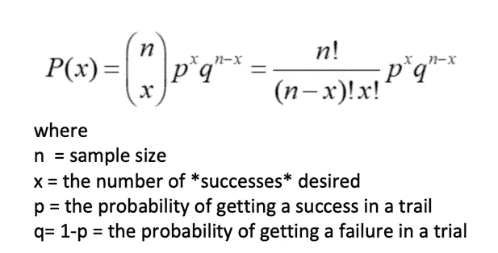
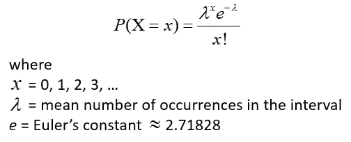
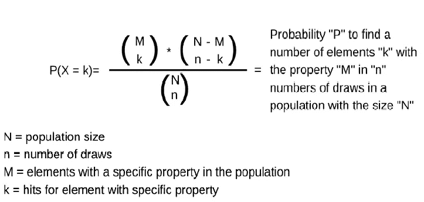
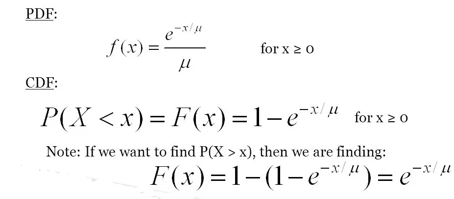

# 分布

> 原文：<https://medium.com/analytics-vidhya/distributions-9cbcadd9d5fe?source=collection_archive---------20----------------------->

我们将讨论一些分布函数。我们将看到它们的性质，并试图用基本的例子来理解它们。

# 二项分布

二项分布

要记住的要点

1.  这是一个离散分布。
2.  有两种可能的结果。
3.  成功的概率是一样的。
4.  固定数量的踪迹。
5.  审判是相互独立的。

首先我们总是想知道为什么要在公式中使用**组合**。为了回答这个问题，我们来看这个例子

***举例:***

车祸数据显示 8%的人死于车祸。10 个人的随机抽样。让我们看看不同的场景。

1.  所有人都死于车祸

(0.08)*(0.08)*(0.08)*(0.08)*(0.08)*(0.08)*(0.08)*(0.08)*(0.08)*(0.08)将会是(0.08)⁰= 1.07 * 10 *幂(-11)

2.所有人都活了下来

(0.92)*(0.92)*(0.92)*(0.92)*(0.92)*(0.92)*(0.92)*(0.92)*(0.92)*(0.92)(0.92)得出(0.92) ⁰ =0.4344

3.只有 2 人死亡

(0.08)*(0.08)*(0.92)*(0.92)*(0.92)*(0.92)*(0.92)*(0.92)*(0.92)*(0.92)*(0.92)这将是(0.08) *(0.92)⁸。现在我们看到了公式中组合的用法。这可以创建多个版本，如(0.92)*(0.92)*(0.92)*(0.92)*(0.92)*(T6)**(0.08)*(0.08)**(0.92)*(0.92)*(0.92)*(0.92)*(0.92)或 like(0.92)****(0.08)****(0.92)*(0.92)*(0.92)*【0.92】。为了避免这种情况，我们需要公式中的组合项。

# 泊松分布

泊松分布

要记住的要点

1.  这是一个离散分布。
2.  描述在固定时间间隔内发生的事件数量。
3.  只需要一个参数λ。
4.  有界在 0 和∞之间。
5.  发明发生的速度总是不变的。
6.  审判是相互独立的。

***例如:***

假设一天内售出的平均商品数量是 2。第二天有三个项目的概率是多少？

λ=2，x=3

回答 P(3；2) = 0.180

# 超几何分布

超几何分布

要记住的要点

1.  它非常类似于二项式分布。唯一的区别是成功的概率随着每次抽签而变化。
2.  这是一个离散分布。
3.  审判是相互依赖的。

***举例:***

一个盒子里有 20 个球:6 个红色的和 14 个黑色的。随机抽取 5 个球 ***，不更换*** 。恰好抽中 4 个红球的概率是多少？

(6C4*14C1)/20C5

*再次组合是必需的，只查二项分布的 2 个骰子例子来了解原因。*

答案= 0.0135

# 指数分布

指数分布

要记住的要点

1.  泊松分布的逆分布。
2.  必须以恒定的速率发生。
3.  这是一个连续分布。
4.  审判是相互独立的。
5.  μ是λ的倒数。

***举例:***

泊松-1 小时内通过收费站的车辆数量。

指数-车辆到达收费站的时间间隔。

**最终想法**

我们没有深入挖掘主题。我们试图理解基本的定义和用法。我们已经讨论了与发行版相关的所有要点。