# 数据科学和 ML 完全数学指南—第 1 部分

> 原文：<https://medium.com/analytics-vidhya/distributions-in-data-science-and-machine-learning-i-5a234013903b?source=collection_archive---------11----------------------->

概率和统计中最重要的概念之一是分布的概念。在了解每个著名的发行版之前，让我们先看一下基本术语。

人们的身高往往遵循一种分布(图片来源:Unsplash)

# 术语:

**1。人口和样本**:

问题:假设印度人口将近 20 亿，我想找出平均身高。从物理上和计算上很难找到平均高度。

解决方案:所以我们从总体中抽取一个样本(random_sample)。因为计算随机样本的平均高度很容易。

> 样本是总体的一个子集。随着样本量的增加，我们的样本均值等于总体均值。

**2。平均值**:测量集中趋势。

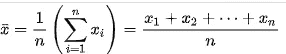

**3。Spread** :基本上说的是这些点与平均值的典型差异。

**4。方差**:基本上就是说“各点距离均值的平方的平均值是多少”。

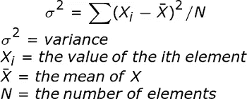

**5。标准差**:方差的平方根。它说，“点与平均值的平均偏差是多少？”。

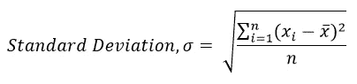

如果标准偏差低，则价差低。

> 所有这三者的问题是“一个孤立点或一个错误会破坏整个数据”。为了避免离群值问题，我们倾向于选择中位数。

**6。Median** :如果总点数为奇数，Median 是排序数据的中间值。

> 异常值对中位数的影响不如平均值大。

如果总点数是偶数，

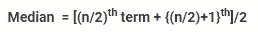

**7。中位数绝对偏差:**

它和标准差有相同的概念。它衡量我的观点离中心趋势有多远，在这种情况下是中间值。

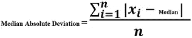

# 高斯分布— N(μ，σ):

> 也称为正态分布，仅取决于两个参数，即趋向于零的均值( **μ)和趋向于一的标准差(σ)。**

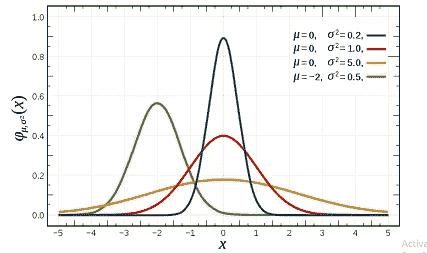

*钟形曲线(Pdf)*

在概率统计中，大多数曲线是钟形曲线。这些钟形曲线就是高斯分布随机变量的概率密度函数(pdf)。

概率密度函数是什么意思？

它规定了随机变量落在特定值范围内的概率，而不是取任何单个值。

如果' X '是一个连续的随机变量，并且它有一个看起来像上述钟形曲线的 pdf，那么我们可以说' X '有一个分布，即 ***高斯分布(X~ N(0，1))*** 。

高斯函数由下式给出:

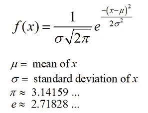

该函数是指数函数，即，为什么该函数指数增长和指数下降。

> *为什么要学习高斯分布？*
> 
> *因为它非常符合每一种自然现象，比如*
> 
> *——掷骰子*
> 
> -扔硬币
> 
> -智商分数、考试分数、体重、身高、年龄
> 
> *这就是为什么它是所有统计学家、机器学习和深度学习工程师最喜爱的分布。*
> 
> 此外，由于分布的平均值、中值和众数相等，因此很容易说明。

68–95–99.7 规则:

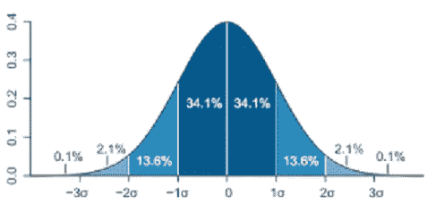

高斯分布随机变量的 Pdf(图片来源:维基百科)

在统计学中也称为 ***经验法则或 3σ法则*** 即 ***68.2%的数据*** 在 ***第一标准差(μ-1σ和μ+1σ之间)******95.4%的数据*** 在**第二标准差(μ-2σ和之间)观察值很少超过 4，5 个标准差。**

# **对称分布**:

是一种分布，我们可以找到一个点“x ”,这样在一边我们有 50%的点，在另一边我们有剩余的 50%的点。高斯分布就是这样一种分布。

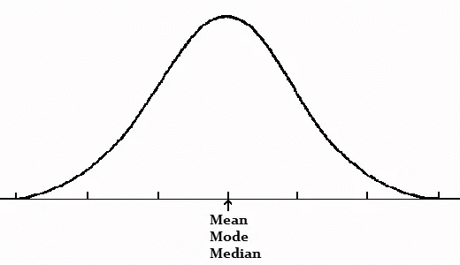

# 非对称分布:

i) **负偏斜**:在左侧，我们有一个长尾，分布的质量集中在右侧。

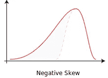

ii) **正偏斜**:在右侧，我们有一条长尾，分布的质量集中在左侧。

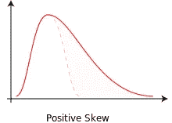

# **峰度**:

它告诉我们曲线的峰值。有三种类型的峰度，即中峰(具有中等峰值的曲线)、细峰(具有尖锐峰值的曲线)和宽峰(具有平坦峰值的曲线)。

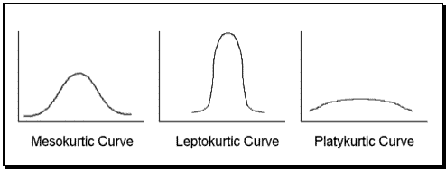

图片来源:simplypsychology.org

> 为什么要了解库图斯病？
> 
> 峰度是衡量数据集中是否存在异常值问题的有用指标。峰度越大表明异常值问题越严重，因此研究人员必须选择替代的统计方法。

# 标准正态分布:

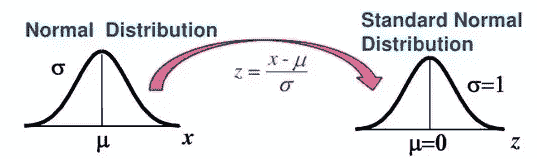

z '是标准的正态变量(图片来源:Quora)

> 标准化是一种很好的方法，我们可以将具有任何 **μ** ，σ2 的变量转换为均值( **μ** )=0 且方差(σ2)=1 的标准形式。

# 核密度估计；

核密度估计与直方图密切相关。根据直方图，我们通过平滑来计算概率密度函数，并且这种平滑是使用核密度估计精确完成的。

使用相同数据构建的直方图(左)和核密度估计(右)的比较。红色虚线是高斯核，蓝色曲线是核密度估计。(图片来源:维基百科)

在上面的直方图中，水平轴被分成子间隔或仓，每个宽度为 2(总共 6 个仓)。

每当一个数据点落在这个区间内，就会在那里放置一个方框。如果一个以上的数据点落在同一个框中，则这些框相互堆叠。

对于核密度估计，具有标准差(σ)的正态核(红色虚线)放置在每个数据点上。在每一点，将内核相加，得到内核密度估计值(蓝色实线)。

# 这些发行版是如何有用的？

简而言之，我们可以说我们学习的所有这些概念包括概率在探索性数据分析(EDA)中都是有用的。它是关于回答我们数据的问题。

考虑一个真实世界的场景，

图片来源(studiousguy)

一个名为 ABC 的机构有 10，000 名学生，我们需要为学生订购 T 恤衫，以庆祝一年一度的节日。t 恤有中号，大号，XL 等多个尺码。我们有以下问题:

一、需要多少件 XL 的衬衫？

**假设**:

1.  获取 10k 学生的测量值既费钱又费时。因此，我们从总体(10k)中随机抽取 500 个样本。从这 500 个观察值中，我们尝试估计样本均值和样本标准差，以接近总体均值和总体标准差。
2.  通常，身高≥ 1.8 米的人倾向于穿加大码的衬衫，而身高在 1.6 米到 1.8 米之间的人倾向于穿 L 码的 t 恤。

图片来源(studiousguy)

正如我前面提到的，高度是正态分布的，现在我们已经计算了平均值和标准差。当我们开始了解分布、均值和标准差时，计算 PDF 和 CDF(累积分布函数)就足够了。在 CDF 中，我们关注的是身高 1.8 米以上的人的比例。假设有 1%的人身高在 1.8 米以上，那么我们可以说几乎有 100 人(10k 的 1%)需要 XL 衬衫。

**参考文献:**

1.  ***百科***
2.  ***斯里干·维尔马和可汗学院的应用课程***
3.  ***吴恩达的 Coursera 机器学习***

[https://medium . com/analytics-vid hya/Google-page-rank-and-Markov-chains-d 65717 b 98 f9c](/analytics-vidhya/google-page-rank-and-markov-chains-d65717b98f9c)