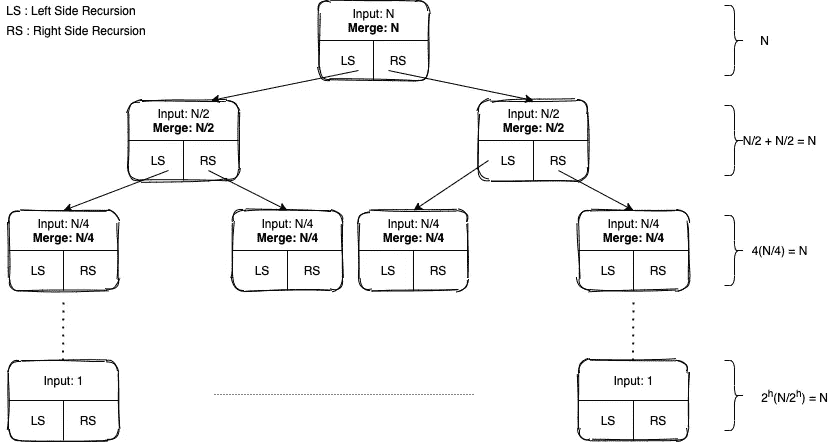

# 分而治之—概念、代码和实践问题

> 原文：<https://medium.com/analytics-vidhya/divide-and-conquer-concept-code-and-practice-problems-86531dd441e?source=collection_archive---------6----------------------->

这篇博客向读者介绍了**分而治之策略**，并讨论了一个通用的 3 步法，它可以适用于解决几乎所有属于**分而治之范畴的问题。**为了详细解释这个概念，博客将使用——合并排序——一种每个计算机科学学生都应该很好理解的算法。博客还解释了**如何编写**合并排序，并通过向读者提供一个**评论良好的 Python 代码**涵盖了实际方面。最后，它还提供了一些带有答案链接的练习题。

我希望这个博客证明是有帮助的。

不再拖延，让我们开始吧！！😃

## 为什么叫“分而治之”？

我们将通过一个假设的例子来理解这一点。

假设我们有一副牌(总共 52 张)，我们想把所有的黑桃从剩下的牌中分离出来。我们可以通过许多方式实现这一点；然而，我们超级聪明😎 😆，我们都知道。我们把这副牌分成两半，每一半有 26 张牌，并向我们的两个好朋友寻求帮助。我们把一半给第一个朋友，另一半给第二个朋友，让他们把所有的黑桃都交给我们。换句话说，我们要求他们通过收集委派给他们的一半中的所有黑桃来征服每一半。

重申一下，我们**将**牌组分成两半，并让朋友们**为我们征服**每一半。嗯，这可能已经是相关的，这种方法被称为分而治之的方法。

更正式地说，在分而治之的方法中，我们**将给定的问题**分成子问题，并试图**解决/征服**子问题。一旦子问题被攻克，我们试图**结合**已解决的子问题来导出原始问题的解决方案。

现在，让我们以合并排序为例，看看它是如何工作的。

## 合并排序—图解说明

让我们假设已经给了我们一个列表——[3，1，4，2]——我们应该使用分而治之的策略对它进行升序排序。为此，我们将使用合并排序。然而，让我们假设不存在合并排序这种东西。我们将如何做到这一点？🤔

好吧，让我们用“卡片例子”作为参考。当我们拿到 52 张牌，并被要求把所有的黑桃分开时，我们做了什么？

*   首先，我们把牌分成两半。
*   然后，我们把每一半委托给我们的一个朋友。
*   最后，我们收集了每个朋友归还的黑桃。

同样，我们处理给我们的列表:

*   首先，我们将列表分成两半。
*   然后，我们将把每个列表委托给我们的一个朋友。
*   朋友们将返回一个排序列表，我们将组合该列表以形成一个排序列表。

然而，有些事情我们可能没有意识到。我们的朋友也很聪明，和我们一样遵循分而治之的策略。当朋友们收到 26 张牌时，他们把它们分成两半(每一半 13 张牌)，并叫他们的另外 2 个朋友找出所有的黑桃。这个分成两半并分配任务的过程一直持续到没有找到所有的黑桃。

在这个新的场景中，我们的朋友也很聪明，我们意识到我们的职责和我们的朋友是一样的——我们都倾向于在给我们的卡片上使用分而治之的方法。

由于任务/职责相同，我们意识到没有必要一次又一次地给新朋友打电话。换句话说，我可以说没有必要一次又一次地定义新的函数。相反，我们可以定义一个依赖于**递归**的**核心函数**。核心职能应该:

1.  接受输入
2.  把它分成两半——左半部分和右半部分。
3.  **递归调用自己**两次——一次在左边，一次在右半部分。
4.  适当地**将两部分**结合在一起并返回结果。

到目前为止，可能有一些事情还不太清楚。然而，让我们通过合并排序的例子，并试图建立一个更好的理解。

概括地说，我们有一个列表— [3，1，4，2]，我们想使用 Merge Sort 对它进行升序排序。

> 注意:从现在开始，我可能会互换使用术语列表和数组。数组和列表是不同的。但是，这种随便用一个换另一个的方式，并不妨碍我们理解分而治之的逻辑。

让我们制作一个核心函数，并将其命名为: **sort (list)，or sort(arr)，or sort(arr)**
**sort()**函数将一个**列表作为参数，然后采用分治法**。

下面是一组解释合并排序如何工作的图片。

首先，我们将排序函数称为:sort([3，1，4，2])。此时的状态如下图所示:

状态 1

然后，sort([3，1，4，2])将数组分成两半，并在左半部分递归调用自身，即[3，1]。发出调用后，它等待递归结束。该状态如下图所示的'*状态 2'* :

状态 2

然后，sort([3，1])将数组分成两半，并在左半部分递归调用自身，即[3]。发出调用后，它等待递归结束。状态如下图状态 3 所示:

状态 3

现在，sort([3])意识到它的输入中只有一个元素。由于只有一个元素，它不能被分割，因此按原样返回。换句话说，sort([3])不进行任何递归调用。这种极限情况被称为基础情况更正式地说，基础用例充当递归树的叶子。

在基本情况即 sort([3])完成其执行并返回值之后，暂停的父实例即 sort([3，1])重新开始其执行。这已在下面的状态 4 图中显示:

状态 4

重新开始执行后，sort([3，1])对右半部分进行递归调用，即 sort([1])。这显示在下面的状态 5 图中:

状态 5

因为 sort([1])是一种基本情况，所以它按原样返回值。这个值被返回给名为 right_sorted 的变量。这显示在下面的状态 6 图中:

状态 6

一旦 sort([3，1])收到了 **right_sorted** 中的值，它就完成了所有的递归调用。目前， **left_sorted** 按排序顺序存储左半部分， **right_sorted** 按排序顺序存储右半部分。现在，我们必须将左半部分和右半部分排序，然后**将它们组合/合并**到一个排序数组中。

> 将两个数组或列表合并成一个是一个众所周知的问题，我希望读者了解这种技术。

现在，sort([3，1])调用 Merge 函数将 left_sorted 和 right_sorted 列表/数组合并为一个。一旦合并完成，合并后的列表将返回到外部排序调用，即 sort([3，1，4，2])。
sort([3，1，4，2])接收其 left_sorted 变量中的值，并重新开始执行。这显示在下面的状态 7 图中:

状态 7

重新开始执行后，sort([3，1，4，2])对右半部分进行递归调用，即 sort([4，2])。这显示在下面的状态 8 图中:

状态 8

现在，同样的步骤——除法、递归调用、基本情况、合并等等。—使用 sort([3，1])发生的将使用 sort([4，2])发生。最终，sort([3，1，4，2])的 left_sorted 和 right_sorted 变量将合并产生最终结果，即[1，2，3，4]。这已在下面的最终状态图中显示出来:

末态

正如我们所看到的，一旦到达最终状态，我们将得到排序后的数组。

理解了这个例子，我们可以向三步法迈进一步。这三个步骤是什么？

# 三步法

在仔细分析了合并排序的工作原理后，我们发现在处理分治时，我们需要考虑并实现以下三件事:

1.  处理**基本情况**。
2.  对两半部分进行递归调用。
3.  **结合**递归调用得到的结果。

如果我们尝试使用 3 步法进行合并排序，我们应该按照以下方式思考:

1.  **基础案例是什么？**
    当列表/数组的长度为 1 时，我们命中基例。
2.  **如何进行递归调用？**
    将数组/列表一分为二，在两者上调用 sort()函数。将输出存储在 left_sorted 和 right_sorted 变量中。
3.  **如何组合结果？**
    制作一个合并函数，帮助我们将两个排序列表/数组合并成一个排序列表/数组。

一旦我们搞清楚了这一点，我们就可以设计我们的核心函数了——叫做 **sort(list)。**sort 函数将以与上述相同的顺序实现这 3 个步骤，分而治之的整个逻辑将成功运行。

下图说明了三步法如何帮助我们编写合并排序算法:

归并排序的图形表示与代码之间的并行绘制

现在，既然我们已经熟悉了如何设计核心函数，即 **sort()，**，让我们跳到编码部分。

## Python 中的合并排序代码

这是 LeetCode 问题的链接。在你阅读解决方案之前一定要试一试。

 [## 对数组排序- LeetCode

### 提高你的编码技能，迅速找到工作。这是扩展你的知识和做好准备的最好地方…

leetcode.com](https://leetcode.com/problems/sort-an-array/) 

LeetCode 提供了一些如下所示的初始代码:

我们将遵循我们的 **3 步**方法，从编写核心函数开始，称为**排序**。下图显示了**排序**功能的代码:

一旦核心函数形成，我们只需要编写**合并**函数。合并函数的代码如下所示:

合并函数一旦编码完成，我们只需要从 LeetCode 提供的函数中调用排序函数，即 sortArray 函数。它看起来像这样:

以下是代码的 GitHub 链接:

 [## shantanutrip/Blog_Codes

### 在 GitHub 上创建一个帐户，为 shantanutrip/Blog_Codes 的开发做出贡献。

github.com](https://github.com/shantanutrip/Blog_Codes/blob/main/Divide_and_Conquer/sort-an-array.py) 

## 复杂性分析—类型 1

为了分析复杂性，让我们看看上面的 **self.sort()** 函数。如果我们认为:

*   *self.sort(list)* 函数对长度为“ *n* 的列表进行排序所用的时间为 *T(n)* ，
*   那么 self.sort(left_half)所用的时间将是 T(n/2)
*   而 self.sort(right_half)所用的时间也将是 T(n/2)。

此外，我们知道:

*   self.merge()函数的总时间复杂度为 O(n)

使用这些信息，我们可以推导出 self.sort(list)所用时间的公式。为了更好地理解，让我们看看下图:

如果我们将 master-method 应用于上图中得到的最终方程，我们会发现时间复杂度为 **O(n log n)** 。

## 复杂性分析—类型 2

还有另一种分析复杂性的方法。然而，与类型 1 相比，这需要更多的可视化。在这种方法中，

1.  我们想象递归树的样子。
2.  然后，在递归树的每一层，我们添加由组合/合并调用完成的所有工作。
3.  然后，我们将递归树的每一层所做的工作相加。

为了更好地理解，请看下图:

我们可以看到，在每一级，总功加起来是 n。因此，总功是:

**h 的值是多少？？**

如果我们观察上面显示的递归树，我们看到在每一层，我们将输入除以 2，直到到达叶节点，在那里输入变成 1。换句话说，当我们到达叶节点时，我们已经将 N 除以 2‘h’次，因此将输入大小减少到 1。

用数学的方法来说，

因此，合并排序的总时间复杂度为:

# 练习题:

*我要感谢我的朋友 Deepankar 帮我选择练习题。*

虽然我刚刚用合并排序来解释这个概念，但我希望读者现在能够使用 **3 步法**来解决他们遇到的任何问题。为了更好地练习，我提供了一些问题的 LeetCode 链接，这些问题可以通过分而治之来解决。可能有其他方法来解决这些问题；然而，我建议读者应该坚持分而治之，以建立对主题的坚定理解。

我还提供了问题的代码。代码注释应该有助于理解如何针对各种问题实现和编码分而治之。

问题链接:

 [## 最大子阵列- LeetCode

### 给定一个整数数组 nums，找出具有最大和的连续子数组(至少包含一个数)

leetcode.com](https://leetcode.com/problems/maximum-subarray/)  [## 合并 k 个排序列表- LeetCode

### 提高你的编码技能，迅速找到工作。这是扩展你的知识和做好准备的最好地方…

leetcode.com](https://leetcode.com/problems/merge-k-sorted-lists/solution/) 

***最大子阵列代码:***

 [## shantanutrip/Blog_Codes

### 在 GitHub 上创建一个帐户，为 shantanutrip/Blog_Codes 的开发做出贡献。

github.com](https://github.com/shantanutrip/Blog_Codes/blob/main/Divide_and_Conquer/maximum_subarray.cpp) 

上面提到的最大子阵是 **O(n log n)** 。

您想使用**分治法**解决 **O(n)** 中的最大子数组吗？请参考以下链接:

 [## 使用分治法的最大和子数组|集合 2 - GeeksforGeeks

### 最大和子数组使用分治| Set 2 给定一个整数数组 arr[]，任务是找到最大…

www.geeksforgeeks.org](https://www.geeksforgeeks.org/maximum-sum-subarray-using-divide-and-conquer-set-2/) 

***合并 K 排序列表代码:***

 [## shantanutrip/Blog_Codes

### 在 GitHub 上创建一个帐户，为 shantanutrip/Blog_Codes 的开发做出贡献。

github.com](https://github.com/shantanutrip/Blog_Codes/blob/main/Divide_and_Conquer/merge-k-sorted-lists.cpp) 

## 结论

在这篇博客中，我们讨论了*分而治之*的主题，也学习了通用的三步法来解决这个主题领域中的问题。为了更好地理解这些概念，我们详细研究了合并排序算法，并探索了整个递归树。通过学习如何编写合并排序算法，我们还获得了实际的理解。我们更进一步，理解了使用分而治之策略的解决方案的复杂性分析过程。最后，为了帮助读者提高他们的实现技能，我们提供了 2 个 LeetCode 问题和到它们的解决方案的链接。

我希望读者发现这个博客是有帮助的。谢谢你的时间。😃

## 参考资料:

1.  [LeetCode](https://leetcode.com/problemset/all/) —问题
2.  [极客为极客](https://www.geeksforgeeks.org/) —增强型解决方案