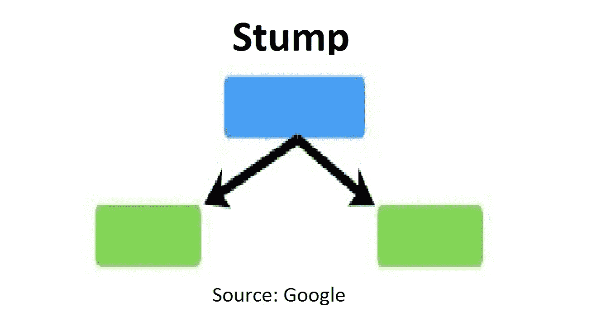
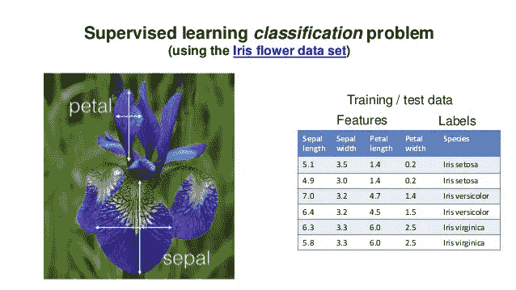
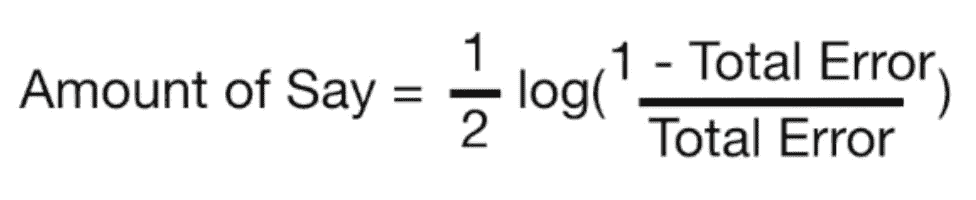
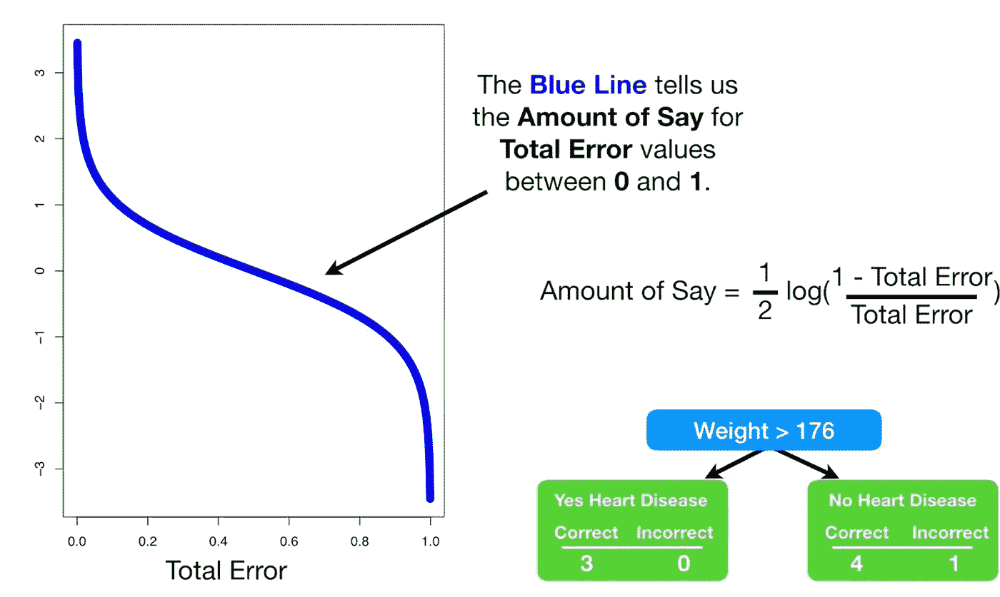
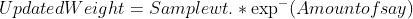
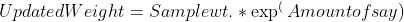

# 深入到 AdaBoost

> 原文：<https://medium.com/analytics-vidhya/diving-deeper-into-adaboost-92a9642e484f?source=collection_archive---------22----------------------->

作为一名机器学习工程师，AdaBoost 是你武库中的一个地狱般的算法。它基于 boosting 集成技术，广泛应用于机器学习领域。在我们深入本文之前，您应该对[决策树](/analytics-vidhya/decision-tree-101-e94a5d131fa0)和[随机森林](https://srivastava-arpan2411.medium.com/)算法有一个基本的概念。

**让我们开始吧**

阿达布斯特姆

*   AdaBoost 背后的基本概念是多个弱学习者可以一起工作，并给出更好的性能。
*   在 random forest 中，树的深度没有预先定义，但是在 AdaBoost 中，我们使用了只有两个叶节点的树桩。
*   这些树桩在技术上被称为“**弱学习者**”。
*   许多弱学习器的集合构成了 AdaBoost 算法。

**与随机森林的比较**

*   在随机森林中，创建的所有树都是相互独立的，而在 AdaBoost 中，一个树桩中的错误分类示例决定了另一个树桩的输入数据。
*   在随机森林中，树的深度不是预定义的，而在 AdaBoost 中，深度被限制为每个树桩只有两个叶节点。
*   在 random forest 中，每棵树在分类中都有平等的发言权，而在 AdaBoost 中，一些树桩在分类中可能有更高的发言权。

**让我们深入算法**

虹膜数据集

*   让我们以虹膜数据集为例。该数据集包含 4 个特征，即萼片长度、萼片宽度、花瓣长度和花瓣宽度，然后我们有 4 个目标类(物种)。
*   我们指定样品重量(样品重量。)并且最初，该权重被设置为 1/n(n =示例的数量)。
*   现在，我们使用每一列创建一个树桩，然后使用基尼指数为每个特征选择最佳的一个。
*   现在我们需要决定这个树桩在分类中有多少发言权。发言权的大小取决于树桩对例子的分类程度。
*   我们计算残肢的总误差，该误差由错误分类样本总数的样本权重之和给出。假设我们的数据集包含 100 个例子，而我们的 stump 错误分类了其中的 10 个。在这种情况下，残肢的总误差将是(1/100) * 10。(1/100)是每个示例的初始样品重量。
*   现在我们计算树桩的 say 量，它由下面的公式给出:

树桩的发言权

*   让我们看一下 V/S 总误差量之间的图表，以便更好地了解情况

图片来源:youtube 上的 Statquest 频道

*   从上图我们可以看出，如果 stump 的总误差较低，它将具有较高的发言权，反之亦然。
*   现在我们强调对被初始残肢错误分类的样本进行分类。我们通过更新样本 Wt 来做到这一点。每一个例子。
*   对于正确分类的示例，权重更新为:

更新样品重量。对于正确分类的示例

*   对于分类错误的样品，其样品重量使用以下公式进行更新:

更新样品重量。对于错误分类的例子

*   现在我们可以看到，正确分类的例子的更新权重低于错误分类的例子的更新权重。
*   在此之后，我们对更新后的样本权重进行归一化，使得它们的总和等于 1。
*   现在我们使用旧的数据集创建一个新的数据集，这样它就包含了更多被 stump 1 错误分类的例子。这可以使用更新的样本权重来完成，因为错误分类的样本将具有更高的权重。
*   由于我们有了一个新的数据集，我们重复上述过程，直到我们得到多个树桩。

【Adaboost 如何进行预测？

*   你带来了一个例子，你把这个例子传递给我们创造的所有树桩。
*   现在，在 6 个树桩中，假设 3 个属于 A 类，3 个属于 b 类。哦，不，这是一个平局。别担心，我们不会像在随机森林中那样遵循聚合。
*   记得我们计算了每个树桩的发言权。是的，那现在会进入画面。我们将预测 A 的树桩的发言权数量和预测 b 的树桩的发言权数量的总和相加。然后，无论哪个总和更高，都将是赢家，这些树桩将对我们的示例进行分类。

希望您对 AdaBoost 有了基本的了解。

**直到那时快乐学习！！**