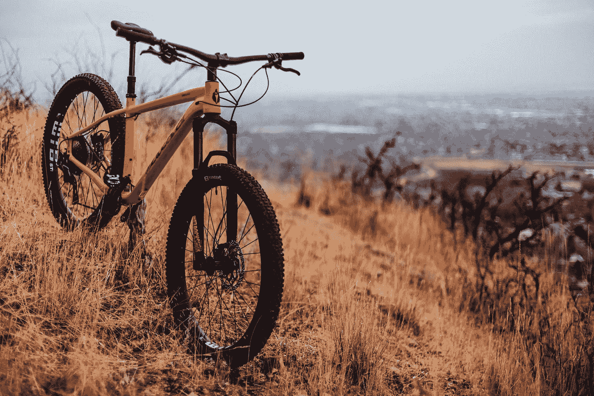
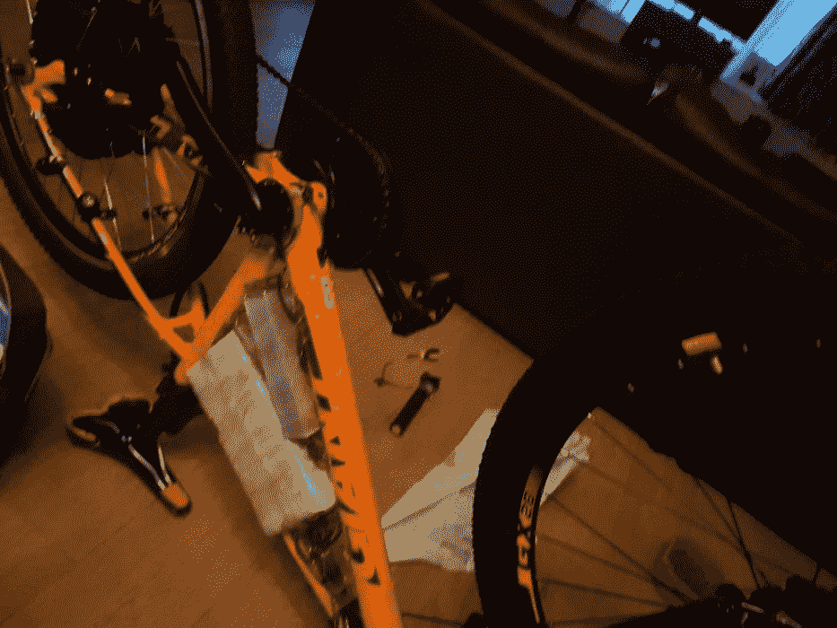
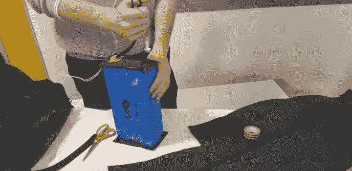
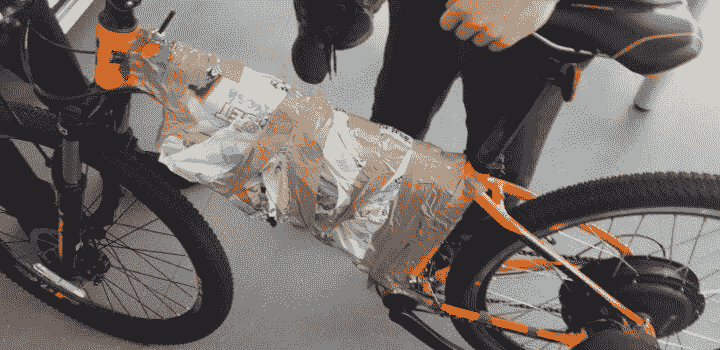
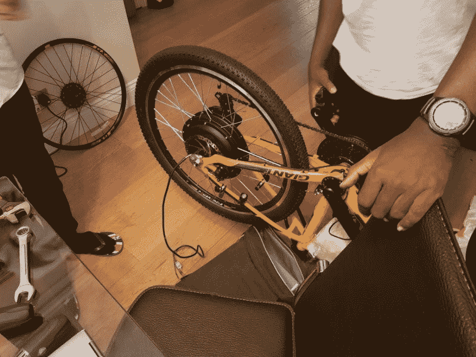
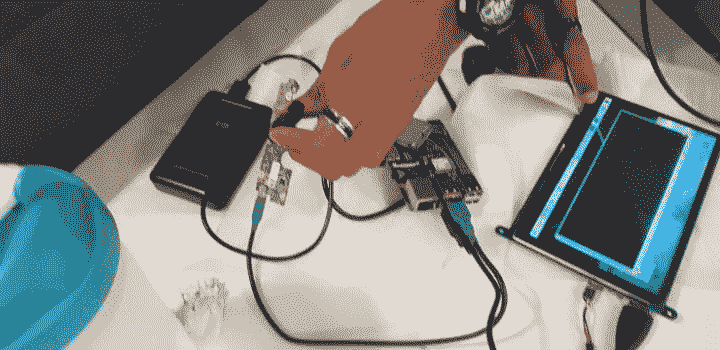
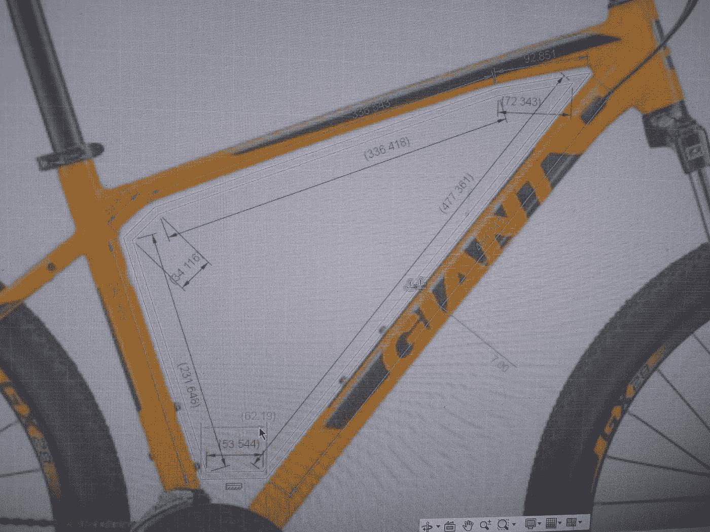
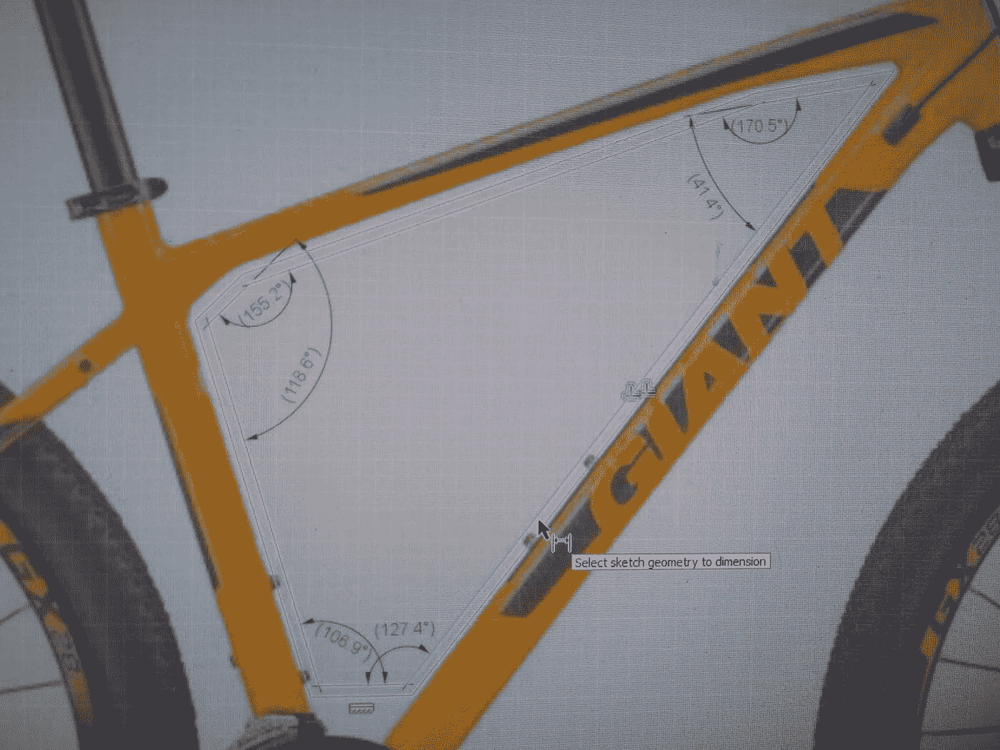

# 我从零开始制造电动自行车的经历

> 原文：<https://medium.com/analytics-vidhya/diy-electric-bike-first-build-e10030686687?source=collection_archive---------16----------------------->

这是我最近自己动手做电动自行车的一个小日志。我主要使用易趣和亚马逊的预建部件，试图降低成本，同时添加一些我自己的电器，利用树莓 Pi，添加我想要的额外功能。

# 第一次迭代

为了这个项目，我挑战自己，将脚踏山地车改造成电动自行车。首先，我需要找到一辆合适的自行车来改装。最初，我决定使用我的一座旧山，并开始修复工作。我改变了刹车，车轮，车轴和磁带，并最终决定，自行车需要这样的技术护理，这超出了我的能力，让它达到一个可接受的标准作为这个项目的基础。

# 电子学

不久之后，我开始研制一辆状况更好的新自行车。一旦组件到达(电池，电机和电子稳定控制系统)，我必须弄清楚如何安全地安装到框架上。在我最初的原型中，我用胶带在三角形框架内获得空间。

# 电池

因为是锂离子电池，所以必须特别保护。因此，我决定用绝缘泡沫和额外的胶带层包裹它，以保护它在建造过程中不受损坏。我发现厚塑料袋虽然不太美观，但能很好地保持组件防水，并提供一些保护免受损坏。我的后期制作步骤将是找到一种更安全和永久的方法来密封电池和电子设备。我还必须用更标准化的东西替换电池上的充电端口，因为很快就发现它附带的端口不是为如此高的功率流而建的。我决定为此使用 XLR 连接器，因为它在插入后是安全和锁定的。

# 经济社会委员会

在这一点上，自行车是完全功能性的，但我唯一的输出是电机自带的小 LED 显示屏。我觉得这不能提供足够的信息，所以我用了一个更大的显示屏和一个树莓派来测量速度和行驶距离，同时运行一个类似谷歌地图的功能。电子稳定控制系统的连接有点混乱，因为原来的油门是非标准的，被取代。因此，在连接新部件之前，我必须用万用表检查和测试连接。

**电机**

我买的马达是装在轮子上的，所以自带轮子，但没有刹车。我不仅要换轮胎，而且一个关键的挑战是将旧车轮的刹车盘换成新的，因为这需要一个相当不常见的工具，而我的学校没有。谢天谢地，我能够源扭矩扳手，并改变了光盘。原来的轮胎也必须换成新的车轮，因为电动车轮的轮胎质地不适合道路。此外，前后轮胎的搭配也让它更具美感。我确信，在这个过程中，应用轮辋胶带，以确保管不会破裂或被电动轮轮辋上的孔切割。

# 显示

该显示器由一台单板计算机运行，这种计算机因其功率大、体积小而在电子行业非常流行。它被称为树莓派 3B，提供足够的处理能力来运行仪表板摄像头系统和导航显示器，可以在任何给定时间显示自行车的速度、距离和位置。dash 相机由一个自定义 Python 脚本运行，该脚本将在自行车打开时启动，并将记录保存到一个文件中。导航系统是一个名为 Navit 的预建 C#应用程序，该应用程序已经过调整，可用于自行车，并且经过编辑，与谷歌地图的外观相匹配。

我在生产过程中面临的一些关键问题是运输时间。我直接从制造商那里购买组件以降低成本，但这意味着某些项目需要 2 个月才能到达。另一个多次出现的问题是破损，当你试图把所有东西都装在一起时，东西总是会破损，尤其是当它们不是为特定目的而设计的时候。这导致订购更多或不同的组件，等待过程再次开始。

# 案例设计

为了防风雨的电子设备，并保持所有组件安全地连接到框架上，我设计了一个木箱，将连接到自行车的 2 个点。我花了很多时间来创造一个既适合框架又能最大化空间的箱子形状。当然，我不得不改变我的设计，因为三角形的车架更理想。我发现把角落稍微弄圆一点会增加很多工作区域。这是理想的，虽然我不得不形状关闭部分的电子稳定控制系统，这是不必要的，以确保一切事情可以安装正确。除此之外，我还必须确保箱子不要太大，以免妨碍骑车人踩踏板，因为那样会造成不舒服的体验。

# 我的经历

在创造自行车的旅程中，我克服了很多障碍，迫使我研究和适应我无法预见的问题。这使得整个经历不仅有趣，而且很有教育意义，因为我遇到了我以前从未使用过的多种技能和能力。如前所述，在更换自行车时，我必须克服重新设计自行车框架和不同部件配置的任务，这给了我一种成就感，因为我收到了所有部件，它们都符合预期。在整个过程中，我意识到我必须培养一种适应的心态，当我意识到 ESC 对于以前没有骑过电动自行车的初学者来说很难控制时，这是特别需要的。因此，我决定买一个新的电子稳定控制系统，这将是一个新的车手更容易，对我来说更安全。我不仅要研究一个我不太熟悉的课题，而且我还不得不退一步，希望取得进展。为了提高效率，我不得不把以前的电子稳定控制系统拆成新的，这意味着在我把新的工作起来之前，自行车不会工作。后退一步感觉并不好，但我相信最终的结果是值得的。我很高兴有一个成品，但我知道我不能看重要的安全功能。

*最初发表于 2021 年 1 月 04 日*[*【https://kgdavidson.co.uk】*](https://kgdavidson.co.uk/diy-electric-bike--my-experience-building-an-electric-bike-from-scratch/)*。*