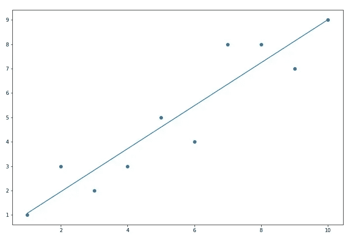
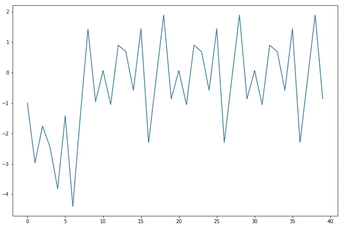
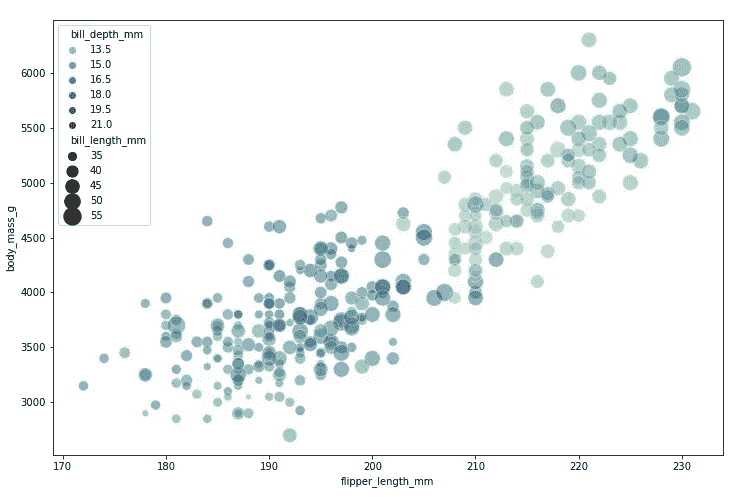
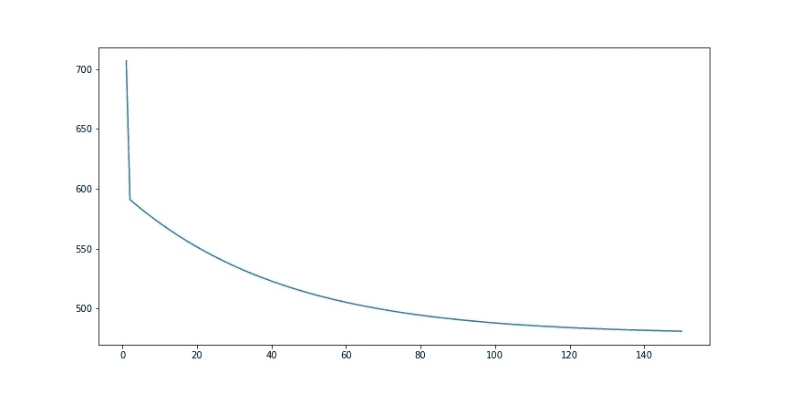
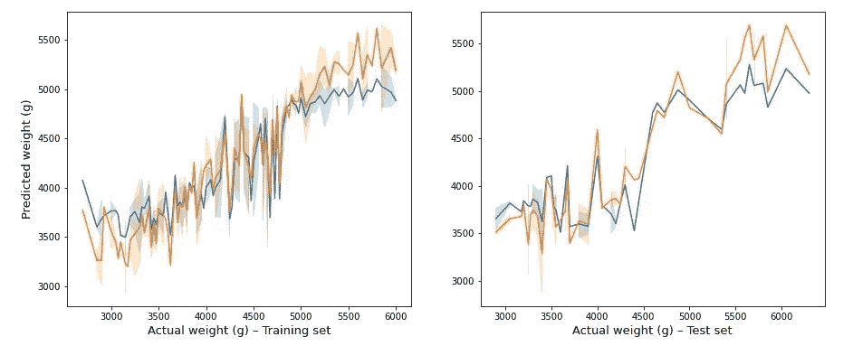

# DIY 梯度下降线性回归

> 原文：<https://medium.com/analytics-vidhya/diy-gradient-descending-linear-regression-b49b24735498?source=collection_archive---------4----------------------->

你为什么要创建一个机器学习模块，而这个模块很可能几年前就已经完成了，而且做得更好？嗯，我不知道你怎么想，但是我有我的理由，我要和那些感兴趣的人分享。


Image by [愚木混株 Cdd20](https://pixabay.com/users/cdd20-1193381/?utm_source=link-attribution&utm_medium=referral&utm_campaign=image&utm_content=6507041) from [Pixabay](https://pixabay.com/?utm_source=link-attribution&utm_medium=referral&utm_campaign=image&utm_content=6507041)

首先，新年快乐(阳历/阴历，你的选择)！其次，我知道我还欠关于网络社会纪律的文章的第二部分，我为它的巨大延迟道歉——但有些事情值得等待(虽然不一定是这篇文章，但有些事情)。第三点:

最近参与制作 Python 模块。与其说是为了效率——可能只是为了任何问题，已经开发出了质量控制更好、处理效率更高、功能更先进的模块——不如说是为了学习新事物。通过“事物”，我认为我们可以区分三个主要领域。

1.  首先是学习你想要包装的概念。如果这个概念对一个人来说是新的，显然，有很多东西需要学习。但是，即使这个概念已经为人所知，把它做成一个模块也需要更严格、更系统地接触——尤其是抽象的——主题。这就引出了第二点。
2.  在精神上/口头上概念化是一回事，但将它概念化为一段代码完全是另一回事。在这样做的时候，人们必须考虑现实世界概念的关系和应用，然后考虑如何将这些关系和用例翻译成具有独特方法、实体和限制的编程语言——以及工具。
3.  最后，学习如何创建一个模块，它的内容是什么，有什么要求，有什么好处等等。测试它是如何工作的。此外，模块如何可能被其他用户利用(或滥用)——并记录下来。

因此，如果这一切听起来令人兴奋，我将详细说明我如何在 Python 中创建我自己的线性回归模块的上述步骤。

# 这个概念

我创建的线性回归模块是基于梯度下降的。为此目的使用它显然是不正统的；然而，也很有教育意义。当然，这不是我的天才想出的主意，但我读了一篇关于机器学习大师的[文章，激起了我的好奇心(所以，非常非常感谢你，赞扬并感谢](https://machinelearningmastery.com/linear-regression-tutorial-using-gradient-descent-for-machine-learning/)[杰森](https://machinelearningmastery.com/about/)一直创造出如此优质的内容)。

坦率地说，梯度下降的细节对我来说是新的。我知道大致的想法，但不知道它的基本机制是如何工作的——而且仍然相当轻蔑。无论哪种情况，普通用例中的概念都非常简单。你需要四样东西:一个预测，你试图预测的实际值，一个惩罚系数(学习率)和迭代。

我们所做的是计算误差，即基于一些模型参数的预测值和实际值之间的差异。然后，使用这个误差，更新模型*权重*——每个参数对结果的贡献大小——作为当前参数和误差的差乘以学习速率。

或者:

> *权重(n+1) =权重(n) ⎯学习率*误差*

那就是:

> *权重(n+1) =权重(n) ⎯学习率*(模型(n)(X) ⎯ y)*

其中*权重(n)* 馈入*模型(n)* ，然后*权重(n+1)* 馈入*模型(n+1)*——当然。在线性回归的情况下，参数是截距和可变系数。对于集合中的每个数据点，将重复更新这些权重的过程——一个完整的更新周期称为一个时期。

现在，这听起来不错，但是让我们用 Python 来实现它。

# 简单线性回归

作为热身，让我们考虑一下简单的线性回归算法是什么样子的。即，仅使用一个独立预测器的模型:

> 模型=截距+系数*变量

因此，我们将有两个权重，一个用于*截距*，一个用于*系数*。因为这些通常用希腊字母 beta 表示，所以我用 *w_b0* 表示截距，用 *w_b1* 表示系数，而 *alpha* 表示学习率:

```
w_b0 = [0]
w_b1 = [0]
errs = []
alpha = 0.01for n in range(len(data['X'])):
    error = (w_b0[-1] + w_b1[-1] * data['X'][n]) - data['y'][n]
    errs.append(error)
    w_b0.append(w_b0[-1] - alpha * error)
    w_b1.append(w_b1[-1] - alpha * error * data['X'][n])
```

当然，我们不需要列出以前的重量甚至误差，但有趣的是观察这些数字如何变化。如果我们让 X 和 y 是:

```
data = {'X': [1, 2, 3, 4, 5, 6, 7, 8, 9, 10],
        'y': [1, 3, 2, 3, 5, 4, 8, 8, 7, 9]}
```

然后我们通过数据运行我们的算法四次，我们得到以下预测:



Matplotlib 主宰着这一天

当然，我们也可以计划我们的错误。理想情况下，它们会以某种古怪的方式接近 0:



我们可以看到，该图相当具有周期性，这是因为我们遍历了 10 个不同的数据点，并在每个周期中独立计算它们的误差。因此，该模式每 10 步重复一次。令人放心的是，它似乎停滞在 0 左右。

但是我可以告诉你我已经让你厌烦了，所以让我们进入下一个阶段吧…顶楼！

# 多元线性回归

还有其他好玩的东西。那么，这里和简单的线性回归有什么不同呢？只是现在我们可以有一个以上的预测者。因此，我们的模型公式应该是这样的:

*模型= Int+Coef(1)* Var(1)+Coef(2)* Var(2)+…+Coef(n)* Var(n)*

这里明显的问题是，我们可能不一定知道我们得到多少输入变量。在这一点上，我还认为该模块应该被广泛使用，因此应该采用 numpy 数组和矩阵而不是列表。通过这种推理，我没有为每个变量的权重创建一个“容器”,而是将所有值存储在一个数组中。由于初始权重为 0，我使用了 numpy 的`zeros()`函数。我同样使用了`empty()`函数来为我的错误生成容器:

```
w_b0 = 0
w_bn = np.zeros(X.shape[1])
errs = np.empty(0)
```

其中 X 是预测值的输入。因为它是一种`numpy.ndarray`格式，我们可以使用它的`.shape`属性来获得权重数组的适当长度。我们也把这次拦截称为`w_b0`。

我们现在需要做的就是将前面的公式推广到任意长度的变量上——以一种 numpy 兼容的方式:

```
for n in range(epochs): # going through n epochs
    for m in range(y.shape[0]): # for m data points ## we calculate the error based on current weights
    error = (
             w_b0 +
             sum([(w_bn[i] * X[m, i]) for i in range(X.shape[1])])
             ) - y[m] ## we add the current error score to the error list (errs)
    errs = np.append(errs, error) ## we update the intercept
    w_b0 = (w_b0 - learning_rate * error) ## for each predictor, we update the coefficient
    for x in range(X.shape[1]):
        w_bn[x] = (w_bn[x] - learning_rate * error * X[m][x])
```

计算`error`的`sum()`部分只是使用列表理解的线性回归公式的*Coef(1)* Var(1)+…+Coef(n)* Var(n)*部分。在底线上，我们现在需要 X 的 2 个指数，因为它是多个不同变量的矩阵。因此，对于每个 y 值，我们遍历 x 中的所有预测变量。

这确实是该模块的核心。截距和系数保存为模型对象的属性，可用于预测:

```
np.array(
         [
          (
           self.intercept +
           sum(
               [
                X[m, n] * self.coefficients[n] for n in
                range(X.shape[1])
                ]
               )
           )
           for m in range(X.shape[0])
          ]
         )
```

其中`sum()`语句再次对应于*Coef(1)* Var(1)+…+Coef(n)* Var(n)*，最外层的列表理解是迭代所有不同的观察。

## 一些不错的额外服务

虽然拟合模型和预测结果已经很简单了，但我还是想加入更多可以说是有用的——也可以说是放错了地方的——附加组件。由于代码相当简单，并且可以在 m [GitHub](https://github.com/aarroonn22/gdlr) 上获得，所以我在这里不再赘述，只列出特性:

*   基于不同聚合方法计算最佳历元
*   MAE、MSE、RMSE 和 R 分数
*   基于不同聚合指标或原始错误分数的内置错误图

我还要补充一点，也许这个项目的这一部分最有趣的方面是构建模块。我试图模仿 [scikit-learn](https://scikit-learn.org/) 的目录和模块结构——我将让您来判断我做得有多好。

# 让我们炸东西吧！

嗯，我们可能没有那么激进，但是我真的想演示一下这个模块是如何完成这篇文章的。因此，我将做一个简单的拟合，将分数与 [scikit-learn 的线性回归模型](https://scikit-learn.org/stable/modules/generated/sklearn.linear_model.LinearRegression.html)进行比较，并展示所有花哨的功能——ayy！

对于这个实验，我将使用 [seaborn 的 penguin 数据集](https://seaborn.pydata.org/generated/seaborn.load_dataset.html)，并使用`flipper_length_mm`、`bill_length_mm`和`bill_depth_mm`来预测`body_mass_g`(尽管存在多重共线性的可能性，但话又说回来，我们在这里是要把事情搞大)。简单可视化的数据如下所示:



我还决定用 20%的测试集和 142 的随机状态来执行一个训练测试分割。然后我为 scikit-learn 的版本安装了两个型号`lr_sk`，为我的版本安装了`lr_gd`。

```
lr_sk.fit(X_train, y_train)
lr_gd.fit(X_train, y_train, learning_rate = 0.000006, epochs = 150)
```

对于学习率，我手动调整了一些值——有些真的爆炸了(万岁)——以找到一个或多或少的最优值。根据所有 MAE、MSE 和 RMSE 度量，最后一个产生了最好的误差。



使用 RMSE 作为聚集度量的模型的错误图

然后我将这两个模型进行了对比。毫不奇怪，Scikit-learn 比我的 DIY 模块做得好得多，但重要的是意图。

在火车上，我听到了鼓声:

*   sci kit-learn:MAE:302.1—RMSE:384.7—R:0.756
*   我的版本:梅伊:359.1 — RMSE: 448.6 — R : 0.668

在测试装置上:

*   sci kit-learn:MAE:346.1—RMSE:416.1—R:0.784(？！)
*   我的版本:梅伊:454.1 — RMSE: 523.9 — R : 0.658

但至少我使用了自己内置的方法来得到我的分数。为了结束这篇文章，这里有一个漂亮的图表，显示了两个模型(蓝色 DIY 版本，橙色-sci kit-learn 版本)对训练和测试数据的预测。



这就是你自己的整洁紧凑的机器学习模块。总而言之，这很有趣，10 分之 10 会推荐。

*一如既往，非常感谢你坚持到最后——如果你还在的话。我真的很感激你，希望我能招待你一会儿。*