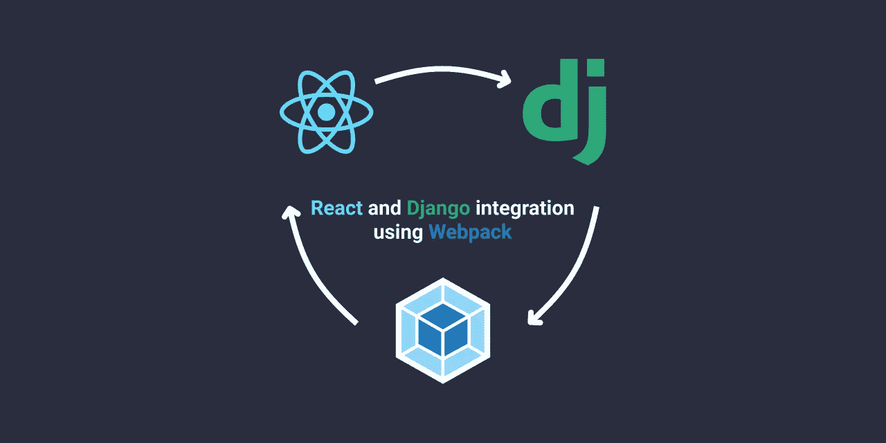

# 反应 Django 一体化

> 原文：<https://medium.com/analytics-vidhya/django-react-integration-37acc304e984?source=collection_archive---------3----------------------->

## 使用 Webpack 和 Webpack 加载器

**在这篇博客中-** 集成时出现的问题会直接反应到 Django 中。
为什么要使用 Webpack 和 Webpack 加载器？
整合的步骤。

**预读-** 这个博客是为那些想了解如何将 React 集成到 Django 中的人，或者那些不明白为什么某些事情会以这种方式完成的人准备的。

**快速注释-** Django 和 React 的这种集成是许多可能的方法之一。这也使用`yarn`作为包管理器。您可以用`npm`命令替换`yarn`命令，它应该仍然运行良好。

此外，你应该知道如何创建一个虚拟环境，以确保未来不会出现版本冲突。这种集成将使用`pyenv`来创建和修改虚拟环境。如果你希望使用`venv`或者其他方法来创建一个开发环境，你可以。
如果你不知道如何使用`pyenv`，你可以从[这里](https://realpython.com/intro-to-pyenv/)学习如何安装和使用。

最后，该集成使用终端代码，即`bash scripting.`如果您正在 windows 上开发，强烈建议您开始使用 Windows Subsystem For Linux(如果尚未使用)。**不需要根。在你的 windows 操作系统中安装 Linux 系统，让开发变得容易多了。如果您在安装 WSL 时需要帮助，请在此处找到它[。](https://www.configserverfirewall.com/windows-10/windows-subsystem-for-linux-2/)**

如果你在任何时候弄乱了文件夹结构，你可以在这里找到完整的[Django-React-Integration](https://github.com/eric-liclair/Django-React-Integration)。需要的时候可以看看。

# 集成时的问题直接反应到 Django 中。

您可能已经知道，Django 在处理项目的静态文件时使用了不同的方法。Django 应该知道所有静态文件的路径。虽然这是管理静态文件的一种很好的方式，但是当涉及到 react 时，您知道已经编写了大量的 JavaScript，修改所有组件的路径绝对是一种令人厌倦的、耗时的、不太适合程序员的工作方式。

因此，为了管理和自动化所有这些，我们使用捆扎机和装载机。

# 为什么要使用 Webpack 和 Webpack-Loaders？

**Webpack** 是一个 JavaScript 编写的静态模块捆绑器。它的作用是，每当你`import { some file } from "some/path";` Webpack 构建一个依赖图，映射你的项目需要的每个模块，并在一个特定的位置生成一个或多个包。

也就是说，它跟踪所有的导入，并检查某个导入文件是否具有特定的文件扩展名。如果是，它会在一个位置创建一个包含所有导入的新包。现在，为了将这些文件转换成 JavaScript，使用了 Webpack-Loaders 。

**加载器**可以将不同语言(如 TypeScript 和 CSS)的文件转换成 JavaScript。

如果您将使用 Webpack 和 Webpack 加载器生成的这个文件放在静态文件目录中，您的 Django 项目将能够访问这些文件。

# **集成 Django 和 React 的步骤**

确保你已经安装了 NodeJS 和 yarn。需要帮助吗？

[如何安装 NodeJS 和 npm？](https://www.geeksforgeeks.org/installation-of-node-js-on-linux/)
[如何使用 npm 安装纱线？](https://classic.yarnpkg.com/en/docs/install#windows-stable)

要确保安装，请运行以下测试命令。

`node --version`

`npm --version`

`yarn --version`

如果以上每个命令分别返回 node、npm 和 yarn 的某个版本，则安装成功，否则尝试重新安装。

**启动虚拟环境。**

创建一个虚拟环境，或者按照下面的代码使用 pyenv 启动并激活一个虚拟环境。确保在所需的项目目录中运行这些程序。

`pyenv virtualenv system venv`

上面的命令在项目目录中创建一个虚拟环境。

`pyenv activate venv`

上述命令激活虚拟环境。

**安装 Django**

现在安装 Django。需要时，使用该命令安装 djangorestframework 和其他 python 包。

`python -m pip install django`

使用上面的命令可以确保安装是针对虚拟环境进行的，而不是针对根 python。

**在 Django 开始一个项目，然后是一个名为 frontend 的应用程序。**

使用以下代码启动 Django 项目

`django-admin startproject <project_name>`

将目录切换到您刚刚使用

`cd <project_name>`

现在启动一个 Django 应用程序，使用

`django-admin startapp frontend`

**将应用添加到设置文件**

转到`<project_name>/settings.py`，将您刚刚创建的应用程序添加到已安装的应用程序列表。

**为要显示的前端创建 url。**

在`<project_name>/urls.py`中添加一个包含`frontend.urls`的新网址

现在进入`frontend/`，创建一个名为`urls.py`的新文件

进入`frontend/urls.py`并向您创建的 url 添加一个视图。

**为 url 创建基于功能的视图。**

既然您已经为前端添加了一个 url，现在是时候创建专用于它的视图了。

转到`frontend/views.py`并创建一个基于功能的视图

注意这里使用的模板`frontend/index.html`。这是我们将在下一步中创建的模板。另外，记住你需要一个单独的`templates`目录来存放模板文件。

**为模板、静态文件和前端反应创建文件夹结构**

在`<project_name>/frontend`中创建一个名为`templates`的文件夹

现在创建另一个名为`frontend`的文件夹，并在其中创建`index.html`。

你的`frontend/templates/frontend/index.html`文件应该是这样的。

您可以稍后更改内容。注意，我们添加了静态文件`css/style.css`和`frontend/main.js`。这是创建静态目录结构的最佳时机。

在`<project_name>/frontend`中创建一个名为`static`的文件夹

现在在其中创建三个名为`frontend` `css` `images`的文件夹。

现在 Django 可以为你的模板访问这些静态文件了。

现在我们将为 React 和 Webpack 创建另一个完整的文件夹结构。

在`<project_name>/frontend`下添加另一个名为`src`的文件夹

在`frontend/src`中创建`index.js`。

这将是 Webpack 开始创建依赖图的入口点。

现在给`frontend/src`添加一个`components`文件夹，并在其中添加一个名为`App.js`的文件。

现在，您的目录中应该有以下文件路径。

`frontend/src/index.js`和`frontend/src/components/App.js`。

这样你的文件结构就差不多准备好了，现在你应该看看文件夹结构，找到与 React 默认文件结构的相似之处。

**初始化纱线并安装所需的依赖项**

现在转到目录`<project_name>/frontend`(如果还没有的话),按照这些命令安装所需的依赖项。

首先，用以下命令初始化纱线

`yarn init -y`

接下来，安装 webpack

`yarn add webpack webpack-cli --dev`

现在安装 babel 和其他所需的 babel 依赖项

`yarn add @babel/core @babel/preset-react @babel/preset-env --dev`

现在安装所需的 Webpack 加载程序

`yarn add babel-loader css-loader style-loader --dev`

安装 react 和 react-dom

`yarn add react react-dom --dev`

最后，我们将添加一些在 react 中使用 react-router 和基于类的组件所需的依赖项。

`yarn add react-router-dom @babel/plugin-proposal-class-properties`

现在`frontend/package.json`一定已经自动为你创建好了。

**配置网络包和巴别塔**

在`<project_name>/frontend`中创建一个文件`webpack.config.js`

这是你的`webpack.config.js`应该有的。

这里发生的是，我们已经定义了—

1.  babel 开始构建依赖图的入口点。
2.  **位于`static/frontend`内的输出点**。如果您还记得，这是我们在`templates/frontend/index.html`中添加的 JavaScript 文件的位置
3.  接下来，我们为 Webpack 定义**规则**来测试扩展(。js|。jsx 和。css ),然后**使用**指令加载器将它们转换成 JavaScript 并打包。
4.  我们还指示 web pack**忽略** `node_modules`

如果你需要更多关于配置的帮助，你可以在这里找到一个指导非常好的文档[。](https://webpack.js.org/concepts/)

最后，我们需要为 babel 配置一些指令。

在`<project_name>/frontend`中创建一个文件`babel.config.json`

这样做的目的是添加一些指令，如所需的预置和插件，供 babel-loader 使用。

帮助将 jsx 转换成经典的 JavaScript。

最后，无论何时在前端目录中运行`webpack`，您都会看到它会在`static/frontend`中创建一个名为`main.js`的包

要让 webpack 自动寻找变更并打包，在您的`frontend/package.json`中添加以下脚本

你的`package.json`应该和上面那个差不多。

我们已经完成了 React 与 Django 一起运行的所有需求的配置。现在在`frontend/index.js`中添加`import { App } from "./components/App";`

并将下面的代码复制到您的`frontend/src/components/App.js`中

你已经准备好了。

将目录切换到项目根目录(在那里可以找到 manage.py ),并在终端中运行以下命令。

`python manage.py migrate`

然后

`python manage.py runserver`

在另一个终端中，转到目录`<project_name>/frontend`并运行以下命令，让 Webpack 在工作时监听并创建包。

`yarn run dev`

**这样，您就成功地将 React 集成为 Django 项目的前端。**