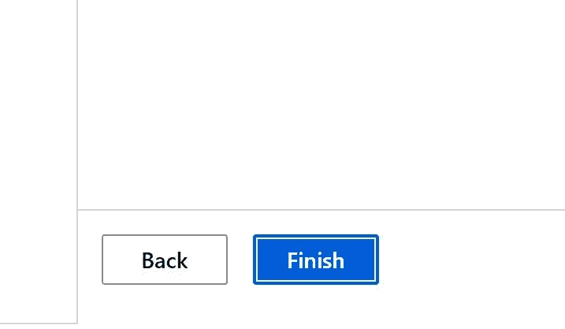
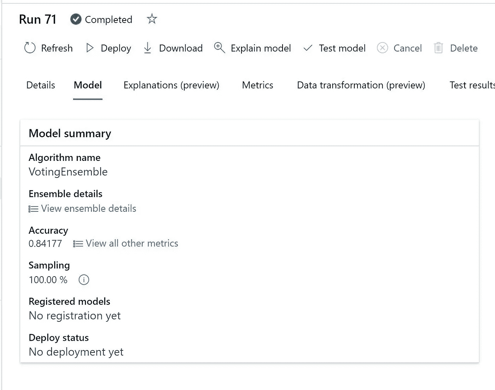
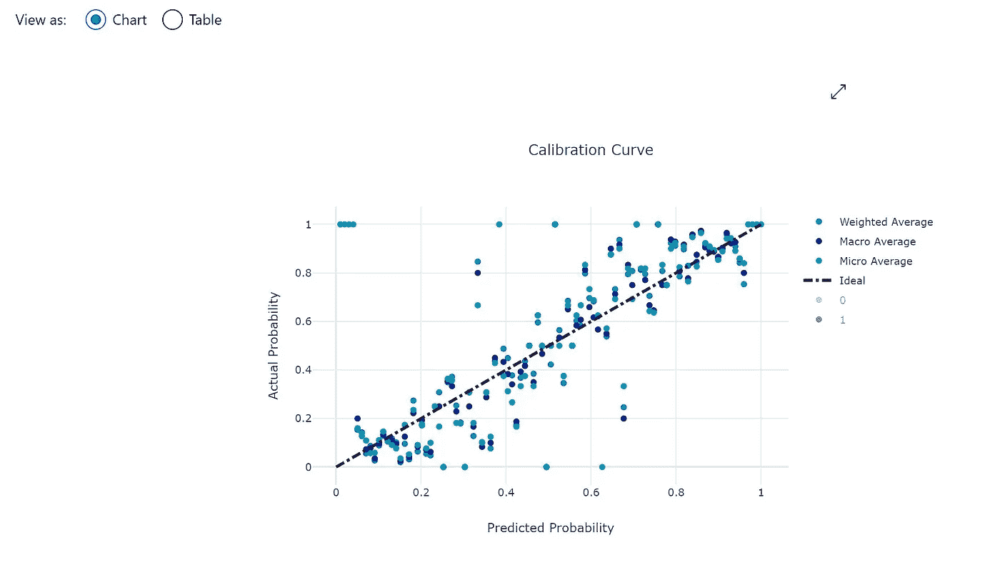

# 自己动手，为自动化机器学习开放黑客

> 原文：<https://medium.com/analytics-vidhya/do-it-yourself-open-hack-for-automated-machine-learning-62a3e6d54a56?source=collection_archive---------4----------------------->

# 使用开源的泰坦尼克号数据集来运行自动机器学习

# 先决条件

*   Azure 帐户
*   创建资源组
*   创建 Azure 存储帐户
*   创建 Azure 机器学习服务

# 数据

*   数据可在回购中获得
*   文件名 Titanic.csv
*   将文件下载到本地硬盘，以便将来上传

# 建立模型

*   登录 Azure 门户网站
*   转到 Azure 机器学习服务资源
*   开放 Azure 机器学习工作室

# 创建数据集

*   转到数据集
*   单击创建数据集

*   从本地文件中选择
*   给数据集起个名字:TitanicTraining

*   单击下一步
*   将文件上传到默认数据存储

*   选择上传文件

*   从本地硬盘选择文件

*   上传文件并单击下一步

*   验证架构，然后单击下一步

*   检查数据类型，保持不变，然后单击下一步

*   单击创建

# 创建计算集群

*   转到计算

*   单击计算集群
*   创建新的计算集群
*   以下是我选择的计算:

*   现在选择计算

*   给个名字

# 自动化 ML 实验

*   创建自动化 ML

*   命名为:TitanicOpenHackExp

*   给一个实验命名
*   选择标签列
*   选择计算

*   选择建模分类或回归的类型

*   单击下一步，然后单击完成

*   等待实验完成
*   通常使用 F16 和 4 个节点需要大约 25 分钟
*   根据数据大小和计算大小，时间可能会有所不同。

# 结果和日志

*   这是实验运行屏幕

*   完成后应该如下图所示

*   单击模型查看所有模型的运行

*   选择带视图解释的模型，因为这是最佳模型

*   现在点击解释选项卡并查看详细信息
*   这是打开黑盒的地方，并显示哪些特征有助于预测

*   现在，单击指标进行查看
*   精确召回

*   受试者工作特征曲线

*   校准曲线

*   升力曲线

*   累积增益曲线

*   日志可用

*   建模完成
*   接下来部署模型。未完待续。
*   原文—[samples 2021/endtoendopenhacktitanicatoml . MD at main balakreshnan/samples 2021(github.com)](https://github.com/balakreshnan/Samples2021/blob/main/OpenHackAutoML/EndToEndOpenHackTitanicautoml.md)