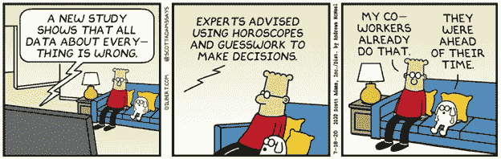
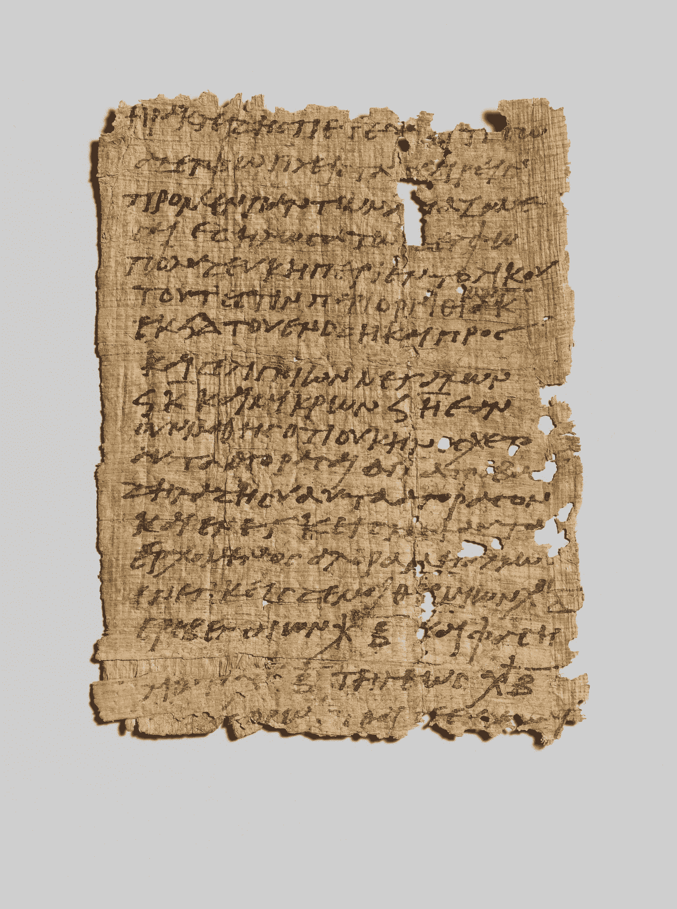

# 中小型企业需要元数据吗？

> 原文：<https://medium.com/analytics-vidhya/do-small-and-medium-sized-businesses-need-metadata-d2e57973f884?source=collection_archive---------15----------------------->

简单的答案是肯定的。任何在多个系统和文件中拥有关键业务数据的组织都需要元数据来理解这些数据。元数据(也称为数据目录)是关于数据的数据。它是一组描述和给出关于其他数据的信息的数据。当能够自助回答与数据相关的问题时，组织就达到了能够驾驭数据力量的成熟度水平:

*   有哪些数据可用？
*   哪些系统需要数据？
*   数据是如何在企业中流动的？
*   如何获取数据？
*   谁能帮我回答关于我需要的数据的问题？​

当组织由元数据驱动时，它就变成了数据驱动。这反过来又能做出有益于业务的良好决策。像这样的呆伯特卡通不再是一个相关的笑话:

呆伯特卡通

正如纸莎草纸改变了人类，元数据改变了数据管理。纸的发明让人们能够记录他们的想法，并以一种前所未有的方式与他人分享。创造可以代代相传的文档的能力是人类文明的变革性成就之一。可靠的可访问元数据可以在数据管理实践中产生同样的影响。

古代纸莎草纸

**中小企业**

[Gartner](https://www.gartner.com/en/information-technology/glossary/smbs-small-and-midsize-businesses) 将小型企业描述为员工少于 100 人的组织，将中型企业描述为员工在 100 到 999 人之间的组织。这些组织不仅需要元数据管理功能，还需要其他数据管理支柱，如数据质量、分析、数据治理等。在考虑数据管理实践时，组织的规模并不重要，相反，应该考虑业务的性质。如果业务活动以数据为中心，那么关注数据管理是有意义的。例如，保险和财富管理组织依靠准确的数据来降低风险和增加利润，因此数据管理，尤其是元数据是他们成功的关键。

**什么是元数据管理？**

DAMA 知识体系( [DMBoK](https://dama.org/content/body-knowledge) )中的元数据管理被定义为“能够访问高质量、集成元数据的计划、实施和控制活动。”支持元数据管理实践的工具和流程需要支持以下不同类别的元数据:

***业务元数据***
【术语表】
数据质量规则
监管约束
数据政策

***技术元数据***
物理数据模型
映射和转换
数据谱系
数据生产系统
数据消费系统

***数据所有权***
数据管家角色
数据保管者角色

***流程元数据***
【数据处理次数】

**用于数字转换的元数据**

各种规模的组织都在关注数字化转型。数字化转型是实施新技术和流程，以改善业务运营和客户体验。为了改造现有的技术，理解其中的数据并理解数据如何在不同的系统之间集成是很重要的。你如何着手收集这些信息？元数据提供了这些信息。软件工程师、产品经理、数据科学家和数据架构师需要元数据来推出新的数字产品和服务，同时增强迭代开发并缩短上市时间。

不幸的是，大多数首席信息官和首席技术官都把技术改进放在优先地位，而元数据则成为一个较低优先级的项目，被推迟或永远不做。结果，数据被存储在没有定义、分类和数据流文档的系统中。随着时间的推移，随着参与项目的关键资源离开团队，理解数据变得更加困难。数据分析变成了一项耗时的工作，涉及源代码的逆向工程。为了避免这些陷阱，技术和数据领导者应该指导他们的团队开始元数据管理。

**入门**

元数据管理实践不必是一个数百万美元的项目。在大多数情况下，Excel 电子表格、SharePoint 网站和 Confluence 页面中已经收集了大量元数据。这些人工制品提供了一个很好的起点。分配一些资源将元数据整合到一个单一的人工制品中是一个很好的起点。对于初学者来说，Excel 通常是一个很好的工具，但不建议长期使用，因为很难将各种元数据链接在一起，并且实现协作容易出错。

当今市场上有非常昂贵和复杂的数据目录工具。这些工具通常是由技术专家设计的，用户界面往往技术性太强，如果没有昂贵的培训，企业用户(如产品所有者)很难理解。还有一些工具承诺自动抓取和发现各种系统中的元数据。这些连接器有利于最大限度地减少手动数据输入，但重要的是要理解元数据确实需要人力资源来保持其更新和准确；它不可能 100%自动化。此外，不可能自动发现业务元数据，例如术语表，因为这些元数据没有存储在任何系统中。

在选择元数据工具时，寻找可以快速实现的工具，不要使用死板的框架。易于理解的屏幕应该是一个关键的考虑因素，因为与业务用户的协作是成功的元数据管理程序的关键。允许定制的工具非常好，因为元数据在每个企业中都是唯一的。最后，API 应该可用于集成，以便元数据可以与其他系统(如数据质量工具)集成，并且爬行以自动发现和自动填充元数据是可能的。

一旦选择了工具并分配了资源来支持数据目录，就可以通过利用现有的工件来填充元数据。在初始元数据填充之后，操作化元数据的持续维护是最关键的步骤。这最好通过以下方式实现:

*   将责任分散到需要为数据目录做出贡献的运营、业务和技术团队。这分散了责任，并促进了确保长期成功的协作方法。
*   将自动元数据发现与手动数据输入相结合，作为 SDLC(系统交付生命周期)的一部分，以保持元数据的最新和相关性。
*   投入可以关注治理活动的资源，以确保各个团队拥有执行其任务所需的访问和信息

大型组织通常很难成功地启动和实施元数据管理实践。利益相关者太多，因此很难就一个连贯的解决方案达成共识；常见的情况是，不同业务部门中的多个数据目录很少，需要这些信息的用户无法访问。因此，SMB 企业无疑具有优势，因为决策者较少，允许采用技术先进、业务友好的解决方案。

**结论**

数据量每天都在增加。随着更多的数据被使用，更多的数据被创建。如果数据可以被理解和利用来创建改善客户体验的产品和服务，那么它可以是一种有价值的“资产”和“资源”。元数据是理解数据的基础。不幸的是，首席信息官、首席技术官和首席数据官认为元数据是可以在以后完成的文档，因此降低了元数据的优先级。这是一个会影响数字化转型以及组织降低风险和增加利润的能力的错误。

**关于作者:**

Jane Estrada 是数据目录软件解决方案提供商 Euryka Data Management Inc .(www . eurykadm . com)的创始人。Jane 是一名经验丰富的数据管理专家，在数据架构、数据治理、数据建模、元数据、主数据和大数据方面拥有超过 15 年的经验，曾供职于 CPPIB、RBC、TD Bank、TELUS 和加拿大丰业银行等机构。Jane 在数据管理各个方面的强大背景使她能够帮助各种规模和复杂性的组织成功实施数据治理和其他信息管理计划。