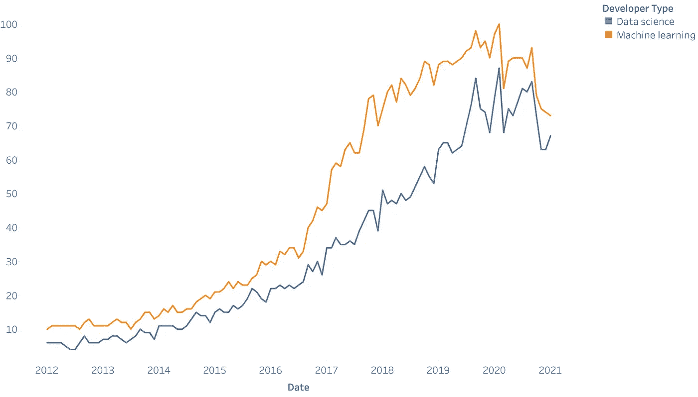
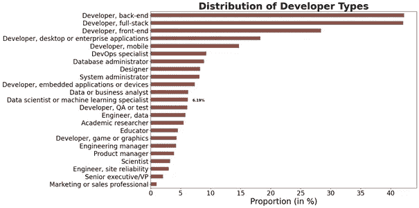
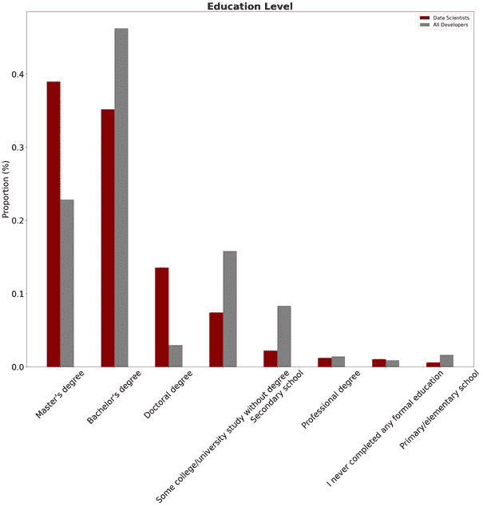
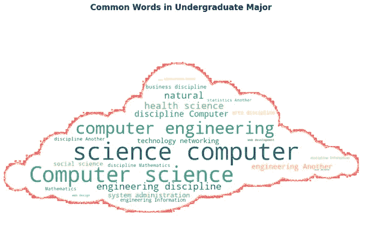
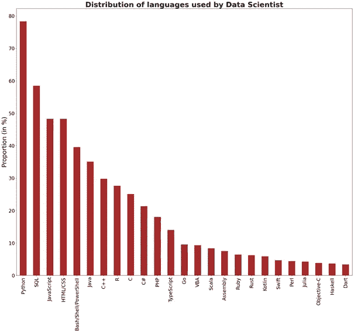
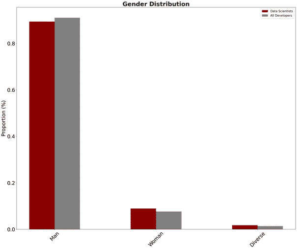
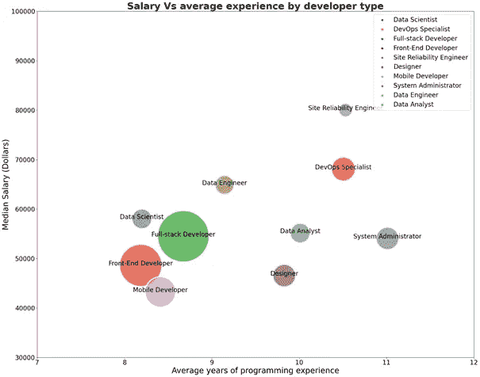
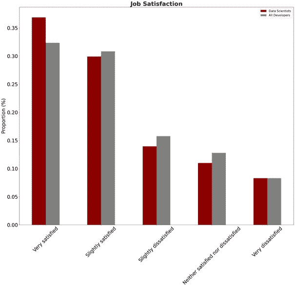

# 你梦想成为一名数据科学家吗？以下是你应该知道的关于理想工作的所有信息…

> 原文：<https://medium.com/analytics-vidhya/do-you-dream-of-becoming-a-data-scientist-here-all-what-you-should-know-about-your-dream-job-f47296096b90?source=collection_archive---------20----------------------->

*一种基于数据的方法，使用 Stack Overflow 的 2020 年开发者调查数据。*

设计的印加瓦

数据科学是当今技术中最通用、最令人兴奋的领域之一。现在对它们的需求很大，这种上升趋势没有减缓的迹象(图 1)。

数据科学家的跨学科背景，包括计算、数学、统计和机器学习技能的融合，是在其职业发展中发挥巨大作用的最重要的资产。此外，数据科学家通常应该表现出两个区别于同行的关键特征:对理解数据的好奇心和热情，以及以尽可能清晰的方式用有吸引力和表现力的可视化方式向更多受众传达发现的天赋。

*谷歌趋势数据提供了特定搜索词相对于总搜索量的频率*

如果你想成为一名数据科学家，但不知道如何进入这个领域，你可能会想到几个问题，特别是:

> -相对于不同的开发者，数据科学家的教育背景如何？
> 
> -数据科学家使用最多的编程语言是什么？
> 
> -与其他开发人员类型相比，数据科学家的性别分布如何？
> 
> -数据科学家和其他软件开发者谁赚得多？
> 
> -与其他开发人员相比，数据科学家对自己的工作更满意吗？

为了更仔细地研究所有这些问题，我选择了一种基于 2020 年 Stack Overflow 开发者调查的数据驱动方法，该方法旨在了解开发者体验的多个方面，从职业满意度和求职到教育和对开源软件的看法。数据集在这里公开[。调查数据涵盖来自 180 多个国家和属地的 64，461 篇评论。](https://insights.stackoverflow.com/survey)

让我们看看我发现了什么！

首先，我想注意到我将专注于“数据科学家或机器学习专家”的受访者，占所有受访者的 6.19%。我知道这只是样本中的一小部分，它远不是最常见的开发人员类型，如后端或全栈开发人员(各占 42%)，他们代表了栈溢出社区的相当一部分。尽管如此，在过去几年中，数据科学家仍然非常受欢迎，并且有上升趋势。

**相比不同的开发者，数据科学家的教育背景如何？**

在这里，您可以看到与其他开发人员相比，科学家完成的最高水平的教育数据。我们可以看到很大的不同！大约 53%的数据科学家获得了硕士或博士学位，而所有开发人员的比例约为 26%。

关于数据科学家的背景，50%的专业数据科学家拥有计算机科学、计算机工程和软件工程背景。大约 12%的数据科学家学习过数学和统计学，这让我相当欣慰，因为我是一名训练有素的统计学家。

数据科学家使用最多的编程语言是什么？

现在，让我们来看看世界各地的数据科学家用什么作为编程语言。由于人工智能、机器学习和数据科学的兴起，Python 是数据科学家使用最广泛的语言，并且在过去几年中呈上升趋势。而且，Python 被栈溢出冠以“增长最快的主流编程语言”的称号。此外，SQL、JavaScript 和 HTML 也很受数据科学专业人士的欢迎。奇怪的是，根据调查结果，R 排在第八位，这对我来说真的是一个令人惊讶的发现，因为我在我的周围看到，这是几个招聘职位要求最多的语言。

> **Python 在受欢迎程度上击败了其他语言……**所以，如果你正考虑进入数据科学领域，你知道现在什么语言是重要的……

**与其他类型的开发人员相比，数据科学家的性别分布如何？**

很明显，在科学和技术领域存在很大的性别差距。更多的是男性主导。所有开发人员和数据科学家之间的差别非常小。只有 8%的职业开发人员的女性参与了调查。

根据《福布斯》的说法，存在这种差距的原因包括女性在生命早期缺乏 STEM(科学、技术、工程和数学)教育，女性在数据科学方面缺乏指导，以及人力资源规则没有跟上性别平衡政策，等等。

如今，有越来越多的努力和多种举措来建立女性在技术领域的包容性和多样性，并在全球范围内传播意识和教育。

数据科学家和其他软件开发人员谁挣得多？

根据调查，数据科学家的工资通常高于同等经验的其他工作的工资中位数。事实上，所有类型的开发人员的工资中位数约为 5.4 万美元，数据科学家为 5.8 万美元。下图显示，你的经验越多，薪水就越高，除了某些类型的开发人员，他们的薪水比同等经验的其他职位要高。

与其他开发人员相比，数据科学家对自己的工作更满意吗？

让我们看看世界各地的开发人员对他们的工作有何感受。看起来相当大比例的数据科学家对他们的工作非常满意，超过 36%的人表示非常满意，30%的人表示稍微满意。如下图所示，表示对工作“非常满意”的数据科学家的比例略高于所有开发人员。

**结论**

我将以电影《追求幸福》中一段令人难忘的话来结束我的演讲:

> *“永远不要让别人告诉你，你不能做某事。如果你有梦想，就要捍卫它。人们自己做不到一些事情，他们想告诉你你也做不到。你想要什么，就去得到它。”*