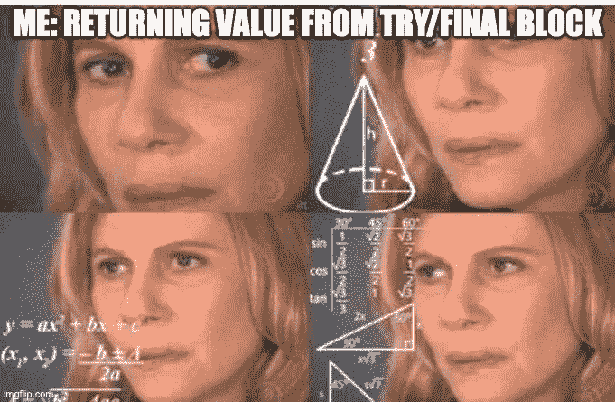
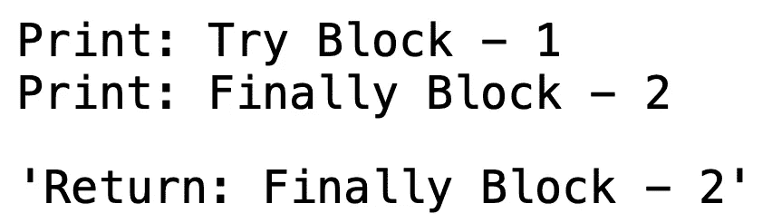
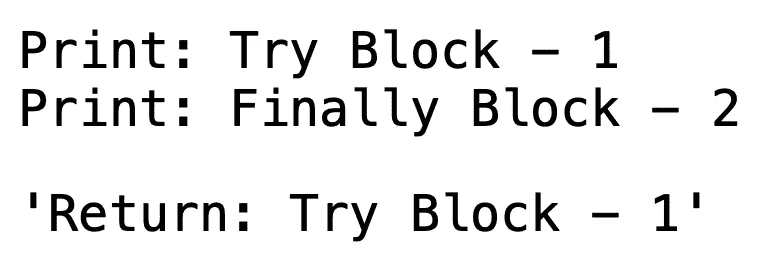
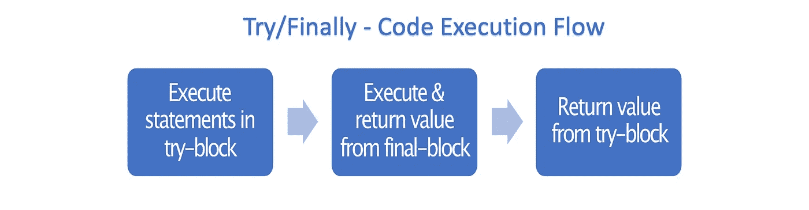

# 你真的理解 Python 中的 Try & Finally 吗？

> 原文：<https://medium.com/analytics-vidhya/do-you-really-understand-try-finally-in-python-110cee4c1a8?source=collection_archive---------8----------------------->

## 在 python 中，`try`和`except`块经常被程序员用来处理任何异常或不愉快的场景。T2 条款被低估了，可以更好的利用。让我们看看*终端模块*是如何工作的。



# **深潜**

> 不管之前发生了什么，一旦代码块完成并且处理了任何引发的异常，就执行最后一个代码块。即使异常处理程序或 else 块中出现错误，并且引发了新的异常，final 块中的代码仍然会运行。

这段引用自 python [文档](https://docs.python.org/2.5/whatsnew/pep-341.html)的话绝对正确，但是当`try`和`finally`块被封装在一个有`return`语句的函数中时，执行行为就有点棘手了。我来举例说明一下。看看您能否猜出以下函数的输出。

# 示例 1:

```
*# Both the try & final blocks have print statements and function returns value from final-block*
**def** example_1():
    **try**:
        val = 1
        print(f"Print: Try Block - **{**val**}**")
    **finally**:
        val = val + 1
        print(f"Print: Finally Block - **{**val**}**")
        **return** f"Return: Finally Block - **{**val**}**"

example_1()
```



功能`example_1`简单直接，首先执行*试块*，然后执行*终块*。变量`val`在*试块*中的值为 **1** ，并在*终块*中更新为 **2** 。

# 示例 2:

```
*# The try block has return statement & final block has only print statement*
**def** example_2():
    **try**:
        val = 1
        print(f"Print: Try Block - **{**val**}**")
        **return** f"Return: Try Block - **{**val**}**"
    **finally**:
        val = val + 1
        print(f"Print: Finally Block - **{**val**}**")

example_2()
```



函数`example_2`是事情变得有点棘手的地方，在*最终程序块*之后执行*尝试程序块*中的`return`语句，但是返回的变量`val`的值不受*最终程序块*中所做更改的影响。

# 示例 3:

```
*# Both the try & final blocks have return statements*
**def** example_3():
    **try**:
        val = 1
        print(f"Print: Try Block - **{**val**}**")
        **return** f"Return: Try Block - **{**val**}**"
    **finally**:
        val = val + 1
        print(f"Print: Finally Block - **{**val**}**")
        **return** f"Return: Finally Block - **{**val**}**"

example_3()
```


函数`example_3`的输出很容易猜测。当*最终程序块*中的`return`语句被执行时，该功能退出，因此*试运行程序块*中的`return`语句永远不会被执行。

# 拿走



`try` & `finally`块并不像人们想象的那样简单，尤其是当它们从一个函数返回值的时候。想了解更多这样有趣的趣闻，请通过 Twitter 关注我。这篇文章的要点是:

1.  您将`return`语句放在哪里将会有所不同。
2.  即使来自*试块*的`return`语句在*终块*之后执行，返回的变量值也不会受到*终块中所做修改的影响。*