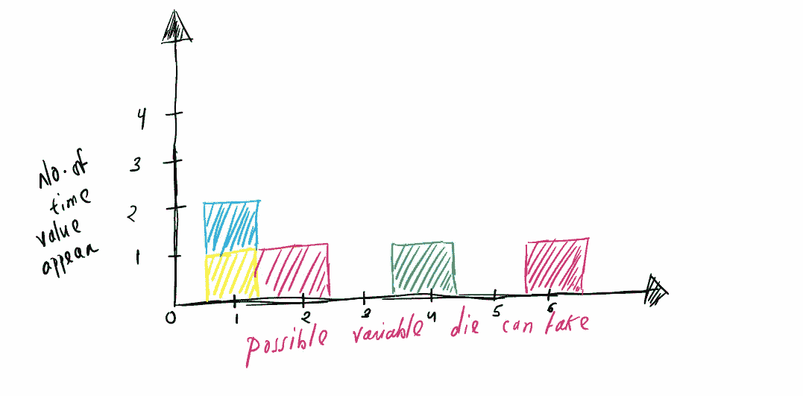
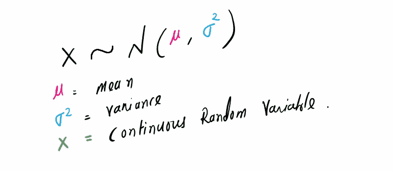
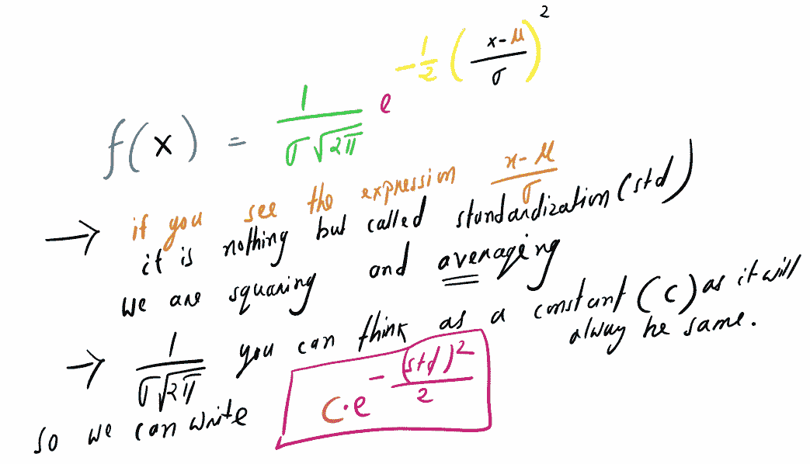
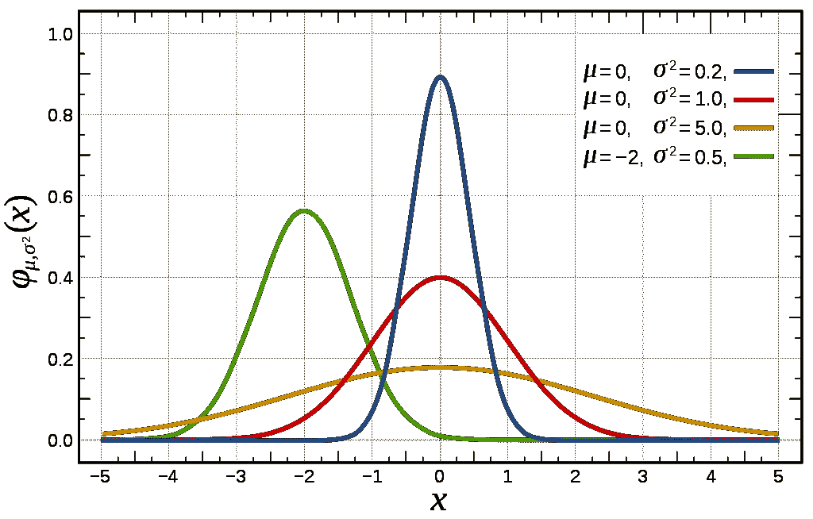
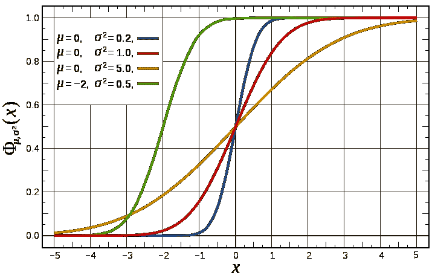
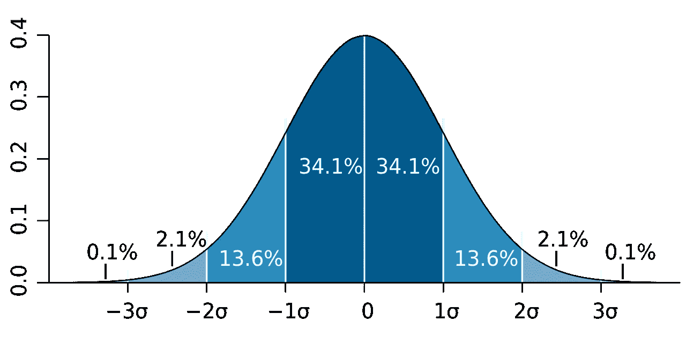
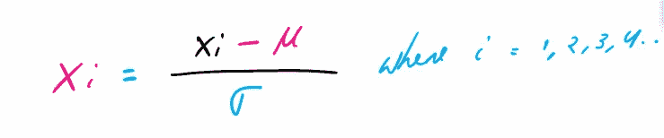

# 你了解正态分布吗

> 原文：<https://medium.com/analytics-vidhya/do-you-understand-normal-distribution-90402e684e80?source=collection_archive---------4----------------------->

正态或高斯分布在统计学中非常有名。作为一名数据科学家，你可能会遇到这种分布。它有许多性质，人们用它们来估计一些概率或有时得到一些信息。

在这篇文章中，我们将讨论一些关于正态分布的问题，看看我们是否理解得足够好

在进一步阅读这篇文章之前，这里有一些问题，试着回答这些问题并检查你是否正确

> 你说的分配是什么意思？
> 
> **你能告诉我什么是正态分布吗？**
> 
> **为了得到高斯分布，我们需要什么参数？**
> 
> **什么是正态分布的 PDF？**
> 
> **能解释一下正态分布的 PDF 和 CDF 图吗？**
> 
> **你能告诉我什么是经验法则吗？**
> 
> 如何从正态分布中得到标准正态变量？

读完这篇博客后，你将能够回答以上所有的问题

**分布**是——变量可能取的值以及它们出现的频率。

例如:

你掷一个骰子 5 次，骰子可能取的值是多少:{1，2，3，4，5，6}，它们出现的频率:比如说{1:2，2:1，3:0，4:1，5:0，6:1}

分配

我们主要有两种发行方式

1.  **连续概率分布**
2.  **离散概率分布**

我就不深究了。

## **正态分布或高斯分布**

是一个**连续概率分布**，这里它取实值随机变量。

为了得到正态分布，我们需要两个东西/参数

*   平均值
*   方差(衡量分布/数据偏离平均值的程度)
*   [平均值和方差应该是有限的]

## 注释

现在我们可以用均值和方差得到 PDF( **概率密度函数**)。正态分布 PDF 的公式为

> ***给定点的 PDF 给出了概率密度，而不是该点本身的概率***

你不必记住这个公式，尽管有时人们会问它。

当你有一些均值和标准差时，你可以很容易地画出正态分布。它看起来有点像下面的图片。它的**钟形弯曲成**形状。

来源——维基百科 PDF

高斯分布的一些**性质(从 pdf 中我们可以看到)**

*   它是对称的(平均两边相同)
*   从公式中我们可以看出，随着均值的变化，它将呈指数下降
*   根据平均值和方差，图会有所不同。随着方差的增加，图变得更粗，随着方差的减少，图变得更细

现在连续随机变量的 **CDF** 可以表示为其概率密度函数(PDF)的积分。上面是正态分布的 PDF。所以我们可以用它来画 CDF

来源—维基百科 CDF

*   它的范围是从 0 到 1

累积分布函数( **CDF** )计算给定 x 值的累积概率。

如果我从 x 轴取值 2，我可以读取 CDF，就像随机变量 2 处的全部数据中有等于或少于 80%的数据。

**经验法则或 68–95–99.7 法则**

这是一个非常简单和信息丰富的规则:该规则说 68%的数据存在于 1 个标准偏差，95%的数据存在于 2 个标准偏差，97.7%的数据存在于 3 个标准偏差。

来源-维基百科

## 标准正态变量

如果一个正态分布的均值为零(0)，方差为一(1)，我们称之为标准正态变量

给定一个正态分布，我们可以通过一个叫做标准化的公式得到标准的正态变量。

谢谢你的时间