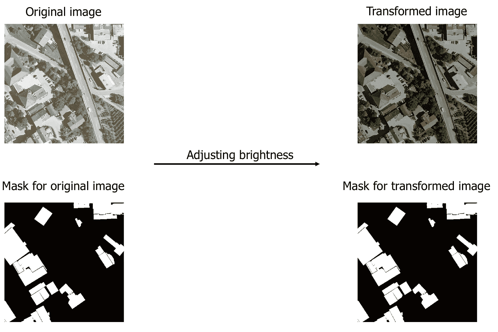
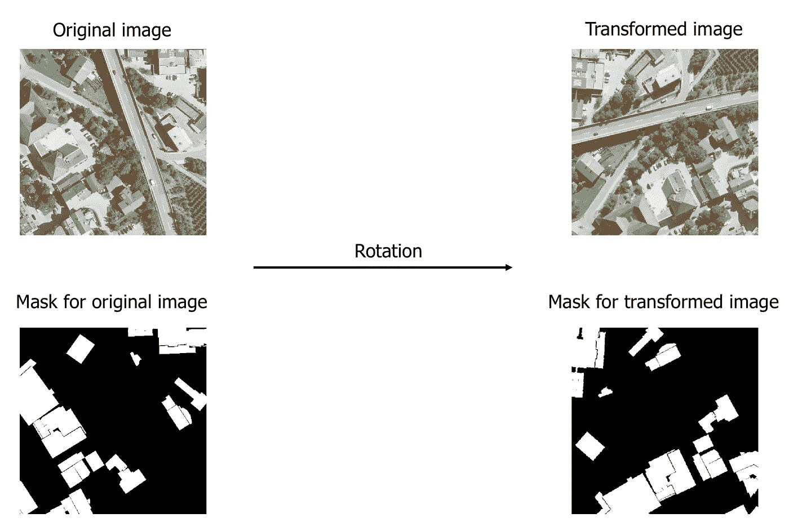

# 你能想象深度神经网络的数据加载器吗？

> 原文：<https://medium.com/analytics-vidhya/do-you-visualize-dataloaders-for-deep-neural-networks-7840ae58fee7?source=collection_archive---------1----------------------->

## 许多因素会影响深度神经网络的性能。让我们看看如何设置 PyTorch 管道进行图像增强(借助 Albumentations Python 库)，并使用可视化来发现任何潜在的问题，以免耗费您的时间和金钱。

照片由 Pexels 的[初创公司股票照片](https://www.pexels.com/photo/man-wearing-black-and-white-stripe-shirt-looking-at-white-printer-papers-on-the-wall-212286/)提供

在软件开发中，当出现问题时，通常我们会得到一个错误，但是在数据科学中却不是这样。如果模型表现不佳，那么一般的方法是改变模型架构或调整超参数并进行更多的训练。是的，这些都是很好的选择，但是确保数据的正确性应该是首要的。

出自电视剧 [*编辑室*](https://www.imdb.com/title/tt1870479/) :

> 解决问题的第一步是认识到它确实存在。

训练与测试数据的差异是低性能模型的最大原因。图像增强有助于通过人工添加更多数据来对抗过度拟合，并提高深度神经网络在计算机视觉任务中的性能。在本帖中，我们将涵盖以下内容:

1.  计算机视觉任务概述
2.  计算机视觉管道
3.  使用白蛋白的图像增强
4.  可视化数据加载器

如果你熟悉计算机视觉任务和 PyTorch，那么可以跳过前两个。

# 计算机视觉任务概述

计算机视觉(CV)任务的常见类型有:

*   图像分类
*   图象分割法
*   目标检测

如果你不熟悉这些计算机视觉任务，那么看看 post — [图像分类 vs .对象检测 vs .图像分割](/analytics-vidhya/image-classification-vs-object-detection-vs-image-segmentation-f36db85fe81)。图像增强有助于使模型更好地概括所有 3 种类型的 CV 任务。

# 计算机视觉管道

PyTorch 数据管道

输入数据和目标数据都必须经过数据集和数据加载器，然后才能传递给模型进行训练。最好将数据加载器的输出可视化。通过这种方式，我们还可以识别数据集定义何时出现问题。相对于上面的数据管道图，只有目标数据和应用的转换基于 CV 任务类型而不同。

## 使用白蛋白的图像增强

[albumations](https://albumentations.ai/docs/)是一个快速灵活的图像增强库。它支持 PyTorch 和 Keras。 [Torchvision](https://pytorch.org/vision/stable/index.html) library 很好，但在图像分割或物体检测方面，它需要很大的努力才能做好。对输入数据和目标标注应用变换的方式因增强类型而异:像素级或空间级。

## **像素级增强:**

更改原始图像的像素值，但不会更改输出遮罩。图像变换，如改变亮度或调整图像 RGB 调色板值的对比度，是像素级的增强。我们通过调整亮度来修改输入图像，但是我们保持输出遮罩不变。

## **空间级扩充:**

更改图像和遮罩。当您应用图像变换(如镜像、旋转或裁剪输入图像的一部分)时，您还需要对输出标签应用相同的变换以保持其正确性。

## **白蛋白的印象分:**

*   能够毫不费力地将图像增强添加到任何计算机视觉管道中。
*   转换声明的语法非常类似于 Torchvision。
*   允许您为每个变换设置所需的概率和值的大小。

增强管道的示例定义如下:

还不服气？然后查看文章— [为什么您需要一个图像增强专用库](https://albumentations.ai/docs/introduction/why_you_need_a_dedicated_library_for_image_augmentation/)。

# 可视化数据加载器

## 为什么？

现在，您可能会想，如果 Albumentations 这么好，那么我们为什么需要可视化数据加载器。我很高兴你问了，蛋白沉淀仍然需要用户输入，我们在提供正确的值方面不是很好。任何理性的人都应该考虑增强的类型以及它是否适用于特定的数据集，但通常情况并非如此。

> 为了避免任何意外，最好是观想。

当对 MNIST 数据集中的数字 9 应用旋转变换时，它可以被变换为 6，但标注仍为 9。看到搞砸数据增强有多容易了吧？

## 怎么会？

像 [*make_grid*](https://pytorch.org/vision/stable/utils.html#torchvision.utils.make_grid) 和[*draw _ bounding _ box*](https://pytorch.org/vision/stable/utils.html#torchvision.utils.draw_bounding_boxes)这样的 Torchvision 函数相当好用，但是并不是端到端的。因此，我们将编写某种包装器，接受数据加载器的`iter`对象，并绘制输入和目标数据值。

关于以下代码的注释:

*   PyTorch 张量需要形状(C x H x W)的图像，它与 NumPy 数组形状(H x W x C)相反。
*   图像数据必须是数据类型为`float`的火炬张量，以训练模型，而对于绘图，其类型应为`uint8`。
*   最佳实践是尽可能避免对数据加载器的`iter`对象进行多次初始化，因为这非常耗时。这就是为什么要把`iter`对象作为函数参数，而不是数据加载器本身。

同样，这篇文章的重点是数据加载器的输出，如果你对整个数据管道感兴趣，那么看看这个 [Colab 笔记本](https://colab.research.google.com/drive/1xnYAmyWqMKMaYDY4J6yty_hQEIPrLMcK?usp=sharing)

**图像分类**

资料组👉 [CIFAR10](https://www.cs.toronto.edu/%7Ekriz/cifar.html)

转换👉调整➡️大小旋转➡️水平翻转

图像分类数据加载器的可视化

**图像分割**

资料组👉[坎维德](http://mi.eng.cam.ac.uk/research/projects/VideoRec/CamSeq01/)

转换👉调整➡️大小旋转➡️水平翻转

图像分割数据加载器的可视化

**物体检测**

资料组👉[宾夕法尼亚-复旦行人检测数据库](https://www.cis.upenn.edu/%7Ejshi/ped_html/)

转换👉调整➡️水平翻转➡️亮度和对比度➡️移动，缩放和旋转

对象检测数据加载器的可视化

# 结论

在计算机视觉中，相对更容易把握模型在做什么。它是如何工作的是一个不同的故事，但是通过足够多的实验，我们可以猜测什么是有效的，什么是无效的。关键是要用最少的实验来解决这个问题。我们对数据管道设置越有信心，就越有时间进行各种实验来提高模型性能。

# 旁注

[1]我相信来自*新闻编辑室*的引语是取自下面[金克拉](https://en.wikipedia.org/wiki/Zig_Ziglar)的引语，但我不太确定。

> *除非你承认自己有问题，并承担解决问题的责任，否则你无法解决问题。*

[2]我从白蛋白中听说过 AutoAlbument，但还没有尝试过。