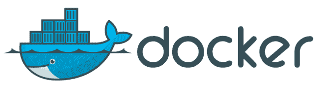

# 面向所有人的 Docker 概念:为什么选择 docker 容器

> 原文：<https://medium.com/analytics-vidhya/docker-concepts-for-everyone-why-docker-containers-fd1bbdeb43ee?source=collection_archive---------7----------------------->

这是我的 docker 概念系列的第 1 部分。继续阅读，了解什么是 docker 容器，它们的好处和使用案例。

随着许多系统越来越依赖 docker，学习使用 docker 将为数据科学家的工具箱增加一个重要工具。

**Docker 是什么？** docker 是 Docker Inc .开发的开源平台，用于创建容器。就是这样。这个平台的主要用途是创建&管理所谓的 docker 容器& docker 映像(一个映像是容器的蓝图)。所以让我们先来理解什么是容器&为什么我们需要一个容器。

**“但它在我的机器上工作正常”:**当我们与他人分享我们的 ML 模型代码时，我们都会面临这个问题。这是因为不同的机器可能使用运行代码所需的不同版本的包&库。避免这个问题的一个方法是，你可以发送一个版本需求列表，列出你的代码正在使用的所有包&库。但是另一个人可能不想花时间安装大量你的代码需要的包，或者他们可能已经有了某些包的冲突版本，所以他们不想弄乱他们自己的系统。

克服这一挑战的更聪明的方法是通过使用 conda 或任何其他包管理器来使用虚拟环境。这解决了包版本问题。尽管比前一个选项好，但您仍然需要安装这些软件包。并非所有的软件包都可以在所有的操作系统上使用，其他的可能会出现安装错误&对于一个大型项目来说，安装所有的依赖项仍然需要花费大量的时间。

因此，我们需要一个不用担心操作系统的解决方案&这个解决方案应该完全消除安装包和库的业务。虚拟机是传统的解决方案。但是，虚拟机会占用大量系统资源。在很多情况下，仅仅为了运行 R 或 Python 脚本而使用虚拟机可能是大材小用。

这导致了容器的发展。可以把容器看作是虚拟机的轻量级版本，其中不是创建所有硬件的虚拟副本，而是仅对操作系统进行虚拟化。为了更详细地理解容器与虚拟机的区别，我强烈推荐 Backblaze 的这篇[文章。使用 docker 平台创建的容器&映像被称为 docker 容器& docker 映像。](https://www.backblaze.com/blog/vm-vs-containers/)

*所以本质上，容器是开销更少&更高效(就其目的而言)的虚拟机版本*。容器的几个主要优点如下:

*   经济高效:比虚拟机便宜
*   节省时间:不要在每台新机器上安装软件包
*   可再现性:将你的代码及其所有的依赖项放在一个容器中，会产生一个与其他应用程序隔离的可预测的环境。无论应用部署在哪里，一切都保持一致，这将带来巨大的生产力。所以不再有“它在我的机器上工作”的问题。
*   可移植性:就像真正的容器一样，您可以运送 docker 容器。该容器不仅包含您的代码，还包含您的代码运行的完全相同的环境。*您可以将容器从您的机器移植到云，从一个云提供商移植到另一个云提供商，带到任何地方，性能都是一致的。*
*   更好的应用程序开发:Docker 映像很容易版本化，这使得在需要回滚时很容易回滚。如果映像的当前迭代有问题，只需回滚到旧版本。*整个过程意味着您正在为持续集成和持续部署(CI/CD)创造完美的环境*
*   模块化和灵活性:因为容器可以被版本化，所以您可以以模块化的方式添加新的特性，而不会破坏现有的解决方案。添加功能、测试新解决方案并推出新容器。
*   NetApp 上的这个[博客有一个容器用例列表](https://www.netapp.com/devops-solutions/what-are-containers/)

事实上，容器是如此的轻量级，它们的好处&它们与敏捷和 DevOps 方法很好地结合在一起，它们的流行并不令人惊讶。使用 docker 平台创建的容器称为 docker 容器。

这是第 1 部分的结尾。我希望你喜欢它。在下一篇文章中，我将讨论如何创建容器&什么是 docker 图像。

Conda 虚拟环境:[https://conda . io/projects/conda/en/latest/user-guide/concepts/environments . html](https://conda.io/projects/conda/en/latest/user-guide/concepts/environments.html)

集装箱化的好处:[https://hentsu.com/docker-containers-top-7-benefits/](https://hentsu.com/docker-containers-top-7-benefits/)

*原载于*[*https://www.linkedin.com*](https://www.linkedin.com/pulse/docker-concepts-data-scientists-why-containers-arvind-shukla/)*。*