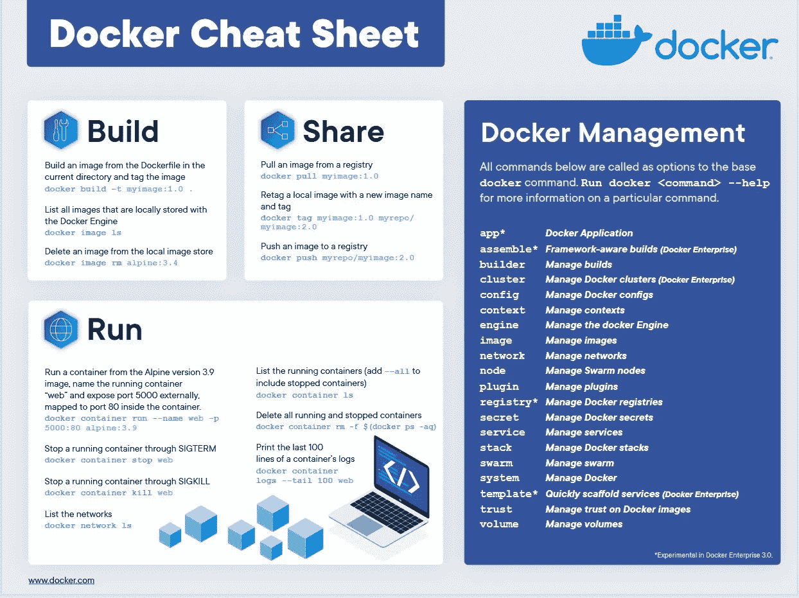

# 码头工人速成班(1)

> 原文：<https://medium.com/analytics-vidhya/docker-crash-course-1-754d9cea7a77?source=collection_archive---------9----------------------->

## 10 分钟内理解 docker 中的主要概念


德国新天鹅堡

***docker 是什么？***

管理容器的工具是一个独立的环境，包含一些代码或软件及其依赖项，因此它独立运行，无论其宿主如何，并且总是产生相同的结果。

***难道虚拟机也能达到同样的效果吗？***

是的，他们可以达到相似的结果，但是他们之间有很大的不同

1.  *资源消耗*因此，虚拟机比 docker 需要更多的资源。
2.  *基础架构如代码*
    Docker 映像是根据 Docker 文件构建的——它是一个包含人类可读脚本的文件，相同的脚本意味着相同的映像。就像其他编码一样，开发团队可以有效地协作。相比之下，不同的虚拟机就像不同的计算机一样，不容易对它们进行比较和故障排除
3.  *可共享*
    有内置的 docker hub 支持，您可以轻松地将您的 docker 图像上传到存储库，并与您的团队或公众共享。当然，你可以共享 other 文件，然后另一方可以用它建立完全相同的图像。
    但是，如果您想要共享虚拟机，您必须导出它并物理复制文件，因为它包括操作系统，通常文件大小非常大。
4.  *社区支持*
    Docker 提供了很多基础镜像，像 Java，mongodb，nodejs。它们已经过官方验证，我们可以在这些基础映像的基础上构建我们的产品，这样可以节省大量时间和精力

***一些基本概念和术语***

*图像*
它是容器的蓝图/模板，它包含一些代码片段或一个软件及其依赖关系。一旦建立了映像，它就是只读的。如果有任何改变，就必须重建。

*基于层的架构*
映像是根据 dockerfile 构建的，里面的每一行命令都是新的顶层。所有的层都被缓存，但是如果修改了 any 命令，那么在重建过程中，后面的层不能再使用缓存。

*容器*运行
镜像的实例，它在镜像之上构建了一个层，与镜像不同，这个额外的层允许读写。每当我们在容器中运行代码时，结果都会反映在这一层中

***码头工人储存***

通常，在我们移除容器后，运行容器产生的那些数据将会丢失。因此 docker 引入了“卷”——它允许容器访问主机上的文件夹

1.  *匿名卷*
    主机中的存储空间与特定容器相链接，在主机中对我们不可见。如果容器被移除，它也将被移除。
2.  *命名卷*与
    匿名卷相似，也不可见，但它不会被移除，即使将链接的容器移除，也可以在不同的容器间共享
3.  *绑定挂载* 可以将主机中的任何文件夹/文件绑定到容器中。因为这是主机中的文件夹/文件，所以除非我们明确删除主机中的这些文件夹/文件，否则该卷是存在的。

***Docker 联网***

默认情况下，docker 会为每个容器分配 IP，您可以通过“inspect”命令了解容器的 IP

1.  连接到 web
    只需提供 IP 或主机名和端口号，与您在主机中所做的一样
2.  使用特殊的域名“host.docker.internal”连接到主机
    ，docker 会为您完成剩下的工作
3.  连接到 coz 的另一个 docker
    上，因为我们可以使用每个容器的 IP 地址，但是在大多数情况下，我们不想硬编码 IP 地址。
    我们可以创建一个“码头网络”,并将我们的集装箱分配给“码头网络”。在 docker 网络中，容器可以通过容器名相互通信

***样本 Docker 文件***

```
FROM java:8
#Try to retrieve the Java 8 base image from local, if not found in #local, it will retrieve Java 8 base image from docker hub COPY . /app/java
#Copy the files in folder (in host machine) to /app/java in the     #container file system. "." means the current folder,  the folder #contains this dockerfileWORKDIR /app/java
#Change the work folder(in the container) for the following commandsRUN javac Hello.java
#execute java compile command, and the result will be including in #the image, it is part of the process in building the imageCMD ["java", "Hello"]
#default command of the container, can be override when we run the #container
```

***关于缓存机制***

如前所述，dockerfile 中的每一行都将是一个新的层，并由缓存提供支持，从而加快映像重建过程。但是，如果编辑了任何行，该行和后续行在重建期间将不受缓存支持。
例如，如果" WORKDIR /app/java "更新为" WORKDIR /exe/java"
，那么" WORKDIR /exe/java "、
"RUN javac Hello.java "、
"CMD ["java "、" Hello"]"
将在没有缓存支持的情况下重建，这意味着需要更长的时间。

***Docker 命令备忘单***



[https://www . docker . com/sites/default/files/D8/2019-09/docker-cheat-sheet . pdf](https://www.docker.com/sites/default/files/d8/2019-09/docker-cheat-sheet.pdf)