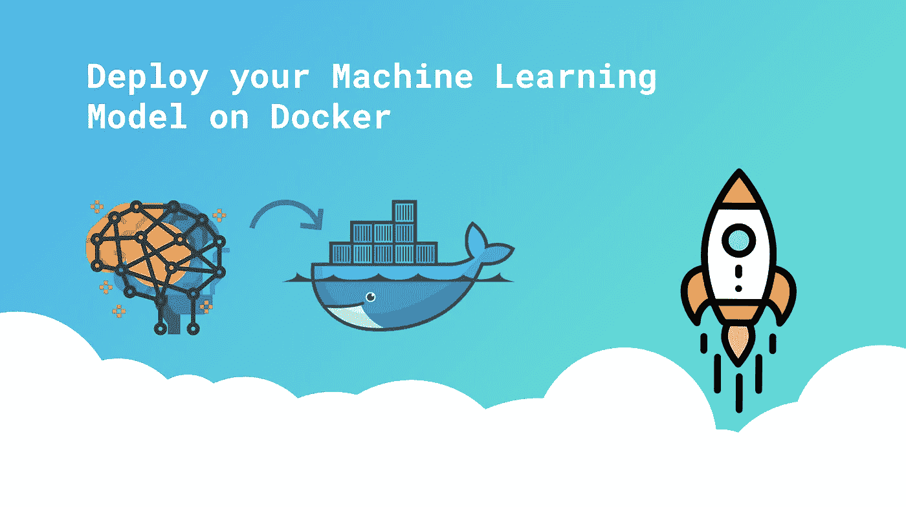
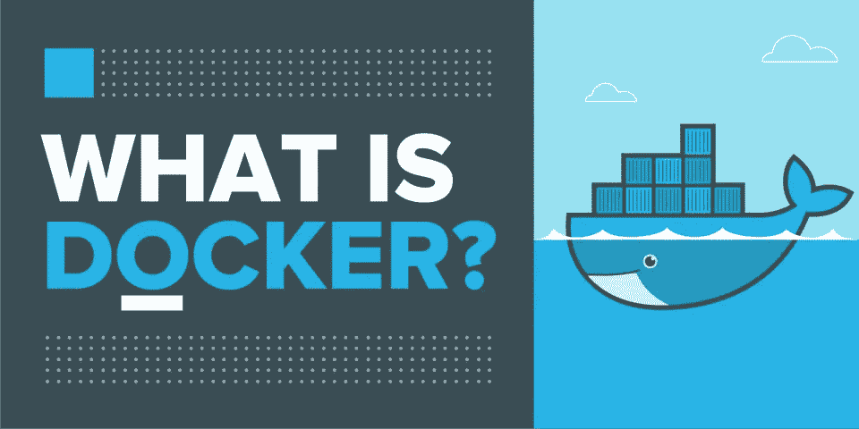
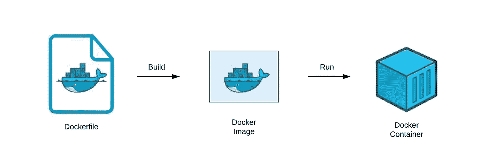
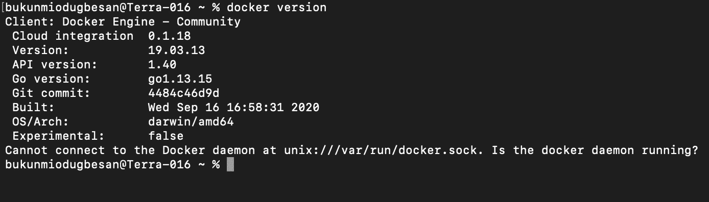
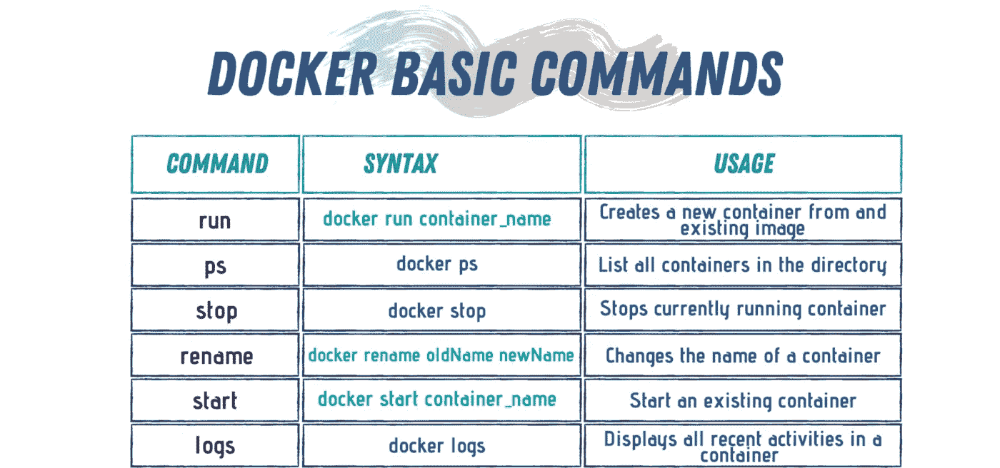

# 数据科学码头工人

> 原文：<https://medium.com/analytics-vidhya/docker-for-data-science-442299c5203c?source=collection_archive---------0----------------------->

## 为什么 docker 在数据科学中很重要？



在我之前的帖子中，我写了关于[理解 MLOPS](/analytics-vidhya/understanding-mlops-5f0a425c68b0) 的文章，但是为了成为机器学习操作的大师，你需要理解 docker 以及为什么它在数据科学中很重要。

曾经开发了一个机器学习模型，然后更换了笔记本电脑，却发现你的代码正在崩溃，你不断地遇到无限的“导入错误”语句或“找不到模块”。有时，这可能是一个版本错误，因为您试图在不同的 python 包版本上运行您的代码。解决这个问题的方法是 Docker。

在我们开始之前。查看我在这里写的更多数据科学相关的文章，也可以在 medium 上跟随我获得更多有趣的教程。

# 那么 Docker 是什么？



Docker 是一个创建和部署隔离环境的工具，用于运行应用程序及其依赖项。基本上，Docker 通过将代码及其所有依赖项放在一个[容器](https://blog.netapp.com/blogs/containers-vs-vms/#:~:text=Virtual%20machines%20and%20containers%20differ,to%20run%20multiple%20OS%20instances.)中，使得在其他具有不同操作系统的机器上编写和运行代码变得容易。

这个容器使代码独立于操作系统。

你需要熟悉的码头术语



**Docker 容器** —容器是一个图像的可运行实例。您可以使用 Docker API 或 CLI 创建、启动、停止、移动或删除容器。

**Docker image** 是一个只读模板，包含一组用于创建可以在 Docker 平台上运行的容器的指令。

**Dockerfile** —一个 Dockerfile 包含了从下载 docker 镜像到设置环境设置 docker 容器的所有代码。您可以将其视为描述您想要运行的系统的完整操作系统安装。

## 为什么 docker 在数据科学中很重要？

在 Docker 容器中运行 ML 模型有很多好处:

*   **再现性**:一旦你测试了你的容器化应用程序，你就可以把它部署到 Docker 正在运行的任何其他系统上，并且你可以确信你的应用程序将会像你测试它的时候一样运行。
*   **敏捷性**:容器提供的可移植性和性能优势可以帮助您使您的开发过程更加敏捷和灵敏。它增强了您的持续集成和持续交付过程
*   **可移植性:**这意味着从本地开发转移到超级计算集群很容易。您可以避免设置麻烦。

# **Docker 入门**

## 安装 Docker

要在你的设备上安装 Docker，使用[Docker 官方网站](https://www.docker.com/get-started)并为你的机器安装正确的版本。要确保安装成功，请尝试运行以下命令:

```
docker version
```



## 熟悉基本命令

虽然 docker 命令很宽泛，但是您可以从这些 docker 命令开始。



## 建立码头工人形象

您将构建一个 flask 应用程序，在浏览器屏幕上返回一个数字的平方。**目标是将你的应用放入 docker 容器**。

创建一个简单的烧瓶应用程序“app.py”

你需要创建一个 ***requirements.txt*** 文件。列出您的应用程序所需的所有依赖项的文件。

接下来您需要做的是创建一个 docker 文件。

文档分类

```
FROM python:3.7-slim
```

这是基础图像，是应用程序的核心。

```
COPY . /app
```

下一个任务是将目录中的所有文件复制到 docker 映像中。

```
WORKDIR /app
```

将工作目录设置为/app。

```
RUN pip3 install -r /app/requirements.txt
```

安装您的应用程序依赖项。

```
ENTRYPOINT ['python3']
```

现在，将入口点设置为“python3”。

```
CMD ['app.py']
```

最后，运行 app.py 文件

下一件事是建立你的码头工人形象。回想一下，docker 映像是一个只读模板，它包含一组用于创建可以在 Docker 平台上运行的容器的指令。

从您的终端，运行 **docker build — help** 来获得您需要的参数列表。

```
**$ docker build -t simpleflask .**
```

从您的终端运行 **docker run— help** 来获得您需要的参数列表。

```
**$ docker run -d -p 5000:5000 <docker_image_id>**
```

*   -p 表示端口。5000:5000 意味着您将系统上的端口 5000 暴露给 docker。本质上，这意味着在您的本地系统上运行这个之后，您的容器将可以通过`[http://localhost:8080](http://localhost:8080/)`访问
*   -d 标志意味着您希望以守护模式(后台)运行它。
*   **<docker _ image _ id>**这里是 simpleflask。因为这是构建时的名称。

检查处于活动状态的码头集装箱

运行 ***docker -ps a***

现在 docker 容器是活动的，您可以通过使用 requests、postman 或 curl 来调用您的 API。

结果将是传递的数字。

# 最佳实践的提示和技巧

1.  始终确保您使用的是最有效的基础映像。例如，在 Python3 的情况下，选择*苗条克星*或*拉伸克星*。他们有充分的支持，并与大多数 DS 和 ML 库很好地合作。
2.  使用**标签**提供重要信息，如使用技巧和关于应用程序和所需库以及如何使用它们的额外信息。
3.  拆分运行命令，使其更具可读性。把所有需要的库放在一个 requirments.txt 文件中以保持有序。
4.  只安装**必需的**包。这使得构建和运行映像更加高效。
5.  显式忽略文件*以避免安全风险(将它们添加到。忽略文件)。*
6.  **避免**添加数据，从数据库或云中提取数据(使用绑定挂载)，但不要在映像中硬编码。
7.  如果您从 Docker 开始，并且想要一个*标准项目模板*，请使用 [CookieCutter 数据科学](https://drivendata.github.io/cookiecutter-data-science/)或 [CookieCutter docker 科学](https://github.com/docker-science/cookiecutter-docker-science)项目模板。

## 包装它

现在，你已经用 Docker 建立了一个隔离的、可复制的、可移植的和令人敬畏的 ML 工作空间。

Docker 对于新手来说可能很复杂，也很有挑战性，但是坚持练习并熟悉重要的命令是很重要的。

我没有提到 docker 卷映射和 docker 容器注册。但是如果你需要更高级的 docker，你可以试试这个 [*链接*](https://jstobigdata.com/docker/advanced-docker-tutorial/) 。

我希望这篇文章对您有用，如果您有任何问题或反馈，请通过

*   推特:@ akinwhande
*   领英:[阿金万德](https://www.linkedin.com/in/akinwande-komolafe-49166b147/)

也可以在 Medium 上关注我，从我这里获取更多有趣的内容。

**参考文献**

1.  [https://dagshub . com/blog/setting-up-data-science-workspace-with-docker/](https://dagshub.com/blog/setting-up-data-science-workspace-with-docker/)
2.  [https://towards data science . com/docker-made-easy-for-data-scientists-b 32 efbc 23165](https://towardsdatascience.com/docker-made-easy-for-data-scientists-b32efbc23165)
3.  [https://towards data science . com/getting-started-with-docker-for-data-scientists-a2ed 505 e2a 09](https://towardsdatascience.com/getting-started-with-docker-for-data-scientists-a2ed505e2a09)