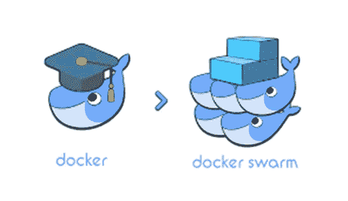
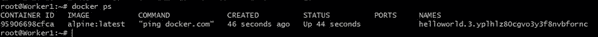

# DOCKER SWARM —创建和部署服务

> 原文：<https://medium.com/analytics-vidhya/docker-swarm-creating-deploying-services-a0da071339d3?source=collection_archive---------18----------------------->

如果你使用过 Docker 容器，你就会明白它们有多强大。但是你知道吗，你可以通过创建一个 Docker 主机集群，称为 Docker swarm，来成倍地提升 Docker 的能力。信不信由你，这个过程真的很简单。您所需要的只是一台机器作为 Docker 群管理器，以及一些 Docker 主机作为工作者节点加入群。

***我们开始吧！***

从 AWS 控制台，导航到 EC2。

对于这个演示，我将创建 3 个实例，1 个经理和另外 2 个工人。

确保您的实例位于同一区域，并记住在设置安全组时，允许所有流量从任何地方通过您的实例

点击**查看并启动**。

点击**发射**。

现在我们已经有了 3 个实例。适当的命名约定可以帮助您确定哪个实例将成为经理和工人。

接下来，让我们连接到这些实例，并在每个实例上安装 docker。

首先让 SSH 进入我们的*管理器*并安装 docker。

在管理器上安装 docker

安装过程有据可查 [**此处**](https://get.docker.com/) 。按照说明安装最新版本的 docker 引擎。

安装 docker 后，您可以使用以下命令检查安装的版本

> **docker--版本**

最好每个节点都有正确的名称，以便于识别。要更改名称，需要以 root 用户身份登录并运行命令:

> vim /etc/hostname

*/ect/hostname* 是存储节点名称的目录。

一旦更改了名称，就需要重新启动实例。

使用上述步骤在每台机器上安装 docker 之后，使用三个不同的终端将 SSH 安装到实例中。

1 名经理 2 名工人终端

在所有终端上，以 **root 用户身份登录。**

到目前为止，我们只把这些机器命名为经理和工人。

在管理器计算机上运行以下命令:

> 停靠站群初始化-广告-地址<manager_ip></manager_ip>

一旦发出并完成，您的管理器实例现在实际上已经成为了群集的**管理器，您的屏幕上应该会出现以下输出:**

对**添加其他机器作为工人节点**，盲目复制命令

> 码头工人蜂拥加入。

到工人机器上。

完成后，您的屏幕将如下所示

快速回顾一下，您可以看到您的工作机显示了一条消息，

> 这个节点作为工作者加入了一个群。

让我们看看您在第一个集群中创建的所有内容。从管理机器上运行命令 **docker node ls** 来查看你的群的连接节点。

你可以看到我们现在有 1 名经理和 2 名工人。

接下来，让我们**在这个集群中部署一个 API 服务**。

随着我们的 Swarm 的启动和运行，让我们将一个服务部署到*，看看调度是如何工作的*。要在 Swarm 上启动服务，请返回管理器计算机。

运行命令:

> docker 服务创建—副本 1 —名称 hello world alpine ping docker.com

参数 Alpine ping docker.com 将服务定义为执行命令 ping docker.com 的 Alpine Linux 容器。

要查看正在运行的服务列表，请使用命令

> 码头服务

现在您已经向 swarm 部署了一个服务，您可以查看该服务的详细信息:

为了以可读的格式查看细节，我们使用了**--漂亮的**标志。

要查看哪些节点正在运行服务，请运行

> 码头服务 ps

在这种情况下，helloworld 服务的一个实例正在 Manager 节点上运行。默认情况下，群中的管理者节点可以像工作者节点一样执行任务。

让我们扩展我们的服务，然后检查哪些节点正在运行这些服务。为了扩展，我们将使用:

> 码头工人服务量表 <service-id>=<number-of-tasks></number-of-tasks></service-id>

在服务中运行的容器被称为任务。

现在检查哪些节点正在运行服务

你可以看到 swarm 已经创建了 2 个新任务来扩展到总共 3 个运行的 Alpine Linux 实例。这些任务在群体的节点之间分配。

让我们通过 SSH 进入一个 worker 节点，查看在您所连接的节点上运行的容器。使用:

> docker ps

太棒了！！您已经见证了经理安排哪些容器在哪里运行。

如果你觉得有趣，请鼓掌！

*谢谢！！*