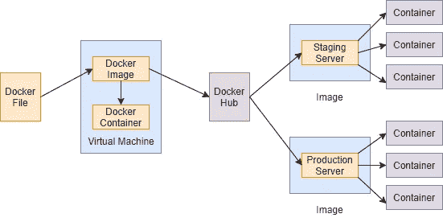
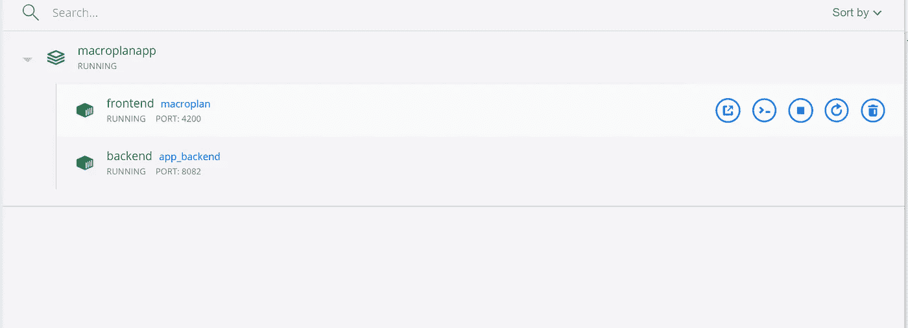

# Dockerizing Angular 应用程序和 Python 后端(瓶子/烧瓶框架)

> 原文：<https://medium.com/analytics-vidhya/dockerizing-angular-application-and-python-backend-bottle-flask-framework-21dcbf8715e5?source=collection_archive---------3----------------------->

今天，我们将完成这一切。


在这篇博客中，我们将了解 Docker，安装它并看看它的实现。

# 什么是 Docker

Docker 是一个容器编排工具，旨在简化应用程序的开发、部署和执行。Docker 容器基本上是虚拟机的替代品，它运行在主机操作系统上。然而，容器不需要任何预先分配的 RAM。


基本 Docker 架构

# Docker 如何工作

通过这个简图可以理解 Docker 的基本工作原理，



码头工人的基本工作流程

在这里，开发人员将依赖关系和需求写在 Docker 文件中。Docker 文件在执行时产生 Docker 映像，它包含了所有提到的需求。Docker 容器是从这个 Docker 映像创建的，简单地说，Docker 容器是 Docker 映像的运行时实例。Docker 映像被放入 Docker Hub，这是 Docker 映像的公共存储库。你可以在这里找到很多预先创建的 Docker 图像。您可以提取自己选择的图像并创建自己的容器。

# 为什么使用 Docker

1.  我们使用 Docker，这样我们的开发、部署和测试环境可以是相同的
2.  微服务架构意味着，如果一项服务停止运行，其他服务仍然可以运行
3.  我们不必事先为 Docker 容器分配 RAM 或存储空间
4.  降低了每个微服务级别的依赖性

# 在 Windows 10 上安装 Docker

**第一步:**进入[这个链接](https://docs.docker.com/docker-for-windows/install/)下载 Docker 桌面

**第二步:**你很可能会看到你的系统上没有安装 WSL 2(Docker 桌面会提示)，按照这里[的步骤](https://docs.microsoft.com/en-us/windows/wsl/install-win10)安装 WSL 2。

(注意:我遵循了该链接下给出的手动步骤，对我来说效果非常好)

**步骤 3:** 在您的终端中运行这个命令，以验证 WSL-2 是否已经安装

```
> wsl -l -v
```


命令的输出

你现在可以运行 Docker 桌面了。让我们把手弄脏吧。

# Dockerizing 角度应用程序(仅限用户界面)

**步骤 1:** 转到 UI 应用程序文件夹(看起来像这样)


GUI 文件夹

**第二步:**打开 cmd，在同一个位置路径运行以下命令，

```
> ng build --prod
```

这将为生产构建您的应用程序，并在上述位置创建一个名为 **dist** 的文件夹。

**第三步:**让我们在同一个位置路径下创建一个 Dockerfile，记得把它命名为 **Dockerfile，**，并在其中写入以下命令

```
FROM nginx:1.17.1-alpine
COPY /dist/macroPlan /usr/share/nginx/html
```

这里我们从 Docker Hub 中拉出一个名为 **nginx:1.17.1-alpine** 的映像，然后将本地系统上的 **dist/macroPlan** 的内容复制到容器中的位置 **/usr/share/nginx/html** 。这就是我们如何创建一个简单的 Dockerfile 文件。

**步骤 4:** 要使用这个 Docker 文件构建 Docker 映像，运行以下命令，

```
> docker build -t macroplan .
```

其中， **macroPlan** 是 Docker 图像的名称，而(。)表示当前目录。您可以通过运行以下命令来检查您的映像是否已经构建，并且您将看到您的 Docker 映像

```
> docker images
```

**步骤 5:** 为了运行这个 Docker 映像并创建一个容器，运行命令，

```
> docker run -p 80:80 macroplan
```

这里 80:80 是源端口和目的端口。您可以在浏览器中键入 localhost:80(如果没有出现，请复制默认 Docker 应用程序的 IP ),然后看到您的应用程序变得栩栩如生。

恭喜你，你已经把你的 UI 应用程序放到了 Docker 容器中。

# 具有瓶子后端框架的对接角度应用

*   **设置用户界面应用**

通过上一节的**步骤 1、步骤 2** 和**步骤 3** 设置 UI 应用。暂时不要运行第 4 步和第 5 步。

*   **设置后端应用程序**

第一步:转到你的 Python 文件(API)所在的文件夹位置

**第二步:**为你要安装的所有依赖项创建一个 requirements.txt 文件，用你要安装的库的名字创建一个文本文件就行了，我的看起来像，

```
pandas
bottle
datetime
json
```

**第三步:**为后端 API 创建 docker file as，

```
FROM python:3.7-slim
COPY /locationOfCodeInYourLocal
WORKDIR /DestinationLocationOnContainerENV PYTHONUNBUFFERED 1RUN pip3 install -r /code/requirements.txtCMD ["python","app.py"]
```

这里我们提取名为 **python:3.7-slim** 的映像，并通过运行 PIP 命令在其上执行安装。我们还使用 **COPY** 命令在容器上设置我们的代码，并使用 **WORKDIR** 命令设置工作目录。 **CMD** 用于运行命令行指令。这里 app.py 是我们需要运行的 Python API 文件的名称。

*   **编写 DOCKER-COMPOSE 文件**

Docker Compose 是一个在 Docker 上运行多容器应用程序的工具，使用 Compose 文件格式定义。合成文件用于定义如何配置组成应用程序的一个或多个容器。将您的合成文件命名为 **docker-compose** ，并添加以下详细信息:

```
version: "3.3"
services:
    app-backend:
        build: ./server/
        image: app_backend
        container_name: backend
        restart: always
        ports:
            - 8082:8082app-frontend:
        build: ./GUI/
        image: macroplan
        container_name: frontend
        restart: always
        ports:
            - 4200:4200
        expose:
            - "4200" 
```

在这里，我们定义源端口和目的端口、各自 docker 文件的位置(在构建选项下)、映像和容器的名称。我们还指定了公开的端口号。

然后我们打开 cmd 并运行命令，

```
> docker-compose up --build
```


应用程序已经启动并正在运行

应用程序现在正在运行。在浏览器中打开本地主机查看它。或者，您可以从 Docker 桌面上查看相同的内容，它看起来像这样，



Docker 桌面窗口

点击**在浏览器中打开**设置，查看您的应用程序运行。

祝贺你成功来到这里。现在你已经了解了基本的 Docker，在进一步尝试之前，一定要学习 Docker 命令。

如果你觉得这很有帮助，请鼓掌。