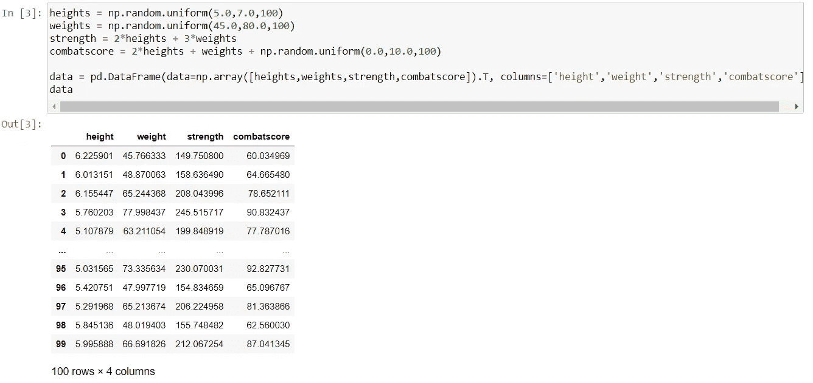
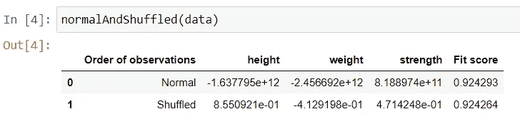
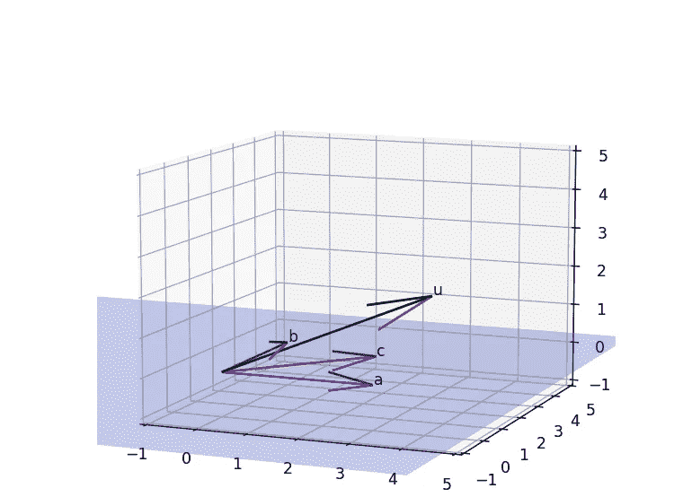
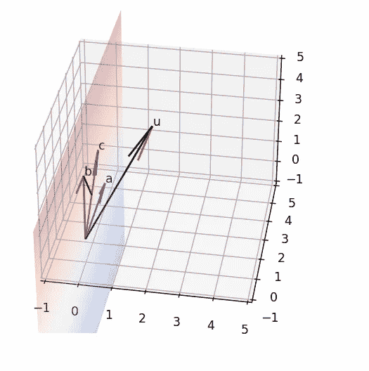
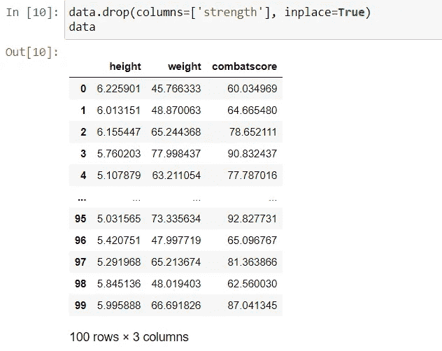
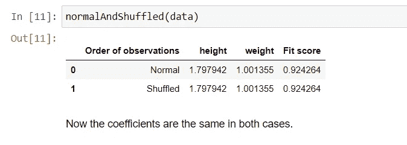

# 特征共线性影响模型拟合吗？

> 原文：<https://medium.com/analytics-vidhya/does-feature-collinearity-affect-model-fit-4618c5dc79ea?source=collection_archive---------4----------------------->

在线性回归的背景下——几何透视

来源:谷歌图片

# 摘要:

我们的假设是，在线性回归的情况下，要素之间的共线性不会对拟合产生太大影响。然而，这使得拟合系数非常不确定，从而对模型的可解释性产生不利影响。我们将验证这一假设，然后提供一个理由来说明为什么会这样。理由将包含对背后现实的几何洞察。

# 背景:

这个问题源于对数据集进行的线性回归。我观察到，当我从特征矩阵中删除了一个完美的共线关系后，模型拟合完全没有改变。这就是这个博客标题的问题的来源，也是**摘要**中提出的假设。

# 假设的验证:

首先是对假设的验证。为此，我们对两个特征——身高(英尺)和体重(千克)进行了 100 次模拟观察。我们生成第三个特征——*强度* = 2ℎ𝑒𝑖𝑔ℎ𝑡+3𝑤𝑒𝑖𝑔ℎ𝑡.这是*力量*与*高度*和*重量*的完美共线关系。我们的反应是 *combatscore* (给定*身高*、*体重*和*力量*的个人在战斗中的得分)。**𝑐𝑜𝑚𝑏𝑎𝑡𝑆𝑐𝑜𝑟𝑒=2ℎ𝑒𝑖𝑔ℎ𝑡+𝑤𝑒𝑖𝑔ℎ𝑡+𝜖**其中 *ϵ* 是随机误差。

有了这些数据，我们将首先拟合一个线性回归模型，并记录系数和模型拟合得分——𝑅得分。然后，我们只需改变观察值，例如，第一个观察值变成第十个，依此类推。我们将再次拟合线性回归，记录系数并拟合该混洗数据集的分数。

比较两者将证实我们的假设。

要使用的数据集

当上述方法应用于数据集及其混洗版本时的结果

**我们清楚地看到系数之间的巨大差异，尽管拟合分数几乎相同。这凸显了一个非常真实的问题。打乱观察结果甚至不是训练数据的变化。即使在这一点上，也注意到了系数值的这种奇怪的偏差。然而奇怪的是，模型拟合几乎不受此影响。**

> **“模型拟合中涉及的计算”有什么特别之处，它可以毫发无损地通过共线性，而系数却不能？**

# 几何解释:

我们将试图通过矢量处理来了解系数是什么以及模型拟合分数表示什么。*身高*、*体重*、*力量*和*战斗分数*这几列是 100 维向量。我们本质上想要做的是尽可能好地将 *combatscore* 表示为向量的线性组合。为了更好地证明这一点，我将使用一些矢量图。让我们首先创建那些情节。

比如说𝑎=(3,0,0、𝑏=(0,3,0 和𝑐=0.7𝑎+0.8𝑏.所以𝑐躺在被𝑎和𝑏.横扫的飞机上现在𝑢=𝑎+𝑏+𝜖，𝜖是一个随机误差。我们的目标是用𝑎、𝑏和𝑐.来尽可能好地表达𝑢

沿着 a、b 和 c 所在平面的向量

现在，就𝑎、𝑏和𝑐而言，𝑢的最佳近似将是当𝑢在平面上的垂直投影，比如说𝑢*_ p*，被表达为𝑎、𝑏和。这种表达方式实际上可以有很多可能的方式，因为我们只需要两个这样的向量𝑎和𝑏，而在这种情况下，我们有三个向量——𝑎、𝑏和𝑐.这正是共线性产生的问题——表示𝑢_𝑝的系数变得不确定、不确定。

在这种情况下，模型拟合是如何表示的？𝑢离它的投影𝑢_𝑝越近，拟合越好。因此，𝑢与平面的垂直距离给出了拟合不足量的度量。

> **向量元素混洗时，这个量会发生变化吗？**

我们将𝑎的值从(3，0，0)改为(0，3，0)，将𝑏的值从(0，3，0)改为(0，0，3)，将𝜖的值从(0，0，1.5)改为(1.5，0，0)，再次绘制上述曲线。𝑐和𝑢的表述保持不变。在这次洗牌后，现实世界对𝑎、𝑏、𝑐和𝑢的解读依然如故。

载体后洗牌

向量可能已经改变了排列，但是𝑢到平面的垂直距离和以前一样。我在这里并不试图做任何分析证明，但这个数字本身似乎太有说服力了。因此，拟合是相同的。然而，当线性回归运行时，向量的元素项会参与计算。改变它们的顺序可以彻底改变𝑢_𝑝在𝑎、𝑏和𝑐.方面的表达

如果只有两个向量𝑎和𝑏，这种任意性就不会出现。为了证明这一点，我们现在将从数据集中删除*强度*列，并重新运行正常和随机模式拟合。

完全共线的柱“强度”

从特征空间中去除共线性

# 结论:

因此，在线性回归的情况下，拟合不受共线性的影响，但模型系数的不确定性以及可解释性会受到影响。

然而，同样的情况不能保证适用于其他型号，因为我不太确定矢量疗法是否也适用于它们。