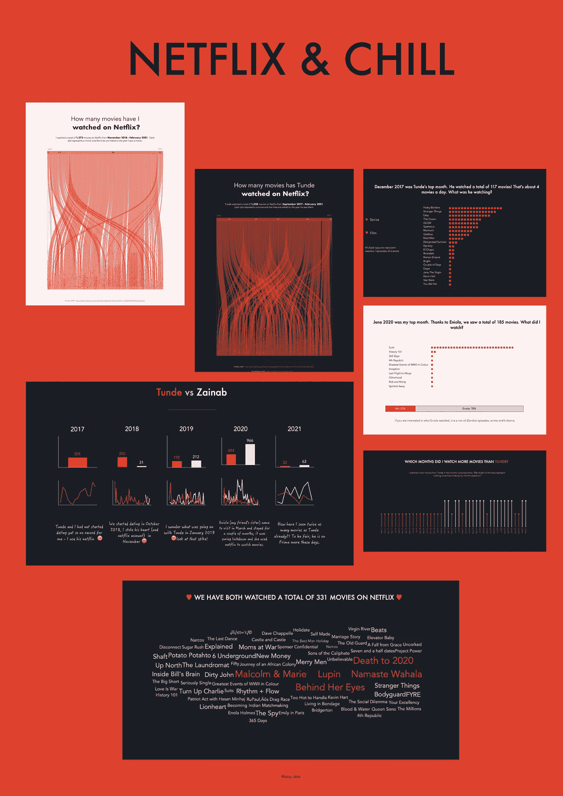
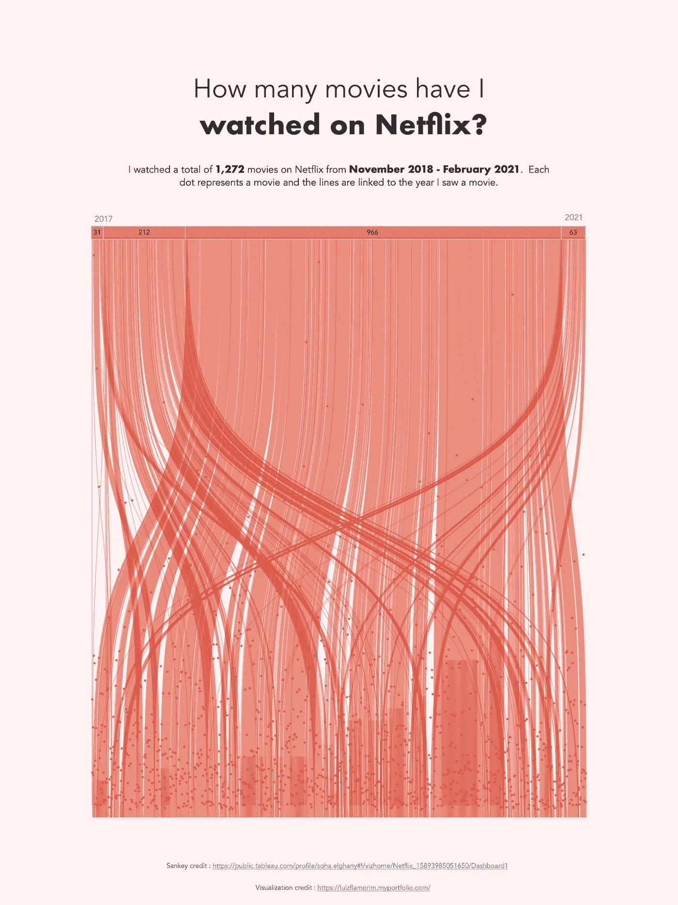
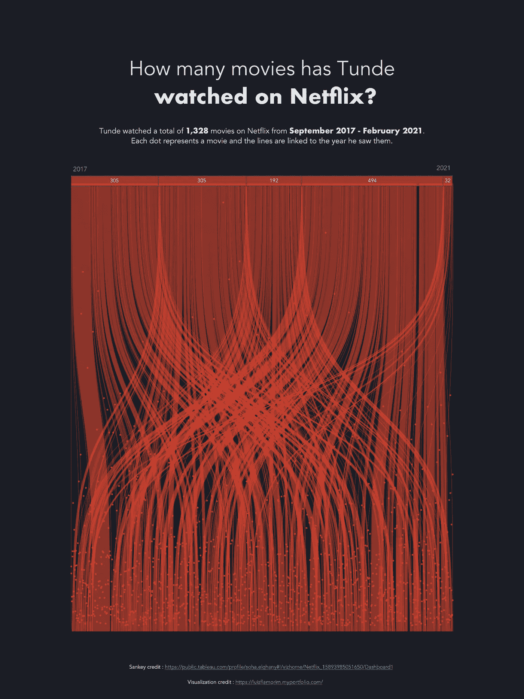
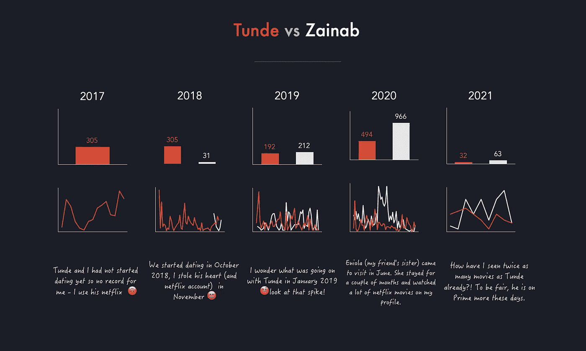
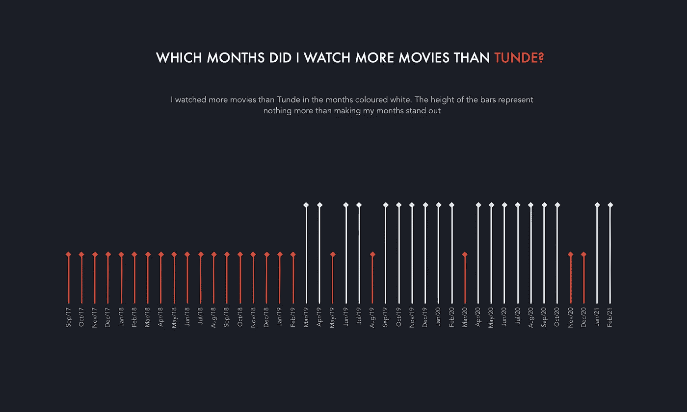
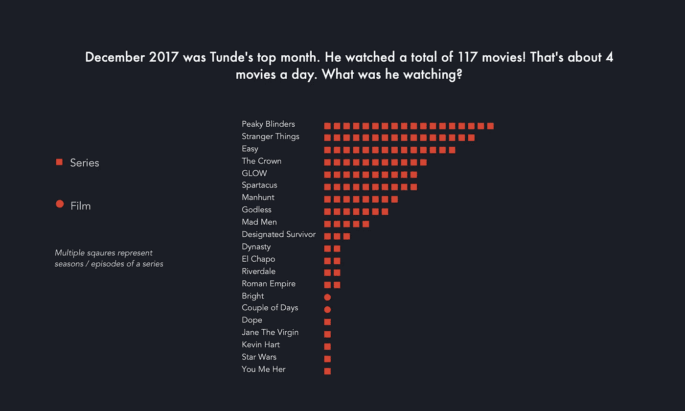
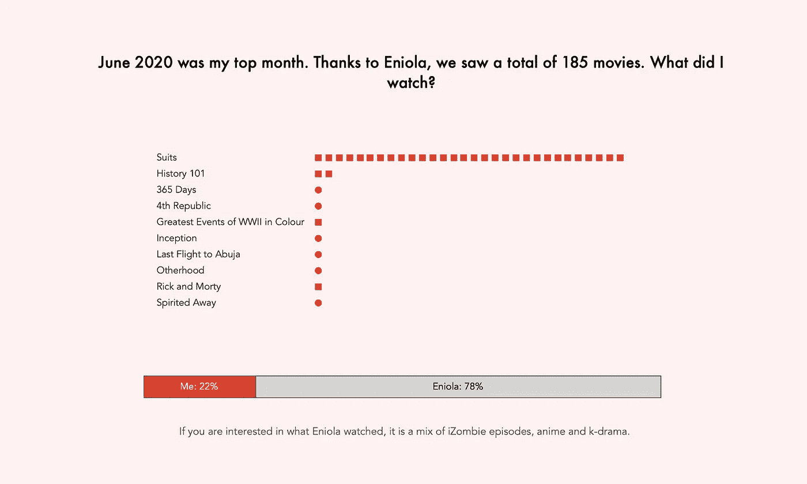
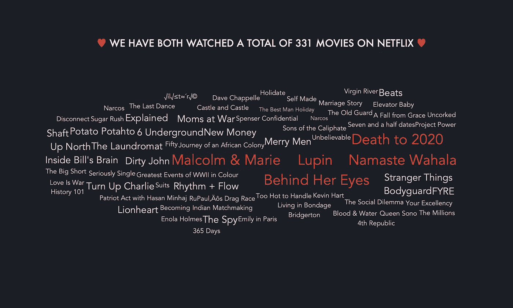

# 我的搭档网飞比我更冷静吗？

> 原文：<https://medium.com/analytics-vidhya/does-my-partner-netflix-chill-more-than-me-121902842cb0?source=collection_archive---------9----------------------->

一个关于我的搭档 Tunde 和我的网飞手表历史的可视化故事，由明显更酷的人(提示:我)讲述。

唐德比我更喜欢电影，所以有趣的是我倾向于看更多的电影。公平地说，他和网飞一起使用 Prime、Hulu 和其他流媒体服务，而我只使用网飞。

# 灵感

去年的某个时候，我偶然看到了 [Luiz Amorim](https://luizflamorim.myportfolio.com/) 关于他的网飞手表历史的这个可视化图，我觉得这很酷。他的观点是我写这篇文章的主要灵感。

[Soha Elghany](https://public.tableau.com/profile/soha.elghany#!/) 对她在网飞的电影做了一个[可视化](https://public.tableau.com/profile/soha.elghany#!/vizhome/Netflix_15893985051650/Dashboard1)，也是受到 Luiz 的启发，在[画面上使用了 Sankey 图表](https://public.tableau.com/en-gb/gallery/?tab=viz-of-the-day&type=viz-of-the-day)。Tableau 是我的首选可视化工具，所以我很高兴看到她，我把它作为一个指南。

# 数据

数据是从我的[网飞手表历史](https://www.netflix.com/viewingactivity)下载的。Tunde 和我使用相同的网飞帐户，但有不同的配置文件，所以我选择了我的配置文件，点击“下载全部”——这将自动下载一个 CSV 文件，然后我切换配置文件下载 Tunde 的数据(他允许我)。

# 形象化

所有的图表我都用了 tableau。你可以点击查看互动版[。](https://public.tableau.com/views/netflix_16143298430420/Firstpage?:language=en-GB&:display_count=y&publish=yes&:origin=viz_share_link:showVizHome=no#1)

让我们开始吧！

我们在网飞上看了多少部电影？

从 2018 年 11 月到 2021 年 2 月，我在网飞总共看了**1272 部**电影。

Tunde 在 2017 年 9 月至 2021 年 2 月期间观看了**1328 部**电影。

我们如何进行年度比较？

我不是一个电视剧或电影的大粉丝，所以最初我很惊讶地发现，在大多数年份里，我看的电影比 Tunde 还多，但我喜欢往往有很长剧集的真人秀。食物竞赛表演、变装比赛、室内装饰表演等等，来吧！

2020 年，我们看的电影比往年多了近 3 倍(《我看见你了，新冠肺炎禁闭》)。我朋友的妹妹 Eniola 在六月来看我，那是在封锁期间，所以她呆了几个月，用了我的网飞个人资料(很多！)因此，从 2020 年 6 月开始，我的电影数量激增。

我们在最好的几个月里看了哪些电影？

2017 年 12 月对于 Tunde 来说绝对是狂欢的一个月。他总共看了 117 部电影，其中只有两部是真正的电影，其余的都是连续剧。Peaky blinders 和奇怪的事情是我也喜欢的节目，所以他得到了一些很酷的点。

2019 年 6 月是我最好的一个月，总共有 185 部电影。记得埃尼奥拉吗？她负责 185 部电影中的 144 部，这意味着我实际上只看了 41 部。也是在这个月，我决定从头再看一遍《西装》。附注:我想要杰西卡·皮尔逊的衣柜，路易·利特仍然是个讨厌的角色。

**我们都看过哪些电影？**

唐德喜欢俗气的节目，我喜欢真人秀，但唉，331 网飞电影把我们团结在一起。当我们不在一起的时候，我们有时会用[手机](https://www.netflixparty.com/)一起看电影。我们很喜欢一起看的电影有《马尔科姆·玛丽》、《2020 年之死》、《埃诺拉·霍姆斯》和《大空头》。

**结论**

这对我来说真的很有趣，所以我希望你能像我喜欢创建它一样喜欢它。请关注我的 [tableau 公众号](https://public.tableau.com/profile/zainab2225#!/)了解更多动态。

**参考文献**

[链接到互动 viz](https://public.tableau.com/views/netflix_16143298430420/Firstpage?:language=en-GB&:display_count=y&publish=yes&:origin=viz_share_link:showVizHome=no#1)

[链接到 Luiz Amorin 的原始视觉效果](https://www.behance.net/gallery/94574457/Netflix-films)

[链接到 Soha Elghany 的桑基可视化](https://public.tableau.com/profile/soha.elghany#!/vizhome/Netflix_15893985051650/Dashboard1)

**联系我**

推特: [@zizzy_data](http://twitter.com/zizzy_data)

领英:[https://www.linkedin.com/in/zainab-ayodimeji-oyinlola/](https://www.linkedin.com/in/zainab-ayodimeji-oyinlola/)