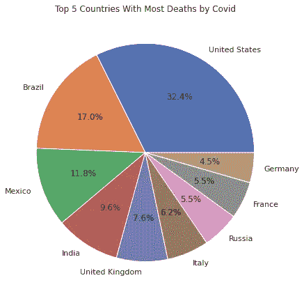
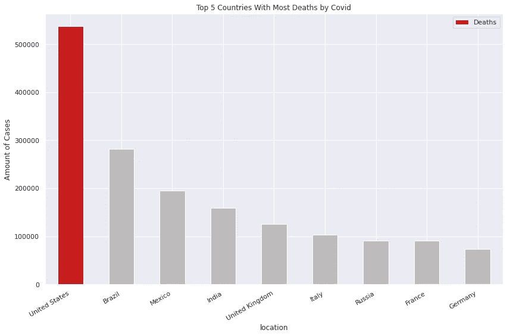

# 不要在你的数据分析中使用饼图

> 原文：<https://medium.com/analytics-vidhya/dont-use-pie-charts-in-data-analysis-6c005723e657?source=collection_archive---------6----------------------->

## 为什么你不应该使用饼图，以及如何取代它们。

饼图是人们日常使用的最流行的可视化类型之一。然而，至少可以说，这也是最糟糕的情况之一。

普里西拉·杜·普里兹在 [Unsplash](/s/photos/pie?utm_source=unsplash&utm_medium=referral&utm_content=creditCopyText) 上的照片

**不要使用以食物命名的图表。**

你可能想知道“哦，我的天啊，为什么最受欢迎的图表变得更差了？”。

我知道，我知道。馅饼的确很好吃。然而，当涉及到数据可视化时，它们就没有那么好了。

# 开始之前

不要忘记关注我的 [GitHub](https://github.com/vinny380) 和 [LinkedIn](https://www.linkedin.com/in/vin%C3%ADcius-porfirio-purgato-7891401b3/) 账户。我喜欢写关于数据科学的文章，并在网上与人分享很酷的东西。

# 为什么不应该使用饼图

通常，饼图用于讲述一个部分与另一个部分的相关程度。基本上，A 部分相对于 B 部分、C 部分和其他部分有多大。然而，饼状图的大麻烦是，为了理解它们，我们必须比较区域(或角度)，而这是人类不擅长的任务。总的来说，我们高估了钝角，低估了锐角。

**很多时候，条形图是取代饼图的最佳选择。**

这里有一个饼状图的例子，新冠肺炎死亡人数最多的十个国家:

作者的情节

你真的看不出一个比另一个大多少。当然，您可以通过做一些数学计算并查看每个切片的值来找出(或尝试)。然而，通用图表应该是直观的，你应该不难理解它们。

现在让我们根据相同的数据绘制一个条形图:

作者的情节

好多了，对吧？我实际上在我的[新冠肺炎数据分析](/analytics-vidhya/data-analysis-on-covid-19-in-the-world-f9f113c82424)中使用了这个图，如果你还没有的话，可以看看。

条形图是比较数据关系的更好选择。这是因为它们让我们通过一维长度来比较不同的物体。与二维相比，人类更擅长比较一维对象，这使得条形图的比较比饼图的面积更容易。只是更简单而已。

总的来说，饼图确实比其他图表漂亮。然而，他们没有做好自己的工作。

如果你想了解更多关于数据可视化的知识，我强烈建议你阅读 Cole Nussbaumer Knaflic 的[用数据讲故事](https://www.amazon.com/Storytelling-Data-Visualization-Business-Professionals-ebook/dp/B016DHQSM2/ref=sr_1_1?__mk_pt_BR=%C3%85M%C3%85%C5%BD%C3%95%C3%91&dchild=1&keywords=Storytelling+with+Data%3A+A+Data+Visualization+Guide+for+Business+Professionals+%28English+Edition%29&qid=1615992895&s=digital-text&sr=1-1)。

如果你想更深入地了解为什么不使用饼状图，我也推荐你读一读斯蒂芬·诺的《T2:把馅饼当甜点吧》。他和同事们一起写了许多原因，说明饼状图为什么以及如何误导你得出错误的结论。这是报纸上的一段引文:

> 这些信息以表格的形式呈现时，比笨拙地排列在饼图外围时更容易阅读。那么为什么要使用图表呢？如果图片不能被解码并且不能更有意义地呈现信息，为什么要显示数据的图片呢？答案是:不应该。当数据图片使从相同数据的表格中不容易辨别的有意义的关系(模式、趋势和例外)可见时，图表是有用的。

也有许多其他研究人员认为饼状图是可怕的。尽管威廉·克利夫兰不是第一个批评饼状图的人，但他在 1984 年写了一篇科学论文，得出结论说，当使用条形图而不是饼状图时，人类的结论准确 1.96 倍。这是因为比较长度比角度更容易。

# 何时使用饼图

老实说，我对此做了一些研究，结果让饼状图的粉丝们很不高兴(饼状图真的存在吗？).

大多数数据科学家只会在你的可视化有两个可能的变量时考虑使用饼图，比如是或否。然而，你仍然必须添加数字标签，如果你不这样做，信息就不会清晰。

**就个人而言，即使在这种情况下，我也会考虑使用条形图。对我来说，这只是一个良好实践的问题，就像评论你的代码一样。**

# 如何绘制饼图

照片由 [Myriam Jessier](https://unsplash.com/@mjessier?utm_source=unsplash&utm_medium=referral&utm_content=creditCopyText) 在 [Unsplash](/s/photos/data-science?utm_source=unsplash&utm_medium=referral&utm_content=creditCopyText) 上拍摄

我知道，你的客户/老板可能不在乎饼状图是否令人困惑，他们可能希望它出现在报告中。既然他们付钱给你，你就必须交付。

所以，下面是一些关于如何用 Matplotib 用 Python 制作 plot 好的饼状图的好文章。

*   MatPlotLib 实现了饼图更好的可视化效果
*   [饼图文档 Matplotlib](https://matplotlib.org/stable/api/_as_gen/matplotlib.axes.Axes.pie.html?highlight=pie#matplotlib.axes.Axes.pie)

# **引文**

法比奥内维斯。“别再用那些难看的饼状图了！” *Medium* ，Medium，2018 年 10 月 11 日，[Medium . com/@ fneves/stop-use-these-ugly-pie-charts-962 AC 70 beb 41](/@fneves/stop-using-those-ugly-pie-charts-962ac70beb41)

斯文·汉伯格。*为什么不应该使用饼状图——更好的数据可视化技巧*， [blog .漏斗. io/Why-we-don-Use-Pie-Charts——以及一些更好的数据可视化技巧](https://blog.funnel.io/why-we-dont-use-pie-charts-and-some-tips-on-better-data-visualizations)

很少，斯蒂芬。"把馅饼留着做甜点吧。"*感知边缘*，2007 年 8 月，第 1–14 页，doi:[www . Perceptual Edge . com/articles/visual _ business _ intelligence/save _ the _ pies _ for _ dessert . pdf](https://www.perceptualedge.com/articles/visual_business_intelligence/save_the_pies_for_dessert.pdf)