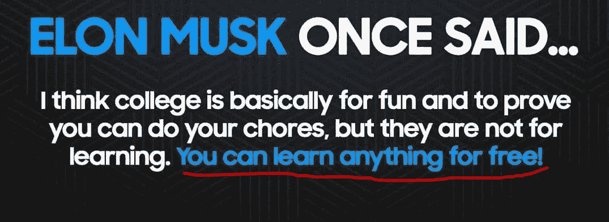
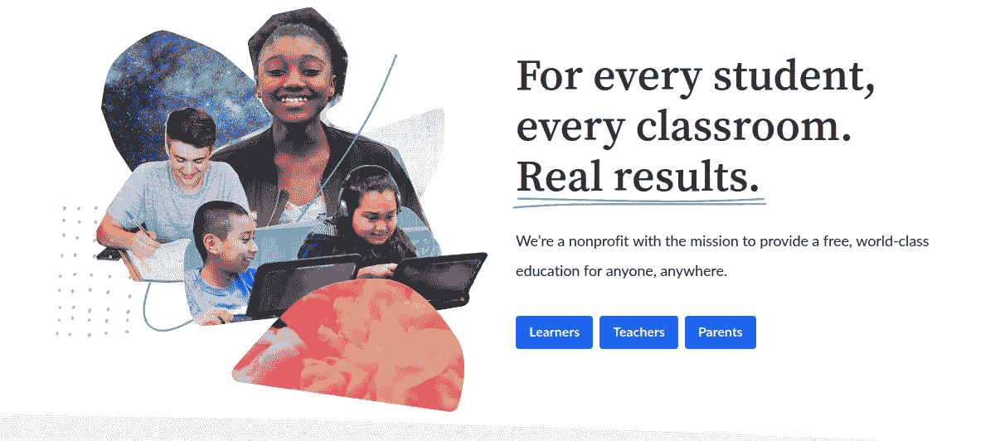
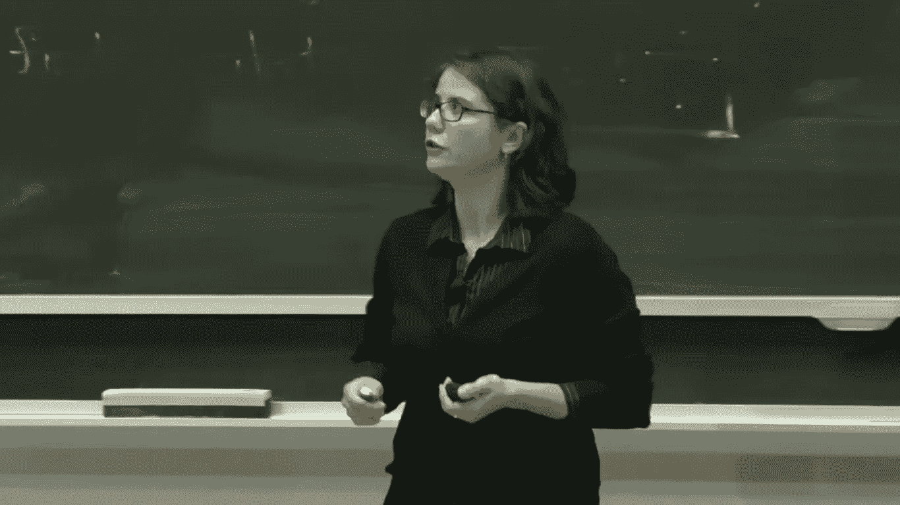
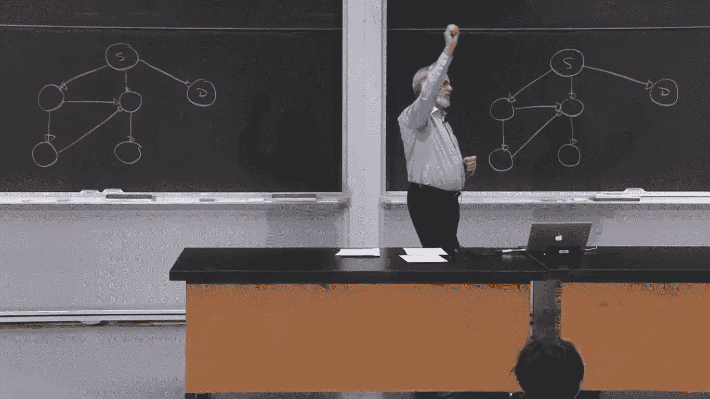
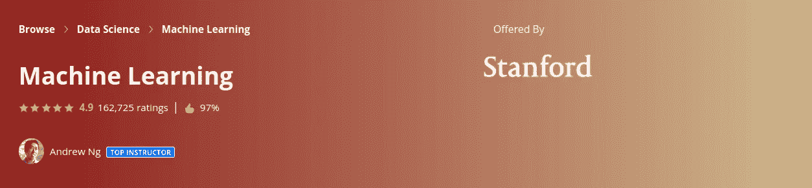
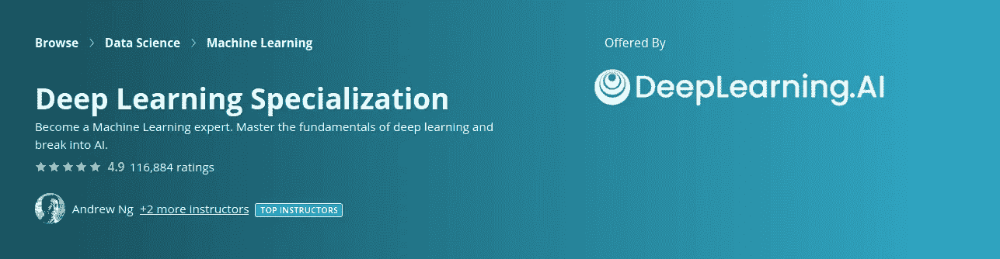

# 不要等到大学才学 AI，现在就可以免费开始。

> 原文：<https://medium.com/analytics-vidhya/dont-wait-for-university-to-learn-ai-you-can-start-now-for-free-3141cfb7a61d?source=collection_archive---------11----------------------->

埃隆·马斯克语录

大多数对人工智能领域感兴趣的学生正在等待大学课程学习这一领域。但实际上，这是错误的，因为互联网上的一切都是免费的。你可以随时随地学习你想学的任何领域。

此外，大多数人认为人工智能是一个局限于计算机科学学生或 IT 学生的领域。但这是错误的。任何有数学基础的人(通常任何科学部门都教数学——代数、微积分、概率和统计)——都有能力轻松地开始这个领域。

因此，作为一名懂一点数学的学生，你不必等到大学才教你人工智能领域。你现在可以从世界顶级大学开始，他们在许多领域提供高质量的内容，不仅仅是 AI。

作为一个两年前开始学习的人工智能学习者，我问了这个领域的许多研究人员来指导我的学习过程，他们总是推荐可能相同的资源，所以我打算与你分享这些资源。

# 1 —吉尔伯特·斯特朗教授的线性代数。

**想象你是麻省理工学院的学生**！！世界上最重要的大学之一。那是每个学生的梦想。但是你相信所有麻省理工学院的讲座和笔记在许多领域对你都是免费的吗？所以你可以从线性代数开始，这是人工智能领域的起点。

吉尔伯特·斯特朗关于线性代数教学的访谈

课程链接: [***点击这里。***](https://www.youtube.com/playlist?list=PLE7DDD91010BC51F8)

# 2 —微积分、概率和统计:

这些也很重要。但是你可以只学最基本的。事实上，我们在高中学习了这些专业，但你必须发展和理解好这三个领域，因为你会在人工智能论文中发现很多数学。

所以我强烈推荐 **KhanAcademy** 平台。这是世界上最好的 MOOCs 之一。他们免费提供数百门课程(英语和法语两种语言)。

可汗学院

微积分课程链接: [**点击这里！**](https://www.khanacademy.org/math) (你会在这里找到所有的数学课程)

统计与概率课程链接: [**点击这里！**](https://www.khanacademy.org/math/statistics-probability)

注意:在 [**麻省理工学院的开放式课程**，](https://ocw.mit.edu/)中，他们也提供这些课程，但是它们有点长，需要更多的时间和精力来完成，所以如果你更喜欢麻省理工学院，你会在那里找到一切。

# 3 —计算机科学和 Python 编程简介:

哇，这是我最喜欢的课程之一，由 Ana Bell 博士提供，如果你是编程新手，你可以从这里开始。你会喜欢学习这门课程的。

安娜·贝尔博士

> 《计算机科学和 Python 编程导论》面向很少或没有编程经验的学生。它旨在让学生了解计算在解决问题中的作用，并帮助学生，无论他们的专业如何，对他们编写小程序以实现有用目标的能力充满信心。该类使用 Python 3.5 编程语言。—麻省理工开放式课程—

课程链接: [**点击这里！**](https://www.youtube.com/playlist?list=PLUl4u3cNGP63WbdFxL8giv4yhgdMGaZNA)

# 4 —计算思维和数据科学简介:

本课程是上一门课程的补充，因此，如果您完成本课程，将会获得关于计算思维和基本数据科学问题的全面知识。

约翰·古塔格博士教学

本课程由约翰·古塔格博士主讲

课程链接: [**点击这里！**](https://www.youtube.com/playlist?list=PLUl4u3cNGP619EG1wp0kT-7rDE_Az5TNd)

# 5 —机器学习:

学完前面所有的课程，现在你有能力开始机器学习(这是解决问题的新范式)。有史以来最著名的课程。由 [**Coursera**](https://www.coursera.org/) 上的 [**吴恩达**](https://en.wikipedia.org/wiki/Andrew_Ng) 提供。

机器学习课程

这个课程非常非常有名(超过 400 万人注册了这个课程)。本课程提供了机器学习、数据挖掘和统计模式识别的广泛介绍。

课程链接: [**点击这里！**](https://www.coursera.org/learn/machine-learning?)

# 6 —深度学习专业化:

恭喜你，你已经快成功了，现在让我们来谈谈吴恩达在 Coursera 上提供的这个专业。

深度学习专业化——Coursera——

当你完成了机器学习课程，现在你可以潜入深度学习领域。你可以在顶尖大学找到很多资源，比如麻省理工学院、NYU 大学..等等。但是相信我，这个专业是最好的，它给了你所有你需要知道的关于这个领域的知识。它涵盖了从神经网络到卷积神经网络和序列模型的所有主要课题。

> 人工智能正在改变许多行业。深度学习专业化通过帮助你获得提升职业生涯的知识和技能，为你在人工智能世界中迈出决定性的一步提供了一条途径。一路上，你还会得到来自工业界和学术界的深度学习专家的职业建议。
> 
> ——Coursera—

链接到专精: [**点击这里！**](https://www.coursera.org/specializations/deep-learning?)

注意:Coursera 课程需要付费，所以如果你想免费获得这些课程，你应该申请经济资助。如果你想知道如何申请。请留言或发邮件给我，我很乐意帮助你。

# 结论:

最后，当你完成所有课程后，你可以更深入地研究人工智能领域，因为深度学习是一个很大的领域，每天都有很多研究出来，所以你应该通过阅读论文和做一些项目或跟随研讨会来保持与该领域的联系。
所以这里简单地说一下如何开始人工智能，可能有不同的路线图，但这是其中之一。
如果您有任何问题或意见，请在评论中留下或发邮件给我。

邮箱:asekhri@inttic.dz