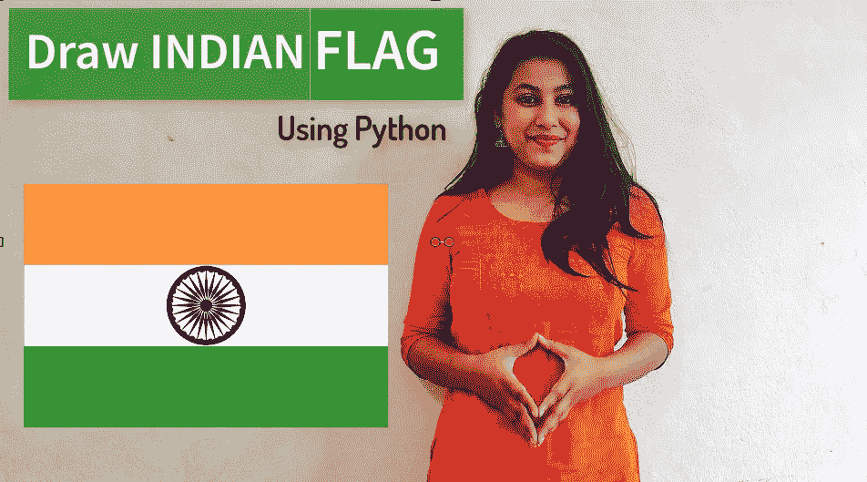
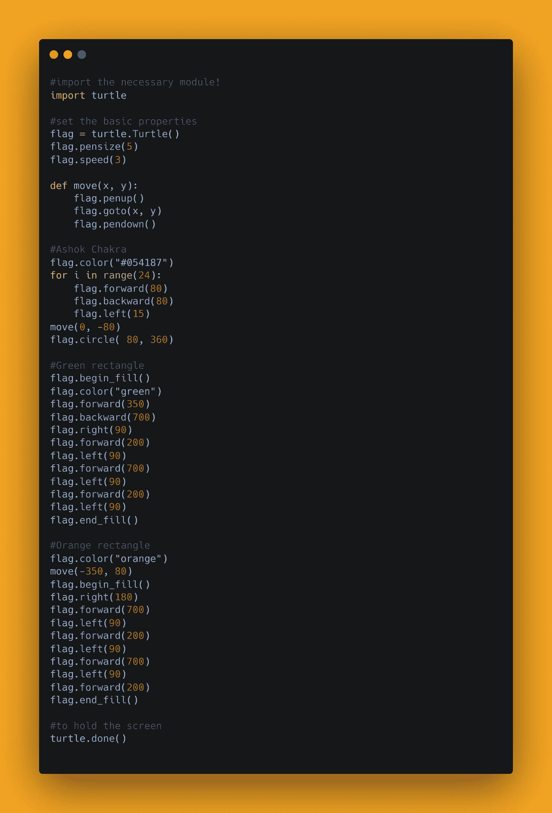
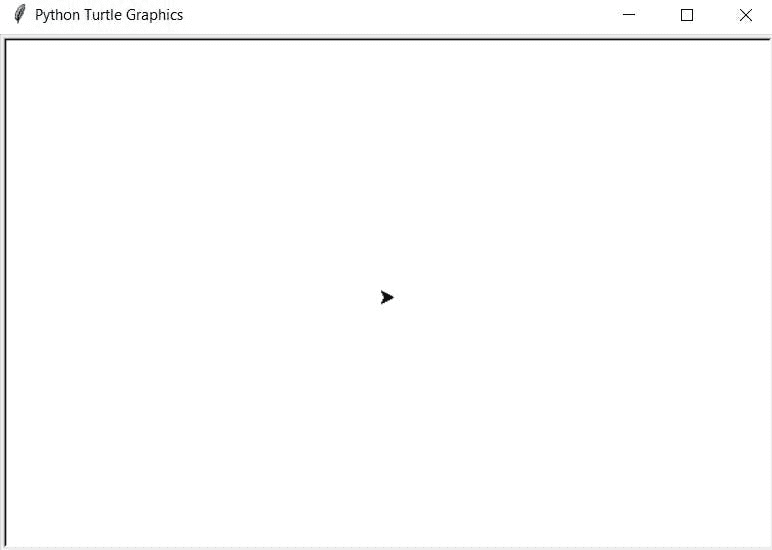
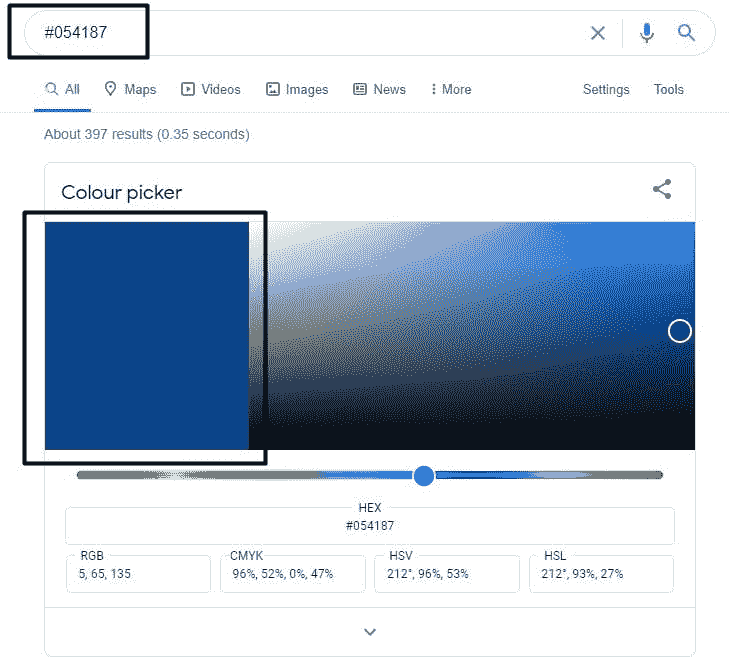
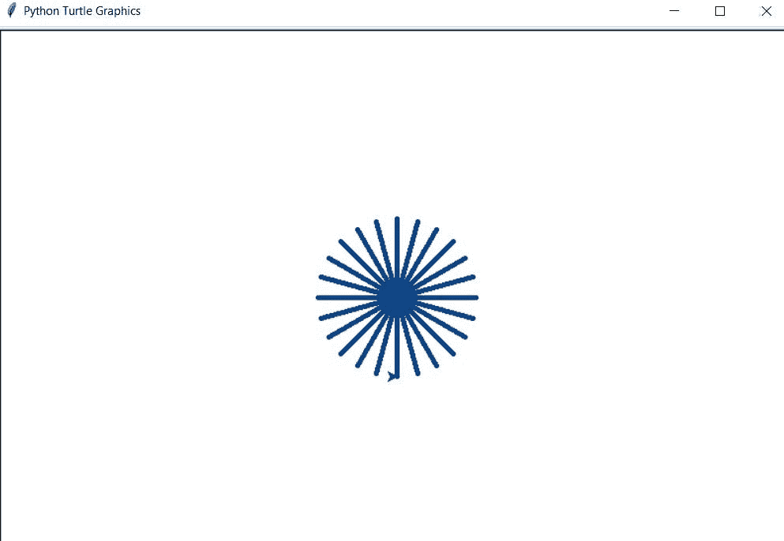
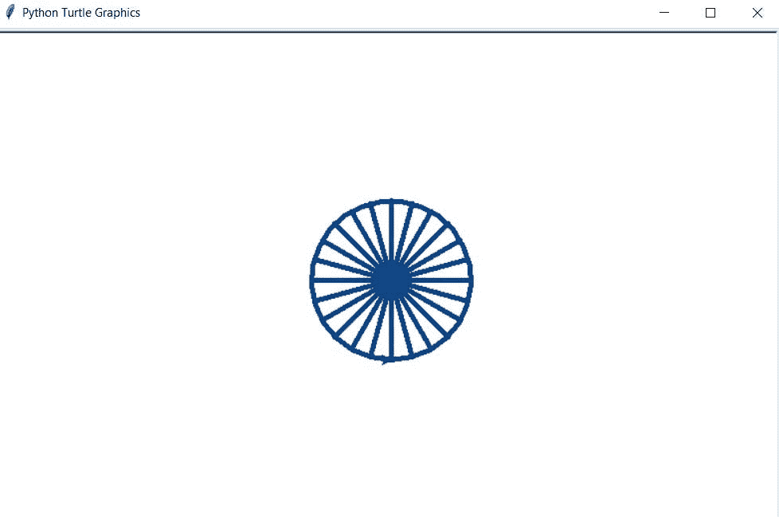
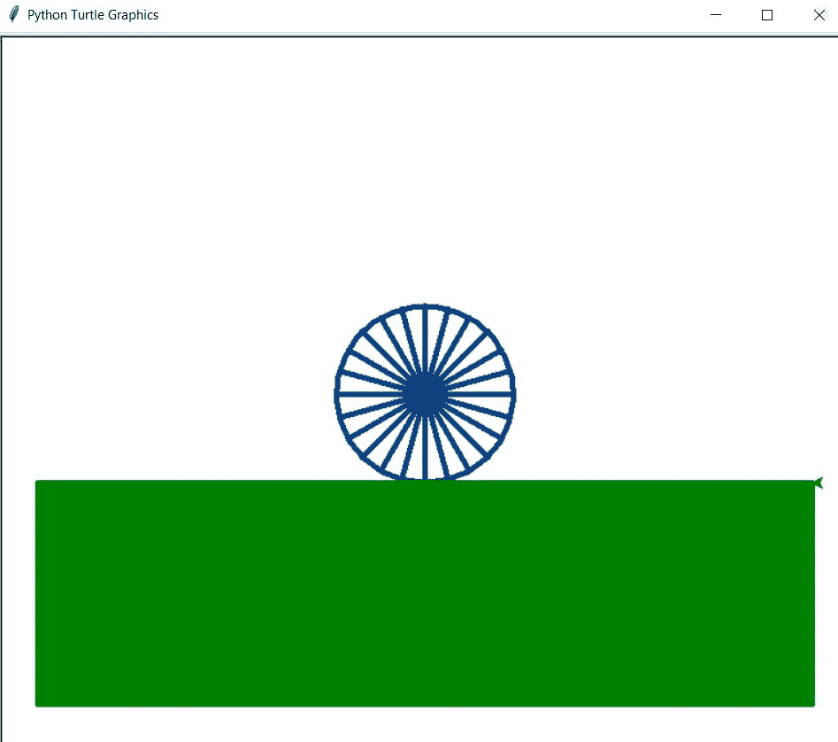
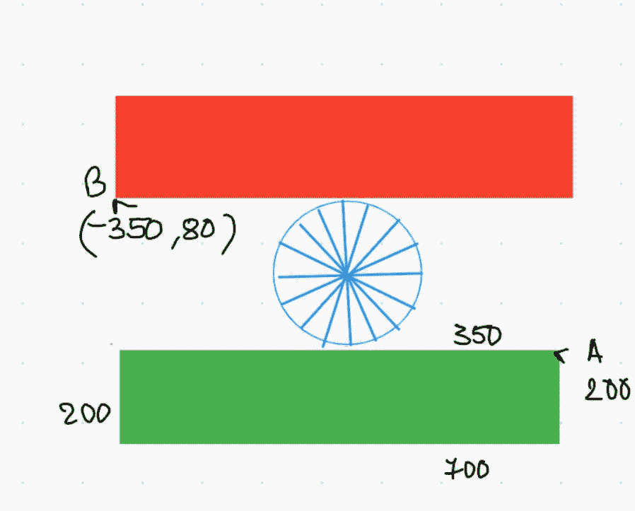
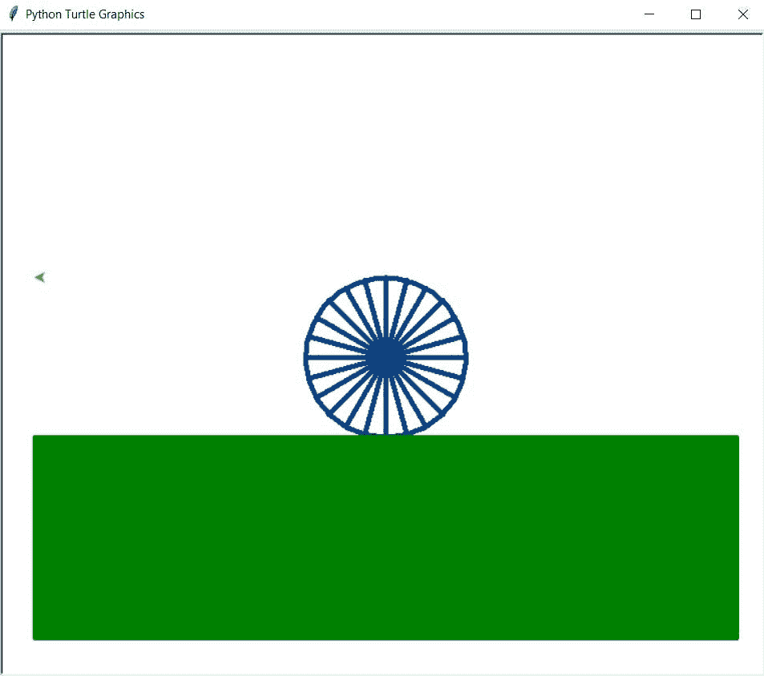
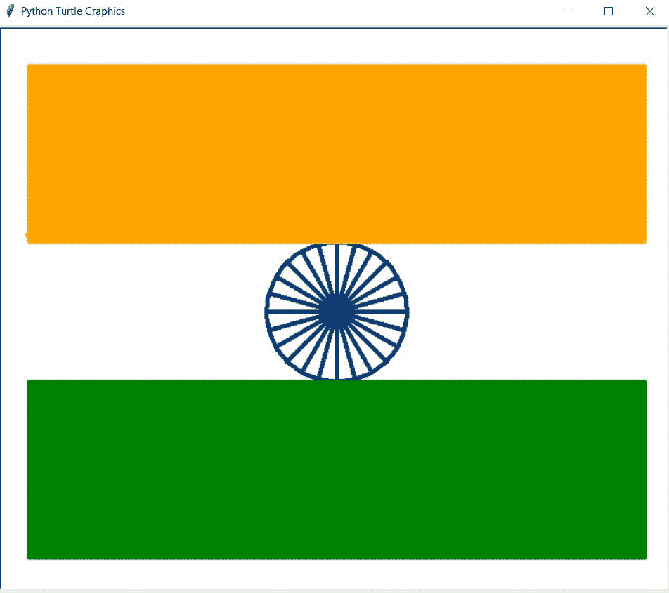

# 使用 Python 绘制印度国旗

> 原文：<https://medium.com/analytics-vidhya/draw-indian-flag-using-python-6a4f2b421014?source=collection_archive---------10----------------------->

你好，世界！今年的共和日，我尝试做一些有创意的事情，用 Python 制作了一面有乌龟的印度国旗。



在这篇博客文章中，我们将学习如何绘制印度国旗。我们将看到 Python 中的实现。

[查看 python 的终极资源库](https://github.com/ayushi7rawat/Ultimate-Python-Resource-Hub)。发现有用就掉颗星！有什么要补充的吗？开个 PR 就一样了！

你可以参考我的 YouTube 视频教程，看一个工作教程来更好的理解和一步一步的指导。

# 这个博客将会涵盖什么

```
1\. Turtle Introduction
2\. Creating an Indian Flag with Turtle
```

*我们开始吧！*

# 乌龟是什么？

`Turtle`是预装的 Python 库。它通过为用户提供一个虚拟画布，使他们能够创建图片和形状。你用来画画的屏幕笔叫做乌龟。

乌龟有三个属性:位置、方位(或方向)和笔。

# 移动龟头

乌龟可以向四个方向移动:

*   向前
*   向后的
*   左边的
*   对吧

如果你想了解更多，可以参考[海龟文档](https://docs.python.org/3/library/turtle.html)。使用此链接导航到文档。

现在你已经熟悉了*我们的议程*，并且已经掌握了*海龟模块的基本知识，*我们可以前进到*编码部分了。*

# 该编码了！

你可以在我的 [GitHub 库](https://github.com/ayushi7rawat/Youtube-Projects/tree/master/Indidan%20Flag%20with%20Turtle)找到所有代码。发现有用就掉颗星。



为了访问 python 库，您需要将其导入到您的 Python 环境中，使用下面的命令将`turtle`导入到您的 Python 脚本中。

```
import turtle
COPY
```

首先，让我们创建一个 turtle 实例。

```
flag = turtle.Turtle()
COPY
```

现在让我们定义一些属性，

*   让我们使用`speed`方法将速度设置为`3`，这意味着旗帜将不仅仅出现在屏幕上，绘图还会有一些动画。
*   如果你想改变背景颜色，你可以使用`bgcolor`方法，默认为白色。
*   你可以用`pensize`的方法调整笔的粗细，会稍微粗一点。

```
turtle.speed(3)
#turtle.bgcolor("black")
turtle.pensize(5)
```

现在让我们定义一个函数来定义运动，我称它为`draw`。

```
def draw(x, y):
    flag.penup()
    flag.goto(x, y)
    flag.pendown()
```



到目前为止一切顺利。现在，让我们画阿肖克脉轮，我们需要为它选择正确的颜色。



```
flag.color("#054187")
```

现在，让我们画出 24 个笔画，为此，我将运行循环 24 次

如果我们从中心开始，我们需要覆盖 360 度，我们有 24 个冲程，所以每个冲程是 15 度。我们从中心开始，用`forward`画一笔，用`backward`回溯到中心，然后转 15 度。我们重复同样的过程 24 次。

```
for i in range(24):
    flag.forward(80)
    flag.backward(80)
    flag.left(15)
draw(0, -80)
```



一旦完成，我们现在可以在笔画的边缘画一个圆。之前，我们前后移动了 80°，所以我们需要考虑同样的圆半径长度，即 80°。

```
flag.circle( 80, 360)
COPY
```



现在，如果你观察，我们的套头衫正指向一个笔划的底部，所以

*   让我们移动 300 或 400
*   回溯两次。
*   我们现在需要将光标移动 90 度，开始朝下。
*   接下来，我们向下移动 200。
*   因此，为了完成我们的矩形，我们需要再次向左转 90 度
*   现在我们面向左边，移动两倍的距离
*   再转 90 度
*   最后，向上移动以完成矩形。

让我们在这里指定颜色为`green`

```
flag.color("green")
```

接下来，让我们制作一个绿色矩形的轮廓。

```
flag.begin_fill()flag.forward(350)
flag.backward(700)
flag.right(90)
flag.forward(200)
flag.left(90)
flag.forward(700)
flag.left(90)
flag.forward(200)
flag.left(90)flag.end_fill()
```

为了完全填充绿色，我们在这里使用了`begin_fill`和`end_fill`的方法。让我们看看到目前为止我们得到了什么！



为了完全填充绿色，我们在这里使用了`begin_fill`和`end_fill`的方法。现在，该画最后一部分了，第二个矩形。现在，我们在 A 点有光标，在 b 点需要它。



为了完全填充绿色，我们在这里使用了`begin_fill`和`end_fill`方法。

现在，该画最后一部分了，第二个矩形。

*   让我们把颜色改成`orange`。
*   现在，我们在 A 处有光标，在 B 处需要它，让我们调用`draw`方法。

```
flag.color("orange")
draw(-350, 80)
```



让我们按照同样的程序，画一个橙色的矩形。

```
flag.begin_fill()flag.right(180)
flag.forward(700)
flag.left(90)
flag.forward(200)
flag.left(90)
flag.forward(700)
flag.left(90)
flag.forward(200)flag.end_fill()
```

它应该看起来像这样。



通过这些步骤，我们成功地用 Python 绘制了一面印度国旗。就是这样！

很简单，不是吗？希望这篇教程有所帮助。我强烈推荐你去看看 YouTube 上的视频，别忘了订阅我的频道。

您可以使用`turtle`库，甚至探索更多的特性。

你可以在我的 [GitHub 库](https://github.com/ayushi7rawat/Youtube-Projects/tree/master/Indidan%20Flag%20with%20Turtle)找到所有代码。发现有用就掉颗星。

感谢您的阅读，我很乐意通过 [Twitter](https://twitter.com/ayushi7rawat) | [LinkedIn](https://www.linkedin.com/in/ayushi7rawat/) 与您联系。

请分享您的宝贵建议，感谢您的真诚反馈！

你绝对应该看看我的其他博客:

*   [Python 3.9:你需要知道的一切](https://ayushirawat.com/python-39-all-you-need-to-know)
*   [终极 Python 资源枢纽](https://ayushirawat.com/the-ultimate-python-resource-hub)
*   [GitHub CLI 1.0:您需要知道的一切](https://ayushirawat.com/github-cli-10-all-you-need-to-know)
*   [成为更好的程序员](https://ayushirawat.com/become-a-better-programmer)
*   [如何制作自己的谷歌 Chrome 扩展](https://ayushirawat.com/how-to-make-your-own-google-chrome-extension-1)
*   [使用 Python 从任何 pdf 创建您自己的有声读物](https://ayushirawat.com/create-your-own-audiobook-from-any-pdf-with-python)
*   你很重要，你的心理健康也很重要！

# 资源:

*   [docs.python.org/3/library/turtle.html](https://docs.python.org/3/library/turtle.html)

在我的下一篇博客文章中再见，保重！！