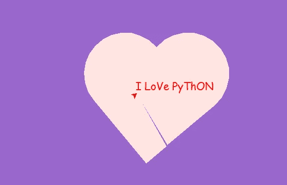

# 画心💖使用 Python🐍

> 原文：<https://medium.com/analytics-vidhya/drawing-heart-using-python-7097b70df12b?source=collection_archive---------1----------------------->

在本文中，我们将使用 python 编写几行代码来绘制心脏并在其中写入文本。为了画一颗心，我们将使用一个叫做“Turtle”的 python 库。

以下是用于绘图的功能:

1.  **乌龟:**用于创建乌龟对象
2.  **背景颜色:**用于设置背景颜色。
3.  **延迟**:设置或返回绘图延迟，单位为毫秒。绘图延迟越长，动画就越慢。
4.  **颜色**:改变乌龟笔的颜色。
5.  **begin_fill:** 记住填充多边形的起点。
6.  **end_fill** :关闭多边形，用当前填充颜色填充。
7.  **向前:**将乌龟向前移动指定的量。
8.  **左:**逆时针转动乌龟。
9.  **右:**顺时针转动乌龟。
10.  **setpos:** 将笔移动到绝对位置。
11.  **向上:**捡起乌龟的尾巴，这样它移动的时候就不会乱动了。
12.  **放下:**放下乌龟的尾巴，这样当它移动的时候就能画出来。
13.  **写:**用给定字体在当前海龟位置写文本。
14.  **退出点击:**点击鼠标关闭海龟图形窗口。

**代码:**

```
import turtle as t
pen = t.Turtle()
t.bgcolor('#9966cc')
t.delay(8)
pen.color('#ffe4e1')
pen.begin_fill()
pen.left(40)
pen.forward(120)
pen.circle(80, 190)
pen.right(100)
pen.circle(80, 180)
pen.forward(160)
pen.left(90)
pen.forward(50)
pen.setpos(-60, 100)
pen.end_fill()
def txt():
    pen.up()
    pen.setpos(-60, 100)
    pen.color('red')
    pen.write('I LoVe PyThON', font=("Comic Sans MS", 16))
txt()
pen.end_fill()
t.exitonclick()
```

**输出:**

