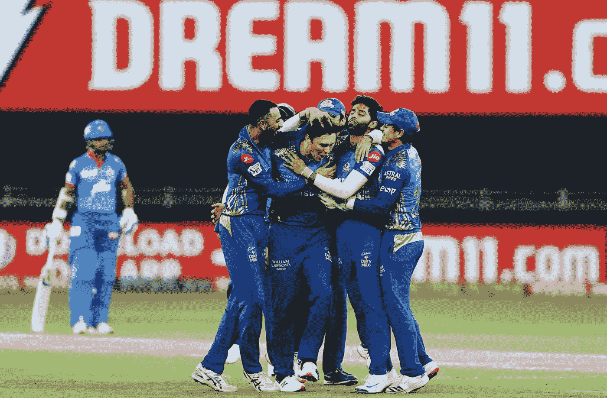

# 使用 Python 和机器学习的 Dream11 团队预测器

> 原文：<https://medium.com/analytics-vidhya/dream11-team-predictor-with-python-and-machine-learning-f0dfce1489eb?source=collection_archive---------0----------------------->

孟买印度人 vs 德里首都，Dream11 IPL 2020 决赛

始于 2008 年的印度超级联赛，由于其 3 小时的小形式，已经成为一年一度的两个月节日，从所有板球国家带来了高质量的人才，为他们提供了一个平台，与板球运动中的大牌明星进行比赛，以向印度这样的板球疯狂国家和世界展示。

近几年 IPL 的指数级上升也导致了**奇幻游戏在印度**的流行，这种变化的火炬手是 **Dream11** 。Dream11 是一个梦幻体育平台，在这里组织现金竞赛，参赛者需要在每场比赛的 22 名选手中选择 11 名选手，并获得最高分以赢得最高奖励。

**组队规则和约束**

你在 Dream11 上建立的每个板球队都必须有 11 名球员，其中最多 7 名球员**可以来自任何一个参加现实生活比赛的球队。**

您的梦想 11 可以有不同的球员组合，但必须在 100 信用上限内，并且必须符合以下团队选择标准:

梦想 11 团队构成限制

一旦你从所有可供比赛的球员中选出 11 名球员，你必须为你的球队选出队长和副队长。队长会给你他们在实际比赛中得的 **2x 分**。副队长会给你**1.5 倍的分数**他们在实际比赛中的分数。

[我](https://www.linkedin.com/in/madhav-goswami-13018b1a/)和 [Abhishek Anand](https://www.linkedin.com/in/abhishekanand374/) 在每场比赛前尝试使用机器学习来预测与 XI 比赛的最佳球队，并试图获得最大的奖励。有很多方法可以解决这个问题。

1.  我们可以使用分类器预测所有 8 个可能结果中的每个球的结果。每个球的结果可以是点球、1 分、2 分、3 分、4 分、5 分、6 分、出局、加时。(为了简单起见，将所有其他情况放在一边)。在模拟整场比赛后，我们可以结合结果，从 22 名球员中选出前 11 名。
2.  我们可以使用 ML 回归器来预测单个玩家获得的分数，基于角色和玩家在过去对抗对手团队时获得的分数，从当前 22 名玩家中选择前 11 名玩家。

前一种方法被放弃了，因为每个球有太多的状态依赖性，并且在决定两个队的击球顺序方面有许多其他假设。

继续第二种方法，第一步是收集所有 IPL 的数据。我们使用网络抓取从 espncricinfo.com 下载所有季节的数据。每场比赛的一个球一个球，比赛投掷，场地，赢家，输家，通过跑垒或三柱门的输赢数据被下载。

**数据准备**

为了[准备数据](https://github.com/abhishek374/dream11/blob/636dc8b206ed0765ec9a7ac9e006c72abdcf8136/data_prep.py)，对于每场比赛，每个球员的击球、保龄球、防守(在某种程度上)统计数据被捕获在每球数据中。击球手汇总、投球手汇总和玩家角色基于所打的球，决定并存储投球，这可以进一步用于将每个玩家获得的 11 分转化为梦想。

从 espn cricinfo 收集的样本匹配数据

Dream11 通过一个积分系统给击球手、投球手和外野手打分，你可以在这里找到。我们用它来将击球和保龄球统计数据转换成每场比赛的 11 分。

一些其他的功能也建立在主队、客场、输赢、移动平均线上。由于 COVID 19，IPL 20 主场比赛功能不相关，所有比赛的场地都被转移到阿联酋，不允许现场观众。

**培训模式**

一旦收集了数据并生成了特征，我们就进入了[训练阶段](https://github.com/abhishek374/dream11/blob/master/point_prediction.py)，在此阶段，我们首先使用玩 XIs 所得分数的移动平均值作为基线来校准我们的 ML 模型的性能。

使用的 ML 模型是随机森林、XG boost 和 Catboost。 [SHapley 加法解释](https://www.analyticsvidhya.com/blog/2019/11/shapley-value-machine-learning-interpretability-game-theory/) (Shap 值)是解读这些机器学习黑盒的一种方式。我们计算了每个特性的 Shapley 值，看看它们是否有意义:

**选择最佳 11**

一旦我们的模型给了我们每个玩家在一场比赛中获得的预测点数，我们就必须应用所有上述的**规则和选择团队的约束**来选择在 dream11 上选择的最佳团队。我们[使用线性规划](https://github.com/abhishek374/dream11/blob/master/optimized_selection.py)来放置这些约束。纸浆图书馆帮助我们实现了这一目标。11 名球员的球队选择将基于每个球员的得分/预测的梦想 11 分和每个球员的信用成本。

信用成本是众星云集的比赛的一个主要问题，例如，MI vs RCB，你想要 Rohit Sharma，Virat Kohli，AB Villiers，Y Chahal，Hardik Pandya，都花费超过 10 个信用点，但不允许你获得体面的另一半团队的信用点。

对于被选中的 11 名球员，我们的系统将选择前 2 名球员作为队长和副队长，他们将在比赛中获得 2 倍和 1.5 倍的积分。

**绩效评估**

我们应用了所有的约束条件，并根据玩家的实际梦想得分选择了最佳的 11 个，然后将其与由我们的 ML 模型预测的得分值和每个玩家的信用产生的最佳 11 个进行比较。

有两种方法，我们评估模型选择团队的表现:

1.  错误率:在限制条件下，得分与最佳得分团队之间的偏差，例如，22 名球员中有 11 名球员得分最高，11 分赢得 650 分，系统选择的团队得分为 450 分，然后出现错误。(650–450)/650 = 0.307
2.  奖励估计:基于启发式，我们可以很容易地说，赚取的点数是高度右偏的概率分布。排行榜上排名第一和第二的团队获得的积分之间的差异将大于排名 100 和 101 的团队。此外，第一组和第二组获得的奖励之间的差异将是 1Cr 和 50 lacs，参加金额为 100 的 4 Cr INR 比赛。但是排名 100 和 101 的团队将各获得 200 印度卢比。在错误率的基础上，我们定义了由我们的模型选择的 11 个玩家获得的奖励。

IPL 整个赛季获得的奖励预测

整个系统的性能是根据一个赛季的所有比赛计算的。使用 IPLs 2008 至 2018 的数据进行训练，并使用 IPL19 数据集进行测试。Catboost 看起来是所有 IPL 赛季最有希望和一致的。

我们选择 Catboost 作为预测团队的模型 1，并使用 1/2 * Catboost + 1/6*移动平均+ 1/6* XGBoost + 1/6*随机森林的集合模型模型 2 来预测最佳团队。

**IPL 20**每场比赛运行流水线

我们使用 cronjob 运行了一个脚本，在比赛开始前 15 分钟与 XI 队(每个对手有 20-25 名可用球员)进行比赛。对这些玩家运行模型以预测每个玩家将获得的分数，然后选择最佳的 11 名玩家来参加这场比赛的 dream11。Pipeline 使用 Xgboost 和 catboost 算法预测了一个 csv，并预测了今天的团队应该选择哪个球员。

预测 11 csv 从梦境中生成 11 预测器，用于选择 MI 对 DC 决赛 IPL 20 的球队

注意——我们在赛季初手动收集并存储球员成本，这些球员成本会根据每个球员的表现在赛季中发生变化。对于 2020 年 IPL 决赛，HH pandya，Ishan Kishan，Q De Kock 的球员成本都在 10 信用点以上。

**结论**

2020 赛季的 Catboost 模型给了我们积极的结果，但是数量并不显著，这给该方法带来了限制。模型的团队在超过 65%的比赛中处于有利地位，但是模型无法获得这些比赛的最佳团队(如果我们能够获得哪怕一场比赛的最佳团队，我就不会写这篇文章，而是在某个海滩上喝冷饮)。

选择队长和副队长对你的团队进入排行榜至关重要，因为他们获得的 dream11 积分会成倍增加。如果他们没有被正确选择，你的团队很少有机会取得好成绩。可以创建单独的模型来更好地预测这些。

IPL 是一年一度的赛事，两者之间有 10 个月的间隔，球员的表现和状态都在变化，还有很多我们可以考虑的其他因素，如球员在其他 T20 比赛中的表现，天气，球场条件，球员的年龄(记得看到 Dhoni 女士在双跑后第一次筋疲力尽)等。当前的方法更适合于玩家排名是单个锦标赛表现的集合的锦标赛。

[Github 回购链接](https://github.com/abhishek374/dream11)