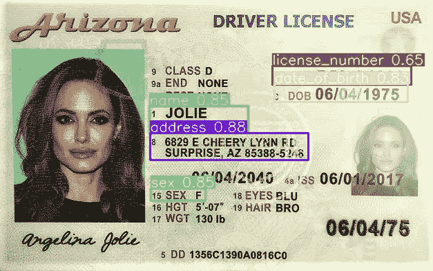
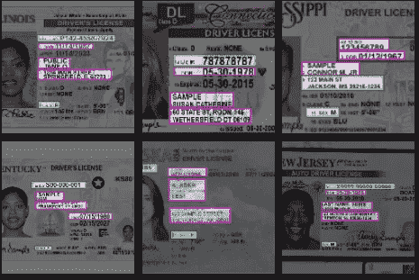
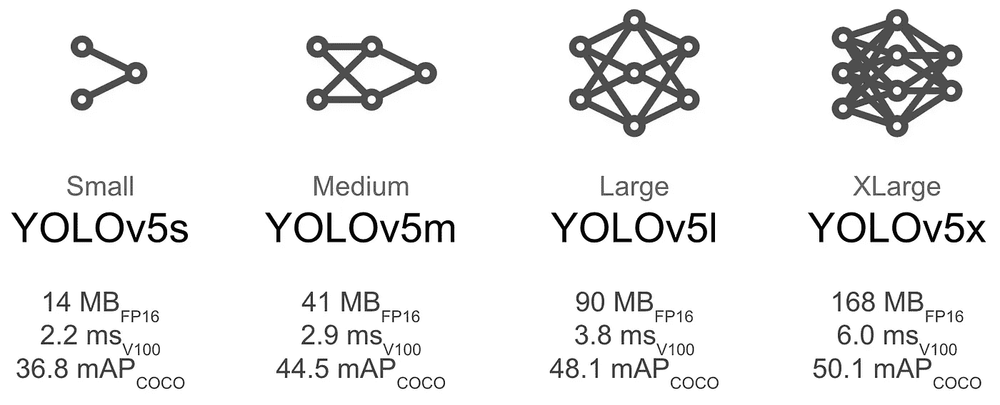
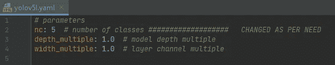
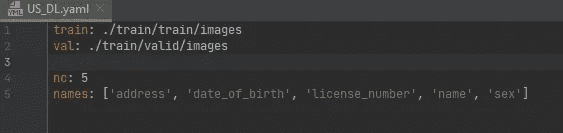
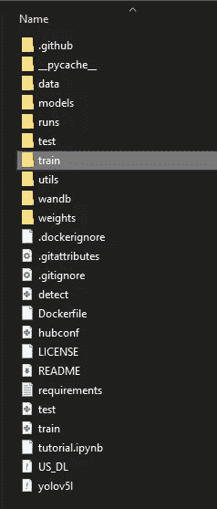
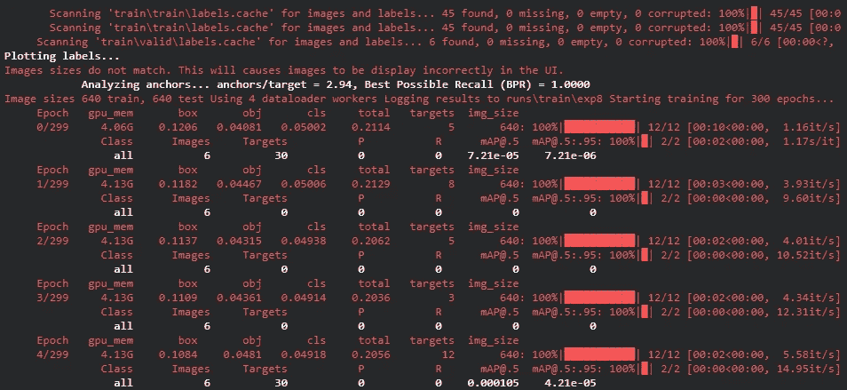
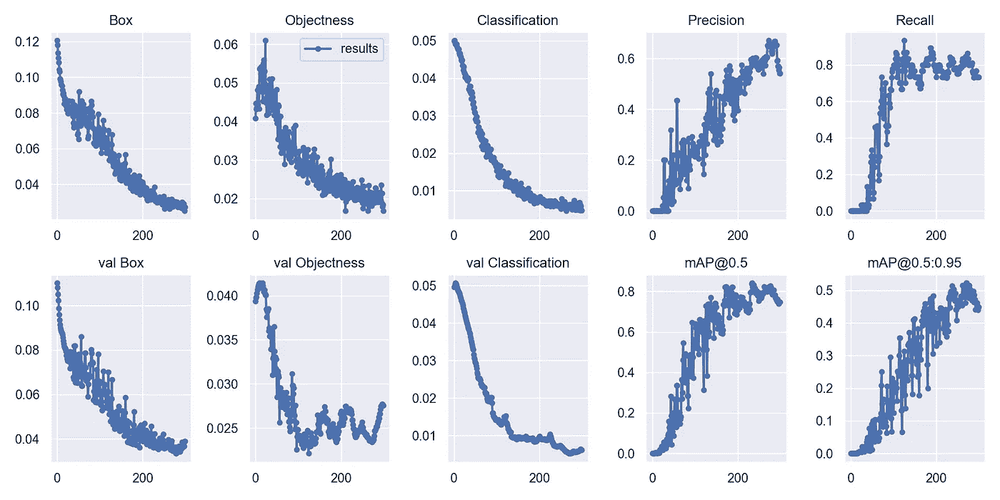
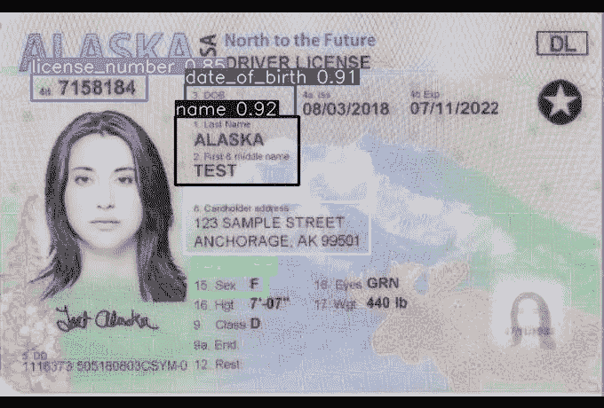
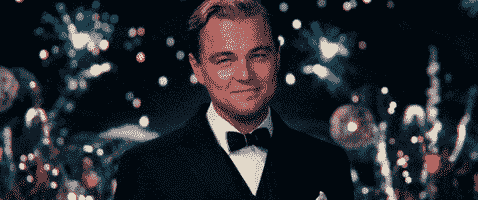

# 使用 CNN (yolov5)提取驾照数据。第一部分

> 原文：<https://medium.com/analytics-vidhya/drivers-license-data-extraction-using-cnn-yolov5-14585709f4d8?source=collection_archive---------3----------------------->



# CNN 是什么？

> 在深度学习中，卷积神经网络(CNN，或 ConvNet)是一类深度神经网络，最常用于分析视觉图像。它们也称为移位不变或空间不变人工神经网络(SIANN)，基于扫描隐藏层和平移不变特性的卷积核的共享权重架构。它们应用于图像和视频识别、推荐系统、图像分类、图像分割、医学图像分析、自然语言处理、脑机接口和金融时间序列。

在这个教程中，我将使用 YOLOv5 架构来浏览一个完整的 CNN 例子。YOLOv5 由[的格伦·乔彻](https://www.linkedin.com/in/glenn-jocher)(Utralytics 的创始人& CEO)发布。在 Github [这里](https://github.com/ultralytics/yolov5)公开发布。Glenn 介绍了基于 YOLOv5 Pytorch 的方法，是的！YOLOv5 是用 [Pytorch](https://github.com/pytorch/pytorch) 框架写的。

## **按照以下步骤获取驾照重要信息。**

# 准备好数据:

我已经从网上公开的[来源](https://www.insider.com/what-drivers-license-looks-like-in-every-state)收集了数据，这是我们申请美国驾照的案例。我已经将所有的图片编辑到一个文件夹中，并为数据预处理部分做好了准备。

收集的数据必须用我们希望从驾驶执照中检测的所有区域的边界框进行注释/标记，例如*姓名、地址、DL 编号、性别和出生日期*。因此，我们用感兴趣的检测对所有图像进行标记。每个图像的标签数量构成总类别，在这种情况下是`'5'`。

# 数据预处理:

我已经使用 [Roboflow](https://roboflow.com) 进行标记，我们也可以使用 [LabelImg](https://github.com/tzutalin/labelImg) 进行同样的操作。



许可证的标签

我的数据集很小，包括所有 50 个州的驾照。数据集很小，因为获得真正的许可证是不可行的。

# 选择 CNN 进行迁移学习:😵

我们可以使用最先进的模型来完成各种深度学习任务，只是受限于个人偏好和用例。你可以在这里查看 PyTorch 提供的车型:【https://pytorch.org/vision/0.8/models.html 

物体检测问题我个人喜欢`YOLO`。随着 [YOLO](https://github.com/ultralytics/yolov5) 架构的发展，可能性是无限的。

> 预训练的检查点用于训练自定义数据集的架构。这叫做**迁移学习**。迁移学习是机器学习中的一个研究问题，它专注于存储在解决一个问题时获得的知识，并将其应用于不同但相关的问题。例如，在学习识别汽车时获得的知识可以应用于识别卡车。

选择一个预训练模型/重量开始训练。这里我们选择 [YOLOv5l](https://github.com/ultralytics/yolov5/blob/master/models/yolov5l.yaml) 。我们选择了一个更大的模型来获得更好的精度分数。



# 设置环境:

您可以简单地克隆 yolov5 项目:

```
$ git clone https://github.com/ultralytics/yolov5  # clone repo$ cd yolov5$ pip install -r requirements.txt  # install dependencies
```

> 注意:如果你有一个 GPU，你可以按照[这些](https://pytorch.org/get-started/locally/)步骤来设置 pytorch CUDA 启用，然后，按照上述步骤。

下载任何权重后，我们都要在神经网络`.YAML` [文件](https://github.com/ultralytics/yolov5/blob/master/models/yolov5l.yaml)中编辑多个相同权重的类。例如，我们已经下载了 yolov5l weights，所以我们必须将类的数量从默认的(80)编辑到我们的用例(5)中，即*姓名、地址、DL 编号、性别和出生日期。*



按需上课。

当我们从 Roboflow 下载数据集并将其提取到 yolov5 文件夹中时，我们得到了另一个`.YAML`文件，该文件包含 train + test 数据的位置，并带有我们给它的类名。



数据集。yolov5 格式的 yaml 文件

**文件夹结构**应该是这样的:



> 注意:不要忘记从 Roboflow webapp 中提取 yolo 格式的数据集。

# 训练数据💜

在**我们的数据集**、批量大小、图像大小以及任一预训练`--weights yolov5l.pt`上训练一个 YOLOv5l 模型(推荐)。预训练重量从[最新的 YOLOv5 版本](https://github.com/ultralytics/yolov5/releases)中自动下载。

我们必须编写以下带有指定参数的命令来开始训练过程。为了更好地理解所有的参数或者添加新的参数，你必须参考根目录中的`train.py`文件。

```
# Train YOLOv5l on DL for 300 epochs$ python train.py --img 640 --batch 4 --epochs 300 --data US_DL.yaml --cfg yolov5l.yaml --weights yolov5l.pt
```

为了在网络上获得更好的洞察力和训练的实时反馈，你可以使用这个命令`$ pip install wandb`安装 weights & bias([wandb . ai](https://wandb.ai/)



训练从 300 个纪元开始

完整的 wandbai 日志可以在这里找到:[*https://wandb . ai/thinkers loop/yolov 5/runs/2 ahw 81wk/overview？workspace = user-thinkers loop*](https://wandb.ai/thinkersloop/YOLOv5/runs/2ahw81wk/overview?workspace=user-thinkersloop)

## 结果:



结果经过 300 个时代的训练。

# 随机数据测试:

训练最好的模型可以在 **runs\train\exp** 文件夹中找到。

现在，让我们来测试一下。`detect.py`根据各种来源进行推理。

```
$ python detect.py --weights runs/train/exp/weights/best.pt --img 640 --conf 0.5 --source test/images
```

生成的图像存储在 **runs\detect\exp** 文件夹。

```
(YOLO-v5) C:\Users\luckie\Projects\Dream\DL data extract\YOLO-v5\yolov5>python detect.py --weights runs/train/exp/weights/best.pt --img 640 --conf 0.5 --source test/images
Namespace(agnostic_nms=False, augment=False, classes=None, conf_thres=0.5, device='', exist_ok=False, img_size=640, iou_thres=0.45, name='exp', project='runs/detect', save_conf=False, save_txt=False, source='test/images', update=False, view_img=False, weights=['runs/t
rain/exp/weights/best.pt'])
YOLOv5  torch 1.7.1+cu101 CUDA:0 (GeForce RTX 2070 SUPER, 8192.0MB)Fusing layers...
Model Summary: 392 layers, 46622106 parameters, 0 gradients, 114.2 GFLOPSimage 1/2 C:\Users\luckie\Projects\Dream\DL data extract\YOLO-v5\yolov5\test\images\test1.jpg: 416x640 1 addresss, 1 date_of_births, 1 license_numbers, 1 names, 1 sexs, Done. (0.050s)image 2/2 C:\Users\luckie\Projects\Dream\DL data extract\YOLO-v5\yolov5\test\images\Alabama-s_jpg.rf.fa47b8af18b6c8263fa5f4c9b7ae760f.jpg: 448x640 1 addresss, 1 date_of_births, 1 license_numbers, 1 names, 1 sexs, Done. (0.048s)Results saved to runs\detect\exp
Done. (0.136s)
```



C 祝贺您成功完成上述步骤。干杯！



**我的代码的完整版本可以在这里找到:**

[](https://github.com/lucky-verma/US-Driver-License-data-extraction/tree/master/YOLO-v5) [## 美国驾驶执照数据提取/YOLO V5 在 master lucky-Verma/美国驾驶执照数据提取

### 这个 Pytorch 实现了从驾驶执照中提取数据，提取所有的分类细节。…

github.com](https://github.com/lucky-verma/US-Driver-License-data-extraction/tree/master/YOLO-v5) 

您可以通过 LinkedIn 联系我:

[](https://www.linkedin.com/in/lucky-verma/) [## 幸运的维尔马-研究生研究助理-马里兰大学巴尔的摩县| LinkedIn

### 熟练的 Python 开发人员，具有在信息技术和研究行业工作的经验…

www.linkedin.com](https://www.linkedin.com/in/lucky-verma/) 

谢谢大家！😀

[](https://www.buymeacoffee.com/luckyverma)