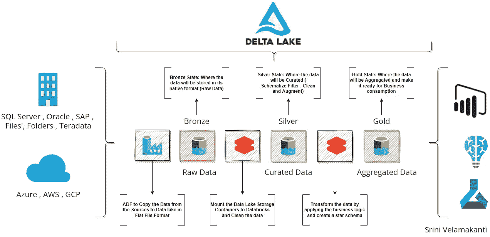
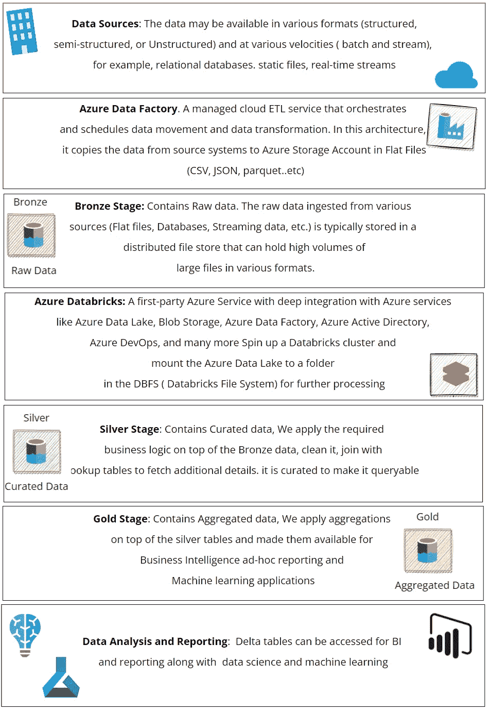
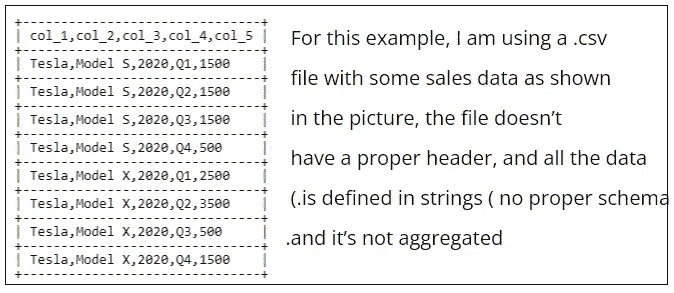
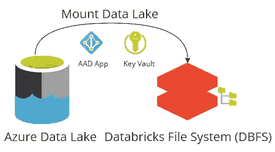
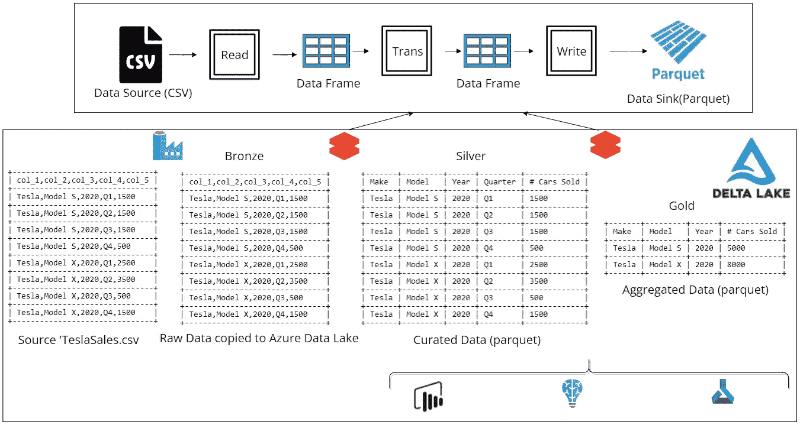
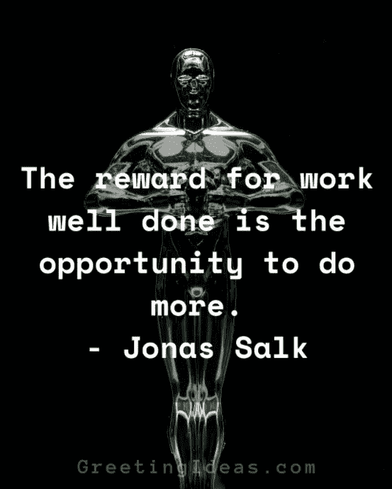

# 沉默的蓝色数据砖三角洲湖建筑

> 原文：<https://medium.com/analytics-vidhya/dumb-down-azure-databricks-delta-lake-architecture-95ef03bbd69?source=collection_archive---------3----------------------->

在这个现代数据世界中，数据的重要性呈指数级增长，组织在新技术上花费了大量的时间和金钱，使公司能够快速处理和理解数据。

随着数据量的增加，数据处理*(ETL-Extract Transform and Load 或 ELT-Extract Load and Transform)*和分析(*数据分析、数据科学和机器学习*)变得越来越耗时，公司正在超越传统的数据架构来满足他们的按需分析需求。

Delta Lake 就是这样一个解决方案，它提供了对传统数据架构的巨大改进。它是一个开源存储层，提供 ACID 事务和元数据处理。它还统一了批处理数据和流数据，用于构建近实时分析。

以下是三角洲湖的几个主要优势

轻松处理大量数据(兆兆字节甚至千兆字节)
使用 **ACID** (原子性、一致性、隔离性、持久性)事务进行统一的批处理和流处理
Delta 允许数据写入者非常轻松地执行删除、更新和更新，而不会干扰读取数据集的计划作业
Delta 记录自创建以来在 delta lake 表上执行的每个操作。这使用户能够查询数据的旧快照(时间旅行或数据版本控制)
。增量实施模式并防止错误写入。
支持多种编程语言和 API
Delta Lake 是经济高效、高度可扩展的 lakehouse 的基础

因此，让我们进入架构，详细查看架构的每个阶段(*从左到右*)

Azure Databricks 三角洲湖建筑

三角洲湖建筑的组成部分

现在让我们来看一个样本数据文件，看看数据在架构的每个阶段是如何转换的。

我们将使用这个 CSV 文件，看看数据如何从原始状态(青铜色)→策划状态(银色)→更有意义的状态(金色)。

Azure 数据工厂管道来复制。“csv”文件从本地文件系统到 Azure 数据湖存储(青铜级)
将 Azure 数据湖装载到 Databricks 文件系统(DBFS)

Azure 数据块来读取。来自 Bronze 的 CSV 文件，应用
转换，然后将其写入 delta lake 表(Silver)
从 Silver 中读取 Delta Lake 表并应用聚合，然后将其写入 Delta Lake 表(Gold)
现在，用户可以连接到 Silver 或 Gold 表进行数据分析(BI 报告或机器学习)

我希望你喜欢读这篇文章，将在我的下一篇文章中看到**三角洲湖的行动**，直到那时，有一个快乐的感恩节，并享受假期。

