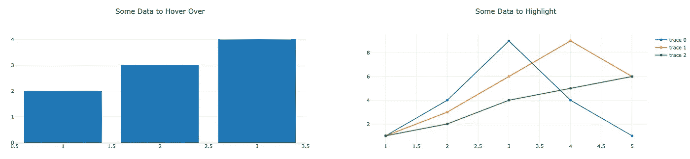

# 用 Plotly.js 事件实现 Angular 中的动态数据可视化

> 原文：<https://medium.com/analytics-vidhya/dynamic-data-visualization-in-angular-with-plotly-js-events-22b524e2e097?source=collection_archive---------3----------------------->

向数据可视化添加交互性有助于更好地理解数据。我最喜欢的交互之一是使用悬停事件来突出显示另一个图中的数据。 [Plotly.js](https://plotly.com/javascript/) 提供了使这种交互成为可能的事件，并且它们的 [Angular 库](https://github.com/plotly/angular-plotly.js)使得添加到你的下一个单页应用程序变得容易。

我们的目标:

将鼠标悬停在图表 1 上以突出显示图表 2

如果你愿意，可以直接跳到 [GitHub 回购](https://github.com/matteson/dynamic-plotly-visualization)。

## 入门指南

如果你已经熟悉了 Angular 中的 Plotly，你可以跳到下一节。第一步，像往常一样，启动一个 Angular 项目并获取一些依赖项。

```
>> ng new
>> npm install --save angular-plotly.js plotly.js
```

然后，我们配置模块并将其添加到`app.module.ts.`

```
import { CommonModule } from '@angular/common';
import * as PlotlyJS from 'plotly.js/dist/plotly.js';
import { PlotlyModule } from 'angular-plotly.js';// We have to supply the plotly.js module to the Angular
// library.
PlotlyModule.*plotlyjs* = PlotlyJS;

import { AppComponent } from './app.component';

@NgModule({
  ...
  imports: [
    BrowserModule,
    CommonModule,
    PlotlyModule,
    ...
  ],
  ...
})
export class AppModule { }
```

这足以让我们使用`angular-plotly`进行基本的绘图。Plotly 支持开箱即用的大量图表[。](https://plotly.com/javascript/#basic-charts)各种图表有大量的文档，但出于演示目的，我们将设置一个简单的条形图和折线图。

```
...
export class AppComponent {
  title = 'dynamic-plots'; // Bar Chart
  graph1 = {
    data: [
      { x: [1, 2, 3], y: [2, 3, 4], type: 'bar' },
    ],
    layout: {title: 'Some Data to Hover Over'}
  }; // Line chart
  graph2 = {
    data: [
      { x: [1, 2, 3, 4, 5], y: [1, 4, 9, 4, 1], type: 'scatter' },
      { x: [1, 2, 3, 4, 5], y: [1, 3, 6, 9, 6], type: 'scatter' },
      { x: [1, 2, 3, 4, 5], y: [1, 2, 4, 5, 6], type: 'scatter' },
    ],
    layout: {title: 'Some Data to Highlight'}
  };
}
```

我们将一些基本数据作为属性`graph1`和`graph2`放入应用程序组件。为了渲染，我们需要像这样将数据和布局绑定到 plotly 组件。

```
<plotly-plot
  [data]="graph1.data"
  [layout]="graph1.layout"
  [useResizeHandler]="true"></plotly-plot>

<plotly-plot
  [data]="graph2.data"
  [layout]="graph2.layout"
  [useResizeHandler]="true"></plotly-plot> 
```

如果一切都连接正确，应用程序将在加载时呈现两个图。



基本情节——我们将在下一节制作动画。

## 用 plotly 事件和 RXJS 制作动画

我们的目标是当用户将鼠标悬停在条形图上时，动画显示折线图。作为一个简单的动画，当用户悬停在第 n 个条形上时，我们将只使用第 n 条线重新绘制折线图。当用户不悬停时，我们将显示所有的线。

从根本上说，我们需要折线图来订阅绘图数据流。这是[RXJS](https://www.learnrxjs.io/learn-rxjs/subjects/behaviorsubject)T4 的一大用处。在 RXJS 中，主体既是可观察的，也是事件的发出者。在我们的应用程序中，绘图必须观察数据流，我们需要发出数据流来响应悬停事件。我们使用`BehaviorSubject`是因为它允许我们设置初始值。

应用程序组件:

```
...
export class AppComponent {...// Initialize a behavior subject to return the line chart data
interactivePlotSubject$: Subject<any> = new BehaviorSubject<any>(this.graph2.data);// We'll bind the hover event from plotly
hover(event: any): void {
  // The hover event has a lot of information about cursor location.
  // The bar the user is hovering over is in "pointIndex" this.interactivePlotSubject$.next(
    [this.graph2.data[event.points[0]].pointIndex]]
  );
}// Reset to default when hovering stops
mouseLeave(event): void {
  this.interactivePlotSubject$.next(this.graph2.data);
}
```

plotly Angular 库导出完整的 plotly 事件集。我们对其中的两个`(hover)`和`(mouseleave)`感兴趣。我们修改前面的模板来绑定我们的方法:

```
 <plotly-plot
       [data]="graph1.data"
       [layout]="graph1.layout"
       [useResizeHandler]="true"
       (hover)="hover(***$event***)"
       (mouseleave)="mouseLeave(***$event***)"></plotly-plot>

    <plotly-plot
       [data]="(interactivePlotSubject$ | async)"
       [layout]="graph2.layout"
       [useResizeHandler]="true"></plotly-plot>
```

这就是 hover 工作的全部内容:

将鼠标悬停在图表 1 上以突出显示图表 2

## 结论

在我的许多数据可视化工作中，我使用悬停事件来绑定多个图。Plotly 公开了大量的事件类型，这些事件类型支持丰富的数据可视化体验。将它们集成到仪表板中是 UX 的一大胜利。


一场伟大的比赛