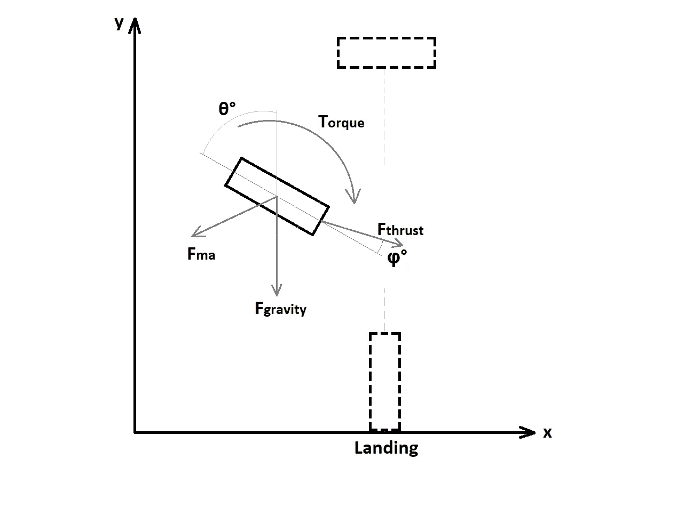
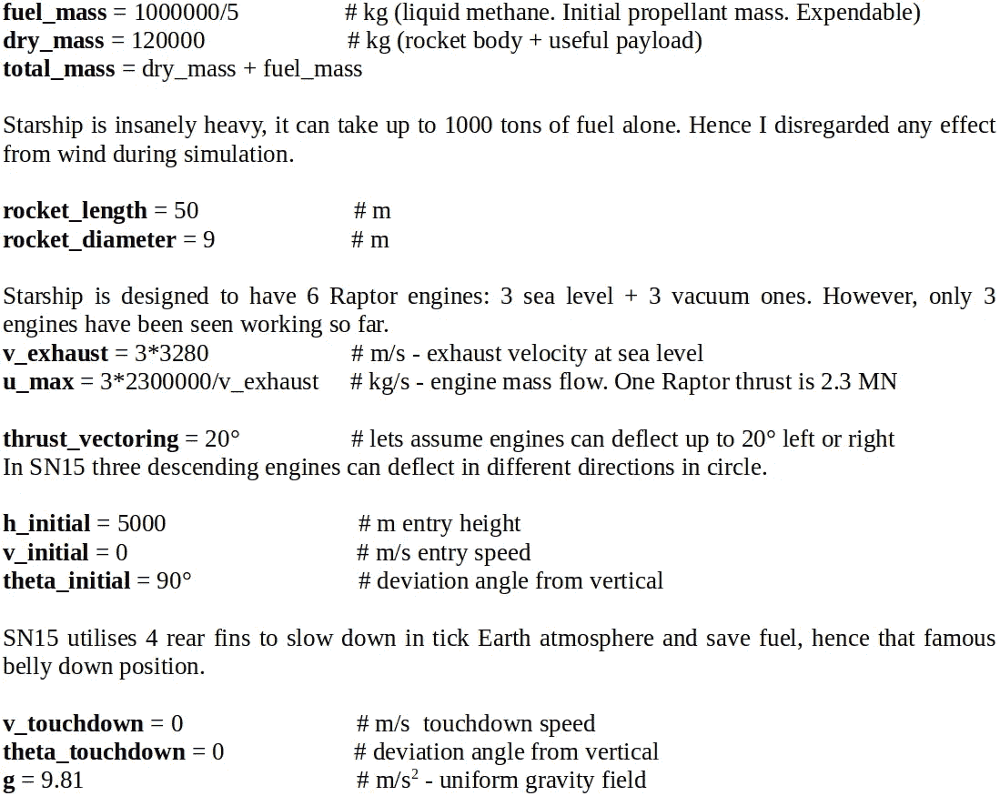
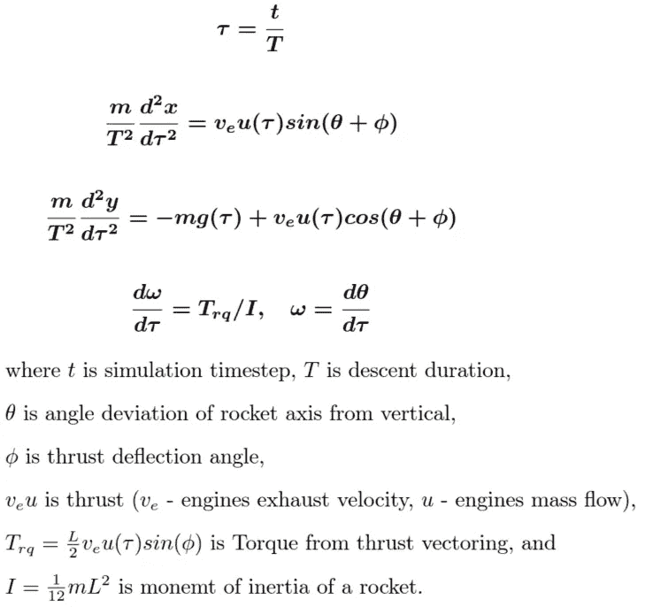
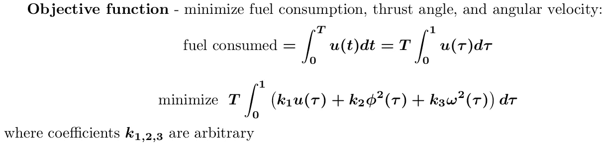
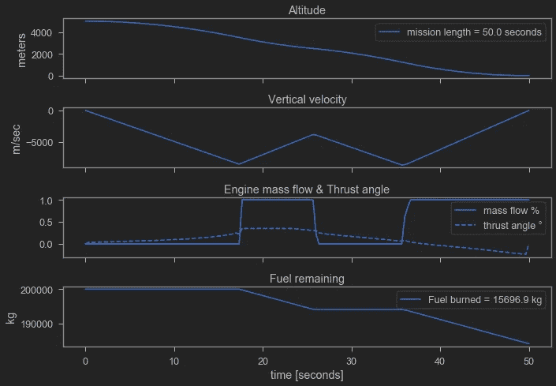

# Python 中的动态优化:火箭软着陆

> 原文：<https://medium.com/analytics-vidhya/dynamic-optimization-in-python-rocket-soft-landing-a5a68eaf3b94?source=collection_archive---------1----------------------->

在[的](/analytics-vidhya/optimization-modelling-in-python-metaheuristics-with-constraints-c22b08c487e8)[系列](/analytics-vidhya/optimization-modelling-in-python-multiple-objectives-760b9f1f26ee)之前的 [文章](/analytics-vidhya/optimization-modelling-in-python-scipy-pulp-and-pyomo-d392376109f4)中，我描述了几个优化问题以及解决它们的不同方法。所有这些问题都有一个共同点——它们是静态的。这意味着被研究的系统及其变量不随时间变化。然而，大多数有趣和相关的现实世界经济问题总是有时间维度。运筹学有解决这类问题的工具包吗？

**动态优化**——是一种处理“多阶段”问题的优化类型，这些问题的变量会随着状态或时间的变化而变化。这种问题通常由**状态变量 x(t)** 来表征，这些状态变量确定系统在时间 **t** 的状态。通常这些状态满足马尔可夫性质，即 **x(t+1)** 受 **x(t)** 的值影响。

动态优化问题也有所谓的**控制或动作变量 u(t)** 。这些变量决定系统在每一步 **t** 的动态，从而影响 **t+1** 的状态值。

这类系统的时间演化通常由**状态方程**来支配，而状态方程是 ***预先知道的*** (强化学习改为学习它们)。这些方程有时被称为运动方程或过渡方程，通常是描述系统物理性质的微分方程。

最后，我们有**目标函数**——在计划时间范围内某个成本函数的总和或积分。

解决这类问题有几种方法，例如**最优控制理论**或**动态规划**。然而，这里我们将简单地尝试使用现代优化包同时求解每个时间步的所有状态方程。

让我们将动态优化应用于一些现实世界的问题，例如火箭软着陆。作为一个例子，让我们试着模拟最近成功的**星际飞船 SN15** 着陆。也就是说，我将尝试优化重物从某个高度(比如说海拔 5 公里)下降并在所需点软着陆的 2D 轨迹，并服从相关的物理力(重力拉力、火箭发动机推力、风等)。

作用在火箭上的主要力

# 模型参数

# 状态方程

现在让我们描述系统的动力学。在我们简化的 2D 案例中，动力学由以下牛顿方程描述(忽略风阻或侧风效应):

我们现在任务是将这个动态系统公式化为最优化问题，产生'最优'或至少物理上合理下降轨迹。在深入实施细节之前，重要的是要理解控制火箭在空间中运动的两个主要建模组件— **状态变量**和**控制参数**。

在每个时间步长，系统的状态由一组有限的变量描述:位置(x，y)，速度，与垂直位置的角度偏差，角速度。我们无法控制这些(除了从边界值)，优化模型应该给我们每个时间步的系统状态。

控制参数是——推力值和推力偏转角。模型将使用控制参数、运动方程和边界值来寻找状态值。

# 履行

我们将使用 python 优化模块 **Pyomo** 和非线性解算器 **Ipopt** 。Pyomo 是一个优秀的开源软件包，可用于制定非常多样化的优化问题集，或用于一般的数值微分/积分。

使用 pyomo 离散化这样的动态系统非常简单，感觉非常自然。在声明变量之后，上面描述的所有运动微分方程都可以写成每个时间步长的独立约束。从而确保系统在每一步都服从运动动力学。

目标或成本函数可能是问题最重要的部分。理想情况下，我们需要同时优化几个属性:燃料消耗、发动机偏转角、火箭角速度等。然而，多目标优化是非常困难的，并且总是给你几个可能的解决方案。因此，我不确定这种方法是否用于实际的星际飞船着陆模拟。为了简单起见，我将这三个目标合并成一个任意权重的目标，可以手动调整。

取决于系数 k1、k2、k3 的值，下降轨迹看起来可能非常不同:)。生成最优着陆轨迹和着陆动画的代码是[这里是](https://github.com/Igor-Shvab/Rocket_soft_landing/blob/main/pyomo_rocket_soft_landing.ipynb)。

# 结果

下面的图表显示了火箭高度的变化，垂直速度，推力的使用等，在一些特定的系统配置。从 5 公里高度开始，在着陆点左侧 600 米，零初始下降速度(v_x = 0)，非常强的左侧冲力(v_y = 500 米/秒)。你可以改变这些初始坐标或目标函数，看看火箭如何表现。

显然这个解决方案是不实际的，因为下降速度太快了。真实的火箭着陆场景很可能有一套可行的预先计算的轨道，但最重要的是，真实的着陆是使用**模型预测控制**技术模拟的。在每一个时间步，系统接收关于其实际和预测空间位置的**状态反馈**，然后如果偏差过大，自动修正自身(使用推进器和驱动鳍)。

最后，这里是视频。