# 电子商务数据:探索性数据分析(EDA)

> 原文：<https://medium.com/analytics-vidhya/e-commerce-data-exploratory-data-analysis-eda-99b17cf53765?source=collection_archive---------4----------------------->

在本文中，我将使用电子商务数据来进行 EDA 数据分析的第一步，也是最重要的一步，因此我们将从我的经验和研究中获得的角度来看这个数据结构。

电子商务-(来自 Mobil13.com)

# **首先，什么是 EDA？**

EDA 或探索性数据分析是数据分析的初步步骤，旨在总结数据的主要特征，更好地理解数据，揭示变量之间的关系，并看到数据中的重要变量。

简而言之，查看数据并尝试从中提取尽可能多的意义是一种很好的做法。

# 电子商务数据

为了分享我对我所知道的概念和技术的看法，我使用了 UCI 机器学习库中以“在线零售”为标题的位于英国的国际数据集，其中包括 2010 年 1 月 12 日至 2011 年 9 月 12 日之间发生的所有交易。我直接从 Kaggle 访问了这个数据集。您也可以访问下面的链接:

 [## 电子商务数据

### 英国零售商的实际交易

www.kaggle.com](https://www.kaggle.com/carrie1/ecommerce-data) 

# EDA 的步骤

1.  描述统计学
2.  缺少值
3.  分组数据
4.  离群点检测
5.  相关

导入 Pandas、NumPy 和可视化所需的所有库(Seaborn、Matplotlib、Missingno 等。)从 Python 库中，我们可以导入数据。

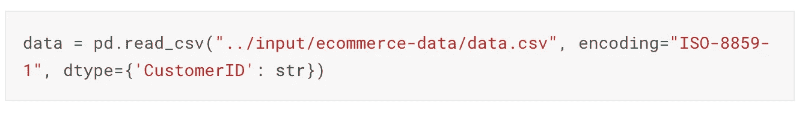

数据导入

当我们用不同的(重音符号等)导入 CSV 格式的数据时。)Python 中的字符我们应该使用编码。这就是为什么 encode 被用来将字符串转换成字节串，以便能够在程序中传递非 ASCII 数据。

> “当您通过 internet/网络传输数据时，信息是作为原始字节传输的。非 ascii 字符不能用一个字节来表示，所以我们需要一种特殊的表示方式(比如“ISO-8859–1”)。

## **描述性统计**

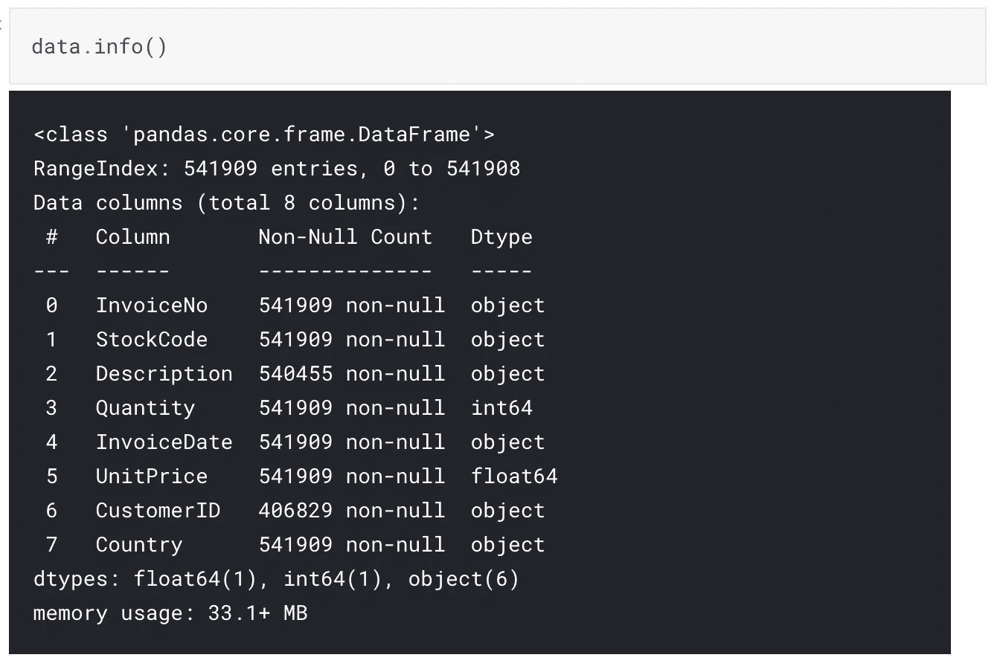

使用 data.info()查看数据内容

首先，我想用 info()查看数据的内容。

数据中有 541909 个条目和 8 列。并且这些特征中的大多数是分类变量类型。由于 CustomerID 是以数字形式给出的，因此它将被转换为“int64”。InvoiceDate 将被转换为日期时间。

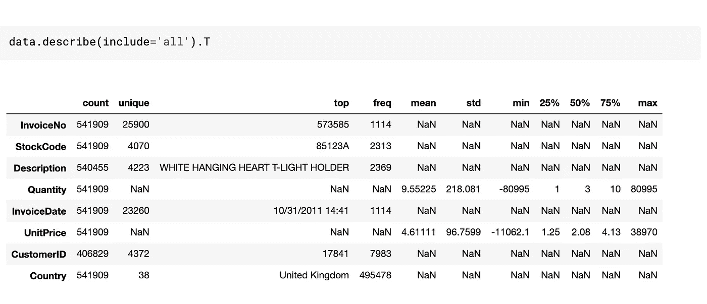

使用 data.describe()查看描述性统计数据

我们可以从 count 列中看到每个特性是否有大量的缺失值。正如我们所看到的，有些特性缺少值。查看唯一值，它将显示为熊猫的 NaN 描述的分类值。

我们看到在量上有一个负值作为 min，后面，我们再分析。

## 丢失值的处理

我们可以使用可视化来查看丢失的值，但是可视化不足以看到全局。可能会有看不到的遗漏变量，这些也需要考察。在可视化缺失数据后，我们需要做的第一件事是对缺失数据进行分类。对缺失变量进行分类将是处理它们的指南。

> 缺失数据分为完全随机缺失(MCAR)、随机缺失(MAR)和非随机缺失(MNAR)。

换句话说，缺失变量可能是随机形成的，不依赖于任何其他变量的值，或者是半随机的，依赖于一些或主要依赖于其他变量。

在这里，我们可以使用 missingno 库，或者我们可以将每列数据可视化为箱线图，以发现异常值，或者我们也可以使用热图，通过突出显示缺失数据来可视化我们的数据。此外，有许多方法来处理缺失值，我们使用的技术取决于我们的数据集和上下文。

这里我用 msno.bar 做了一个可视化

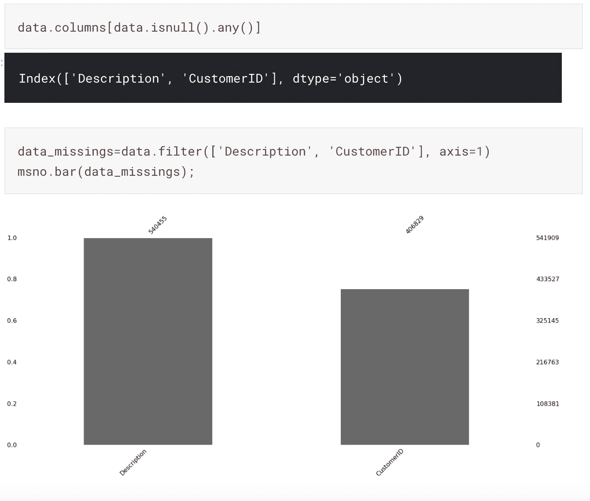

缺失变量的可视化

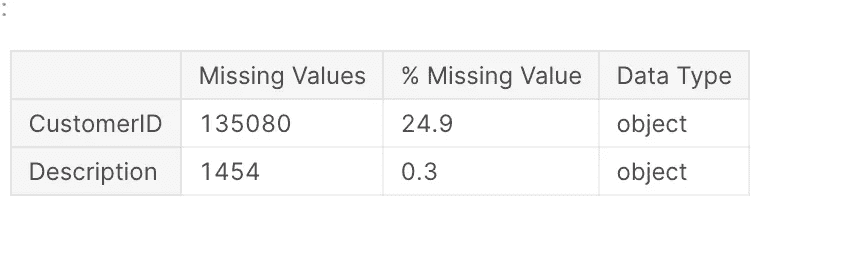

缺失变量的分布

24.9 %的客户是未知的。此外，我们还有 0.3 %的遗漏描述。我们需要获得关于那件事的进一步信息。

除了描述中缺失的数据，我们还会查看客户 id 中是否有缺失的数据。

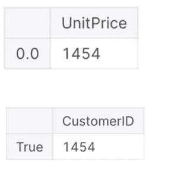

产品描述中缺失数据的数量出现在两个变量中

在缺少产品描述的情况下，客户和单价总是会丢失。

处理这些似乎是不可能的，所以把它从数据中去掉更有意义。

现在让我们看看我们是否隐藏了 nan 值？

我们没有找到 NaN 值，而是找到了隐藏的缺失值(显示字符串“missing”和“？”).我们把他们变成了 NaN。我们丢弃了这些数据，因为我们不知道为什么描述丢失了(客户 id 也丢失了)。

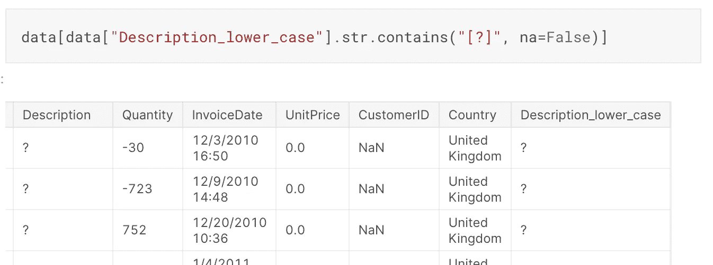

隐藏描述中缺少的值

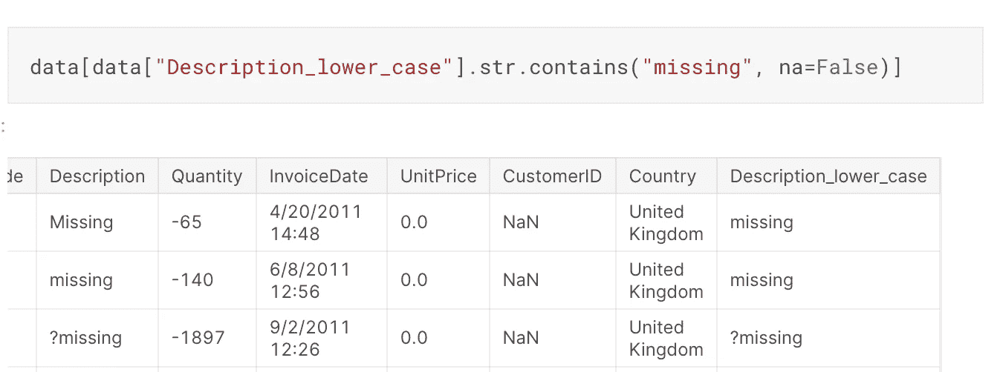

隐藏描述中缺少的值

## **分组数据**

使用“分组”方法，我们可以将数据分成不同的类别。通过根据一个或多个变量对数据进行分组，我们可以对单个组进行分析。

除了我所加的例子，还可以利用我们的创造力和电子商务知识进一步成倍增加和发展。甚至可以进行有趣的观察。

我们继续吧！

在将名为 InovoiceDate 的列转换为日期时间格式后，我们创建了年、月和日格式的新列，以便我们可以在分组时使用这些列。

您可以在下图中看到分组示例和可视化效果。

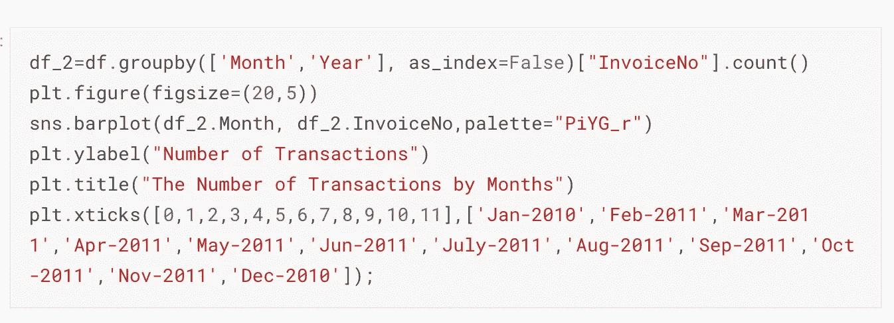

按年份和月份分组统计发票编号

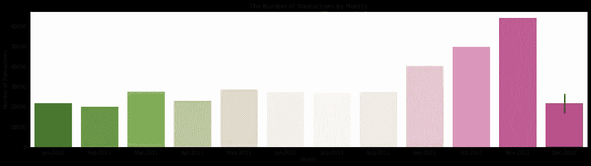

按月列出的交易数量

最高交易数量发生在 2011 年 11 月。

如果我们在日列上使用“groupby”并计算发票号，我们可以制作一个如下图所示的可视化图形。

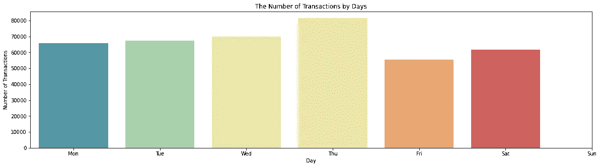

按天计算的交易数量

从这里可以看出，最高成交数发生在周四。

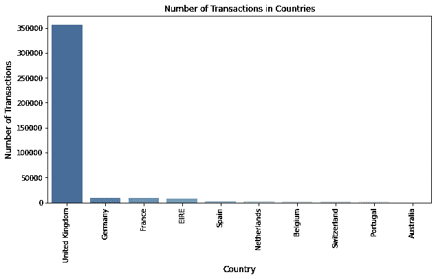

国家的交易数量

在这里，我们也可以看到哪个国家在“groupby”的帮助下进行了最多的交易。

同样，我们可以根据国家、总收入、取消订单率等进行比较。

根据客户 id 和发票号，我们可以看到购买或退货的金额。

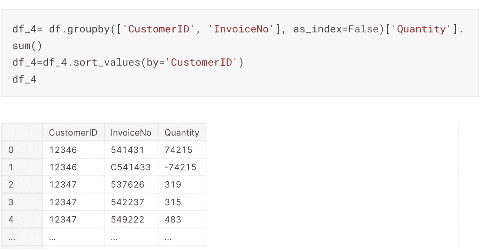

按客户 id 和发票号分组合计数量

发票号中既有数值，也有以 C 开头的值。我认为以 C 开头的交易意味着退货交易，相应的数量值将为负。因此，我创建了一个名为 Canceled_orders 的列，并观察数量值。

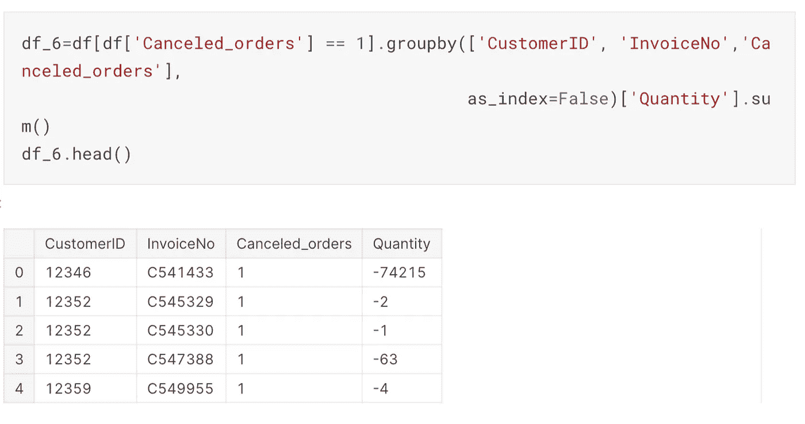

取消订单列的创建

正如我们在这里看到的，退货交易的值以 C 开头，金额值变为负值。

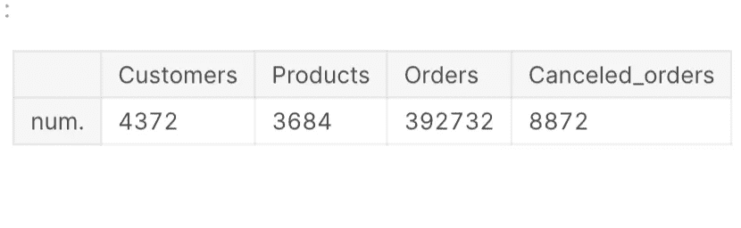

总分配

如果我们从大的方面来看，客户、产品、订单和退货的总数如左图所示。

我将产品数量和单价相乘，得出总收益。然后就可以按照客户分组，分析哪个客户消费最多，退货最多。

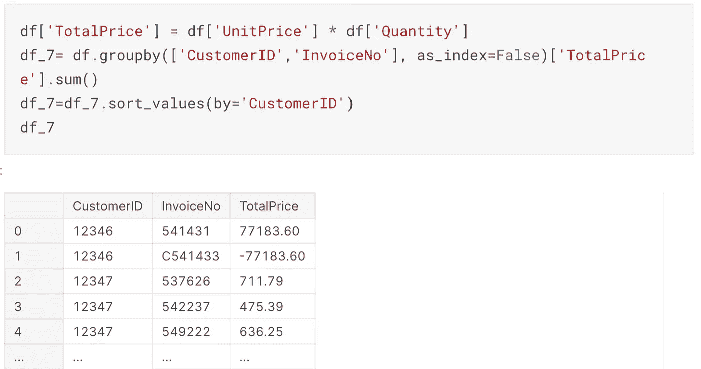

寻找总收入

当我检查单价时，我看到值为 0，并认为这些是给客户的礼物。我通过包含产品描述进行了分组，结果如图所示。

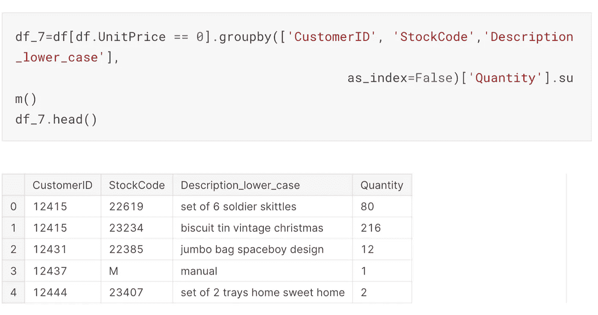

零单价产品的检验

虽然我不是 100%确定，但我认为描述显示产品是作为礼物赠送的。我现在不考虑产品的单价。然后我们可以在异常值分析中检查它。

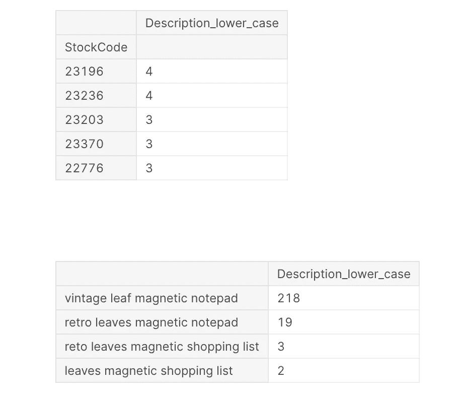

定义中不同句子形式的相同表述

正如我们在这里看到的，同一股票代码有多个定义。

当我们查看它们时，我们看到相同的定义以不同的句子形式输入，这增加了定义的多样性。这些也需要修复。

## **异常值检测**

分析数据集中的离群值，主要是为了验证数据是否有意义，用正确的视角看数据集。异常值可能是由数据收集过程中的错误引起的，或者可能表明数据中存在差异。

我们可以将不同的特征(一个变量异常值分析)绘制成箱线图或另一个特征(多个变量异常值分析)的函数，如目标变量。

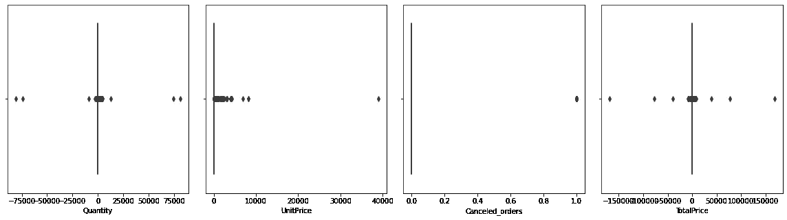

显示异常值的箱线图

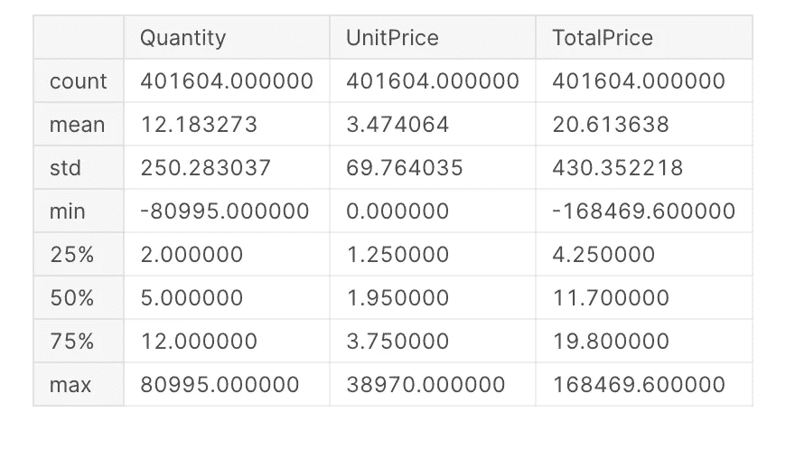

详细检查三个特征

我们已经看到产品单价为 0 的值。当我们查看单价的最小值和最大值时，我们可以看到有极端的异常值。

大多数产品以 2 至 12 件的数量出售(% 25%至 75%)。同样，当我们查看数量最小值和最大值时，我们可以看到存在极端的异常值。

在这里，我们可以使用硬边方法看到异常值，因此我们不包括显示极端异常值的值。

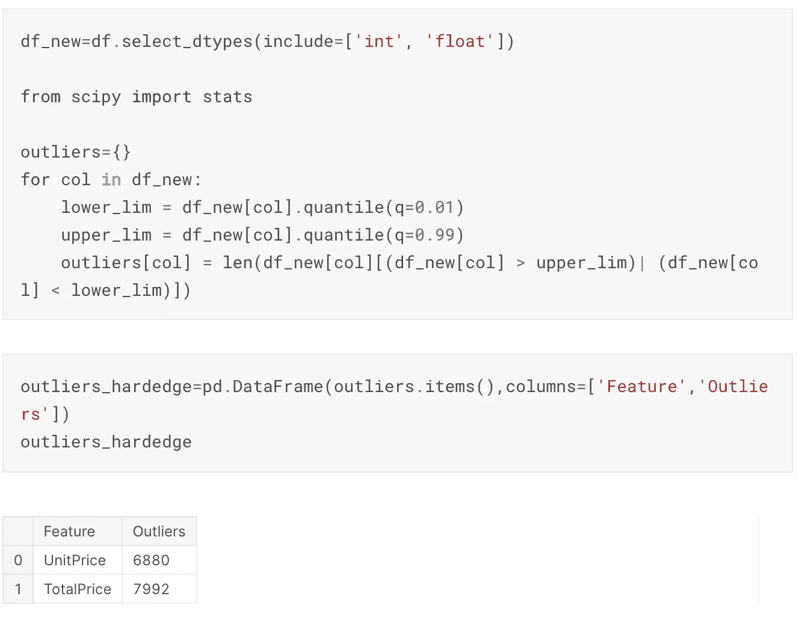

硬边缘法异常检测

我们将高于 99%和低于 1%的值视为异常值的方法称为硬边。

我们可以在图中的 UnitPrice 和 TotalPrice 列中看到异常值的数量。由于这些值太多，删除或更改这些变量可能不符合逻辑。

**对数变换**

使用对数变换，我们可以为具有非常宽的数据范围的变量获得更宽的冲程角度。

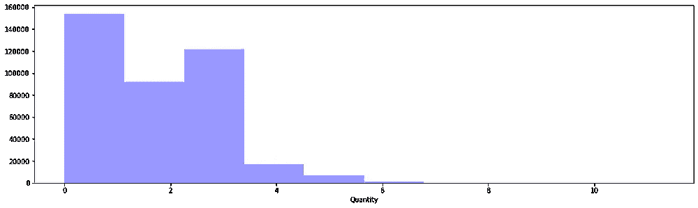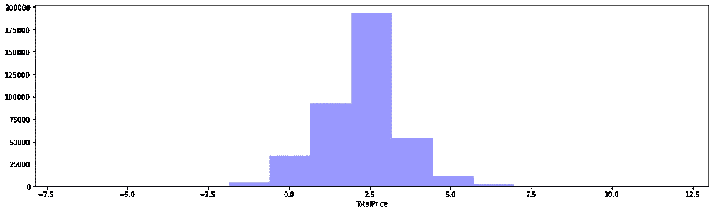

取对数的两个变量的可视化

绘制直方图时，对数变换对于压缩 y 轴非常有用。由于我们有非常广泛的数据，较小的值被较大的值压缩。我们可以取每个变量的对数，用 sns.distplot 可视化。

> “对数变换还可以突出异常值，并可能得到钟形分布。这个想法是，获取数据的对数可以为数据提供对称性。”

正如上面引号中提到的，我们的目的是确定异常值之外的范围，并且只接收属于它的数据。例如，对于以对数形式显示的 TotalPrice 值，我们可以采用范围为 exp (-2.5)到 exp (8)的值。超出此范围的值是我们没有包括在数据中的值。我发现这个数字是 8963，它比我在硬边法中发现的数字(7992)要高。

虽然异常值的数量很高，但我们可以用第一硬边法去除异常值，然后进行对数变换，得到限值内的值。或者，我们可以做相反的过程，但当然可以使用不同的方法。

异常值分析依赖于分析师的创造力。我的建议是先看看离群值对模型的反应，然后决定是放弃还是改变它们。

# 相关

变量之间的相关性表明，当一个变量变正或变负时，另一个变量往往会朝那个方向变化。简而言之，相关性是变量之间相互依赖的一种度量。

> “知道因果关系和相关性之间的区别很重要。因为相关性并不意味着因果关系，而因果关系可能需要独立的实验。”

理解相关性是有用的，因为我们可以用一个变量的值来估计另一个变量的值。

在这篇文章中，我将解释皮尔逊相关系数，一种常见的相关类型。

**皮尔逊相关**

皮尔逊相关度量系数在-1 和 1 之间的两个变量之间的线性相关性。

1:正线性相关。

0:无线性相关性(这些变量很可能互不影响)。

-1:负线性相关。

皮尔逊相关是函数 corr()的默认方法。让我们用 Seaborn 创建关联热图。它的默认状态是 sns.heatmap (df.corr())。将颜色图中显示的值范围从-1 设置为 1，并将注释设置为“True”以显示热图中的相关值后，它将给出如下图所示的输出。

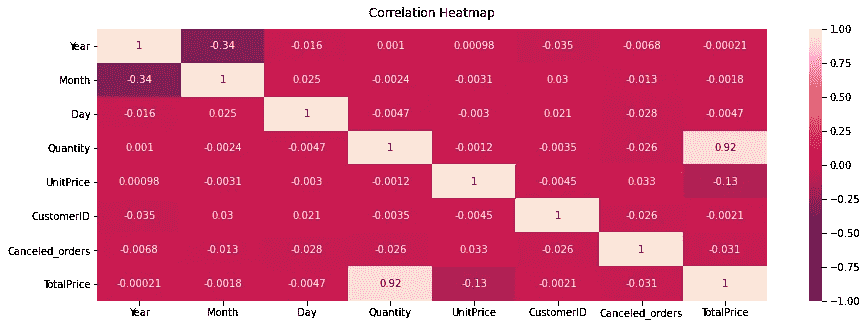

在这个数据集中查看影响总价的变量是不合理的。因为我们不能期望变量之间有很强的相关性。

如果将具有相同内容的定义收集在某个组下，并通过在下面的研究中安排定义周期来根据类别进行分离，则查看相关性可能是合乎逻辑的。所以期望现在的相关性是不合理的，所以必须产生新的变量。

感谢阅读我的文章！

我们暂时结束了。我知道有一部作品需要进一步发展。在这一点上，你的反馈对我很重要。下面分享一下我参考的作品和文章:

EDA:[https://medium . com/forward-artificial-intelligence/explorative-data-analysis-EDA-dont-ask-how-ask-what-2e 29703 FB 24 a](/towards-artificial-intelligence/exploratory-data-analysis-eda-dont-ask-how-ask-what-2e29703fb24a)

异常值分析:[https://towards data science . com/a-brief-overview-of-outlier-detection-techniques-1e 0 b 2c 19 e 561](https://towardsdatascience.com/a-brief-overview-of-outlier-detection-techniques-1e0b2c19e561)

缺失值:[https://towards data science . com/handling-missing-data-for-a 初学者-6d6f5ea53436](https://towardsdatascience.com/handling-missing-data-for-a-beginner-6d6f5ea53436)

卡格尔项目:[https://www.kaggle.com/allunia/e-commerce-sales-forecast](https://www.kaggle.com/allunia/e-commerce-sales-forecast)，[https://www.kaggle.com/fabiendaniel/customer-segmentation](https://www.kaggle.com/fabiendaniel/customer-segmentation)