# 早期糖尿病风险预测

> 原文：<https://medium.com/analytics-vidhya/early-stage-diabetes-risk-prediction-f68b60427471?source=collection_archive---------23----------------------->

iStock.com

# 方法:

1.  介绍
2.  数据
3.  电子设计自动化(Electronic Design Automation)
4.  数据工程/清理
5.  模型结构
6.  测试/结论

1.介绍

如果我们能发现糖尿病的早期症状，那该有多好？机器学习的一个有前途的应用可以做到这一点。虽然这个概念并不新鲜，而且广泛应用于许多医学领域，但对于初学数据的科学家来说，通过不同的数据集和风格来了解不同的工作流可能会非常有帮助。所以让我们开始吧。

2.数据

我从加州大学欧文分校(UCI)([https://archive.ics.uci.edu/ml/index.php](https://archive.ics.uci.edu/ml/index.php))获得的数据已经是 CSV 格式的了。它的大小相对较小，520 个实例(行)，16 个独立属性(列)和 1 个依赖属性(列/类)。这些数据最近于 2020 年 7 月 12 日捐赠给了 UCI。尽管元数据写道数据由缺失值组成，但我没有发现任何缺失值，稍后您将会看到。

3.探索性数据分析

我总是做的第一件事就是打开数据，看看缺少什么，需要删除什么。我以为会有一些丢失的值需要处理，就像元数据建议的那样，但是我没有发现。

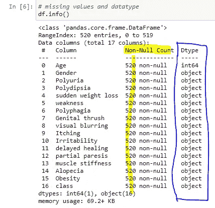

在所有属性中，只有 Age 是整数数据类型。不仅所有其他属性都是对象数据类型，它们都以二进制格式存在，如男性/女性、肯定/否定和是/否。这使我的工作容易得多，因为大部分工作都是在数据清理和数据工程方面，尽管还有一点工作要做，所以让我们继续。

砧板上的第二件事是处理数字数据，如偏度、峰度和 KNN 等模型的标准标度变换。

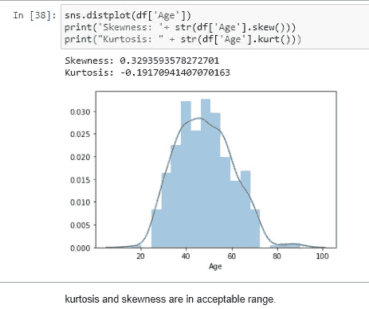

今天一定是我的幸运日。就在我认为这个数据再简单不过的时候，我发现年龄属性的偏斜度和峰度都在可接受的范围内，所以不需要任何转换，比如 log 转换。再来看看其他属性。

给定合理数量的属性，我通常会尝试单独查看每个属性。在像这样的属性更少(16 个)的情况下，我可以进行更深入的研究。当我这样做的时候，我发现了两个有趣的发现。

令我惊讶的是，这些数据向我展示了一些关于性别属性的有趣现象。

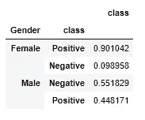

这些数据表明，如果你是男性，你患糖尿病的几率比你是女性更接近于掷硬币，而女性患糖尿病的几率是压倒性的。这令人瞠目结舌，因为人们会认为两种性别的概率相似。虽然这个属性让我震惊，但我非常怀疑，因为我们不要忘记我们正在处理一个小数据集(520)。结合我们不知道的许多其他因素，例如谁捐赠了数据，他们如何收集数据，以及他们在哪里收集数据，都会对研究结果的整体可靠性产生不利影响。记住这一点，让我们看看第二个有趣的发现。

肥胖的属性让我有点恼火。

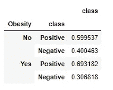

仍然存在相关性(69%)。也不算弱，但不是我想的和想看到的数量，特别是与一些相关性更强的属性相比，比如性别(90%)。肥胖和性别属性完全颠覆了我的世界。但在下结论之前，我们先来看看其他属性。我不是医学领域的，所以没有参照系。也许，肥胖相关性(69%)在这个领域是一个很强的相关性，让我们继续建立一个参考框架。

易怒的属性为肥胖相关性可能是一个很强的可能性提供了一个有力的证据。

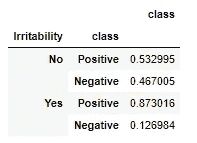

既然谈论所有的属性都是枯燥和不必要的，我将挑选一个属性作为一个群体的代表来解释我的发现。在这种情况下，我选择易怒来代表具有强相关性的其他属性(87%)，因为它不仅显示了强相关性，还给了我们一种不完全古怪的独特见解。我可以选择“烦渴”，但这样做将类似于选择头发长度来预测性别，没有那么有趣。现在我们有了上框架(强相关性)，让我们看看下框架(弱相关性)是什么样的。

没有下半部分的框架是不完整的；有 1%–5%的概率，痒是我们弱相关组的代表。

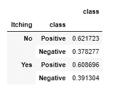

要么是，要么不是，‘痒’属性给出了一个接近抛硬币的结果，基本上对谁有硬币都没用。

这基本上完成了 EDA 的画面，所以让我们继续下一部分，看看如何处理弱属性。

4.数据工程/清理

就像我前面说过的，这个数据集非常用户友好，不需要清理、异常值处理和空值填充，但是还有一点工程工作要做。

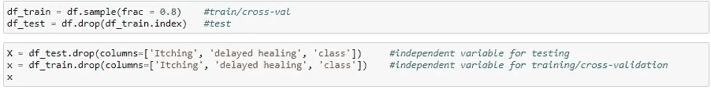

将数据拆分为定型集(X 小写)和测试集(X 大写)

虽然有许多方法来处理具有弱相关性的属性，例如什么也不做，只是将属性放入削弱其系数或完全消除它们的脊或套索模型中。我通常会扔掉它们。老实说，效果是一样的:不会过度拟合模型。所以是个人喜好。好，接下来是什么？

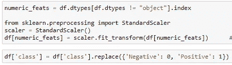

转换目标/从属属性/要素是个人偏好，但数值数据的标准比例变换对于依赖欧几里得距离的模型(如 KNN)的性能至关重要。在这种情况下，只有一个特征需要转换:“年龄”。

最后一个工程步骤是一次热编码。

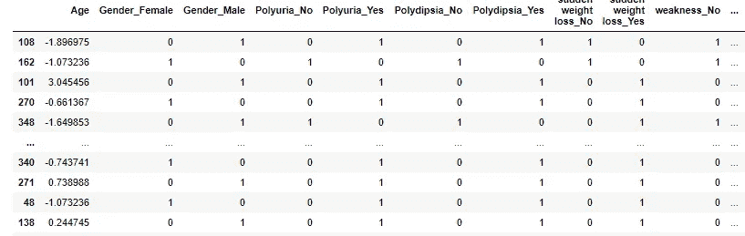

除了' Age '之外，其余的属性都是有序分类属性，所以我们用 pd.get_dummies 方法对它们进行一次性编码。现在我们已经准备好了，让我们开始做饭吧。

5.模型结构

在我们开始之前，让我们建立一个函数来告诉我们我们的模型有多好。

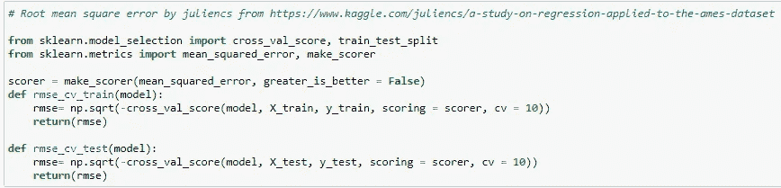

除非我有更好的东西，否则我不会多此一举。上面的均方根误差函数你可能很熟悉。我从 Kaggle 的 Julience 那里借来的，推荐你看看他的作品。并不是所有的都很棒，但是选择你认为聪明的，并引用你的出处。这是所有的旁注，让我们看看我们的模型。

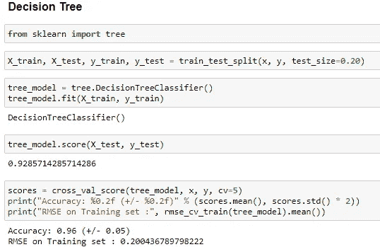

除了决策树，我还培训了 KNN，物流注册，和 SVM。但是由于训练它们的过程都是一样的，所以我只展示决策树，因为它是二元分类的最佳模型。我们完成了，现在让我们来测试一下。

6.测试/结论

最后，让我们看看我们的模型如何处理它从未见过的数据集。

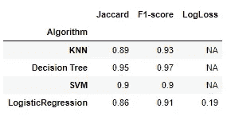

虽然我不确定这是否是行业水平的性能，但我认为这是可部署的。换句话说，给定独立属性，模型将为您提供对原始训练数据集有意义的依赖属性。但我不会走得太远，声称我们可以普遍使用这个模型作为糖尿病预测器，因为我仍然非常怀疑一些特征，如性别。然而，它对于在同一地点、以相同的方式收集数据的人以及相似的人群仍然非常有用，因为我怀疑“性别”特征的有趣特征可能是由于人口、地点和收集数据的方式。如果都相等，模型应该还是很有用的。感谢您阅读本文:)