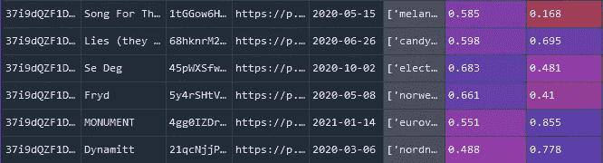
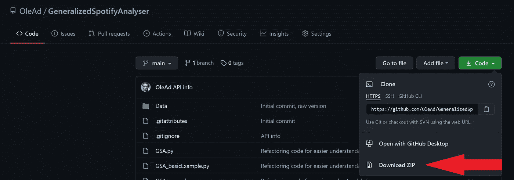
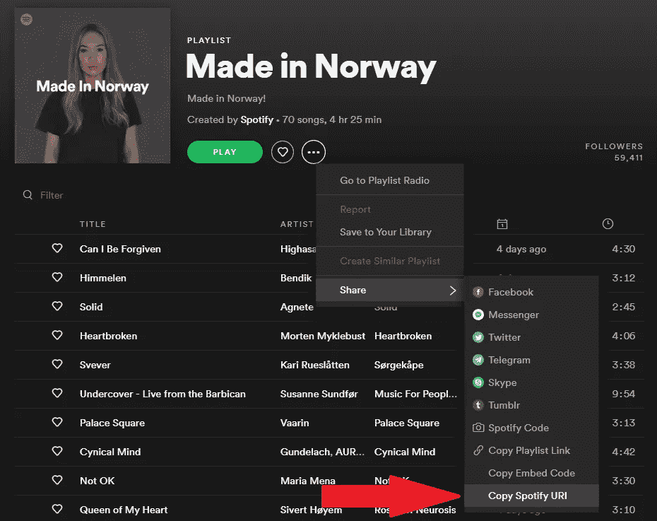
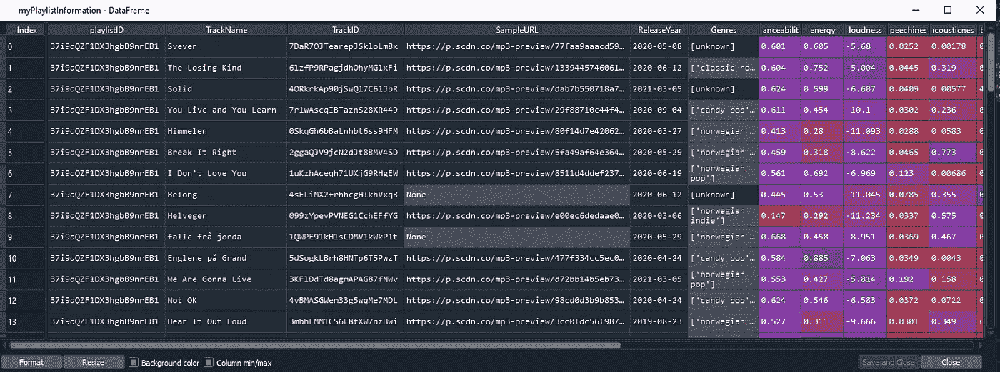

# 轻松分析 Spotify 播放列表中的音频功能—第 1 部分。

> 原文：<https://medium.com/analytics-vidhya/easily-analyse-audio-features-from-spotify-playlists-part-1-3b004cd406b3?source=collection_archive---------6----------------------->

使用 Python 从 Spotify 播放列表获取音频功能和预览音频文件的简单指南。



GSA 输出示例

音乐是我们生活中决定性的一部分。随着听音乐已经主要成为一种数字化和在线活动，它为研究人员提供了一个很好的途径来深入了解我们为什么听音乐。虽然 mixtapes 的时代早已过去，但收集音乐的过程仍然以播放列表的形式存在。在 Spotify 上，播放列表既是组织音乐的一种方式，也是创建适合不同场合的曲目集的一种方式。

就我个人而言，我有多个目的和原因的播放列表。一个包含我工作时听的曲目。另一个包含怀旧游行，还有一个放着让我的孩子们放松的歌曲。如果你在 Spotify 上搜索播放列表，你会发现成千上万的关键词，比如“悲伤的歌曲”、“睡眠音乐”、“跳舞”。

这些播放列表提供了一种理解特定场合音乐特征的方式。人们睡觉用的铁轨和跳舞用的铁轨在数量上有区别吗？看一个人的播放列表能看出他的年龄吗？

这只是人们可以通过查看播放列表来解决的问题的两个例子。

在这篇文章中，我将展示如何使用 Python 和一个简单的脚本，即[通用 Spotify Analyser (GSA)](https://github.com/OleAd/GeneralizedSpotifyAnalyser) ，从播放列表中快速获取元数据和音频功能。这篇文章假设你对 Python 和编程有一定的了解，但是我会尽量让它更容易理解。

> 这篇文章是 GSA 的第一个“版本”,随着它的发展，我会相应地更新它。最后一次更新是 2021 年 3 月 17 日。

*   第 1 部分涵盖了启动和运行。
*   [第 2 部分](https://oleheggli.medium.com/easily-analyse-audio-features-from-spotify-playlists-part-2-51959638450c)展示了如何将 GSA 作为大型数据收集的一部分。
*   [第 3 部分](https://oleheggli.medium.com/easily-analyse-audio-features-from-spotify-playlists-part-3-ec00a55e87e4)给出了一些如何分析音频特征的例子。

你可以在 [GitHub](https://github.com/OleAd/GeneralizedSpotifyAnalyser) 上找到这里使用的脚本。

# 先决条件

*   Python 3

前往[https://www.python.org/downloads/](https://www.python.org/downloads/)并遵循那里的指示。确保至少选择 Python 3.8 或更新版本。

*   Spotify 账户

你需要一个 Spotify 账户和一个 Spotify 开发者账户。两者都可以免费得到。去[https://developer.spotify.com/dashboard/](https://developer.spotify.com/dashboard/)做一个。

*   (可选)IDE

我使用 Spyder，这是一个用 Python 编程的开源 IDE。您可以使用任何其他 IDE，或者根本不使用，但是如果您使用 Spyder，本系列后面的部分可能会更容易理解。

# 获取脚本

首先，您需要获得 GSA 脚本。你可以从[这里](https://github.com/OleAd/GeneralizedSpotifyAnalyser)下载它们，按“代码”，然后按“下载 ZIP”。将此文件解压缩到您选择的目录中。



点击 GitHub 上的下载 ZIP 获取脚本。

# 获取 API 访问权限

接下来您需要做的是获得 API 访问权。为此，你需要在 [Spotify 开发者仪表盘](https://developer.spotify.com/dashboard/)中设置一个应用。你给你的应用起什么名字并不重要。您需要的是以下内容:客户端 ID、客户端密码、重定向 URL 和您的 Spotify 用户名。

一旦你制作了一个应用程序，你可以看到一个客户端 ID 和(通过按下显示客户端密码)一个客户端密码。按“编辑设置”找到你的重定向 URIs，并添加“[http://example.com/callback/](http://example.com/callback/)”如果它还没有填写。获得所有这些信息后，转到您提取 GSA 脚本的文件夹。

在 GSA 文件夹中，您会找到一个名为“*spotifyConstants _ template . py*”的文件。编辑该文件，并粘贴您在 Spotify for Developers 仪表板上找到的信息。现在将这个文件重命名为“ *spotifyConstants.py* ”。

# 安装要求

下一步是安装使 GSA 工作所需的包。这主要是你在 Python 中使用的常规包，加上了 Spotify API 的包装器 [SpotiPy](https://github.com/plamere/spotipy) 。

使用命令行界面，导航到解压缩 GSA 的文件夹，然后键入:

```
pip install -r requirements.txt
```

完成后，你就可以测试 GSA 了！

# 使用 GSA

GSA 中包含了两个示例脚本。我们先来看一下基本的例子( *GSA_basicExample.py* )。这个脚本向您展示了如何获取单个播放列表的音频特性，然后下载播放列表中曲目的 30 秒预览 MP3。

首先，我们导入 GSA 和 pandas(Python 中用于数据操作的库)。

> 如果使用命令行界面，现在应该输入 Python。

```
import GSA
import pandas as pd
```

接下来，我们需要使用 Spotify API 进行认证。

```
GSA.authenticate()
```

第一次运行该脚本时，会打开一个网页，您可以在其中通过 Spotify 的系统允许脚本使用您的凭据。一旦你同意，你将被转到另一个网页。这就是 URI 之前提到的重定向。复制这个地址并粘贴回控制台。您现在应该已经通过验证了！

> 如果您之前已通过身份验证，GSA 将刷新您的令牌，而不是创建新的令牌。

# 获取播放列表信息

为了从播放列表中获取元数据和音频特性，我们需要它的 ID。对于这个例子，我们将使用挪威制造的播放列表。您可以通过按 share 并选择“复制 Spotify URI”来找到播放列表 ID。这将为您提供以下文本:Spotify:playlist:37i 9 dqzf 1 dx 3 hgbb 9 nreb 1。我们感兴趣的是最后那些数字。



该图显示了如何获取播放列表 ID

> 有关获取播放列表 id 的不同方法，请参见 GSA_example.py。

我们现在可以使用 GSA.getInformation()函数来查询 Spotify 关于播放列表的 API。

```
myPlaylist = GSA.getInformation(‘37i9dQZF1DX3hgbB9nrEB1’, verbose=True)
```

这将创建一个 pickle 文件(。pkl)与您的播放列表中的曲目的所有信息，并将其保存到子文件夹“播放列表”。 **verbose=True** 参数使函数输出每个音轨的标题。为了访问 Python 中的信息，我们现在可以使用 pandas 读回它:

```
myPlaylistInformation = pd.read_pickle(myPlaylist)
```

在这里，我们将 pickle 文件作为包含所有信息的数据帧读取，包括播放列表中每个音轨的音频特性。



示例输出，此处显示在 Spyder 的变量浏览器中。

# 下载预览 MP3

Spotify 上的大多数歌曲都有相关的 30 秒 MP3 预览。如果您想要快速收听播放列表中的音乐，或者如果您想要运行不同的音频分析，这些功能尤其有用。

> 我将在以后的文章中阐述 Spotify 的音频功能和更常规的音乐信息检索分析之间的相关性和联系。

为此，可以使用 GSA.downloadTracks()函数。该函数将包含以下信息的列表作为输入:SampleURL、TrackName、TrackID 和 playlistID。这些都存在于我们之前创建的数据帧中，因此我们可以从那里提取它们。

```
toDownload = myPlaylistInformation[[‘SampleURL’, ‘TrackName’, ‘TrackID’, ‘playlistID’]].values.tolist()
```

现在我们需要创建一个循环，在每个轨道上调用 GSA.downloadTracks()。我们还需要记录成功下载的曲目。

```
# Create an array to keep track of which were successfully downloadeddownloaded = []# Now download preview MP3s, in a loop:for track in toDownload:
    print(‘Downloading track: ‘ + track[1])
    # this prints the current track name
    success = GSA.downloadTracks(track)
    downloaded.append(success)
```

下载的 MP3 可以在 Audio 子文件夹中找到。

# 摘要

第 1 部分到此结束！您现在应该已经安装了 [GSA](https://github.com/OleAd/GeneralizedSpotifyAnalyser) ，并且能够从单个播放列表中获取信息。在[第 2 部分](https://oleheggli.medium.com/easily-analyse-audio-features-from-spotify-playlists-part-2-51959638450c)中，我将向您展示如何使用 GSA 作为更大数据收集的一部分。在[第三部](https://oleheggli.medium.com/easily-analyse-audio-features-from-spotify-playlists-part-3-ec00a55e87e4)中，我们做统计和可视化。