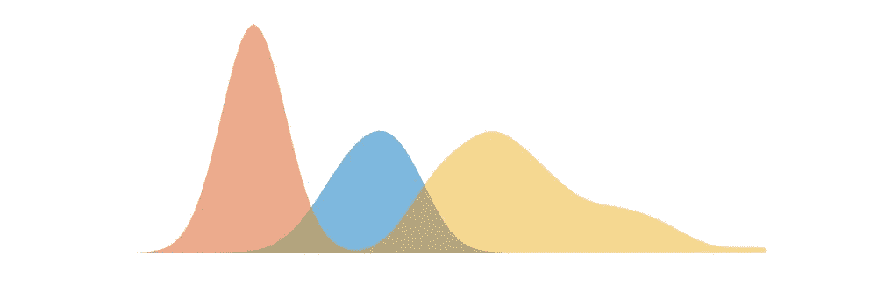

# 双峰还是三峰数据？尝试高斯混合模型

> 原文：<https://medium.com/analytics-vidhya/easily-cluster-and-display-data-using-a-gaussian-mixture-model-in-matlab-68bdbeb8cd3f?source=collection_archive---------1----------------------->

如果您正在使用 MATLAB 分析包含两个或多个正态分布总体的数据，本教程可以帮助您对它们进行分类



让我们希望您的数据能够干净地进行聚类吧！

让我们首先创建一个包含来自三个随机分布的数据的假设数据集。

```
rng(5) % Initialize the random number generatormu = [5,10,15]; % Choose mean and standard deviation values
sigma = [.5,2,3];
Nsamples = [100,100,100]; % Note this %data = cell2mat( arrayfun(@(i) ...
random('Normal',mu(i),sigma(i),Nsamples(i),1), [1:3],...
'UniformOutput', false )' );figure; hist(data)
```

创建图形将得到如下所示的内容。使用 MATLAB 的自动宁滨，很难判断你在里面放了多少高斯函数。


我们可以使用 AIC 估计量来检查数据中的最佳高斯数。当然，我们知道玩具数据集的答案是 3，但在野外不会是这样。

```
rng(5)Nguess = 5; % Guess the data has at most 5 Gaussiansoptions = statset(); options.MaxIter = 500;% Fit Gaussian Mixture Models for each of the five models
gmmodels = arrayfun( @(x) fitgmdist( data, x, 'Options', options ),[1:Nguess],...
'UniformOutput', false );% Extract the AIC values for each model
AIC_values = cellfun( @(x) x.AIC, gmmodels );% Plot AIC values to see the number that gives you the smallest AIC
figure; ax=axes('NextPlot','add'); plot( ax, [1:5], AIC_values );[a,b] = min(AIC_values);
plot(b,a,'ro')
```

这将向您显示一个最小值为 3 的浅平台，这很好，因为这是我们放入人工数据的数量。


现在，我们将尝试使用 **arrayfun** 基于我们上面创建的高斯混合模型对数据进行聚类(如果您需要重温您的**乐趣**动作，请查看我在[制作 MATLAB“乐趣”](/analytics-vidhya/day-1-making-matlab-fun-ad850eaffbde)上的帖子)。

```
Idx = cluster(gmmodels{3},data);% We will create artificially spaced bins
Nbins=100;
bins = linspace(0,max(data),Nbins);% Create a Kernel Density Function for Each of the 3 Gaussians
% Note the multiplication by the normalization factor
% (sum(Idx==x))/numel(Idx) 
% Entries roughly should match up with Nsamples/sum(Nsamples)
%
f = arrayfun( @(x) (sum(Idx==x)/numel(Idx))*ksdensity( data(Idx==x), bins, 'BandWidth', 1 ), [1:3], 'UniformOutput', false );figure; ax=axes('nextplot','add');arrayfun( @(f_) plot(bins,f_{1}), f );
```

现在这里有两个地方你可能需要调整当使用它与你自己的自定义数据。

**①宁滨。**你可能想尝试一种更有原则的方法，比如[弗里德曼-迪康尼斯法则](https://en.wikipedia.org/wiki/Freedman%E2%80%93Diaconis_rule)(非常简单)。

**(2)带宽。**KS 密度函数中的参数被任意设置为 1。这是你可以玩的东西，或者检查这个[公式](https://en.wikipedia.org/wiki/Kernel_density_estimation#A_rule-of-thumb_bandwidth_estimator)。

一旦你显示了结果，它应该看起来很清晰，从视觉上比我们开始的直方图有了很大的改进。


最后，你会想要通过使用传说中的**补丁**功能获得那种美丽的美感(在这篇文章中有更多**补丁**魔法[)。](https://neuraljojo.medium.com/day-28-accentuate-your-data-using-best-fit-lines-and-shading-4d6994e72425)

```
% I use two anonymous functions to create the x and y input to patch
% This way the Kernel Density Function is generated new for each
% of the three Gaussians
patchup_ksf_y = @(ksf) [ksf,zeros(1,numel(ksf)),ksf(1)]';
patchup_ksf_x = @(ksf) [bins,fliplr(bins),bins(1)]';% Create a figure without lines or axes
% You can edit here if you wish to preserve any of the plot pieces
figure('color','w'); ax=axes('nextplot','add','xcolor','w','ycolor','w','box','off');% Create an array that contains three patches
patches = cellfun( @(ksf) patch( patchup_ksf_x(ksf),patchup_ksf_y(ksf),...
'k','EdgeAlpha',0,'facealpha',0.5,'parent',ax ), f )% A custom palette for the display
palette=lines(3);% Re-coloring the patches
arrayfun( @(i) set(patches(i),'facecolor',palette(i,:)), [1:3] )
```

请注意，这不同于对数据进行高斯拟合。下面是你应该怎么做。

```
gm = arrayfun( @(x) gmdistribution( gmmodels{3}.mu(x), gmmodels{3}.Sigma(x) ), [1:3], 'UniformOutput', false )figure('color','w');
ax = axes('nextplot','add','xlim',[min(bins),max(bins)]);arrayfun( @(x) plot( bins, (sum(Idx==x)/numel(Idx))*pdf( gm{x}, bins' ) ), [1:3] )
```

让我们一起来看看数据，核密度图和高斯拟合。


原始数据(左)使用**聚类**函数和高斯混合模型进行聚类——给我们三种颜色。然后可以使用 **ksdensity** 或者三个高斯 **pdf** s **平滑这些数据。**

这就是生成显示数据集多样性的精美图形所需的全部内容。关于 **ksdensity** 函数的另一种用法，请查看我关于[在 MATLAB](https://neuraljojo.medium.com/use-matlab-to-create-beautiful-custom-violin-plots-c972358fa97a) 中创建半小提琴图的帖子。