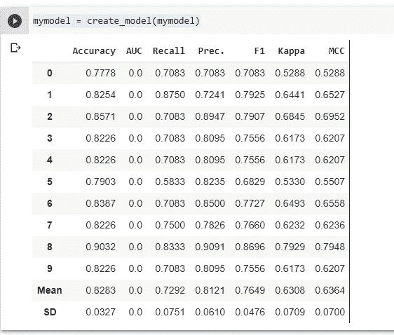

# 使用 Pycaret 进行简单快速的机器学习

> 原文：<https://medium.com/analytics-vidhya/easy-and-quick-machine-learning-with-pycaret-2e2b90c8e1b?source=collection_archive---------9----------------------->

ML 从来没有这么容易过！

如果您可以用 Python 制作一个相当好的 ML 模型，只需要很少的代码行和惊人的简单性，会怎么样？

如果我告诉你 Python 的 **Pycaret** 做了所有这些事情会怎么样？

在本文中，我们将使用 Pycaret 通过几个步骤从头开始创建一个模型。所有使用的代码都可以在这个 [Google Colab 笔记本](https://colab.research.google.com/drive/1txeG6c5K92t5jZIoHKqqlJciDy4Bqo7V?usp=sharing)中找到，你可以通过它在线复制相同的步骤——不需要设置！

使用 Pycaret，只需 5 个步骤即可完成端到端模型创建:

1.  设置
2.  模型比较
3.  模型创建——基于最佳模型(或多个模型，如果您想进行堆叠/混合)

4.模型调整

5.模型最终确定

然后你可以保存它(作为一个 pkl 文件)，或者用它来做预测。

很酷，对吧？**让我们开始吧！**

还不如跳！

## 那么——我们要预测什么？

对于本文，我们将使用一个数据科学经典:好老泰坦尼克号！

我们将使用泰坦尼克号的数据集来分类谁能幸免于难。这里可以看到 Kaggle [的原比赛。](https://www.kaggle.com/c/titanic)

为此，我们将只使用熊猫和 Pycaret。Pandas 已经预装在 Colab 中，所以我们只需要像这样安装 Pycaret:

> ！安装 pycaret

在步骤运行之后，我们拥有了我们需要的一切，我们可以像这样导入这些模块:

> 进口熊猫作为 pd
> 
> 从 pycaret.classification 导入*

然后，有了我们的工具，我们将从 URL 打开原始的 Titanic CSV，并将其导入数据帧:

> titanic = PD . read _ CSV(' https://raw . githubusercontent . com/edneibach/py caret-jump start/main/titanic . CSV ')

在本文中，我们不会深入研究机器学习的数据准备，因为 Titanic 数据集本身不需要太多准备，Pycaret 也负责一些数据准备(一次性编码、特征缩放、训练/测试分割……)

在我们使用 Pycaret 之前，我们需要知道数据集的结构，以及我们想要预测哪一列。描述()和。head()帮帮我们:

> titanic.describe(include='all ')

> 泰坦尼克号. head()

PassengerId 和 Name 没有用，因为它们不能帮助我们预测任何事情，也没有统计意义，所以我们删除它们以消除干扰(记住—所有列必须与我们想要预测的内容有关)

> titanic.drop(['PassengerId '，' Name']，inplace=True，axis=1)

现在一切都准备好了— **我们要预测的列是‘幸存’**(1 表示他们确实幸存了，0 表示他们没有)。我们可以开始了吗？

# 1.设置

> 设置(泰坦尼克号，目标= '幸存')

这基本上会告诉 Pycaret 什么是数据，你想预测什么。

它会自动分配数据类型——如果一切正常，你只需按回车键。它还将保留 30%的数据集，以便在最后进行测试。

否则，您可以使用参数“categorical _ variables”和“numeric_variables”手动指向正确的数据类型

现在我们已经设置好了一切，我们可以比较模型了。

# 2.模型比较

> mymodel = compare_models()

瞧啊。

这将训练几个模型(使用 k-fold 交叉验证，这是一个很好的验证实践)并对它们进行排序。默认情况下，模型是按照准确性进行排序的，但是您可以使用“sort”参数来更改这一点。

**现在你知道了哪些模型是最好的，你可以创建并使用它们**。

在本文中，我们不会讨论堆叠或混合，这是一种组合最佳模型以获得更好结果的方法(我们将只创建一个分类器)，但如果您想获得更好的结果，可以使用 stack_models()或 blend_models()。

# 3.模型创建

> mymodel = create_model(mymodel)

这将基于 compare_models 方法给出的结果创建一个新的分类器(**最佳模型**)。这里的输出是使用 k 倍交叉验证获得的分数— **平均结果是您应该关注的**。

# 4.模型调整

> mymodel = tune_model(mymodel)

这将**为你创建的模型调整超参数**。

**有时精确度不会有太大变化，但这是值得的，因为它不会造成伤害，最终可能会免费为您提供更好的模型。**

# 5.模型最终确定

> mymodel = finalize_model(mymodel)

*(无输出)*

这将在整个数据集中训练模型(而不是在 70%的数据集上训练它),并返回相同的模型。

我们做到了！

## **一切就绪！现在，您可以进行新的预测，或者保存模型以便在其他时间或地点进行预测。**

# 5.1-保存您的模型

> save_model(我的模型，'我的模型')

这将**将你的模型**保存为**。python 脚本运行目录下的 pkl 文件**。然后，您可以用 **load_model()** 加载它，并使用它进行预测。

因为我们在 Google Colab 上运行这个脚本，所以你可以点击左边的文件夹图标，文件就在那里——然后你可以下载它，或者复制它的路径，这样你就可以在 Colab 中引用它。

# **5.2 —加载您的模型**

> 从 pycaret.classification 导入负荷模型，预测模型
> 
> load_model('mymodel ')

重要信息:“mymodel”正在运行脚本的目录中引用“mymodel.pkl”。您也可以指向另一个目录。

如果您已经在脚本中将模型作为对象，则加载模型是不必要的，但是这样做意味着您不必在每次想要使用它时都训练它。

# 压轴戏——做预测！

为了进行预测，我们需要新的数据行(“观察”)，以便在 predict_model()中引用它。

我们可以使用这个代码片段制作一个虚拟的数据帧来进行测试:

> testdata = pd。data frame(columns = titanic . columns)
> 
> testdata.loc[0] = [''，' 2 '，'女性'，' 35 '，' 0 '，' '，80 ' '，' S']

既然我们手中既有刀又有奶酪，我们可以使用 predict_model 以数据帧的形式生成新的预测。

> 预测=预测模型(我的模型，测试数据)
> 
> print("幸存: "，预测['标签']。loc[0])
> 
> print("Score:"，预测['Score']。loc[0])

如你所见，这个人很有可能活下来。

这个模型非常好，大约有 82%的精确度。

根据[这篇](https://onyxinsight.com/2020/08/27/a-data-deep-dive-part-i-titanic/)文章，**Kaggle 上不到 5%的竞争对手在泰坦尼克号数据集**上获得了 80%以上的准确率。然而**我们使用 **Pycaret** 通过几个简单的步骤**做到了这一点。

很神奇，对吧？

此外，您还可以将此模型与 Streamlit 配对，以便轻松制作和运行您自己的数据科学应用程序！[看看吧。](https://www.streamlit.io/)

感谢您阅读我的文章，如果您有任何建议或想了解更多，请随时[给我发消息](mailto:bloemerbach@gmail.com)！