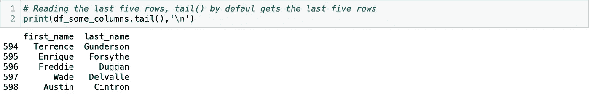
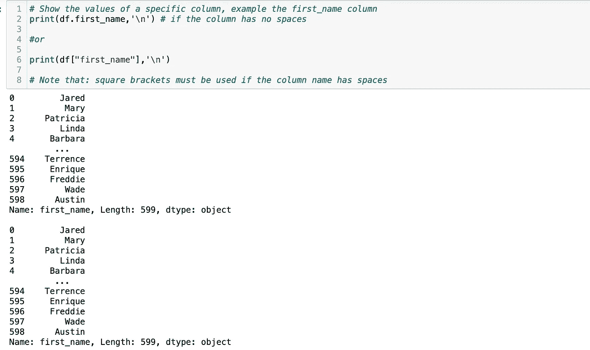
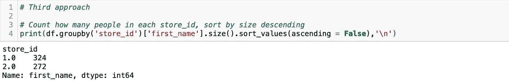
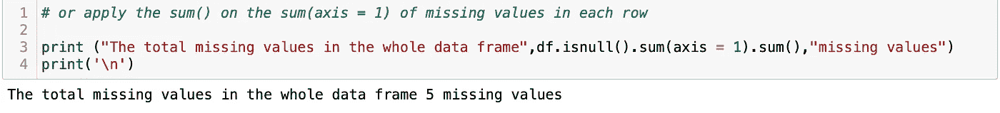
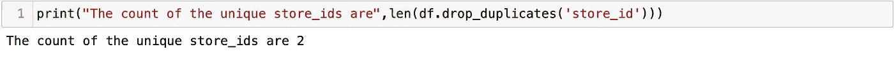
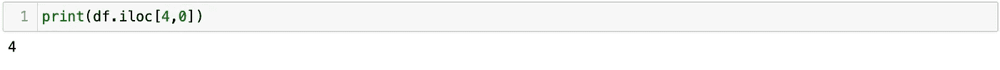
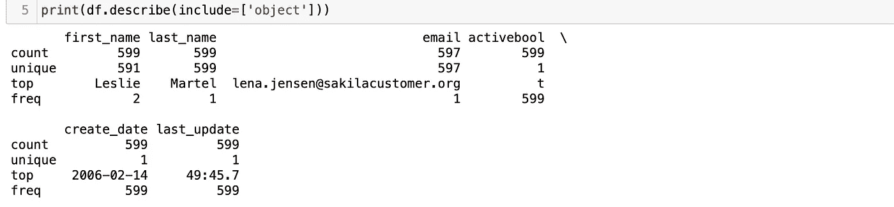

# 使用 Pandas 库轻松进行数据分析和操作

> 原文：<https://medium.com/analytics-vidhya/easy-data-analysis-and-manipulation-using-pandas-library-ea588499d452?source=collection_archive---------21----------------------->

在这篇文章中，我将向你展示如何使用 Pandas 库来分析和操作你的数据。

我正在用 Jupyter 笔记本写我的 Python 代码。我将向您展示代码的屏幕截图，并解释每个代码块。在这篇文章中，我将展示如何使用 Pandas 库以不同的方式完成相同的工作。请阅读代码块中的注释以理解所执行的步骤。

我使用一个名为 customer.csv 的 CSV 文件，它包含 599 行客户和 10 列。我们开始吧。

在下面的单元格中，我将使用 **pd.read_csv()** 函数从 CSV 文件中读取数据。当使用该函数读取 CSV 文件时，您**不需要** **需要**指定分隔符(sep)是“，”因为那是默认分隔符。如果文件是一个**标签** - **分隔值** (TSV)文件，那么我们必须指定 **sep='\t'** 。read_csv()函数默认将属性 **header** 设置为 **1** **(header = 1)** ，假设文件的第一行是**列名**。

在下面的单元格中，我将使用 **pd.read_table()** 函数读取相同的数据。当你使用函数 **pd.read_table()** 读取一个 CSV 文件时，你**需要**通过写 **sep = "，"**来指定**分隔符**是一个" "。

打印数据帧(df 或 df2)将显示以下内容:

**注意:**如果文件没有头(列)名， **pd.read_csv()和 pd.read_table()** 函数都会将**第一行作为头名**。为了防止这种情况，我们需要将**标题属性**设置为**None****(header = None)**，在这种情况下，列将被命名为 **(0，1，2 等)**。要提供您选择的**自定义名称**，您可以使用 **names** 属性，并提供您偏好的列名称列表( **names =[column1_name，column2_name 等]** )。

为了显示数据框中**各列**的**数据类型**，我将在数据框上使用( **dtypes** )。

在下面的单元格中，我将使用 **pd.read_csv()** 一次，使用 **pd.read_table()一次，使用 **usecols** 属性读取(**'**' first _ name '，' last_name')** only 一个数据帧中的特定列**。**

在下面的单元格中，我将使用数据框属性( **shape** )显示数据框(df)中的行和列的总数。输出将显示行是 **599** 行，列是 **10** 列。

为了只显示**行**的**总数**，我们只能访问**索引 0** 处的项目。

为了只显示**列**的**总数**，我们只能访问**索引 1** 处的项目。

为了显示所有**数据帧**中**值**的总数，我们可以使用( **size** )属性。

为了显示数据帧**中每个**列**中的**总数值**，不包括 NaN 值**，我将使用( **count()** )函数。

在下面的单元格中，我将向**显示特定列** (email) **中的值的总数，不包括** NaN 值。我还将显示特定列**中值的总数，包括** NaN 值。

为了读取前五行，我将使用 **head()** 函数。默认情况下， **head()** 函数检索**的前 5** 行。

为了读取最后五行，我将使用 **tail()** 函数。默认情况下， **tail()** 函数检索最后的 **5 行**。

为了显示特定列的**值，我将在下面的单元格中展示两种方法。**

在下面的单元格中，我将向**显示一组**列的值。注意，当选择多个列时，必须在**列表中提供这些列。**

在下面的单元格中，我将向您展示如何以五种不同的方式**获得一列值的**频率分布**。**

1.  **使用 value_counts()并排除 NaN。**

**2。使用 value_counts()并包括 NaN。**为了包含缺失值的计数，我将在 value_counts()函数中默认添加**dropna = False****dropna = True**。

**3。使用大小为()的 groupby()。**在下面的单元格中，我使用 **groupby('store_id')** 按 store_id 对行进行分组，然后我**使用 **size()** 对每组中的 **first_name** 进行计数**，然后使用 **sort_values【升序= False】**对**进行排序****对** **进行降序**计数。注意，store_id 计数是一个**整数**值。

**4。将 groupby()与 count()一起使用。**在下面的单元格中，我使用 **groupby('store_id')** 按 store_id 对行进行分组，然后我**使用 **count()** 对每组中的**first _ name 进行计数，然后 **sorted** 使用 **sort_values【升序= False】**对**计数** **降序**。注意，store_id 计数是一个**整数**值。

**5。注意:** groupby()在处理**数字**列时**不会将 NaN** 显示为一个组，为了包含 NaN，我们可以将数据帧或仅 store_id 列转换为 **str** ，然后我们将能够看到 **NaN** 作为组值之一。

在下面的单元格中，我正在做与上面相同的事情。唯一的区别是我使用的是 **sum()** 函数，store_id 的数据类型的计数是 **float** 。

我们可以在 groupby()返回的组中包含 NaN 值的另一个解决方法是用另一个数值(如-1)替换 NaN 值。在下面的单元格中，我使用 fillna()函数，并将-1 指定为 NaN 值的替换值。

到**统计特定列(如电子邮件)中的 NaN 值**。我们可以做到以下几点:

为了**计数每一行中的 NaN 值**。我们可以做到以下几点:

请注意，sum()中的 axis = 1 指的是行，而 sum()中的 axis = 0(这是默认值)指的是列。

为了**计算每列中的 NaN 值**。我们可以做到以下几点:

到**统计**整个数据帧**中的 NaN** 值。我们可以做到以下几点:

或者，我们可以获得每列中 NaN 的总和，然后应用该总和，如以下单元格所示:

或者，我们可以获得每一行中 NaN 的总和，然后应用该总和，如以下单元格所示:

为了计算 **store_id** 列中缺失值的数量**，我们可以执行以下操作。**

通过给定**真/假**来确定每个**列**是否具有 **NaN** 值，我们可以执行以下操作。

注意，在上面的单元格中，在 any()函数中，默认情况下 axis = 0。为了通过给定**真/假**来确定每个**行**是否具有 **NaN** 值，我们将指定 axis = 1，如下面的单元格所示。

通过回答(**对或错**)来检查**数据帧**的任何地方是否有**任何缺失值**，我们可以做以下操作:

或者我们可以做以下事情:

如果行中的 **store_id** 是**缺失**则打印 **True** ，如果没有缺失则打印 **False** ，我们可以这样做。

要回答特定列(例如 store_id)是否有缺失值(真或假)的问题，我们可以执行以下操作:

为了找出不同的 **unique** store_id 的**包括 NaN** ，我将如下使用 Pandas unique()函数( **pd.unique())** 。

在前一个单元格中，store_id 的唯一值是 1，2，nan(因为缺少一些值)。

为了**统计**那些**唯一值** **包括 NaN** ，我们可以做如下操作:

或者我们可以这样做。

为了在没有 NaN 值的情况下显示 store_id **的**唯一值**，我将选择 **store_id** 值，其中**不是 NaN** ，然后选择**唯一值**，如下所示。**

我可以使用 **numpy** 函数(numpy 作为 np 导入)做同样的事情，如下所示:

正如我们在上面看到的，nan 值消失了，只有值 1 和 2 显示为 **store_id** 的唯一值。

**对特定列中的唯一值**进行计数的方法如下。

要获得 **store_id** 列中**最频繁的值**，我们可以执行以下操作:

或者我们可以做以下事情:

或者我们可以做以下事情:

或者我们可以做以下事情:

为了找出**store _ id(即 store_id = 1) **的最频繁值**出现了多少次**，我们可以做如下操作。

或者我们可以这样做:

要显示最频繁的 store_id 及其计数，我们可以执行以下操作。

**绘制一个条形图**，显示 store_id 列**中每个值的频率，不包括 NaN** 。我们可以做到以下几点。

或者我们可以这样做。

**绘制条形图**，显示 store_id 列**中每个值的频率，包括 NaN** 。我们可以做到以下几点。

我们可以通过索引选择特定的行和列，其中行和列都从索引 0 开始。所以这 599 行的索引从 0 到 598。列的索引也是从 0 开始的。所以这 10 列的索引是从 0 到 9。我们可以使用 **iloc** ，其中您可以指定**iloc[from rowindex:toro windex，fromColumnIndex : toColumnIndex]。**注意，toRowIndex 和 toColumnIndex 是互斥的，python 在它们的值之前选择索引。

为了选择显示所有列的前**三行**，我将执行以下操作。

或者我们可以这样做。

正如你在上面看到的**十列**被选中，但只有**前三行**的**索引为 0、1 和 2。**

为了选择从索引 **2 开始到结尾**显示所有列的行，我将执行以下操作:

或者我们可以做以下事情:

从上面的**可以看出，十列**被选中，但只有从**索引 2 到最后一个索引(索引 598)** 的**行**被选中。

选择从**索引 2 到索引 3** 开始的行，显示所有列。

或者只需执行以下操作:

要选择索引为 4 的行中的值，我们可以执行以下操作:

对于从**索引 1 到索引 2** 中选择**行**的**列，索引 0 和 1** 仅为(customer_id，store_id)，我们可以执行以下操作。

对于**选择数据框中的特定值**，我们可以指定行的索引、列的索引。在接下来的单元格中，我选择的是**行**的值，其中**索引为 4** ，而**列索引为 0** 。

在下面的单元格中，我使用 **iloc** 仅显示 store_id 的**值。**

为了选择**不相邻的行**或**列**，我们可以在列表中提供这些行和列的**索引号。在下面的单元格中，我选择了从 **2 到**5(独占)的行，但是只选择了**store _ id 和 email** 。**

在下面的单元格中，我只选择了**行的第 2 行和第 6 行**和列 **store_id 以及电子邮件。**

为了检索行和列中的值，我们也可以使用 **loc。loc** 作用于**行的名称和**列的名称。为了选择名为【2，3，4，5】的**行并显示所有列**，我们将执行以下操作。

如果我们想要**选择行(2、3、4)和列(商店 id、名字、姓氏和电子邮件)**，使用 **loc** ，我们将执行以下操作:

使用 **iloc，我们**将执行以下操作:

使用 **loc** 选择**不相邻的列**，我们可以提供列表中列的名称。在下面的单元格中，我正在**从 2 到 5(不包括)中选择行，但是只有 store_id 和 email** 。

在下面的单元格中，我使用 **loc** 来**只选择第 2 行和第 6 行，只选择 store_id 和 email 列。**我将提供列表中不相邻的行和列。

在下面的单元格中，我使用 **loc** 只显示 **store_id** 。

我们可以根据显示所有或特定列的**条件**选择一些行。在下面的单元格中，我将**选择 store_id 为 1** 的客户的名字。

在下面的单元格中，我将**选择带有 **Leslie** 的客户**作为他们的**名字**。

显示 **Leslie** 作为 **first_name** 的客户的**计数**。

我们可以根据**复合** **条件选择一些行。**在下面的单元格中，我将选择具有 **store_id = 1** **和**first _ name = " Jared "的客户。我们可以用来组合条件的**和**运算符是**&**。

在下面的单元格中，我将选择 **first_name = "Mary"** **或**其 **first_name = "Jared"** 的客户。**或**运算符是管道 **"|"** 。

或者我们可以这样做:

在下面的单元格中，我将选择 **store_id 不等于 2** 的行，仅显示 **customer_id 和 store_id 列。**

在下面的单元格中，我将计算 store_id = 1 的行数。

要将每一行显示为列表，我们可以执行以下操作。

如果我们做的和上面一样，并且提供**轴= 0** ，将显示以下内容。

为了只显示列表的第一行，我们可以执行以下操作:

或者

或者

所有上述情况将导致以下结果:

上面的列表没有显示列名。要显示列表中的列名，我们可以执行以下操作。

在下面的单元格中，我将遍历这些行，并打印第三列(first_name)的值，即行[2]。

为了遍历数据帧并打印一个包含索引和名字列的值的**元组**，我将执行以下操作。

在下面的单元格中，我将计算其中一个数字列 **store_id** 的一些统计数据。

我们还可以使用 describe()函数显示带有数值的列的统计数据。describe()函数将显示以下内容:计数、平均值、标准差、最小值、最大值、25%、50%、75%百分位数。

如果你想要指定你想要描述的类型，你需要使用**包含**参数。在下面的单元格中，我将显示数据类型为**对象**的系列的描述。

在下面的单元格中，我将用值 1 替换 store_id 中三个缺少的值。

如果我计算 store_id 列中的空值，它们应该是 0。

我希望你觉得这篇文章很有趣，并且主题解释得很清楚。请继续关注我的下一篇文章。