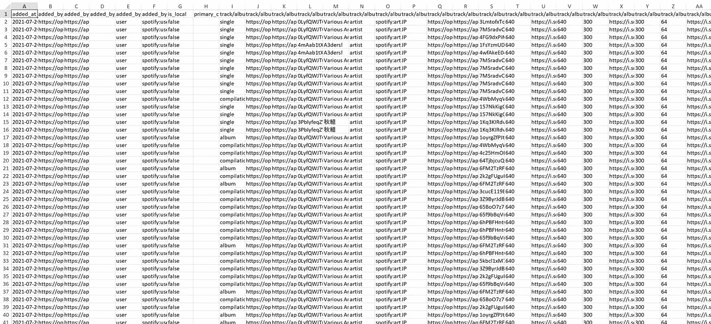

# 使用 Spotify 的 Web API 进行简单、无代码的数据收集

> 原文：<https://medium.com/analytics-vidhya/easy-no-code-data-collection-using-spotifys-web-api-a381db04976b?source=collection_archive---------1----------------------->

*无需编写任何代码即可分析 Spotify 的歌曲数据。*

[奥米德·阿明](https://unsplash.com/@omidarmin?utm_source=unsplash&utm_medium=referral&utm_content=creditCopyText)在 [Unsplash](https://unsplash.com/s/photos/spotify?utm_source=unsplash&utm_medium=referral&utm_content=creditCopyText) 上的照片

我想大多数 Spotify 用户都会熟悉 Spotify 基于情绪的播放列表，比如上图中的 Happy Hits。不管你的心情如何，Spotify 设法推荐了完全符合你内心独白的歌曲……它是怎么做到的？其中很大一部分将是 Spotify 的算法，另一个可能决定歌曲基调的功能将是歌曲的音频功能，Spotify 非常好地公开了这些功能，供好奇的数据爱好者通过其 API 访问。所有这些听起来都很完美，但是如果你以前从来没有输入过一行代码呢？

如果你没有任何编码经验，这个 HTML 看起来有点吓人。

当然，理想的解决方案是让你学会一种编码语言，这样你就可以最大化 API 的特性。另一种选择是使用预建的 Spotify 分析器，如 [Chosic](https://www.chosic.com/spotify-playlist-analyzer/) 、 [Soundplate](https://play.soundplate.com/analyze/playlist) 和 [Spotilyze](https://www.spotilyze.com/) 。然而，这些分析器是有限的，因为你将无法从 Spotify 访问完整的数据集，从而降低了你真正分析数据的能力。别担心，有一种方法可以提取 Spotify 的所有歌曲数据*，而无需输入一行代码！*

步骤概述:

1.  查找播放列表/专辑的 Spotify ID。
2.  使用 Spotify 的 Web API 控制台获取 JSON 数据。
3.  将 JSON 转换为 Excel/CSV。
4.  对音频功能重复上述步骤。
5.  享受分析数据集的乐趣！

顺便说一下，我这篇文章所基于的数据集可以在下面找到。让我们开始详细的演练！

 [## A3！Spotify 歌曲数据

### 简介 A3！Spotify 歌曲数据描述此表试图整理所有 A3！歌曲数据可从…获得

docs.google.com](https://docs.google.com/spreadsheets/d/16U4K2MNY4mI8uzgD9khtoRsp2_L0Dbru36GGx7_AHd0/edit?usp=sharing) 

**第一步:制作一个您想要查看的歌曲的播放列表。**

Spotify 的 API 允许用户获取单曲、专辑和播放列表的信息。播放列表可能是最灵活的，因为你可以很容易地定制你想找的歌曲。请注意，使用 no-code 方法的每个请求最多只支持 100 首歌曲，所以记住要遵守这个限制！

对于本例，我们将遵循我的 [A3 的数据收集方法！x Spotify 数据项目](https://ordinarytwilight.medium.com/ed7215917d23?source=friends_link&sk=8a2e0aa4237089d03e96b56f11b6ec05)。我们将在这里使用的播放列表是 [A3！Spotify](https://open.spotify.com/playlist/37i9dQZF1DWTyxueI1JMs3?si=aeb5332cc5ec46af) 策划的播放列表，包含 50 首歌曲。

不要忘记将共享链接保存到您将要分析的播放列表中，这将在以后派上用场！

链接到 A3！播放列表:【https://open.spotify.com/playlist/37i9dQZF1DWTyxueI1JMs3? si=8f4cf10265e24579

**第二步:打开** [**Spotify 的 Web API 控制台**](https://developer.spotify.com/console/) **，获取播放列表数据。**

要详细了解每个 API 调用做了什么，请查看 [Spotify Web API 文档](https://developer.spotify.com/documentation/web-api/reference/)以了解数据是如何构造的。

获取 A3 中歌曲的音频功能！播放列表，我们首先需要一个曲目 id 列表。要获得这些，首先要检索播放列表的 JSON 数据。对于本演练，您不必熟悉 JSON，但是如果您有兴趣，这里有维基百科的简短解释:

> JSON 是一种开放的标准文件格式和数据交换格式，它使用人类可读的文本来存储和传输由属性值对和数组组成的数据对象。

以下是您在[“获取播放列表”](https://developer.spotify.com/console/get-playlist/)控制台页面应该看到的内容:

截图来自作者。

Spotify 为我们提供了一个易于使用的控制台界面，旨在展示 API 的功能。然而，对于数据分析，我们只需要在某个时间点静态捕获数据，所以这对我们的使用来说已经足够好了！

只有两个字段是强制的:playlist_id 和 OAuth 令牌。

通常，Spotify 共享链接遵循以下格式:

*https://open.spotify.com/<物品类型>/*/***<ID>****？<查询>查询*

使用示例播放列表，

[*https://open.spotify.com/playlist/****37i 9 dqzf 1 dwtyxuei 1 JMS 3****？si = 8f4cf 10265 e 24579*](https://open.spotify.com/playlist/37i9dQZF1DWTyxueI1JMs3?si=8f4cf10265e24579)

因此，该示例中的播放列表 ID 是 **37i9dQZF1DWTyxueI1JMs3** 。

要获取 OAuth 令牌，只需单击绿色的“获取令牌”按钮，然后在弹出窗口中单击“请求令牌”。

单击“获取令牌”后，您应该会看到此弹出窗口。

系统会提示您登录您的 Spotify 帐户，并授权 Spotify for Developers 在本次会话中访问您的帐户。令牌会在一段时间后过期，因此您需要偶尔申请一个新令牌。现在你已经得到了你需要的一切，只需点击“尝试”按钮，你就会看到这个:

播放列表请求的 JSON 有效负载。

现在只需突出显示最外面的花括号之间的所有白色文本，并将其粘贴到任何文本编辑器中进行保护。

**第三步:将 JSON 有效负载转换成 Excel 文件。**

对于这一步，我使用这个[在线转换器](https://www.convertcsv.com/json-to-csv.htm)，但任何其他转换器也应该工作！首先，将文本文件中的所有内容粘贴到“输入数据”字段中。您会发现 CSV 预览看起来很奇怪，或者触发了“无效 JSON 格式”警告。这是因为您需要通过删除有效载荷顶部和底部突出显示的部分来整理数据，直到您只剩下方括号之间的部分。这将把 JSON 有效负载整理成一个简单的歌曲数组及其数据。

删除开头突出显示的部分…

…还有结尾！

之后，点击“JSON 到 Excel”按钮，获得闪亮的新电子表格。

这是…很多。

有很多数据，但我们只对少数几列感兴趣，因为我们主要关注的是音频特性，一旦我们知道了音轨 id，我们就会获取这些特性。要找到这些，请查找下面突出显示的“曲目/id”和“曲目/名称”栏。

突出显示的列很重要。

我也突出了音轨名，因为它们比 id 更容易记忆。这个数据集也有一些有趣的变量，如专辑名称，发行日期，艺术家，曲目流行度和曲目持续时间，所以花点时间去检查这些！

第四步:获取所有音轨的音频特征。

接下来，您需要将 turn track/id 列(没有标题)转换为 Tracks API 可以接受的格式，以便获得音频特性。文档指出，id 应该是一个逗号分隔的 id 列表，最多 100 个 id。

文档是您最好的朋友…

我不想为几十个 id 手动添加逗号，所以我决定将 track/id 列转换为 CSV 文件，方法是将转置的列粘贴到另一个表中，并将该表保存为 CSV 文件。

复制->选择性粘贴->粘贴转置到另一个工作表->另存为 CSV。

在文本编辑器(我在这里使用记事本)中打开 CSV 文件，会得到以下 id 字符串:

这就是为什么我不想手动添加逗号。

接下来，将字符串复制并粘贴到[“获取多个音轨的音频特征”](https://developer.spotify.com/console/get-audio-features-several-tracks/)控制台页面。你会得到这样的结果:

不要忘记添加您的令牌！如果它与之前的令牌相同，应该会自动添加。

键入您的令牌，然后单击“尝试”。您应该会看到新的 JSON 有效负载出现。

前两首歌曲的音频功能有效负载。

将 JSON 有效负载转换为另一个 Excel 文件，记得先清理有效负载！

删除 curl 请求和“音频功能”标题…

…最后一个花括号。

您可以将转换后的 JSON 文件下载到一个新的 Excel 工作簿中，但我只是决定将预览表复制到上一个工作簿中的一个新工作表中(仅粘贴值),并附加另一个工作表中的 track/name 列，以便更容易识别每首歌曲。我还添加了一些条件格式，以便更容易定位极值。

我们快完成了！

对于我的项目，我决定从播放列表和音频特征数据中挑选、处理和组合列来创建这个[大表](https://docs.google.com/spreadsheets/d/16U4K2MNY4mI8uzgD9khtoRsp2_L0Dbru36GGx7_AHd0/view#gid=144930822)，它整理多个播放列表的歌曲，因为我需要每个 A3 的数据！Spotify 上提供的歌曲。

好了，现在我们完成了。

**第五步:最后，让我们分析一些数据！**

好了，你已经有了一个相当大的数据集可以玩了。现在怎么办？

可能性几乎是无限的！继续我们到目前为止采用的无代码方法，您可以使用电子表格编辑器的原生图表，但是考虑到数据集的大小和我在线共享图表的意图，我决定使用 Tableau。下面看看我想出来的，完整的练习册可以在[这里](https://public.tableau.com/app/profile/ordinary.twilight/viz/A3SpotifySongData/AnalysingA3SongsonSpotify)找到！一定要检查实际的工作簿，因为许多可视化效果与 Tableau 的交互功能配合得最好。

所有歌曲的简要分类。

概括的音频特征数据。

所有音频特征的散点图矩阵。

因为这篇文章的重点是在没有代码的情况下收集数据，所以我强烈建议阅读[这篇文章](https://towardsdatascience.com/what-makes-a-song-likeable-dbfdb7abe404)作为您可以使用新数据集做什么的例子！作为入门，下面是 Spotify 和那篇文章对音频功能的解释:

> 可跳舞性:描述一首曲目在音乐元素组合的基础上适合跳舞的程度，包括速度、节奏稳定性、节拍强度和整体规律性。
> 
> 效价:描述一首曲目所传达的音乐积极性。高价曲目听起来更积极(例如，快乐、愉快、欣快)，而低价曲目听起来更消极(例如，悲伤、沮丧、愤怒)。
> 
> 能量:代表强度和活动的感知度量。通常，高能轨道感觉起来很快，很响，很嘈杂。例如，死亡金属具有高能量，而巴赫前奏曲在音阶上得分较低。
> 
> 速度:轨道的整体估计速度，单位为每分钟节拍数(BPM)。在音乐术语中，速度是给定作品的速度或节奏，直接来源于平均节拍持续时间。
> 
> 响度:轨道的整体响度，以分贝(dB)为单位。响度值是整个轨道的平均值，可用于比较轨道的相对响度。
> 
> 语速:这可以检测音轨中是否存在口语单词。越是类似语音的录音(例如脱口秀、有声读物、诗歌)，属性值就越接近 1.0。
> 
> 乐器性:预测音轨是否不包含人声。“Ooh”和“aah”在这种情况下被视为乐器。Rap 或口语词轨道明显是“有声的”。
> 
> 活跃度:检测录音中是否有观众。较高的活跃度值表示音轨被现场执行的概率增加。
> 
> 声音:一种置信度，从 0.0 到 1.0，表示音轨是否是声音的。
> 
> Key:估计的音轨的整体 key。整数使用标准音高分类符号映射到音高。例如，0 = C，1 = C♯/D♭，2 = D，等等。
> 
> 调式:表示轨道的调式(大调或小调),旋律内容来源的音阶类型。大调用 1 表示，小调用 0 表示。
> 
> 持续时间:音轨的持续时间，以毫秒为单位。
> 
> 拍号:估计的轨道整体拍号。拍号(拍子)是一种符号约定，用于指定每个小节(或小节)中有多少拍。

享受探索 Spotify 歌曲数据的乐趣，希望本指南对您有所帮助！