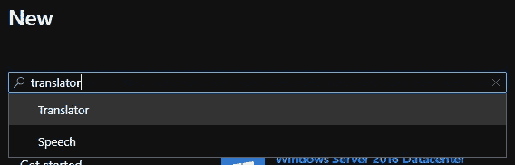
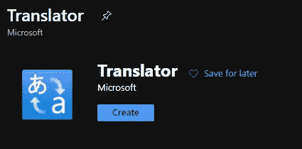
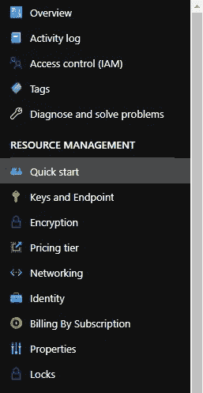
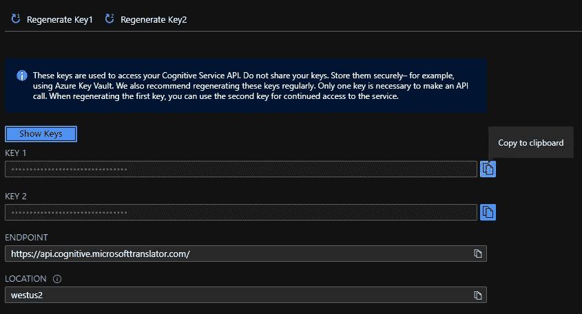
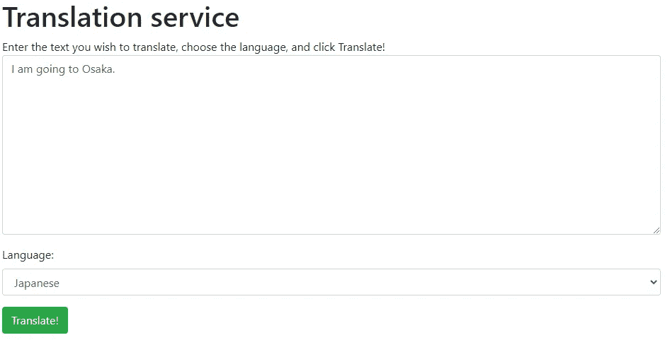
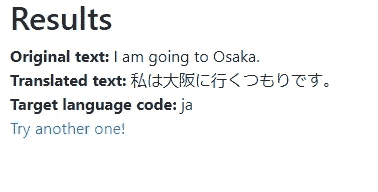

# 在 python 中使用 AZURE 服务的简单步骤

> 原文：<https://medium.com/analytics-vidhya/easy-steps-to-use-azure-services-in-python-c7c3e0bda9a2?source=collection_archive---------15----------------------->

# **先决条件**:

1.  Microsoft Azure 上的帐户。如果您没有下面的一个检查:

> 如果你是在职职业报名[这里](https://azure.microsoft.com/en-in/free/)
> 
> 如果你是学生报名[这里](https://azure.microsoft.com/en-us/free/students/)

2.关于 python 的基础知识(FLASK)。

# **目标**

完成本教程后，您将能够

1.  获得如何将 Microsoft AZURE 服务与 python 集成使用的实践经验。
2.  你将有一个迷你翻译项目准备展示。

# **流程**

如果你在这里，这意味着你已经有一个 Microsoft AZURE 帐户。

让我们从流程开始:

1.  **设置本地环境**

> 1.在本地主机上创建一个文件夹。
> 
> 2.创建一个新文件 requirements.txt，并将以下内容复制到其中。

> flask
> python-dotenv
> 请求

> 3.在该位置打开 bash(windows 上的命令提示符)。
> 
> 4.运行-

> **pip install-r requirements . txt**

2.**做一个简单的 app**

> 1.创建一个文件名 **app.py**
> 
> 2.在里面复制下面的代码。

> 3.现在创建新的文件夹**模板**，然后在里面创建一个**index.html**文件。(确保将文件夹命名为**模板**)
> 
> 4.将下面的代码复制到其中。

> 5.让我们在本地主机上尝试一下。尝试在命令提示符/bash 中运行以下命令。

> 6.最后，通过访问 URL[http://localhost:5000](http://localhost:5000)在浏览器中打开迷你应用程序

3.**在微软 AZURE 上制作服务**

> 浏览到 [Azure 门户](https://portal.azure.com/)
> 
> 选择创建资源

> 3.在搜索框中，输入 Translator
> 
> 4.选择翻译者

> 5.选择创建

> 6.使用以下值完成创建翻译表单:

> 订阅:*您的订阅*
> 
> 资源组:
> 
> 选择新建
> 
> 名称:烧瓶艾
> 
> 资源组区域:*选择您附近的区域*
> 
> 资源区域:*选择与上述*相同的区域
> 
> 名称:*唯一值，如 ai-yourname*
> 
> 定价层:免费 F0

> 7.选择审阅+创建
> 
> 8.选择创建
> 
> 9.几分钟后，资源将被创建
> 
> 10.选择转到资源
> 
> 11.选择资源管理下左侧的密钥和端点

> 12.在键 1 旁边，选择复制到剪贴板

> 13.记下端点和位置值
> 
> 15.返回本地文件夹，在应用程序的根目录下创建一个新文件，方法是选择 new file 并将其命名为。环境(的。文件的开头是必需的。)
> 
> 16.将以下文本粘贴到。包封/包围（动词 envelop 的简写）

**4。最后的步骤**

> 以下代码为最终 **app.py**

> 2.在**模板**文件夹中创建一个新文件**results.html**，并将下面的代码复制到其中。

**5。结果**

> 使用 Ctrl-C 停止 Flask 应用程序
> 
> 执行命令`flask run`重启服务
> 
> 浏览到 [http://localhost:5000](http://localhost:5000) 来测试您的应用程序
> 
> 在文本区域输入文本，选择一种语言，然后选择“翻译”

> 5.你会看到结果的！

就这样

那可是一大堆工作。但是你现在已经掌握了微软 AZURE 的窍门。😃

> **所有图片积分归微软所有。**