# EDA 和 R(和 Python)中的基本数据可视化

> 原文：<https://medium.com/analytics-vidhya/eda-and-basic-data-visualizations-in-r-and-python-a9ffaba32c92?source=collection_archive---------11----------------------->

任何对数据科学感兴趣和学习数据科学的人可能都很清楚 Python 和 R 之间正在进行的关于数据科学的争论。尽管这两种语言都有其令人惊叹的地方，但都有一些优点和缺点。Python 有很多优点，比如它是一种通用的多用途语言，简单易学，交互性强。它的一些缺点是它的可视化特性不像 R 那样广泛和复杂。另一方面，r 是专门为数据分析而设计的，因此它有令人惊叹的工具，大量的软件包，简单的安装和指南，可以帮助你解决你可能面临的可视化(RStudio)的每个问题，另一个功能是它可以与 Github 同步。它的一些缺点是它是特定的，不像 Python 那样是多用途的。它们也有一些相似之处，比如都是开源的，都是命令行解释器，广泛用于数据科学项目等。

就我个人而言，我认为 Python 在整体上更好地处理数据科学，因为它易于使用和理解，但是 R 提供的统计数据比 Python 好得多。话说回来，R 主要用于统计分析和图形工作。总之，Python 是一种令人惊叹的多用途语言，但是 R 提供了更好的统计分析特性和工具。因此，问题不应该是哪一个更好，而应该是如何在您的特定用例中最好地利用这两种语言。

理论讲够了，让我们进入正题。现在，我将展示一些使用这两种语言的探索性数据分析(EDA)和数据可视化过程。虽然我的 R 代码会更加详细，因为我也相信网上有各种 EDA 和 Data Viz 示例代码，但没有 R 中的那么多。(同样，我可能是错的，但这真的不重要)

您可以使用此处的[链接访问代码、数据和数据字典。](https://github.com/OjasPandey99/EDA-and-Data-Viz-in-Python-and-R-)

只是一个头，在这里我将解释 R 代码，但我已经在上面提到的链接中提供了 Python 代码。

# 使用的库

## tidyverse

Tidyverse 是用于数据清理和探索的最广泛使用的 R 包之一。它为此提供了各种各样的工具。Tidyverse 相当于 python 的熊猫，但更好。

## ggplot2

如果你对 python 中的可视化有所了解，那么 ggplot 就是 Python 的 matplotlib 和 seaborn 的组合等等。与 Python 不同，它易于使用，只需几行代码就可以实现复杂的可视化。

## 撇油器

这是另一个有用的 R 包，用于提供汇总统计数据，并能够处理各种数据类型。

## e1071

这个 R 包是统计和概率算法的有用工具。

## 格子木架

这是一个强大的 R 包，用于高级数据可视化，侧重于多元分析。

## 摘要工具

该软件包有助于数据探索并提供摘要报告

为了便于说明，我使用了两个数据集，一个是哺乳动物睡眠数据集(msleep ),另一个是汽车数据集(mpg)

# EDA 技术

加载数据集后，我对数据执行一些 EDA 技术。其中一些例子如下:

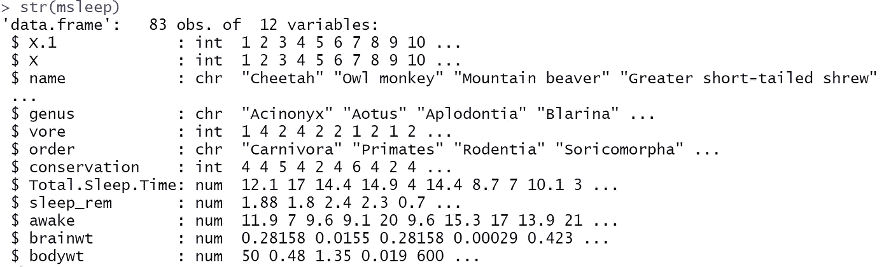

str() :这个函数是 base R 包的一部分，代表“结构”。它产生整个数据帧的基本结构。

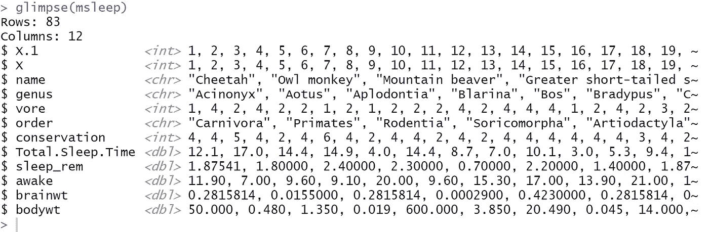

**glimpse() :** 这个函数提供了对数据集以及各个列的数据类型的预览

**skim():** 比上面提到的函数稍微高级和复杂一点的是来自 [skimr](https://cran.r-project.org/web/packages/skimr/index.html) 库的 skim()函数。它的结果包括最小值、最大值、缺失值的数量、空白区的数量、标准偏差、百分位数、唯一值等。它还将特征分为数字和类别。

**summary():** summary 是 base R 包中的另一个函数，它提供了我们的数据帧的简短摘要。

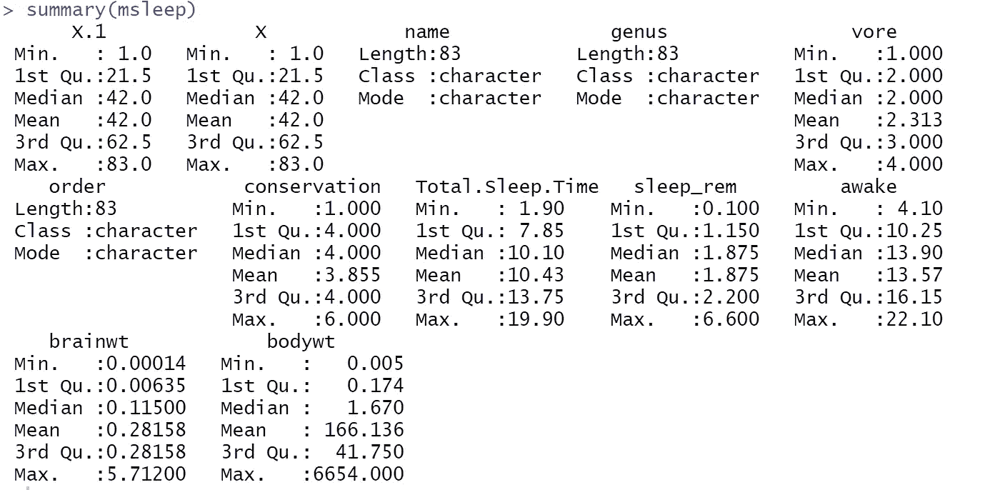

**dfSummary() :** 另一个功能，即使不比 Summary()和 skim()功能更高级，也相当于 summary()功能，是来自 [summarytools](https://cran.r-project.org/web/packages/summarytools/vignettes/Introduction.html) 库中的 dfSummary()功能。它对每个变量进行了更深入的分析。

在进行了更多的分析(可以在提供的代码中看到)之后，我们继续进行数据可视化。

# 绘制分类变量

## 使用 qplot()绘制条形图

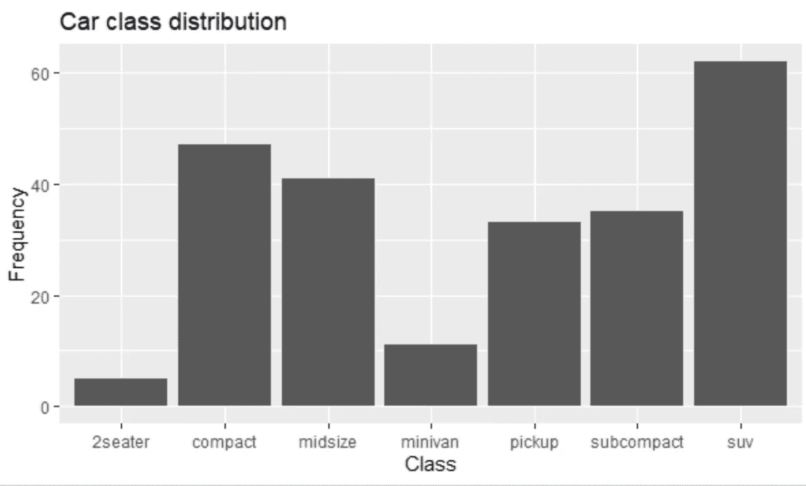

[R 中的 qplot](https://ggplot2.tidyverse.org/reference/qplot.html#:~:text=qplot()%20is%20a%20shortcut,used%20to%20base%20plot()%20.&text=It's%20great%20for%20allowing%20you,easier%20to%20create%20complex%20graphics.) (Qucik plot)是简单 Plot()函数的快捷方式。它不像 ggplot()那样广泛，但在生成用于快速分析的简单图时很有用。

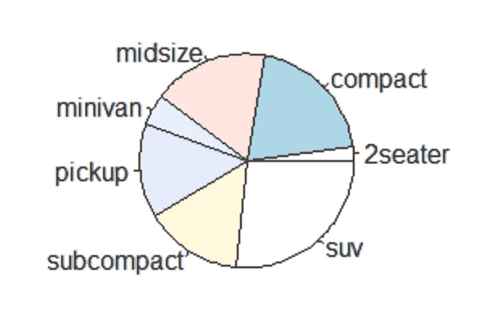

**饼状图:**我们还可以使用 R 中的 Pie()函数绘制一个简单的饼状图，用于快速分析，就像 qplot 一样。

# 绘制数字/定量变量

## 单变量分析图

**直方图**

**hist() :** 图形包中的这个函数给出了一个频率在 y 轴上的直方图。

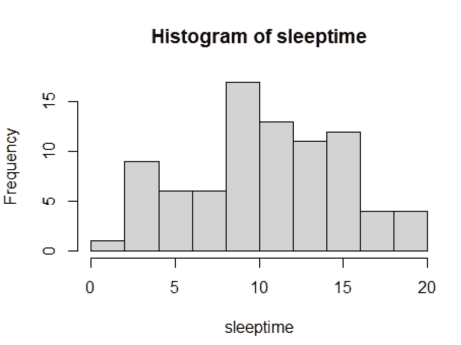

**histogram() :** 这个来自点阵库中的函数类似于 hist()函数，主要区别在于它给出 y 轴上的百分比，而不是频率。

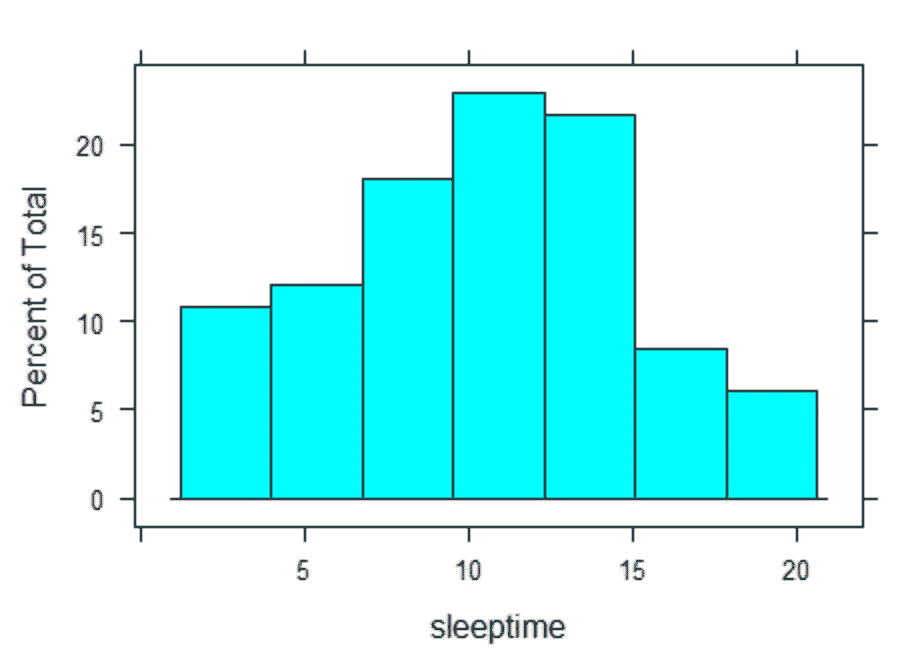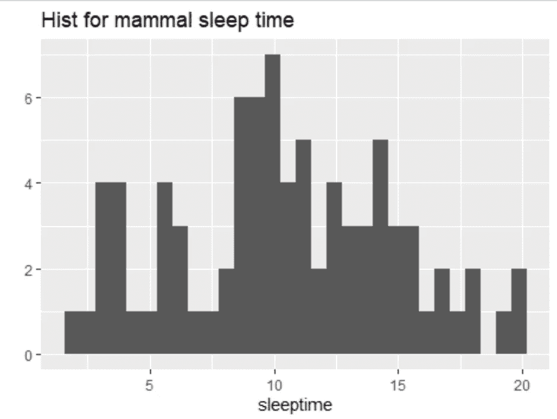

**qplot() :** 这里我们也可以使用 qplot 快速绘制直方图。

**密度相关图:**

几个密度相关图的例子如下:

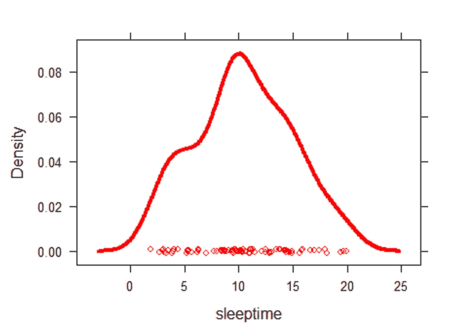

使用 Density plot()函数绘制密度图。

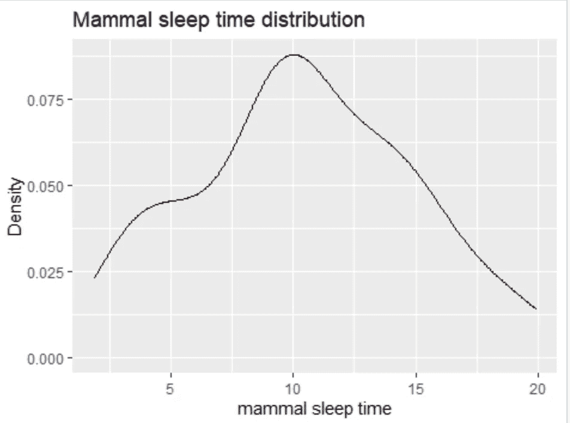

使用 qplot 的密度图。

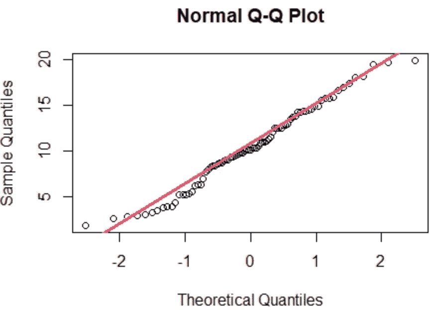

使用 qqnorm 函数绘制密度图。

**箱线图:**

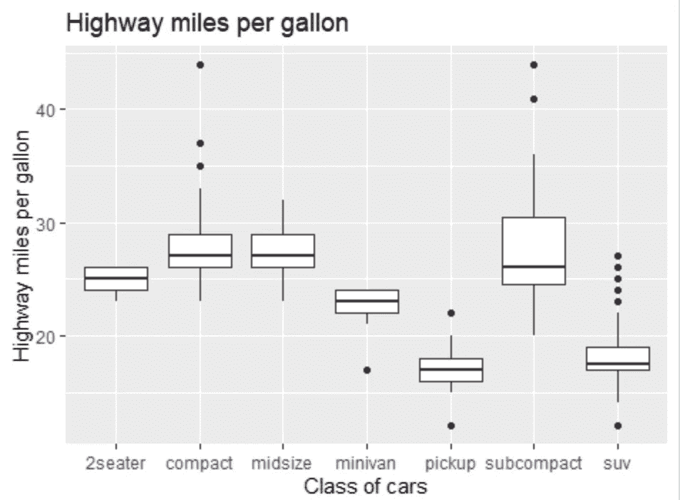

这个使用 qplot 制作的箱线图给出了使用 mpg.csv 数据的每类汽车的每加仑公路里程。

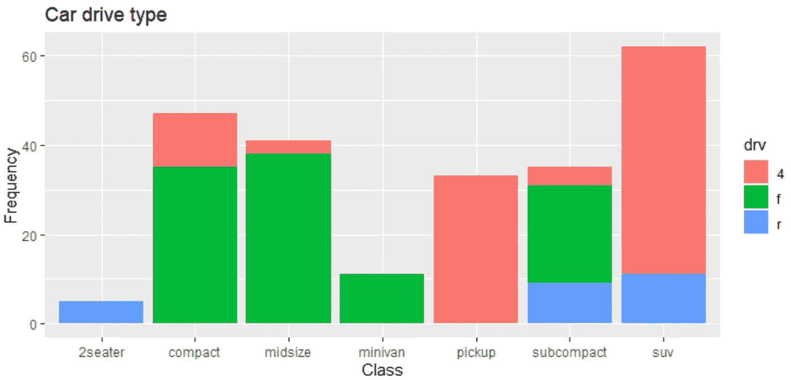

使用 qplot 的堆积条形图显示了各类汽车的每次行驶频率。

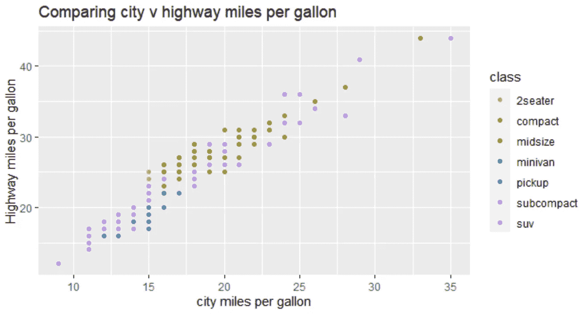

最后，我们可以看看彩色点状图(也称为散点图)。

最棒的是，所有这些情节都是由一行代码完成的。使用 ggplot()函数也可以得到一个更高级的版本，正如我前面所说，它要高级得多。但是对于本文来说，重点是一些易于理解和实现的快速图表和分析，qplot()函数完成了这项工作。

我还为 EDA 和相同数据集的数据可视化提供了 Python 代码。正如我之前说过的，R 和 python 都是令人惊奇的，当涉及到数据科学时，两者结合起来会更加令人惊奇。我相信学习这两者会有很大的好处，这样我们就可以将他们各自的能力合二为一。

在代码的最后，我还提供了另一个令人惊叹的 R 包的几行代码， [dlookr](https://cran.r-project.org/web/packages/dlookr/index.html) ，它用于数据诊断、转换和探索。一定要检查一下。

谢了。希望这有所帮助。