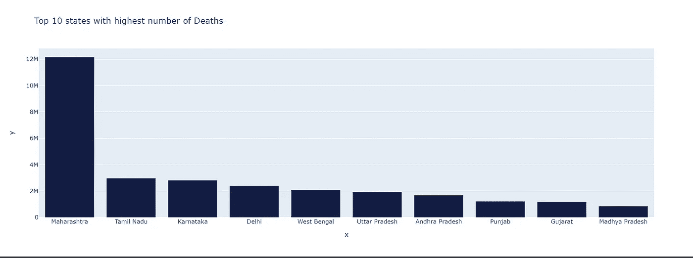

# 基于 Covid19 印度数据的 EDA

> 原文：<https://medium.com/analytics-vidhya/eda-on-covid19-india-data-e0fc4168e1a3?source=collection_archive---------24----------------------->

**探索性数据分析(EDA)** 是指对数据进行初步调查的关键过程，以便在汇总统计和图形表示的帮助下发现模式、发现异常、测试假设和检查假设。

首先，你需要下载 [covid19 印度数据](https://www.kaggle.com/sudalairajkumar/covid19-in-india)。

让我们导入所有的库并读取数据。

我们可以通过使用`head()`方法显示数据帧的前 5 行来检查数据是否成功导入。

现在，让我们对这个数据集应用 describe()方法并查看结果。它显示平均值、标准偏差、四分位数和最大最小值的描述。

**状态智能分析**

确诊病例最多的 10 个州

治愈病例最多的 10 个州

死亡人数最多的 10 个州

从以上图表中我们可以看出，马哈拉施特拉邦的确诊、治愈和死亡病例数最高。

**月明智分析**

确诊病例比较

治愈病例对比

死亡案例对比

因此，通过使用 EDA 技术，我们可以完全了解数据集，我们可以从数据集中提取有意义的信息，还可以找出数据集中是否存在任何缺陷。

使用可视化图表，可以从数据中获得多种见解。在本文中，我们介绍了一些基本的可视化。使用这些数据可以得出更多的分析和见解。