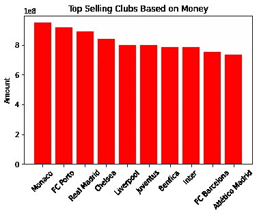
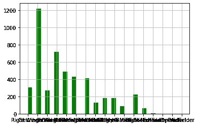

# 2000 年至 2018 年足球转会 EDA

> 原文：<https://medium.com/analytics-vidhya/eda-on-football-transfers-between-200-2018-a004e06ef087?source=collection_archive---------6----------------------->

在足球界，一旦转会窗口打开，俱乐部开始出价，购买，租借，借用或出售他们的球员。这种转会是为了得到最好的球员或者卖掉最差的球员。

转会是相当昂贵的，所以俱乐部和联赛会尽可能地争取最好的球员来组建自己的球队。

我会做一个探索性的数据分析来回答这些问题:

1.  销量前 10 的俱乐部是哪些俱乐部？
2.  10 大购买俱乐部是哪些俱乐部？
3.  哪些联赛是销量最高的联赛？
4.  哪些联赛是顶级购买联赛？
5.  年龄决定一个球员的价值吗？
6.  哪个职位最抢手？

## **相关方:**

俱乐部老板，俱乐部经理，联赛经理，足球爱好者。

## **数据收集:**

数据集来源于 [Kaggle](https://www.kaggle.com/vardan95ghazaryan/top-250-football-transfers-from-2000-to-2018) 。

## **数据分析:**

**畅销俱乐部:**

这些是转出最多的俱乐部。

十大销售俱乐部

**顶级购买俱乐部:**

这些是转会最多的俱乐部。

十大购买俱乐部

**推论:**

总的来说，波尔图和乌迪内斯是最大的卖家，但不是最大的买家。

国际米兰在这两个排行榜上都名列前茅，这似乎是球队内部的一次大洗牌。

**畅销联赛:**

这些是转会最多的联赛。

十大销售联盟

**顶级购买联盟:**

这些是转会最多的联赛。

十大购买联盟

尽管俱乐部买卖球员，但他们自己也有转会价值。

**转出金额最高的俱乐部:**

销售价值最高的 10 家俱乐部

**转会价值最高的俱乐部:**

最具购买价值的 10 家俱乐部

**推论:**

摩纳哥看到更多的转会出去，因为他们在联赛中排名第一，而不是转会进来，因为他们从顶级买家中消失了。

巴黎 SG 和热刺显然正在购买更多的球员，因为他们被视为建立自己的球队。

**转出数值最高的联赛:**

十大销售联盟价值

**转会身价最高的联赛:**

十大购买联盟价值

**推论:**

英超是最有价值的，因为所有的转会都发生在那里。

意甲和拉利加失去的比他们得到的多。

球员的年龄也决定了他们的转会价值。

年龄是一个球员价值的决定因素，因为可以看出，20-30 岁之间的球员转会最多，在 23-24 岁之间达到顶峰。

球员位置在转会价值中也很重要。

中锋是转会中最受欢迎的位置。

## 结论:

当俱乐部和联盟做出转会决定时，许多因素都被纳入考虑，是从头开始建立他们的球队，还是为他们的球队获得最好的球员。

这个分析的代码可以在我的 [Github](https://github.com/Nwosu-Ihueze/Football-Transfer) 中找到。