# 美国失业率数据集上的 EDA

> 原文：<https://medium.com/analytics-vidhya/eda-on-the-usa-unemployment-rate-dataset-ff548dfadb5b?source=collection_archive---------17----------------------->

图片来自 pexels-nathan-cowley

失业是一个术语，指的是有就业能力并积极寻找工作但找不到工作的人。未充分就业的人也包括在这个群体中。失业率可以通过劳动力总人数除以失业人数来衡量。通常，失业率是一个国家经济状况的指标之一。在美国，如果一个人没有工作，但在过去四周内一直在找工作，并且可以工作，那么他就被定义为失业者。

来分析我们从 [Kaggle](https://www.kaggle.com/jayrav13/unemployment-by-county-us) 得到的这个数据集。该数据集包含从 1990 年到 2016 年不同月份美国 47 个州不同县的失业率(百分比)。

在这项分析中，我们检查了 1990 年至 2016 年美国失业率的趋势，哪些州的失业率最高，为什么。哪个县的就业率最高，一年中哪个月的失业率最高，为什么？

现在来分析一下，

## **1。导入库**

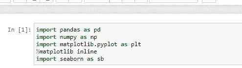

Numpy 用于 python 中的数学计算，Pandas 用于数据操作，而 Matplotlib 和 Seaborn 用于数据可视化。

## 2.导入数据集并检查它

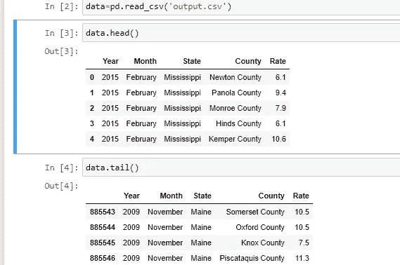

## 3.探索数据

我们继续研究数据，找出数据集的形状(显示行数和列数)，找出列的名称，并使用 *describe()* 函数获得关于数据集的更多细节。

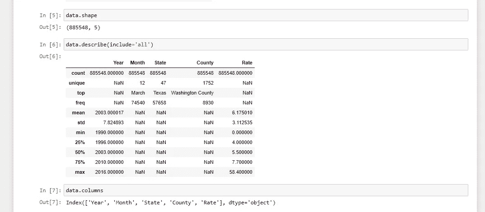

从上图中，我们看到数据集具有

1.  885548 行和 5 列
2.  从 describe 函数的结果中，我们看到该年的最小值是 1990 年，最大值是 2016 年。也就是说，我们的数据集包含 1990 年至 2016 年的数据。
3.  对于月份类别，总共有 12 个月，最常见的是三月。
4.  州类别也是如此。该数据集包含 47 个不同的州，尽管美国有 50 个州。这意味着数据集中缺少 3 个州。同样，发生最多的州是德克萨斯州。
5.  郡是一些国家的领土划分，它是地方行政当局的首领。它是一个州或国家的行政区划。从上面的图像中，我们有 1752 个独特的县。
6.  最后，我们注意到最高失业率约为 54%,最低失业率为零(这意味着一些县/州的失业率为零)。)

接下来，为了检查未包含在数据集中的州，我们调出“州”列，发现遗漏的州是阿拉斯加、佛罗里达和佐治亚。

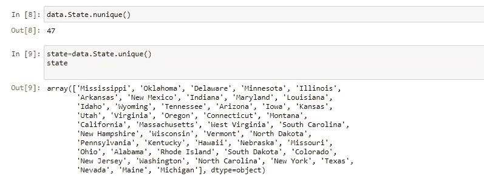

为了得到最高票数的州，

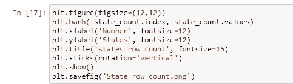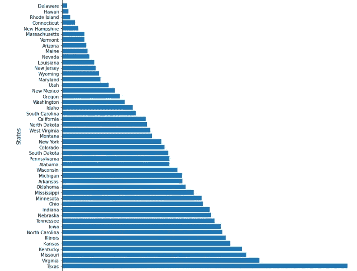

State_row 计数

我们注意到德克萨斯州的频率最高，特拉华州的频率最低。

为了根据年份对失业率进行分类，我们首先根据每年的平均失业率对数据集进行分组。

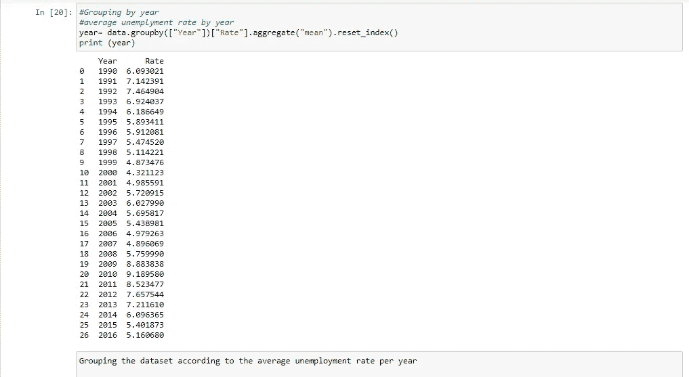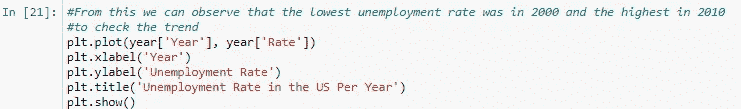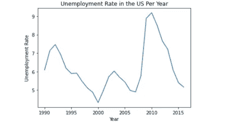

请注意，失业率在 2000 年有所下降，在 2010 年有所上升。研究表明，2000 年失业率的下降发生在政府报告缺少工人的公司提高工资，并继续招聘，创造了 340，000 个新工作岗位的时候。据华尔街日报报道，在 2010 年，失业率增加了很多，因为在那段时间，工资增加了，很多人开始找工作。

更深入地研究这一年的数据和各州，我们发现加州的失业率最高。据说，在那个时期，该州的失业率比全国失业率高出近 3%。2010 年 8 月，加州的失业率为 12.4%，而全国失业率为 9.6%。由于建筑业的衰退，该州经历了大量的失业——失业人数超过了全国范围——这也解释了为什么该州的失业率和失业人数远远高于全国平均水平。在图 2 中给定数据的总体前景中，亚利桑那州的失业率最高，这可能是由于其人口众多。

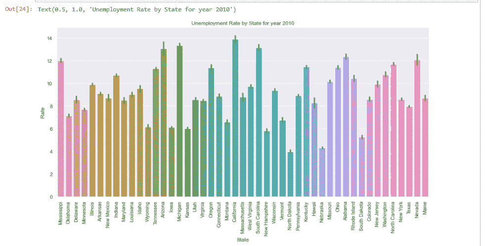

图 1

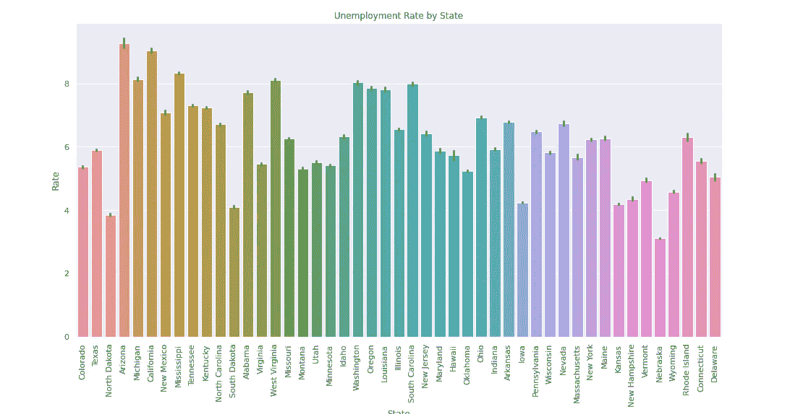

图 2

向前看，将每月的失业率可视化，我们可以推断出失业在一年的第一个月，即一月增加。根据研究，这是一年中解雇和裁员最多的月份。

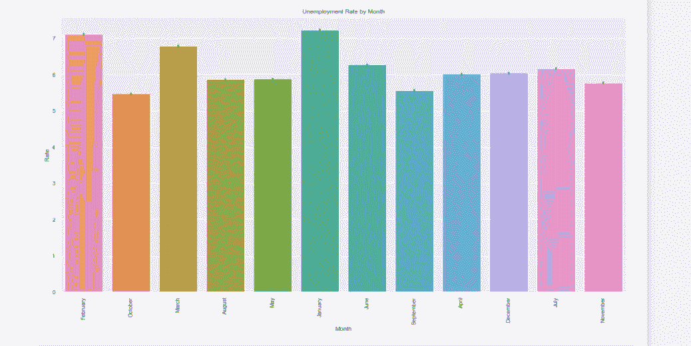

我的完整代码可以从我的 [Github 页面](https://github.com/Ibukun-Ogunnaike/SCAMP-EDA-on-The-US-Unemployment-Rate-Ibukunoluwa-Ogunaike-1/blob/main/SCAMP%20EDA%20on%20The%20%20US%20Unemployment%20Rate%20Ibukunoluwa%20Ogunaike%201%20(1).ipynb)获得。我相信你对如何分析这些数据并从中做出推论已经有所了解。分享你的评论，也不要忘记记录你的掌声。