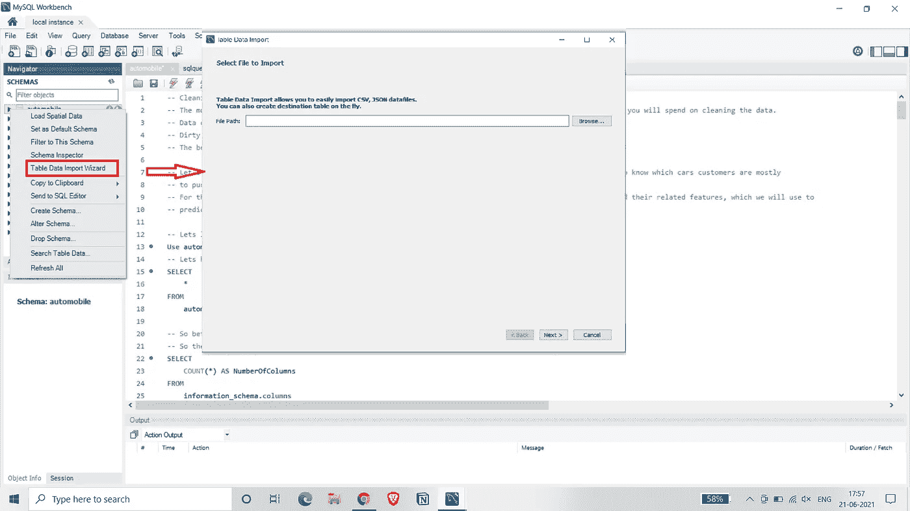

# 使用 SQL 的 EDA

> 原文：<https://medium.com/analytics-vidhya/eda-using-sql-f771f9311876?source=collection_archive---------4----------------------->

使用 SQL 的数据分析过程的完整演练。


卢克·切瑟在 [Unsplash](https://unsplash.com?utm_source=medium&utm_medium=referral) 上的照片

# 介绍

SQL 代表结构化查询语言。它是与数据库交互的标准语言。SQL 是最重要的工具，数据分析师用它来操纵数据并从中获得洞察力。在本项目中，我们将尝试清理、处理和分析数据，为此我们将使用来自 UCI 机械学习资源库的**的 [**汽车数据**。](https://archive.ics.uci.edu/ml/datasets/automobile)**

**对于这个项目，我将使用 MySQL 工作台。你可以从 [**这里**下载。](https://dev.mysql.com/downloads/windows/installer/8.0.html) MySQL 是一个开源的关系数据库管理系统。请随意使用任何其他 RDBMS 软件。现在我们有了软件设置，接下来让我们将数据集导入数据库。**

****

**马克·克林在 [Unsplash](https://unsplash.com?utm_source=medium&utm_medium=referral) 上拍摄的照片**

# **导入数据**

**要在 MySQL workbench 中导入数据，请遵循给定的步骤，因为数据集是 CSV 格式，我们必须使用*表数据导入向导菜单导入数据。***

1.  **创建一个名为*汽车*的数据库。**
2.  **右击模式栏中的汽车数据库，并从菜单中选择*表格数据导入向导选项。***
3.  **现在，在文件选择窗口中输入文件的路径，然后单击下一步。**
4.  **在选择目标窗口中点击*创建新表*并将表名设置为 *automobile_data，然后点击下一步*。**
5.  **在设置窗口中，保持值不变，然后单击下一步。**
6.  **最后点击 Next 按钮执行任务，数据集导入成功！！！**

****

**导入数据集**

**现在，在创建数据库之后，让我们开始研究数据并回答一些问题。好吧，在开始之前，让我们假设你已经开始了二手车经销企业。你想知道哪些车是顾客最想购买的，这样你就知道哪些车需要库存。现在我们的目标很明确，让我们来分析数据！！！**

# **数据清理**

**让我们来看看我们的数据集，要查看数据，我们将使用以下查询:**

```
-- Let's load the data in the database and inspect the data.
Use automobile;
-- Let's have a look at the data. This query will retrieve all the data from the table.
SELECT 
    *
FROM
    automobile_data;
```

**这将返回表中存在的所有行和列。现在让我们来看看数据的形状。**

```
-- So the below query gives us the number of columns in the dataset.
SELECT 
    COUNT(*) AS NumberOfColumns
FROM
    information_schema.columns
WHERE
    table_name = 'automobile_data';-- Now let's find out the number of rows.
SELECT 
    COUNT(*) AS NumberOfRows
FROM
    automobile_data;
```

**所以数据中有 20 列和 203 行。**

**现在，让我们检查每一列，检查数据中是否有缺失值、异常值或任何拼写错误，这些都会妨碍分析。**

**让我们看看我们有多少独特的品牌，**

```
-- selecting distinct brands
SELECT DISTINCT
    make AS UniqueBrands
FROM
    automobile_data;-- checking missing values
SELECT 
    *
FROM
    automobile_data
WHERE
    make IS NULL or make = '';
```

**有 21 种独特品牌的汽车可供选择。我们必须找出客户最常购买的前 5 款汽车。在处理分类数据时，最好的方法是找到唯一的值，这将有助于我们缩小拼写错误的范围。因此，这一列中不存在错误和缺失值。**

**现在，让我们检查列*门数*，**

```
-- check for distinct values
SELECT DISTINCT
    num_of_doors AS NumOfDoors
FROM
    automobile_data; -- check for missing values
SELECT 
    *
FROM
    automobile_data
WHERE
    num_of_doors IS NULL OR num_of_doors = '';
```

**所以这一列中有两个缺失值，品牌道奇和马自达各有一辆车在*门数*列*中有缺失值。***

**我们将通过查看具有相同特征的汽车来尝试替代缺失的值。**

```
select * from automobile_data
where make = 'dodge' and body_style = 'sedan' and drive_wheels = 'fwd' and engine_location = 'front';
```

**为了找出要替换的值，通过该查询，我们将找出车门、品牌道奇、车身样式(轿车、前轮和前置发动机位置)的常见数量。**

**三辆道奇车满足这些条件，我们可以看到它们都有四个门，所以我们可以在缺失的位置替换相同的值。为了替换该值，我们将使用 SQL 的 UPDATE 语句。**

```
update automobile_data
set num_of_doors = 'four'
where make = 'dodge' and body_style = 'sedan' and drive_wheels = 'fwd' and engine_location = 'front';
```

**我们已经成功地用“四”填充了缺少的值。同样，我们可以按照同样的程序来替代马自达汽车的价值。**

```
-- similarly, for mazda
select * from automobile_data
where make = 'mazda' and fuel_type = 'diesel';-- So we will replace the missing value with 'four' as it is a sedan which usually has four doors.-- substituting value 
update automobile_data
set num_of_doors = 'four'
where make = 'mazda' and body_style = 'sedan' and fuel_type = 'diesel';
```

**现在，继续下一列，让我们检查 *drive_wheels* 列，因为这也是一个分类列，让我们找出存在的不同值。**

```
-- check for distinct values
SELECT DISTINCT
    drive_wheels AS DriveWheels
FROM
    automobile_data; -- check for missing values
SELECT 
    *
FROM
    automobile_data
WHERE
    drive_wheels IS NULL or drive_wheels = '';
```

**在结果集中，我们可以看到“4wd”出现了两次，但是没有拼写错误，那么为什么它会出现两次呢？？这是因为其中一个值中存在空白，让我们通过查看值的长度来确认这一点。我们使用 length()函数。**

```
Select drive_wheels, length(drive_wheels) as length
from automobile_data
group by drive_wheels;
```

**因此，结果集显示一个值的长度为“4”。这是因为存在空白，为了删除空白，我们将使用 *trim()* 函数。**

```
Update automobile_data
set drive_wheels = trim(drive_wheels)
where length(drive_wheels) > 3;
```

**因此，我们已经成功地更新了该表。让我们转到下一列，*气缸数量*。在该列中，“two”被拼错为“tow ”,因此我们需要纠正这个错误，并使用 update 语句用正确的值更新该表。**

```
SELECT DISTINCT
    num_of_cylinders AS NumOfCylinders
FROM
    automobile_data;-- Okay, so here 'two' is misspelled as 'tow', so we need to replace it.UPDATE automobile_data 
SET 
    num_of_cylinders = 'two'
WHERE
    num_of_cylinders = 'tow';
```

**因此，还有两列，我们需要检查— *压缩比*和*价格。*两列都有连续的值，所以让我们检查一下值的范围，看看是否有异常值。**

```
select min(compression_ratio) as MinCopressionRatio, max(compression_ratio) as MaxCompressionRatio
from automobile_data;
```

**该查询将返回压缩率的最小值和最大值。我们可以看到，最大值超过了结果集中压缩比的上限。这可以从 [**数据** **描述**](https://archive.ics.uci.edu/ml/datasets/automobile) 中得到验证。根据描述，最大值为“23”，结果集中的最大值为“70”，这是一个异常值。因为只有一条记录，并且我们不知道具体要替换哪个值，所以我们将使用 delete 语句删除这条记录。**

```
delete from automobile_data
where compression_ratio = 70;
```

**让我们检查最后一列，即*价格*列。**

```
select min(price) as MinPrice, max(price) as MaxPrice
from automobile_data;
```

**好的，我们可以看到一些汽车的价格为“0”，这是不正确的，因为数据描述中的价格从“5118”开始。因此，为了解决这个问题，我们将用所有汽车的平均价格来代替这些值。**

```
update automobile_data
set price = 12977
where price = 0;
```

**我们现在已经清理了数据，并准备进行分析！！！！**

# **分析数据**

**让我们确定我们的目标，**

1.  **根据品牌查找客户购买的前 5 款汽车。**
2.  **根据 body_style 查找排名前 5 的汽车。**

**让我们从第一个问题开始，为了找到基于品牌的前 5 辆汽车，我们将执行以下查询。**

```
select make, count(make) as CarsBought
from automobile_data
group by make
order by CarsBought DESC
Limit 5;
```

**该查询主要检索品牌的汽车数量，并按数量降序排列结果。正如我们在结果集中看到的，大多数客户更喜欢购买丰田品牌的汽车。**

**现在让我们根据车身风格找出排名前 5 的汽车。**

```
select body_style, count(body_style) as CarsBought
from automobile_data
group by body_style
order by CarsBought DESC
Limit 5;
```

**这一结果表明，与其他车身款式相比，消费者更喜欢购买轿车。这里我们得到了一些具体的结果，消费者更喜欢丰田品牌的汽车和轿车车身风格的汽车。因此，让我们进一步深入调查结果，确定购买丰田汽车的客户更喜欢哪种车身风格？**

```
select body_style, count(body_style) as CarsBought
from automobile_data
where make = 'toyota'
group by body_style
order by CarsBought DESC;
```

**因此，该查询的结果告诉我们，客户购买了丰田品牌的掀背车款，进一步挖掘数据，我们了解到客户更喜欢购买掀背车款和汽油型的丰田汽车。**

**通过对数据的分析，我们现在知道了应该储备哪种类型的汽车，并可以进一步创建预测模型来预测汽车的销售，但为此，我们需要更多的数据。**

**感谢阅读！如果你想与我取得联系，请随时通过**varunbelgaonkar@gmail.com**或我的[LinkedIn个人资料联系我。可以查看我的](https://www.linkedin.com/in/varunbelgaonkar/) [**Github**](https://github.com/varunbelgaonkar) 个人资料，针对不同的数据分析项目。**